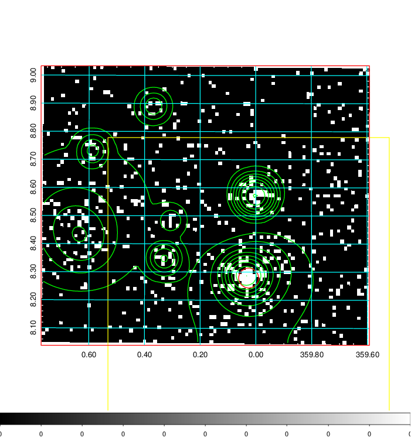
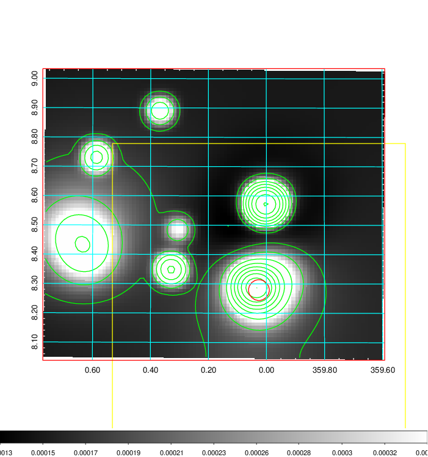
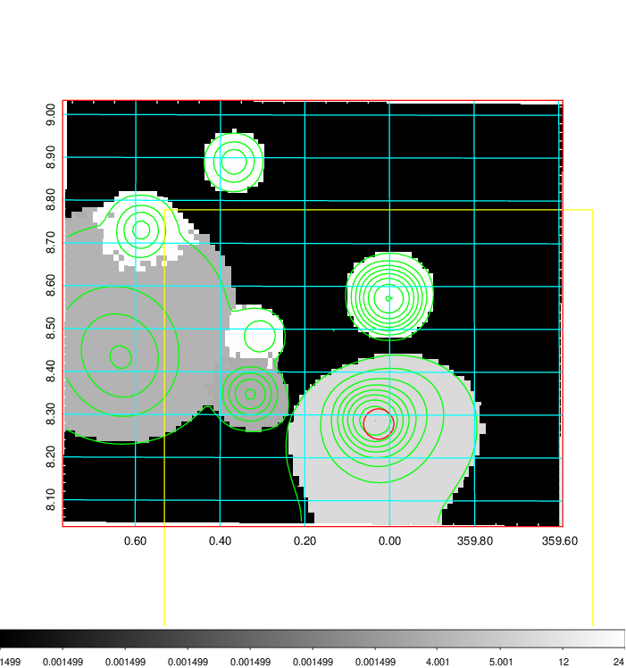
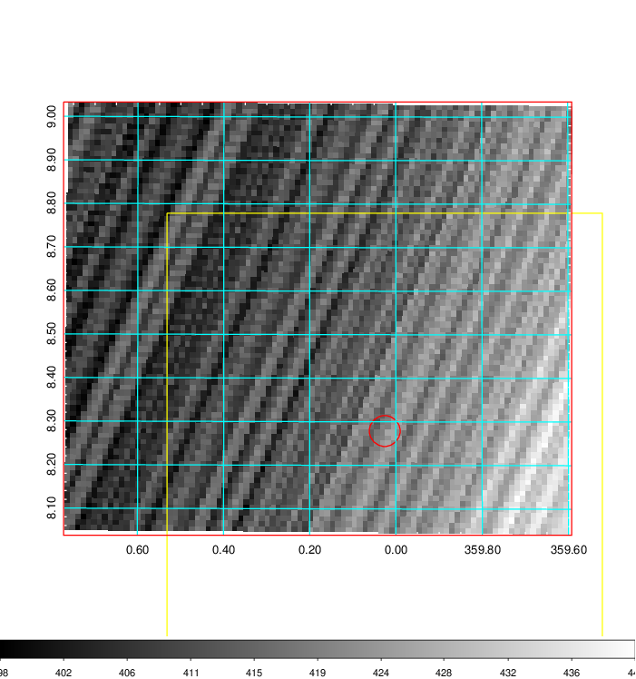
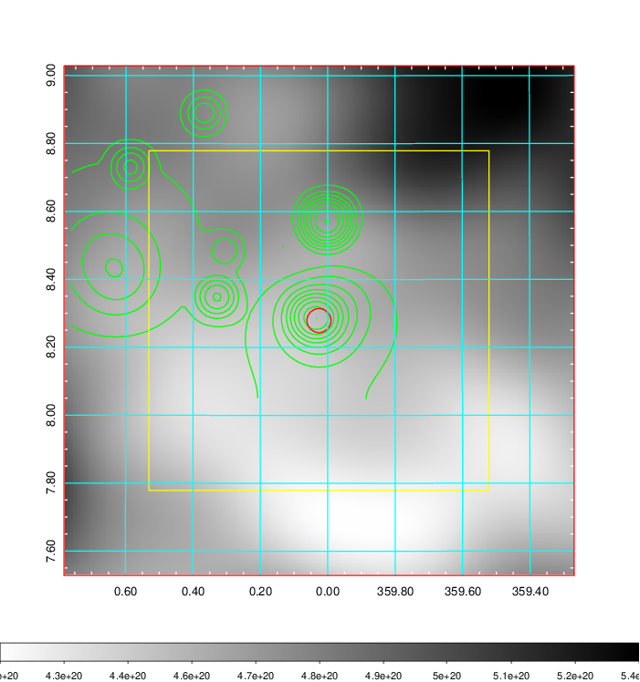
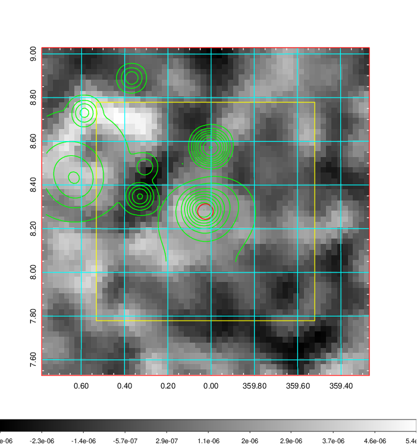
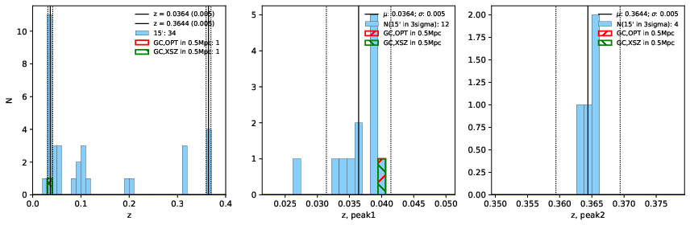
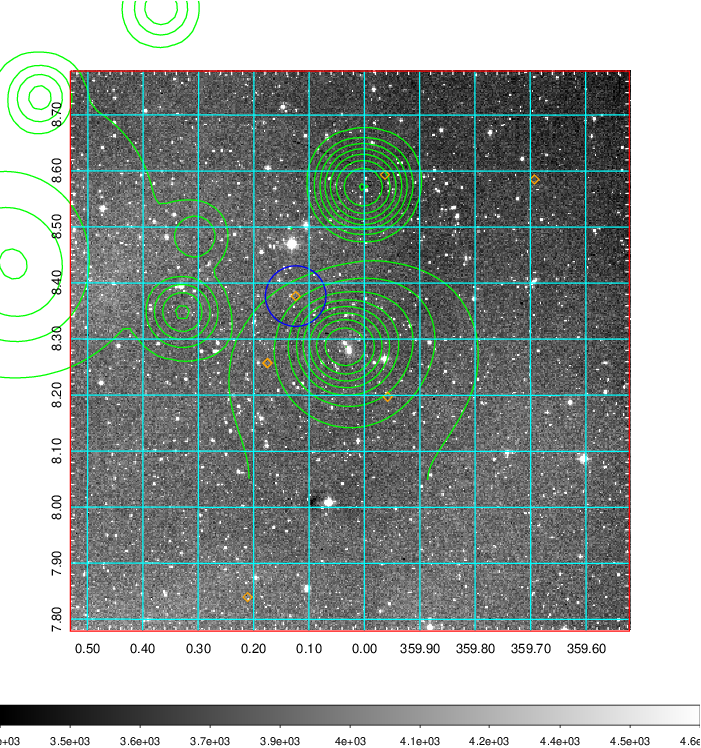
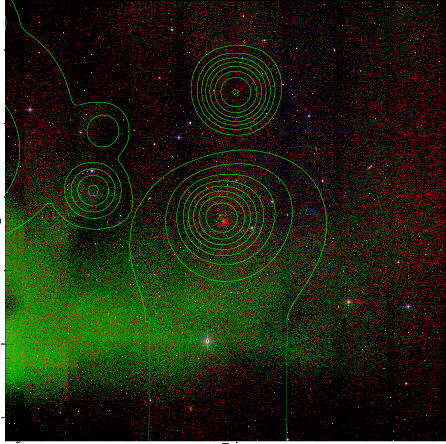
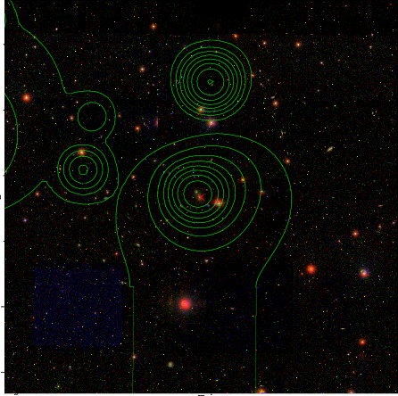

### 1

|Name|RAJ2000[deg]|DEJ2000[deg] |Ext[arcmin]| Ext,ml | z | z_src| C|GC(XSZ,Delta_z<0.01)| GC(OPT,Delta_z<0.01)|GC| R_sig[arcmin] | R500[arcmin] | R500[Mpc]| CRsig[c/s] | CR500[c/s] |L500[1E44 erg/s]|F500[1E-12 erg/s/cm^2]| M500[1E14 Msun]|Tx[keV]|Cnt_sig|Beta|Rc[arcmin]|Comment|Alias|
|---|---|---|---|---|---|------|---|--------|---------|----------|---|---|---|---|---|---|---|---|---|---|---|---|---|---|
|1| 0.026| 8.279| 2.13| 56.61| 0.0364(0.005)| z1, z_xsz| B| MCXC| N| C, F20, MCXC, N, SPI, W| 13.188| 14.734| 0.639| 0.265(0.037)| 0.270(0.038)| 0.137(0.013)| 4.457(0.410)| 0.77(0.04)| 1.84(0.05)| 127.9| 0.737(-0.117+0.150)| 3.035(-0.900+0.967)| -| k241|

|[RASS image](../image/1/1_img.pdf)|[filtered image](../image/1/1_fil.pdf)|[Segment image](../image/1/1_seg.pdf)|
|-------------------|--------------------|-------------------|
|   |    |   |

|[Exposure image](../image/1/1_mex.pdf)| [nH image](../image/1/1_nh.pdf)| [Planck image](../image/1/1_p.pdf)|
|-------------------|--------------------|-------------------|
|   |     |  |

|[Redshift Histogram](../image/1/1_zg.pdf) | [DSS image(z1)](../image/1/1_dss_z1.pdf)      |  [DSS image(z2)](../image/1/1_dss_z2.pdf)    |
|-------------------|--------------------|-------------------|
| |  Blue circle for optical clusters;  Magenta circle for XSZ clusters;  all with r=1Mpc;  Only GC with Delta_z<0.01 are shown. |  Blue circle for optical clusters;  Magenta circle for XSZ clusters;  all with r=1Mpc;  Only GC with Delta_z<0.01 are shown.  |

|[Previous-identified clusters](../image/1/1_gc.pdf) | [2MASS image](../image/1/1_2mass.pdf)      |[SDSS image](../image/1/1_sdss.pdf)   |
|-------------------|-------------------|-------------------|
|  Green, magenta, and blue circles  for optical, X-ray and SZ clusters  respectively, with redshift of clusters  labelled. The radius of circles  are 1Mpc.|  |   |

