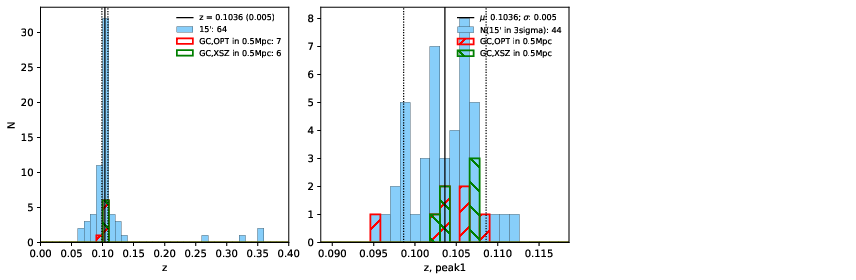

### 10

|Name|RAJ2000[deg]|DEJ2000[deg] |Ext[arcmin]| Ext,ml | z | z_src| C|GC(XSZ,Delta_z<0.01)| GC(OPT,Delta_z<0.01)|GC| R_sig[arcmin] | R500[arcmin] | R500[Mpc]| CRsig[c/s] | CR500[c/s] |L500[1E44 erg/s]|F500[1E-12 erg/s/cm^2]| M500[1E14 Msun]|Tx[keV]|Cnt_sig|Beta|Rc[arcmin]|Comment|Alias|
|---|---|---|---|---|---|------|---|--------|---------|----------|---|---|---|---|---|---|---|---|---|---|---|---|---|---|
|10| 2.935| 32.415| 1.32| 61.24| 0.1036(0.005)| z1, z_xsz| B| F20, MCXC, PSZ2, SPI, Tar, XB| A, C, RM, W| A, C, F20, MCXC, PSZ2, SPI, Tar, W, XB| 9.775| 9.479| 1.082| 0.447(0.045)| 0.445(0.045)| 2.266(0.096)| 8.287(0.349)| 3.98(0.08)| 5.19(0.07)| 154.0| 0.783(-0.102+0.121)| 2.917(-0.653+0.667)| -| k080|

|[RASS image](../image/10/10_img.pdf)|[filtered image](../image/10/10_fil.pdf)|[Segment image](../image/10/10_seg.pdf)|
|-------------------|--------------------|-------------------|
|   |    |   |

|[Exposure image](../image/10/10_mex.pdf)| [nH image](../image/10/10_nh.pdf)| [Planck image](../image/10/10_p.pdf)|
|-------------------|--------------------|-------------------|
|   |     |  |

|[Redshift Histogram](../image/10/10_zg.pdf) | [DSS image(z1)](../image/10/10_dss_z1.pdf)      |  [DSS image(z2)](../image/10/10_dss_z2.pdf)    |
|-------------------|--------------------|-------------------|
| |  Blue circle for optical clusters;  Magenta circle for XSZ clusters;  all with r=1Mpc;  Only GC with Delta_z<0.01 are shown. |  Blue circle for optical clusters;  Magenta circle for XSZ clusters;  all with r=1Mpc;  Only GC with Delta_z<0.01 are shown.  |

|[Previous-identified clusters](../image/10/10_gc.pdf) | [2MASS image](../image/10/10_2mass.pdf)      |[SDSS image](../image/10/10_sdss.pdf)   |
|-------------------|-------------------|-------------------|
|  Green, magenta, and blue circles  for optical, X-ray and SZ clusters  respectively, with redshift of clusters  labelled. The radius of circles  are 1Mpc.|  |   |

