

### 100

|Name|RAJ2000[deg]|DEJ2000[deg] |Ext[arcmin]| Ext,ml | z | z_src| C|GC(XSZ,Delta_z<0.01)| GC(OPT,Delta_z<0.01)|GC| R_sig[arcmin] | R500[arcmin] | R500[Mpc]| CRsig[c/s] | CR500[c/s] |L500[1E44 erg/s]|F500[1E-12 erg/s/cm^2]| M500[1E14 Msun]|Tx[keV]|Cnt_sig|Beta|Rc[arcmin]|Comment|Alias|
|---|---|---|---|---|---|------|---|--------|---------|----------|---|---|---|---|---|---|---|---|---|---|---|---|---|---|
|100| 35.401| 21.373| 2.78| 34.36| 0.1700(0.000)| z_xsz| B| PSZ2, Tar| C, N| A, C, N, PSZ2, Tar, W| 12.700| 6.368| 1.107| 0.206(0.064)| 0.191(0.059)| 2.757(0.346)| 3.441(0.432)| 4.56(0.28)| 5.77(0.22)| 65.1| 0.758(-0.154+0.158)| 3.208(-1.126+0.991)| -| k351|

|[RASS image](../image/100/100_img.pdf)|[filtered image](../image/100/100_fil.pdf)|[Segment image](../image/100/100_seg.pdf)|
|-------------------|--------------------|-------------------|
| 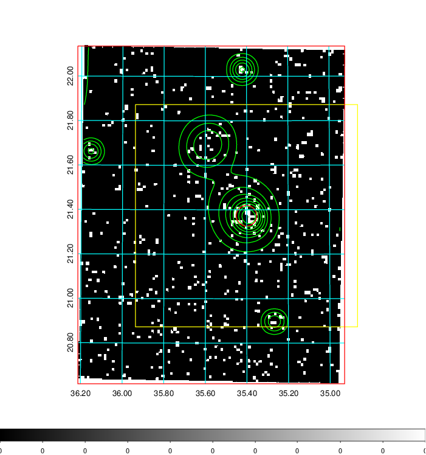  | 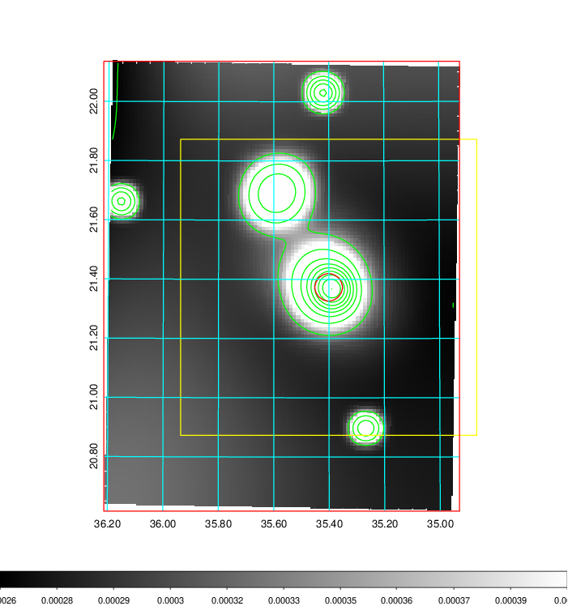   | 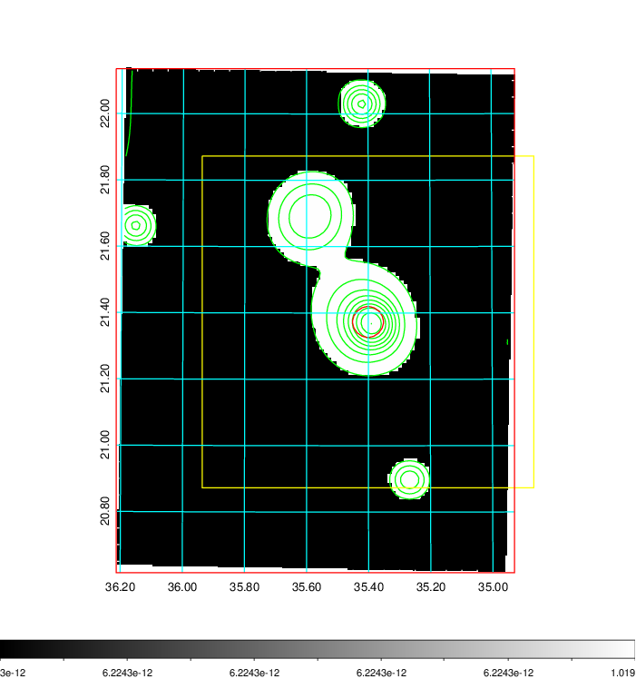  |

|[Exposure image](../image/100/100_mex.pdf)| [nH image](../image/100/100_nh.pdf)| [Planck image](../image/100/100_p.pdf)|
|-------------------|--------------------|-------------------|
|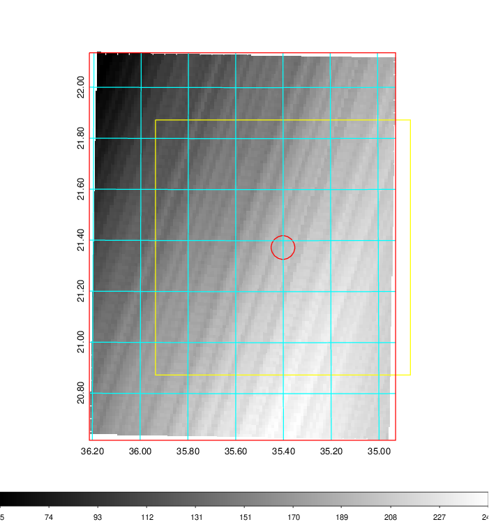   | 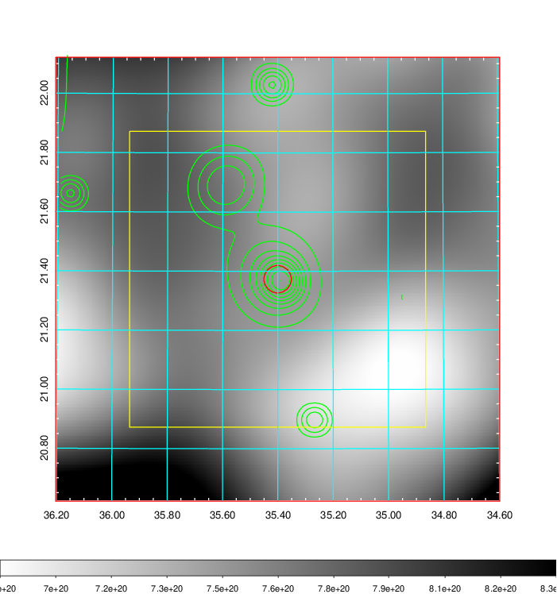    | 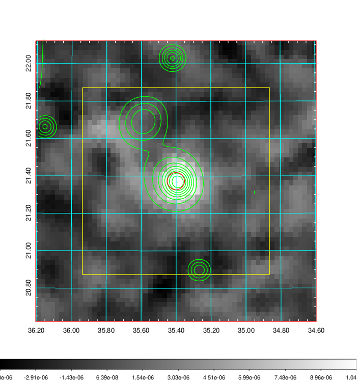 |

|[Redshift Histogram](../image/100/100_zg.pdf) | [DSS image(z1)](../image/100/100_dss_z1.pdf)      |  [DSS image(z2)](../image/100/100_dss_z2.pdf)    |
|-------------------|--------------------|-------------------|
|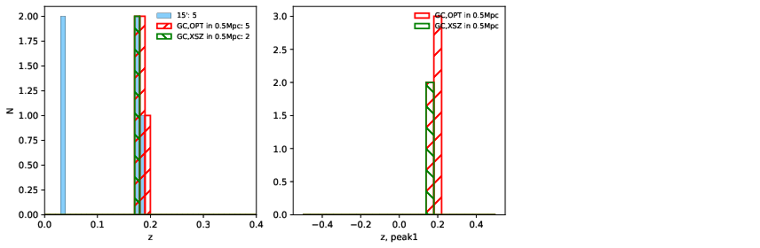 |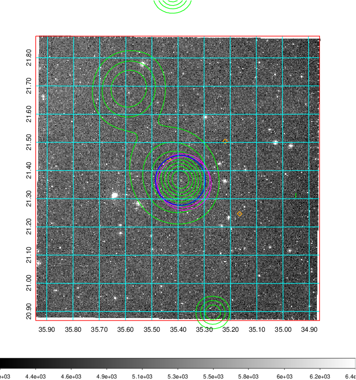  Blue circle for optical clusters;  Magenta circle for XSZ clusters;  all with r=1Mpc;  Only GC with Delta_z<0.01 are shown. | 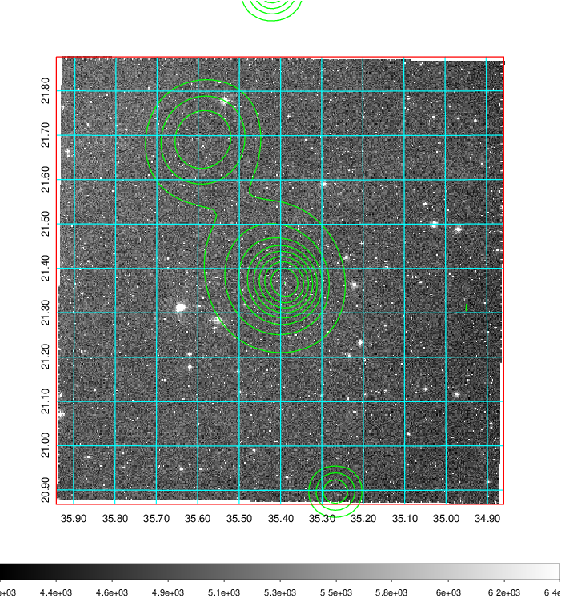 Blue circle for optical clusters;  Magenta circle for XSZ clusters;  all with r=1Mpc;  Only GC with Delta_z<0.01 are shown.  |

|[known Abell/XSZ clusters](../image/100/100_gc.pdf) | [2MASS image](../image/100/100_2mass.pdf)      |[SDSS image](../image/100/100_sdss.pdf)   |
|-------------------|-------------------|-------------------|
|  Magenta, blue and green circles  for optical, X-ray and SZ clusters  respectively, with redshift of clusters  labelled. The radius of circles  are 1Mpc.|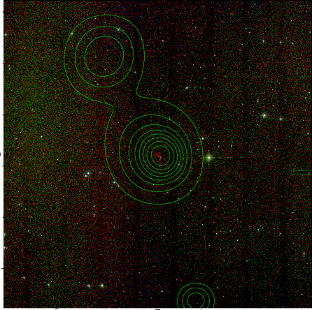  | 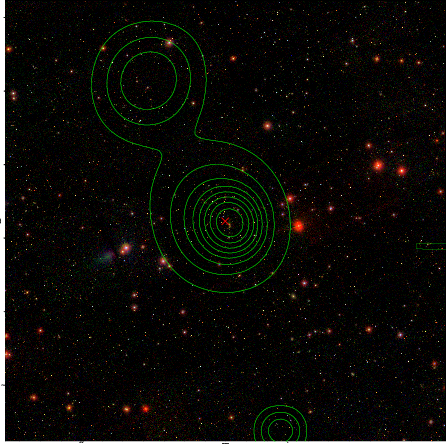  |

