

### 102

|Name|RAJ2000[deg]|DEJ2000[deg] |Ext[arcmin]| Ext,ml | z | z_src| C|GC(XSZ,Delta_z<0.01)| GC(OPT,Delta_z<0.01)|GC| R_sig[arcmin] | R500[arcmin] | R500[Mpc]| CRsig[c/s] | CR500[c/s] |L500[1E44 erg/s]|F500[1E-12 erg/s/cm^2]| M500[1E14 Msun]|Tx[keV]|Cnt_sig|Beta|Rc[arcmin]|Comment|Alias|
|---|---|---|---|---|---|------|---|--------|---------|----------|---|---|---|---|---|---|---|---|---|---|---|---|---|---|
|102| 36.287| -29.475| 1.48| 36.01| 0.0618(0.005)| z1, z_xsz| B| MCXC| N| A, MCXC, N| 11.725| 10.964| 0.784| 0.273(0.035)| 0.270(0.034)| 0.474(0.039)| 5.164(0.425)| 1.45(0.06)| 2.75(0.07)| 111.9| 0.542(-0.031+0.057)| 1.552(-0.385+0.559)| -| k106|

|[RASS image](../image/102/102_img.pdf)|[filtered image](../image/102/102_fil.pdf)|[Segment image](../image/102/102_seg.pdf)|
|-------------------|--------------------|-------------------|
| 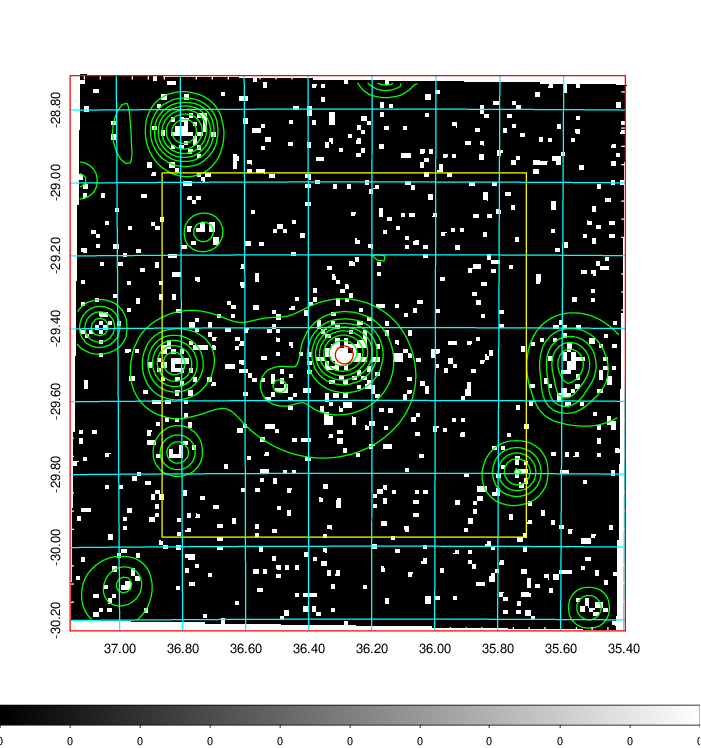  | 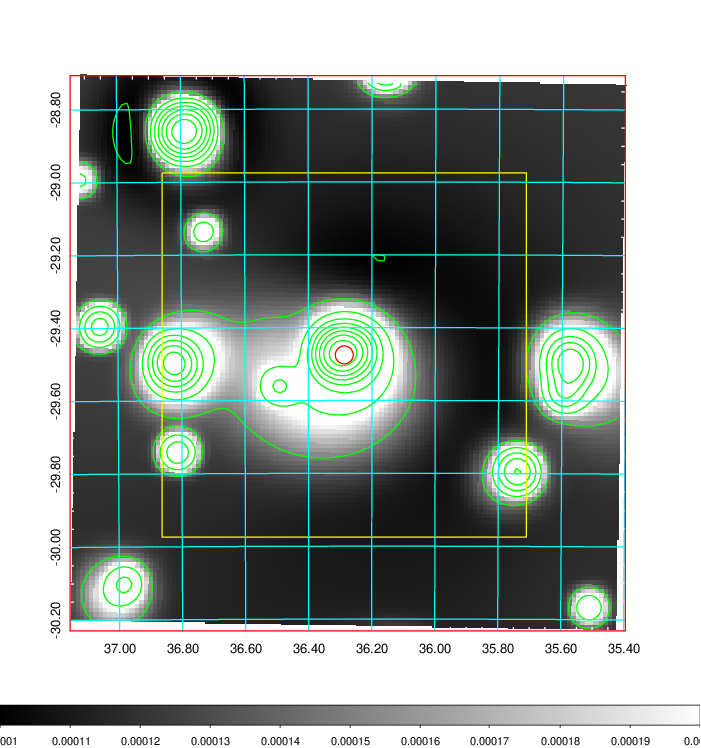   | 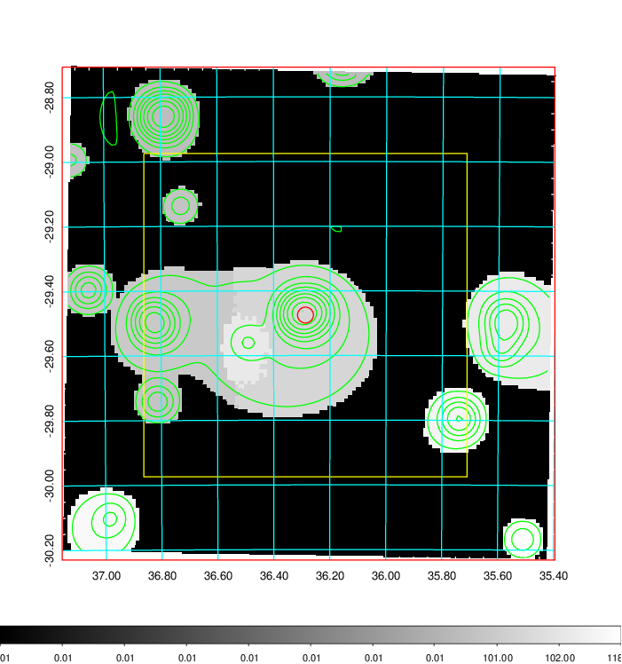  |

|[Exposure image](../image/102/102_mex.pdf)| [nH image](../image/102/102_nh.pdf)| [Planck image](../image/102/102_p.pdf)|
|-------------------|--------------------|-------------------|
|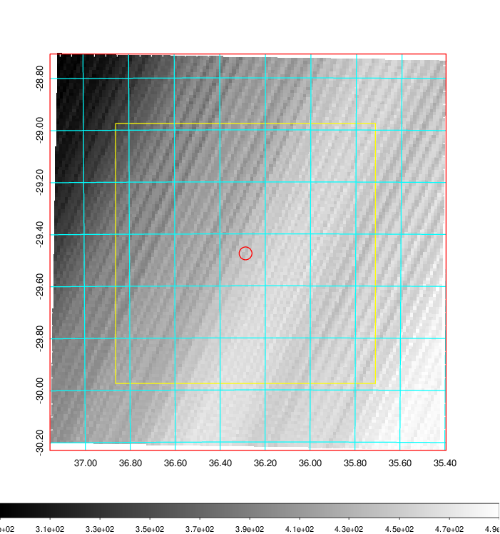   | 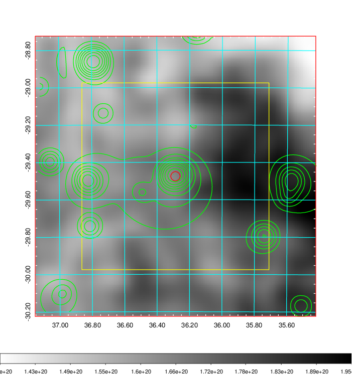    | 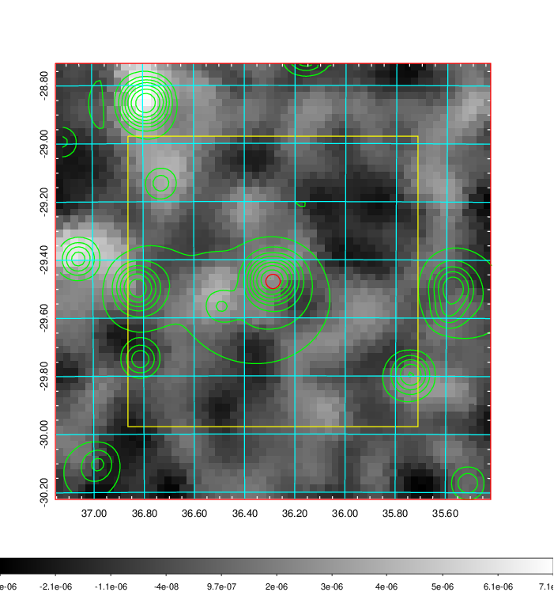 |

|[Redshift Histogram](../image/102/102_zg.pdf) | [DSS image(z1)](../image/102/102_dss_z1.pdf)      |  [DSS image(z2)](../image/102/102_dss_z2.pdf)    |
|-------------------|--------------------|-------------------|
|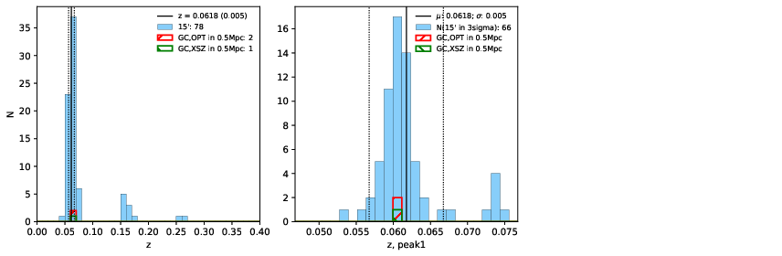 |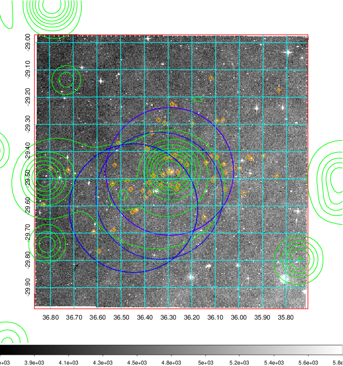  Blue circle for optical clusters;  Magenta circle for XSZ clusters;  all with r=1Mpc;  Only GC with Delta_z<0.01 are shown. | 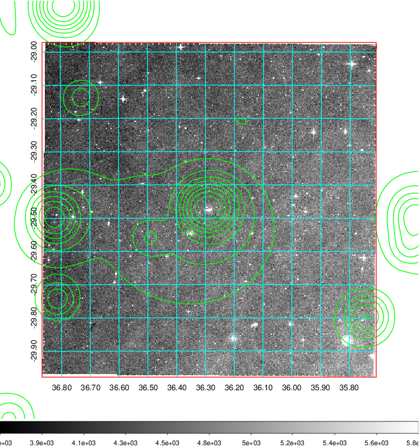 Blue circle for optical clusters;  Magenta circle for XSZ clusters;  all with r=1Mpc;  Only GC with Delta_z<0.01 are shown.  |

|[Previous-identified clusters](../image/102/102_gc.pdf) | [2MASS image](../image/102/102_2mass.pdf)      |
|-------------------|-------------------|
|  Green, magenta, and blue circles  for optical, X-ray and SZ clusters  respectively, with redshift of clusters  labelled. The radius of circles  are 1Mpc.|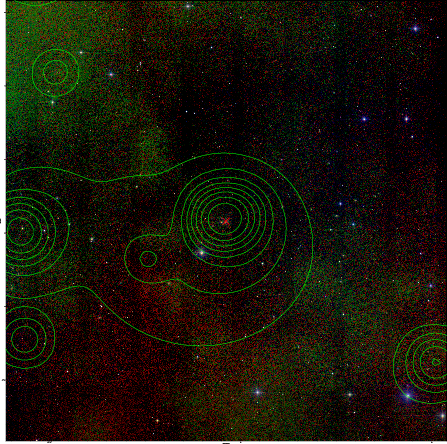  |

|[DES image](../image/102/102_des.pdf)   |[ATLAS image](../image/102/102_s.pdf)        |
|-------------------|-------------------|
| 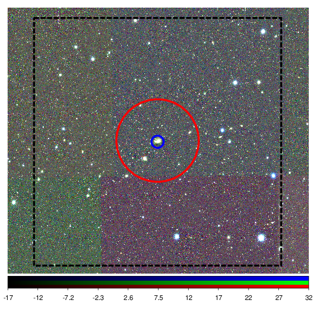  | 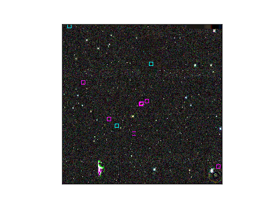  |
