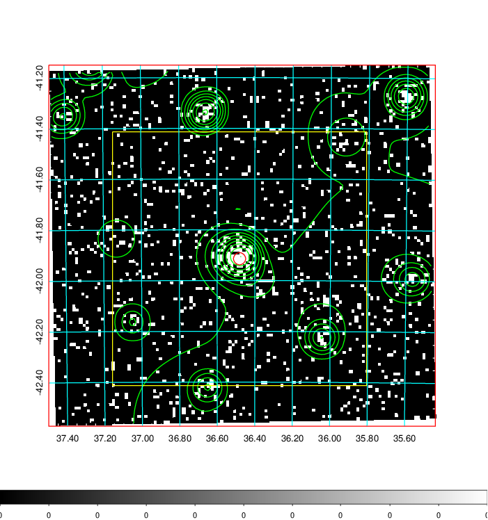
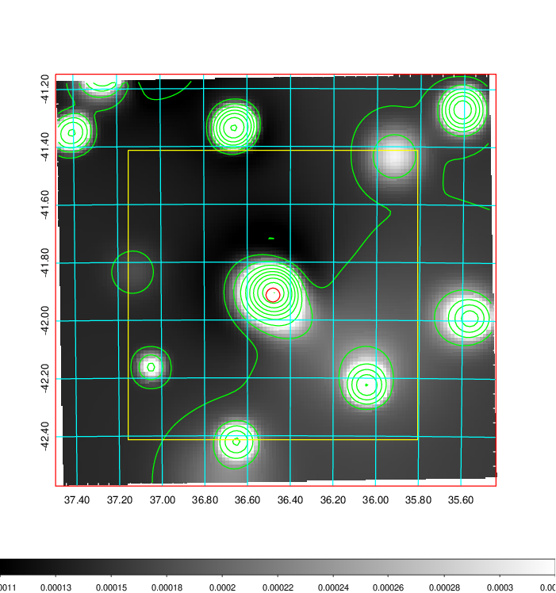
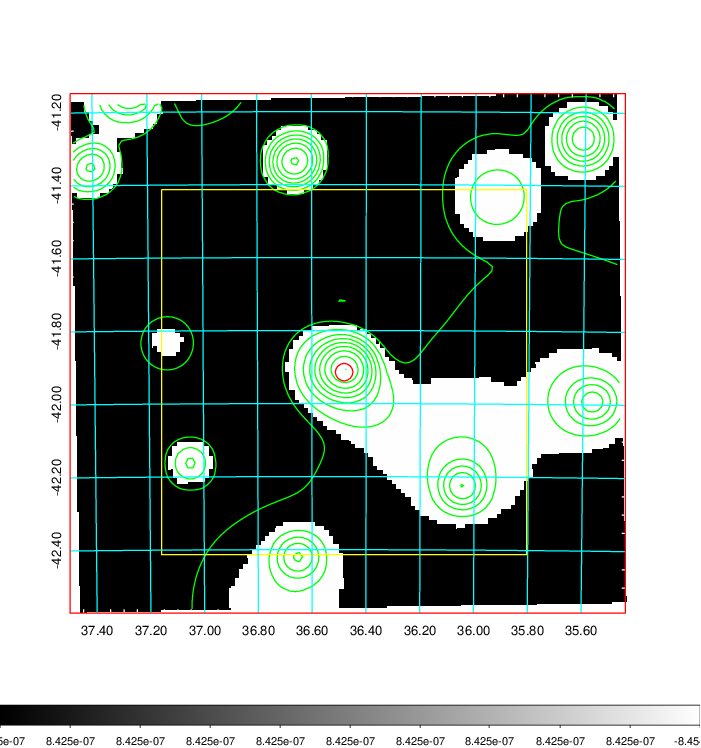
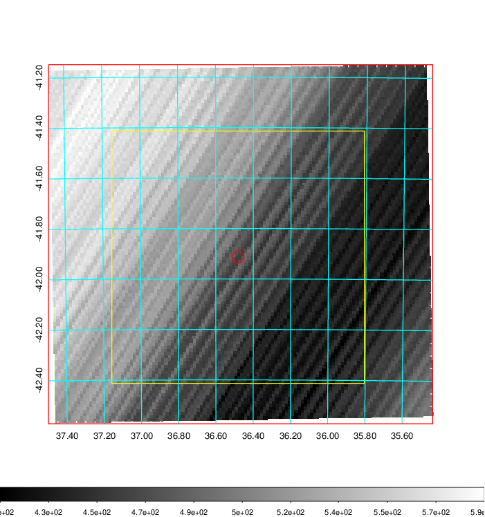
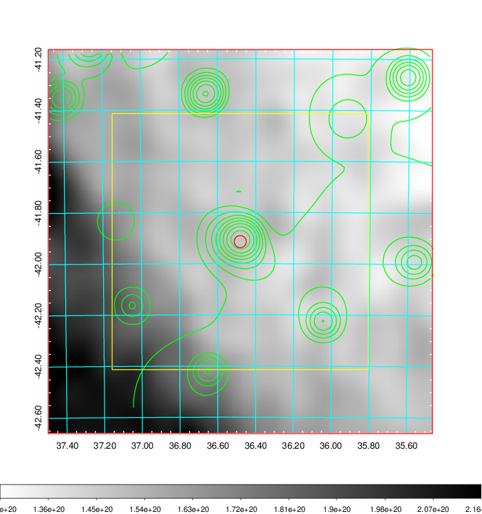
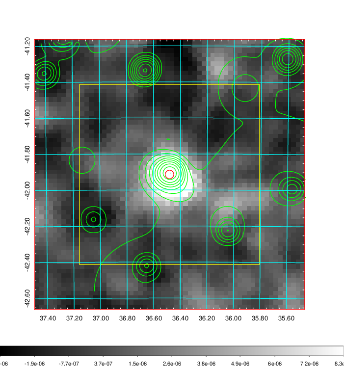
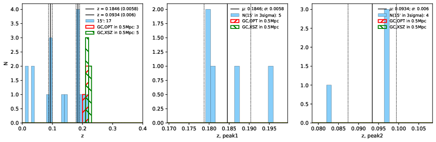
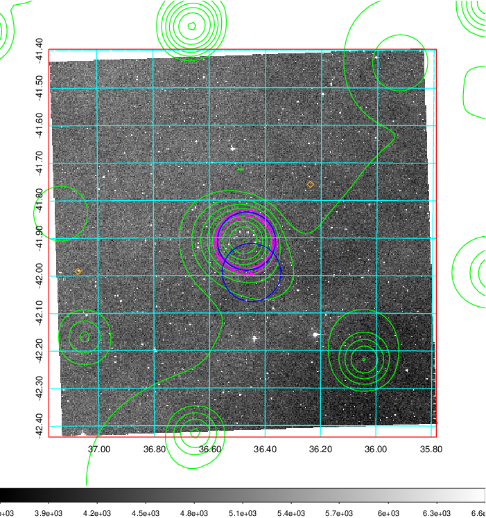
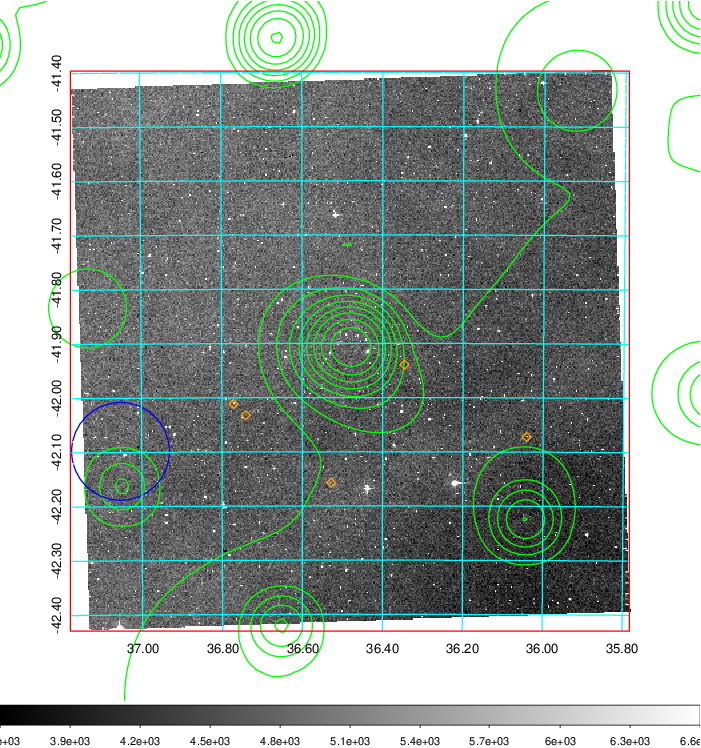
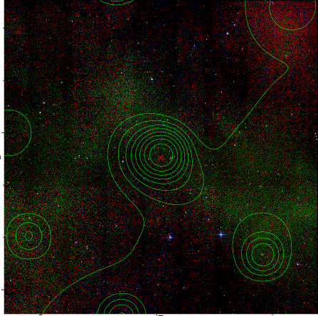

### 103

|Name|RAJ2000[deg]|DEJ2000[deg] |Ext[arcmin]| Ext,ml | z | z_src| C|GC(XSZ,Delta_z<0.01)| GC(OPT,Delta_z<0.01)|GC| R_sig[arcmin] | R500[arcmin] | R500[Mpc]| CRsig[c/s] | CR500[c/s] |L500[1E44 erg/s]|F500[1E-12 erg/s/cm^2]| M500[1E14 Msun]|Tx[keV]|Cnt_sig|Beta|Rc[arcmin]|Comment|Alias|
|---|---|---|---|---|---|------|---|--------|---------|----------|---|---|---|---|---|---|---|---|---|---|---|---|---|---|
|103| 36.481| -41.914| 1.43| 51.90| 0.2198(0.000)| z_xsz| B| B15, MCXC, PSZ2, Tar| A| A, B15, MCXC, N, PSZ2, Tar, W, XB| 10.750| 5.860| 1.248| 0.265(0.033)| 0.247(0.031)| 7.155(0.404)| 5.039(0.285)| 6.89(0.18)| 7.57(0.13)| 129.2| 0.868(-0.119+0.092)| 3.169(-0.650+0.474)| -| k099|

|[RASS image](../image/103/103_img.pdf)|[filtered image](../image/103/103_fil.pdf)|[Segment image](../image/103/103_seg.pdf)|
|-------------------|--------------------|-------------------|
|   |    |   |

|[Exposure image](../image/103/103_mex.pdf)| [nH image](../image/103/103_nh.pdf)| [Planck image](../image/103/103_p.pdf)|
|-------------------|--------------------|-------------------|
|   |     |  |

|[Redshift Histogram](../image/103/103_zg.pdf) | [DSS image(z1)](../image/103/103_dss_z1.pdf)      |  [DSS image(z2)](../image/103/103_dss_z2.pdf)    |
|-------------------|--------------------|-------------------|
| |  Blue circle for optical clusters;  Magenta circle for XSZ clusters;  all with r=1Mpc;  Only GC with Delta_z<0.01 are shown. |  Blue circle for optical clusters;  Magenta circle for XSZ clusters;  all with r=1Mpc;  Only GC with Delta_z<0.01 are shown.  |

|[known Abell/XSZ clusters](../image/103/103_gc.pdf) | [2MASS image](../image/103/103_2mass.pdf)      |
|-------------------|-------------------|
|  Magenta, blue and green circles  for optical, X-ray and SZ clusters  respectively, with redshift of clusters  labelled. The radius of circles  are 1Mpc.|  |

|[DES image](../image/103/103_des.pdf)   |
|-------------------|
|   |
