

### 104

|Name|RAJ2000[deg]|DEJ2000[deg] |Ext[arcmin]| Ext,ml | z | z_src| C|GC(XSZ,Delta_z<0.01)| GC(OPT,Delta_z<0.01)|GC| R_sig[arcmin] | R500[arcmin] | R500[Mpc]| CRsig[c/s] | CR500[c/s] |L500[1E44 erg/s]|F500[1E-12 erg/s/cm^2]| M500[1E14 Msun]|Tx[keV]|Cnt_sig|Beta|Rc[arcmin]|Comment|Alias|
|---|---|---|---|---|---|------|---|--------|---------|----------|---|---|---|---|---|---|---|---|---|---|---|---|---|---|
|104| 36.488| 36.996| 8.53| 33.42| 0.0357(0.005)| z1, z_opt| S| -| N, W| A, N, Tar, W| 11.238| 13.501| 0.575| 0.166(0.041)| 0.172(0.042)| 0.078(0.012)| 2.627(0.400)| 0.56(0.04)| 1.51(0.07)| 52.4| 0.869(-0.158+0.096)| 13.586(-2.112+1.402)| An SZ cluster with  no $z$ and offset = 0.44 Mpc| t403|

|[RASS image](../image/104/104_img.pdf)|[filtered image](../image/104/104_fil.pdf)|[Segment image](../image/104/104_seg.pdf)|
|-------------------|--------------------|-------------------|
| 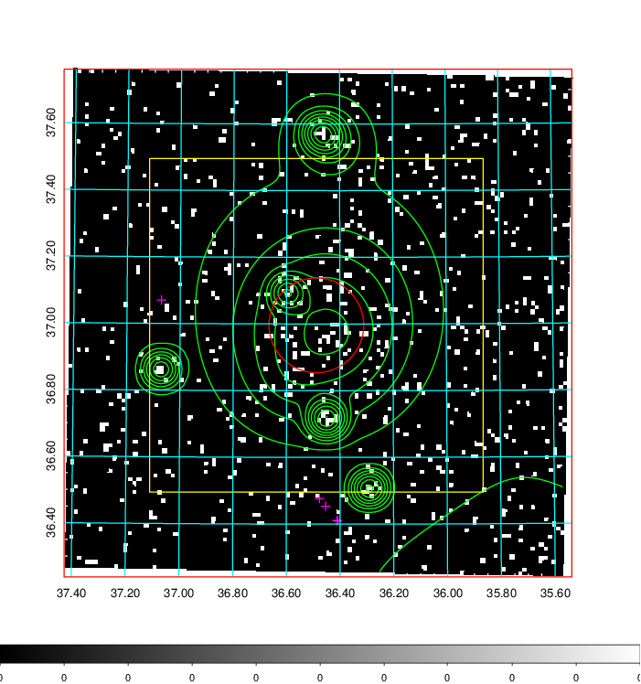  | 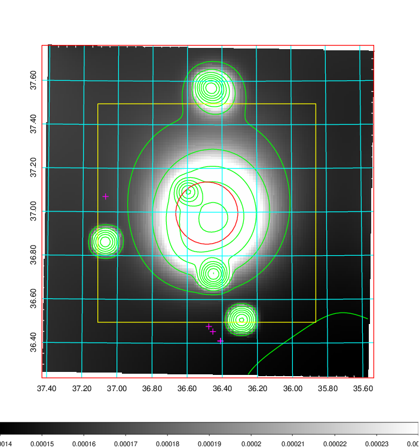   | 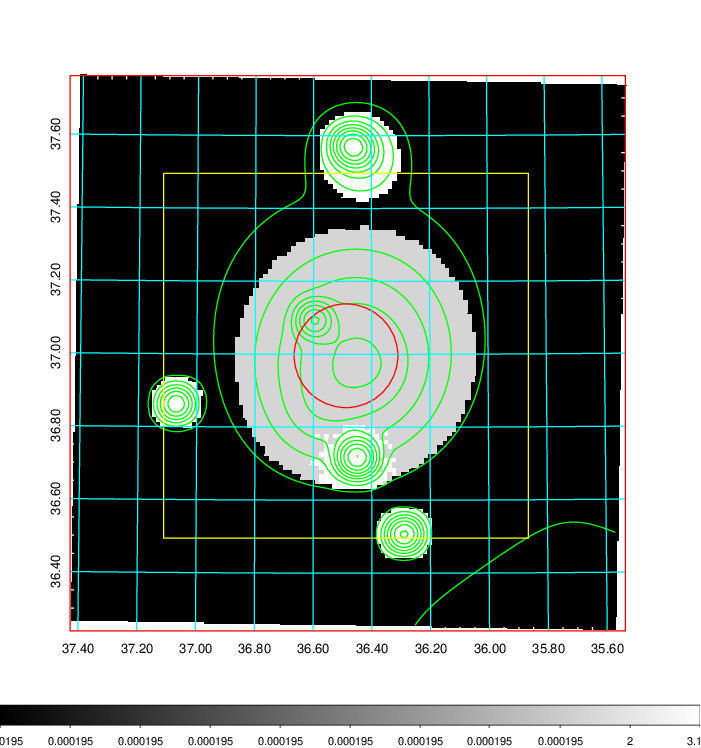  |

|[Exposure image](../image/104/104_mex.pdf)| [nH image](../image/104/104_nh.pdf)| [Planck image](../image/104/104_p.pdf)|
|-------------------|--------------------|-------------------|
|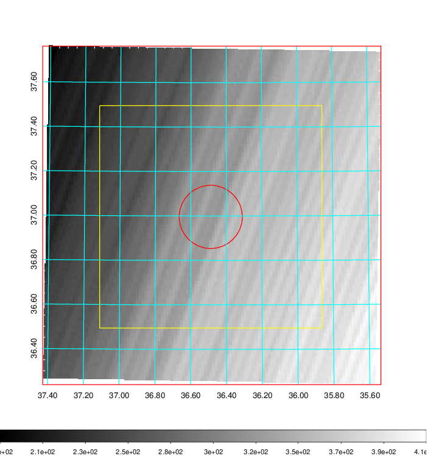   | 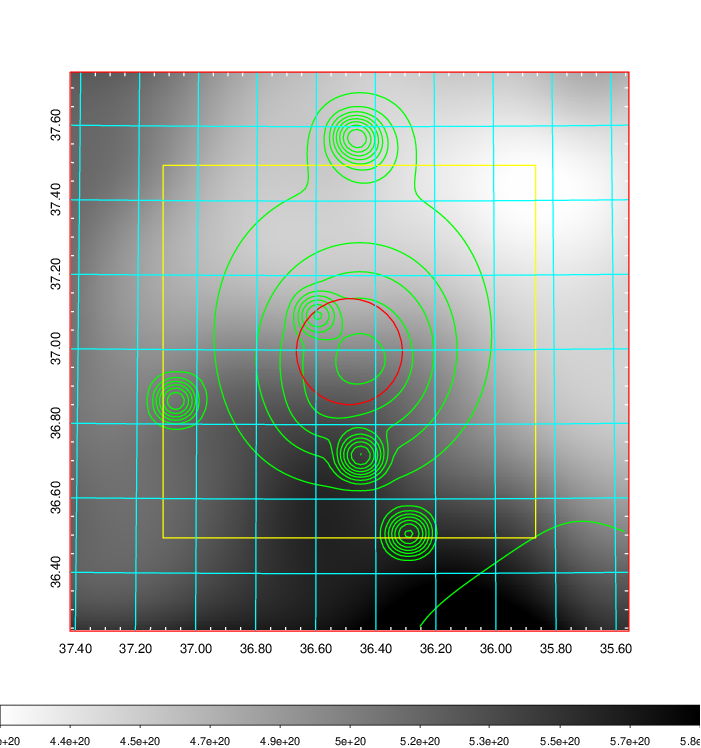    | 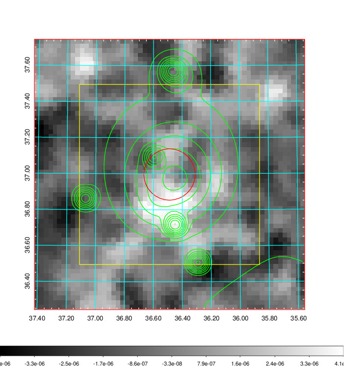 |

|[Redshift Histogram](../image/104/104_zg.pdf) | [DSS image(z1)](../image/104/104_dss_z1.pdf)      |  [DSS image(z2)](../image/104/104_dss_z2.pdf)    |
|-------------------|--------------------|-------------------|
|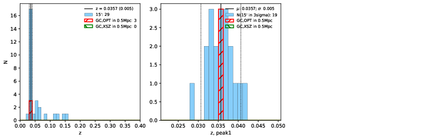 |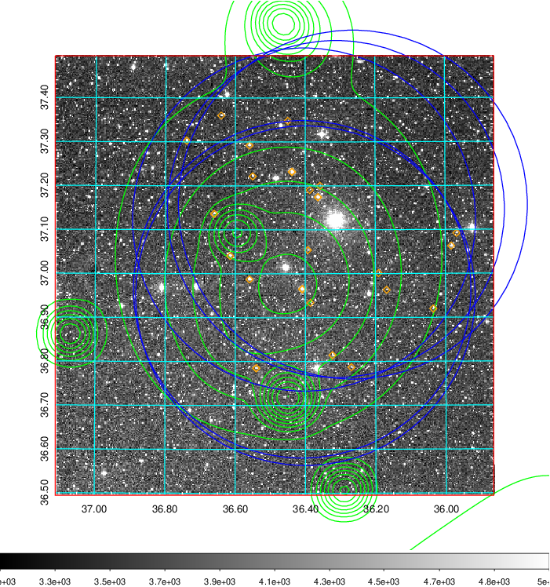  Blue circle for optical clusters;  Magenta circle for XSZ clusters;  all with r=1Mpc;  Only GC with Delta_z<0.01 are shown. | 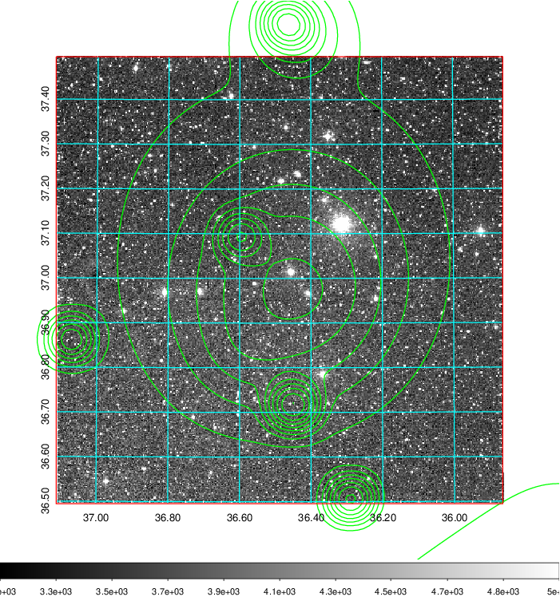 Blue circle for optical clusters;  Magenta circle for XSZ clusters;  all with r=1Mpc;  Only GC with Delta_z<0.01 are shown.  |

|[Previous-identified clusters](../image/104/104_gc.pdf) | [2MASS image](../image/104/104_2mass.pdf)      |
|-------------------|-------------------|
|  Green, magenta, and blue circles  for optical, X-ray and SZ clusters  respectively, with redshift of clusters  labelled. The radius of circles  are 1Mpc.|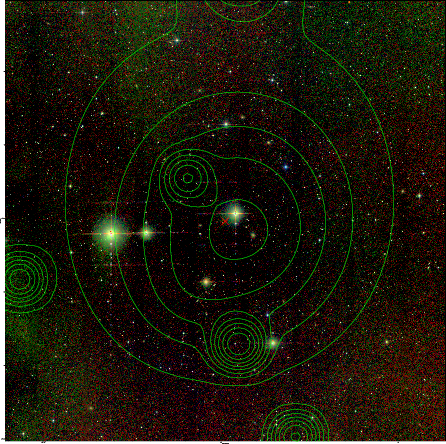  |

|[PS1 image](../image/104/104_ps1.pdf)            |
|-------------------|
| 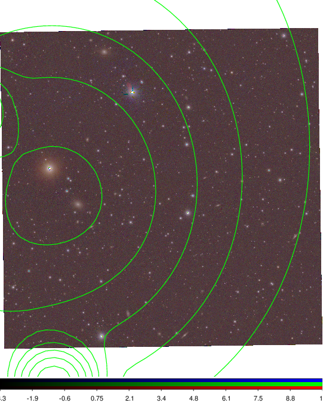  |
