

### 105

|Name|RAJ2000[deg]|DEJ2000[deg] |Ext[arcmin]| Ext,ml | z | z_src| C|GC(XSZ,Delta_z<0.01)| GC(OPT,Delta_z<0.01)|GC| R_sig[arcmin] | R500[arcmin] | R500[Mpc]| CRsig[c/s] | CR500[c/s] |L500[1E44 erg/s]|F500[1E-12 erg/s/cm^2]| M500[1E14 Msun]|Tx[keV]|Cnt_sig|Beta|Rc[arcmin]|Comment|Alias|
|---|---|---|---|---|---|------|---|--------|---------|----------|---|---|---|---|---|---|---|---|---|---|---|---|---|---|
|105| 37.046| 28.211| 4.52| 60.84| 0.0364(0.005)| z1, z_xsz| B| MCXC| N| MCXC, N| 13.188| 14.506| 0.629| 0.234(0.042)| 0.238(0.042)| 0.112(0.011)| 3.651(0.344)| 0.73(0.04)| 1.79(0.05)| 81.9| 0.727(-0.141+0.170)| 4.732(-1.473+1.454)| -| k505|

|[RASS image](../image/105/105_img.pdf)|[filtered image](../image/105/105_fil.pdf)|[Segment image](../image/105/105_seg.pdf)|
|-------------------|--------------------|-------------------|
| 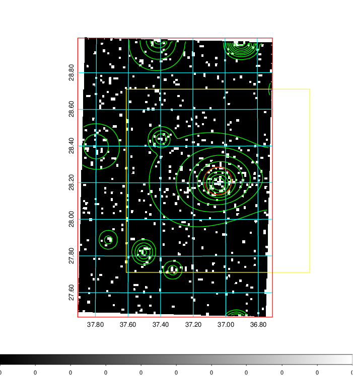  | 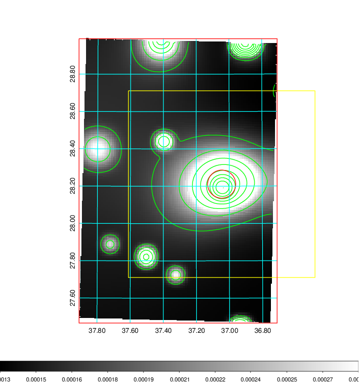   | 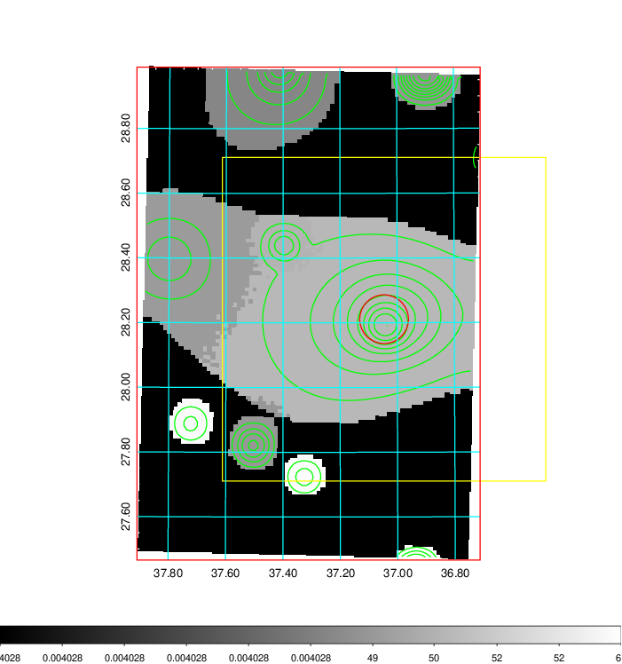  |

|[Exposure image](../image/105/105_mex.pdf)| [nH image](../image/105/105_nh.pdf)| [Planck image](../image/105/105_p.pdf)|
|-------------------|--------------------|-------------------|
|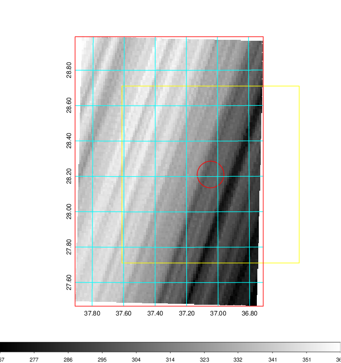   | 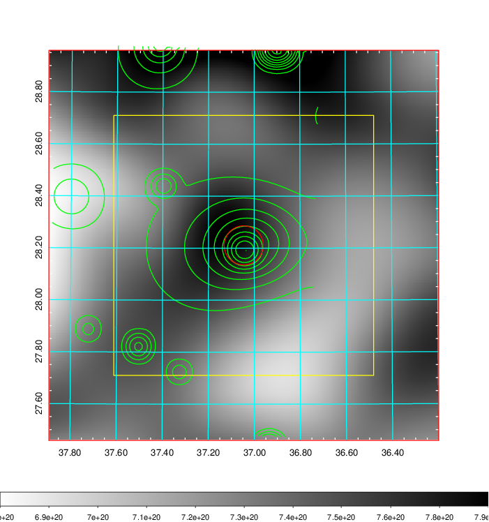    | 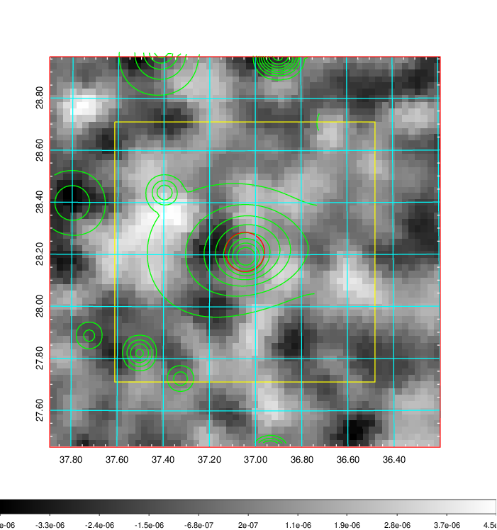 |

|[Redshift Histogram](../image/105/105_zg.pdf) | [DSS image(z1)](../image/105/105_dss_z1.pdf)      |  [DSS image(z2)](../image/105/105_dss_z2.pdf)    |
|-------------------|--------------------|-------------------|
|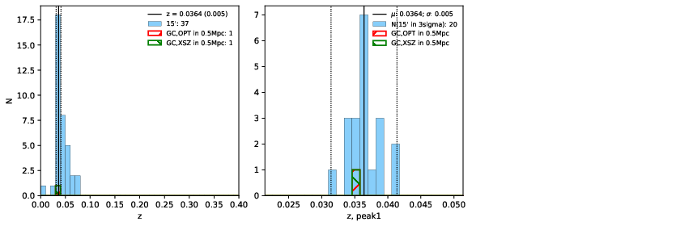 |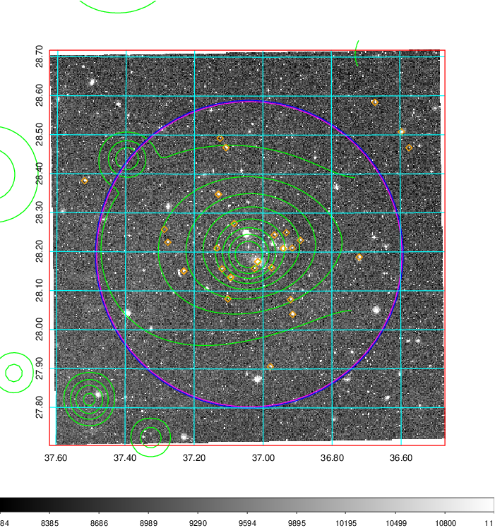  Blue circle for optical clusters;  Magenta circle for XSZ clusters;  all with r=1Mpc;  Only GC with Delta_z<0.01 are shown. | 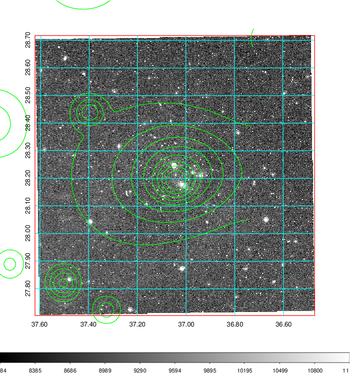 Blue circle for optical clusters;  Magenta circle for XSZ clusters;  all with r=1Mpc;  Only GC with Delta_z<0.01 are shown.  |

|[Previous-identified clusters](../image/105/105_gc.pdf) | [2MASS image](../image/105/105_2mass.pdf)      |
|-------------------|-------------------|
|  Green, magenta, and blue circles  for optical, X-ray and SZ clusters  respectively, with redshift of clusters  labelled. The radius of circles  are 1Mpc.|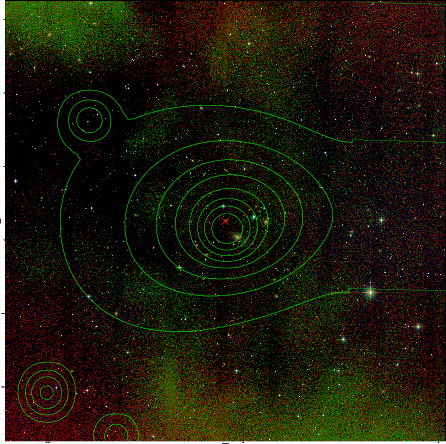  |

|[PS1 image](../image/105/105_ps1.pdf)            |
|-------------------|
| 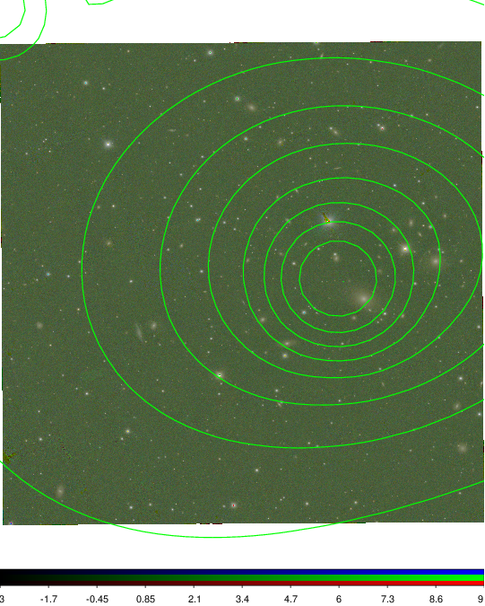  |
