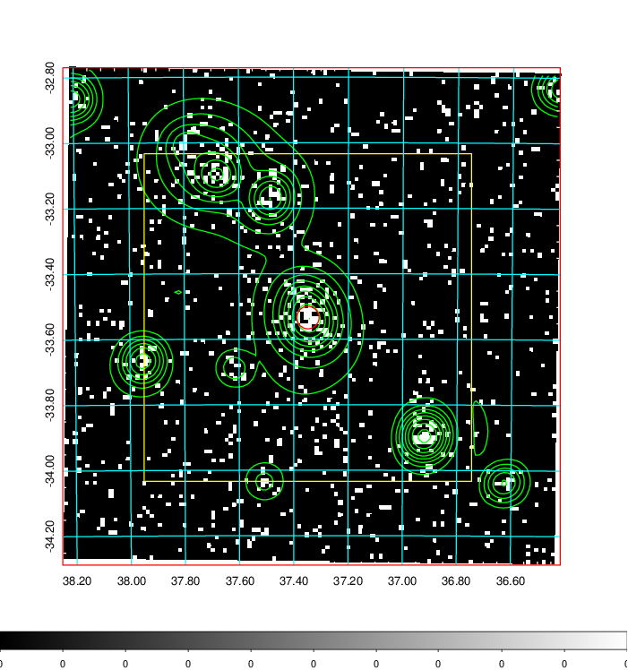
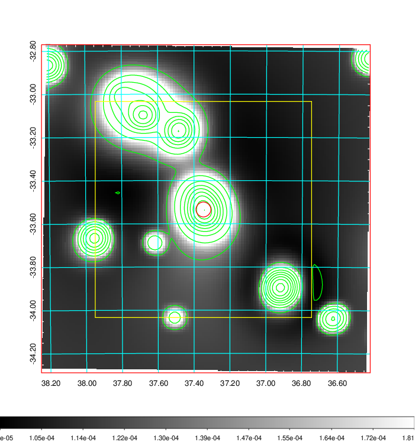
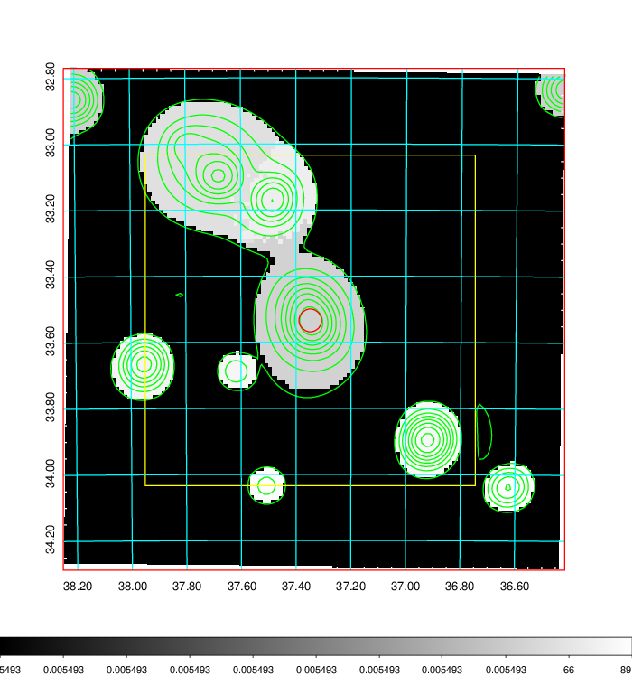
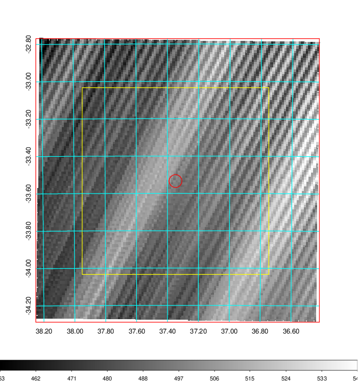
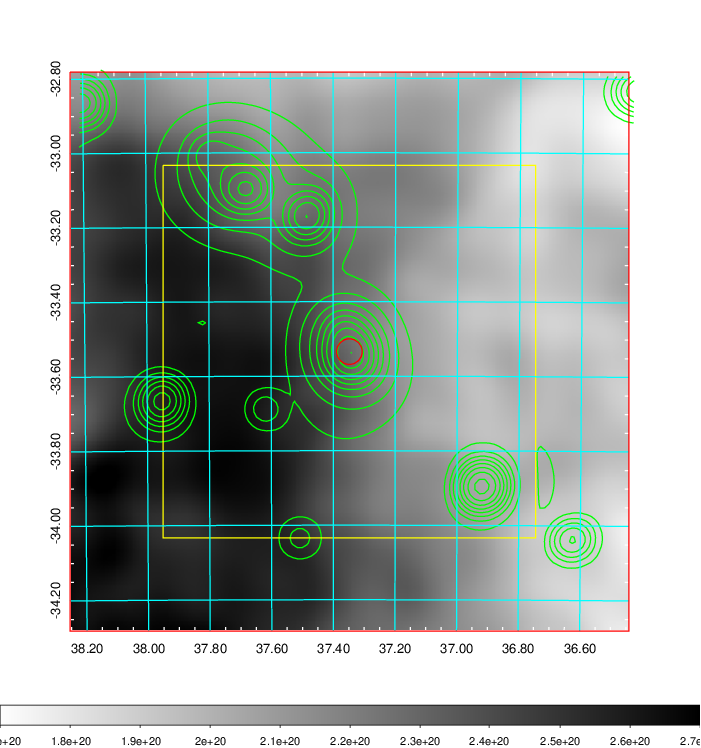
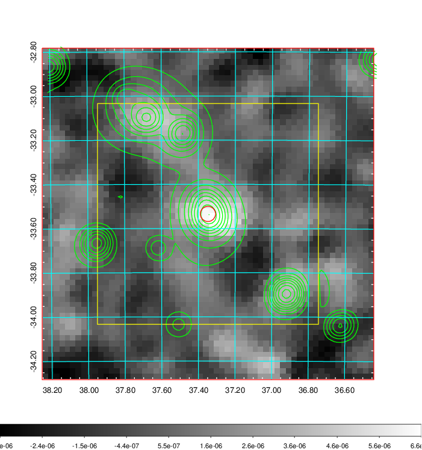
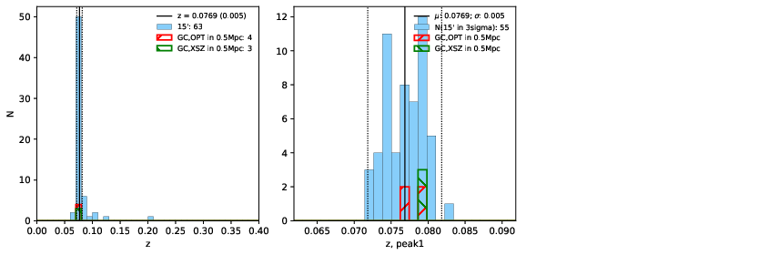
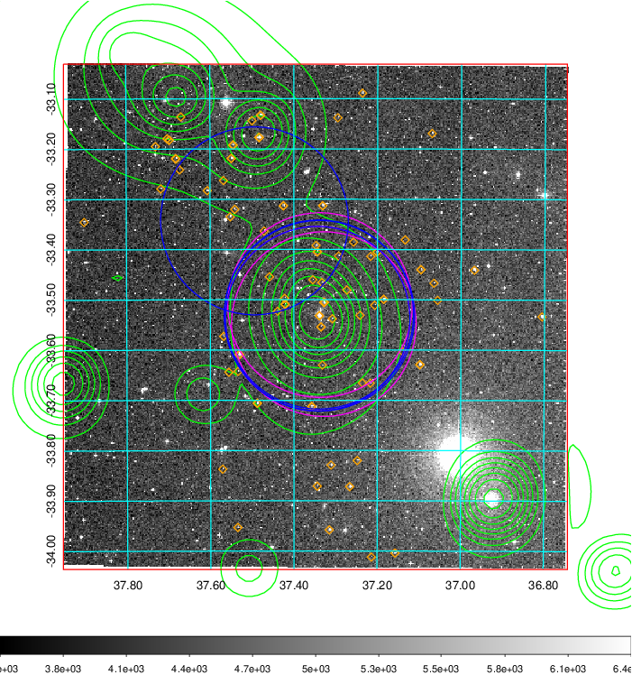
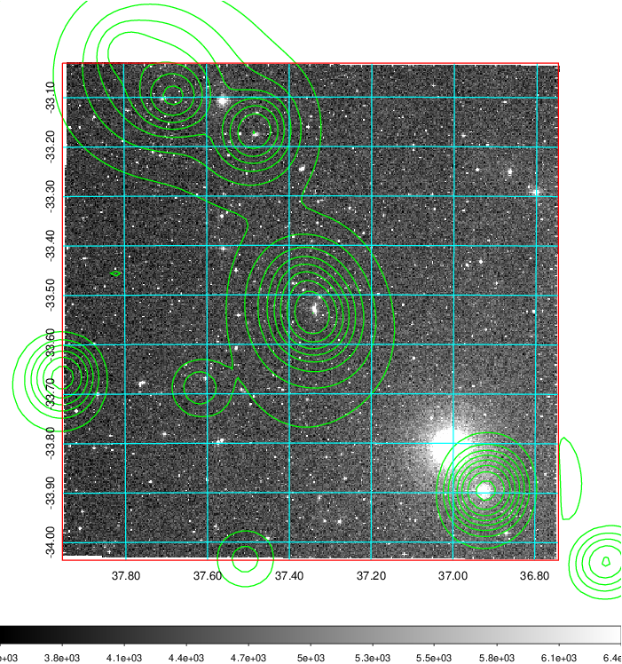
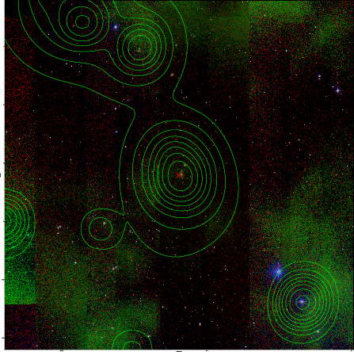

### 106

|Name|RAJ2000[deg]|DEJ2000[deg] |Ext[arcmin]| Ext,ml | z | z_src| C|GC(XSZ,Delta_z<0.01)| GC(OPT,Delta_z<0.01)|GC| R_sig[arcmin] | R500[arcmin] | R500[Mpc]| CRsig[c/s] | CR500[c/s] |L500[1E44 erg/s]|F500[1E-12 erg/s/cm^2]| M500[1E14 Msun]|Tx[keV]|Cnt_sig|Beta|Rc[arcmin]|Comment|Alias|
|---|---|---|---|---|---|------|---|--------|---------|----------|---|---|---|---|---|---|---|---|---|---|---|---|---|---|
|106| 37.348| -33.534| 2.07| 57.63| 0.0769(0.005)| z1, z_xsz| B| MCXC, PSZ2, Tar| N, W| MCXC, N, PSZ2, Tar, W| 14.650| 9.007| 0.787| 0.191(0.031)| 0.179(0.029)| 0.485(0.048)| 3.340(0.333)| 1.49(0.08)| 2.81(0.09)| 100.1| 0.691(-0.107+0.155)| 2.997(-0.913+1.059)| -| k227|

|[RASS image](../image/106/106_img.pdf)|[filtered image](../image/106/106_fil.pdf)|[Segment image](../image/106/106_seg.pdf)|
|-------------------|--------------------|-------------------|
|   |    |   |

|[Exposure image](../image/106/106_mex.pdf)| [nH image](../image/106/106_nh.pdf)| [Planck image](../image/106/106_p.pdf)|
|-------------------|--------------------|-------------------|
|   |     |  |

|[Redshift Histogram](../image/106/106_zg.pdf) | [DSS image(z1)](../image/106/106_dss_z1.pdf)      |  [DSS image(z2)](../image/106/106_dss_z2.pdf)    |
|-------------------|--------------------|-------------------|
| |  Blue circle for optical clusters;  Magenta circle for XSZ clusters;  all with r=1Mpc;  Only GC with Delta_z<0.01 are shown. |  Blue circle for optical clusters;  Magenta circle for XSZ clusters;  all with r=1Mpc;  Only GC with Delta_z<0.01 are shown.  |

|[known Abell/XSZ clusters](../image/106/106_gc.pdf) | [2MASS image](../image/106/106_2mass.pdf)      |
|-------------------|-------------------|
|  Magenta, blue and green circles  for optical, X-ray and SZ clusters  respectively, with redshift of clusters  labelled. The radius of circles  are 1Mpc.|  |

|[DES image](../image/106/106_des.pdf)   |[ATLAS image](../image/106/106_s.pdf)        |
|-------------------|-------------------|
|   |   |
