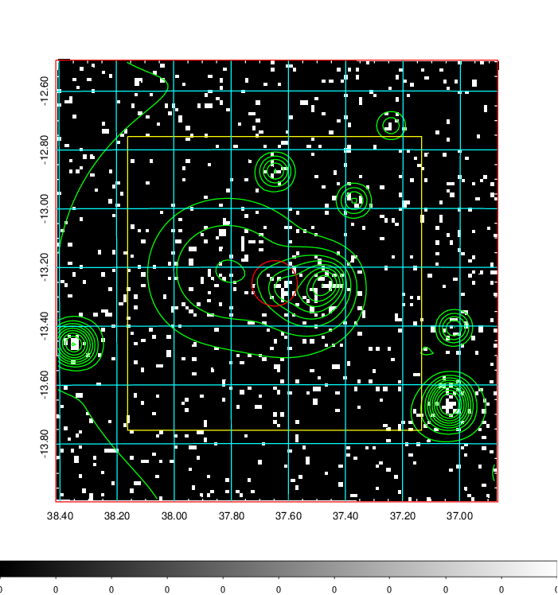
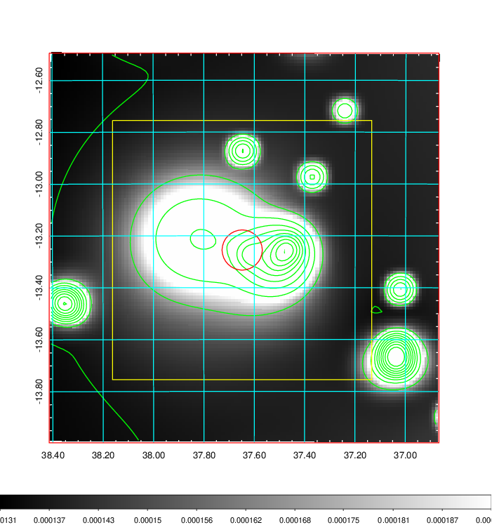
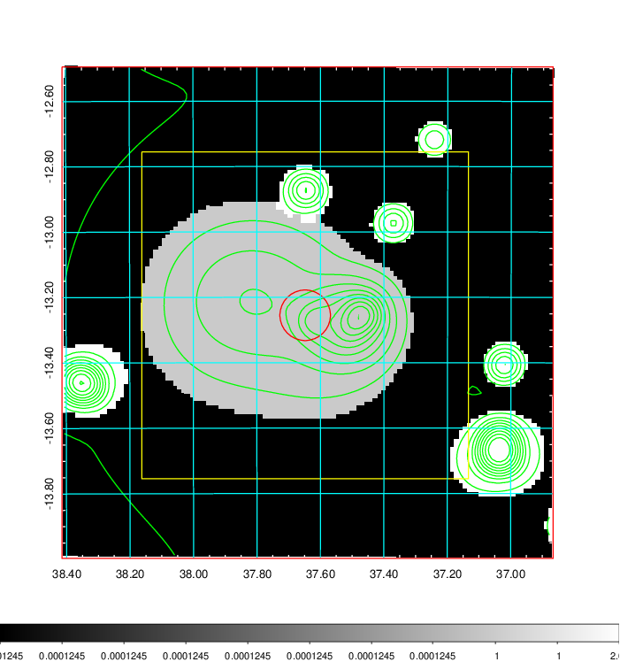
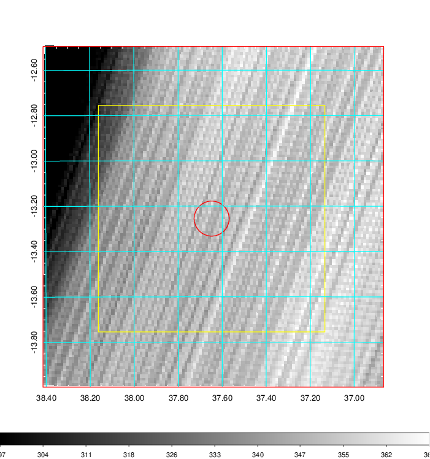
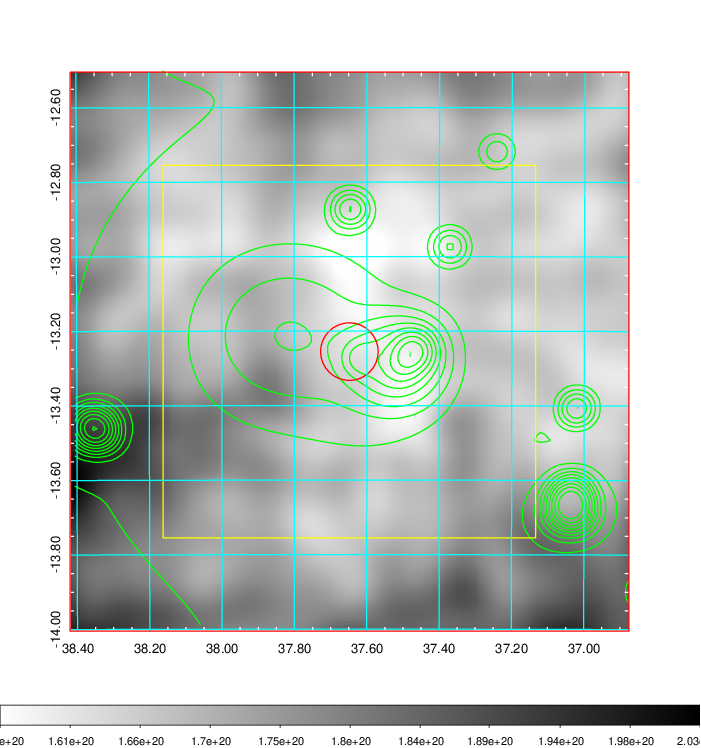
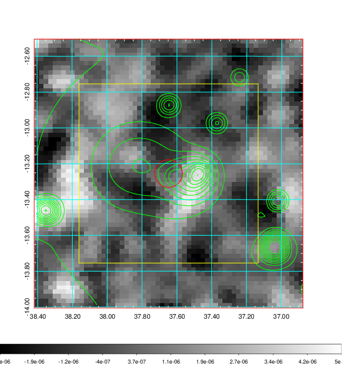
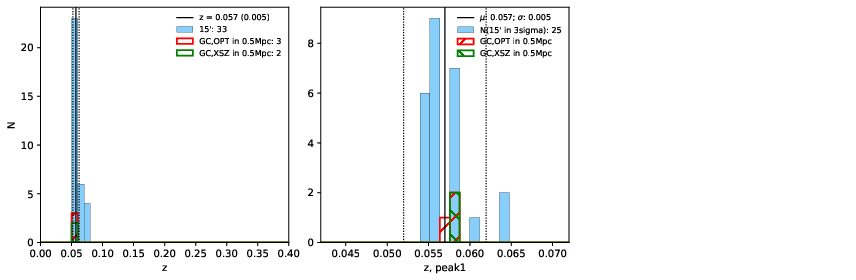
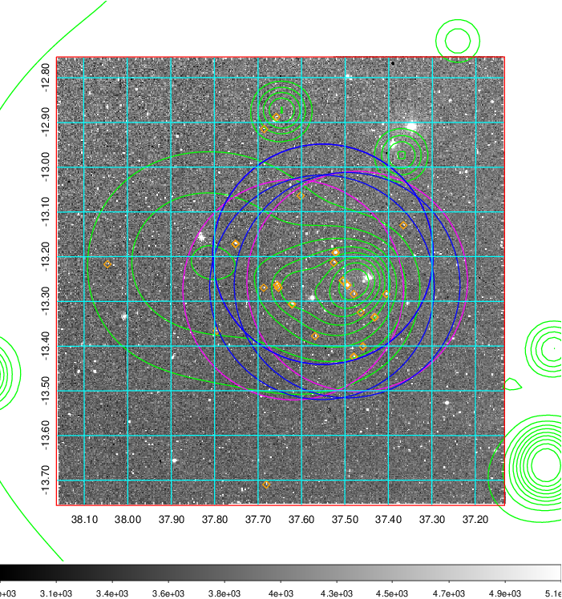
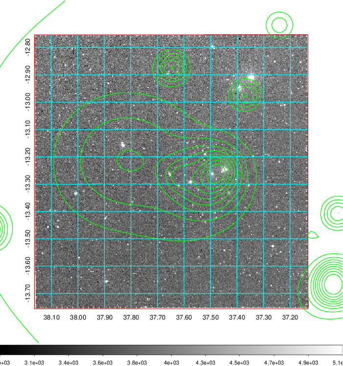
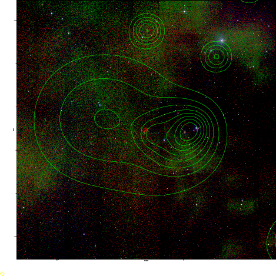

### 108

|Name|RAJ2000[deg]|DEJ2000[deg] |Ext[arcmin]| Ext,ml | z | z_src| C|GC(XSZ,Delta_z<0.01)| GC(OPT,Delta_z<0.01)|GC| R_sig[arcmin] | R500[arcmin] | R500[Mpc]| CRsig[c/s] | CR500[c/s] |L500[1E44 erg/s]|F500[1E-12 erg/s/cm^2]| M500[1E14 Msun]|Tx[keV]|Cnt_sig|Beta|Rc[arcmin]|Comment|Alias|
|---|---|---|---|---|---|------|---|--------|---------|----------|---|---|---|---|---|---|---|---|---|---|---|---|---|---|
|108| 37.648| -13.255| 4.64| 47.67| 0.0570(0.005)| z1, z_xsz| B| L03| A, N| A, L03, N, W| 22.231| 10.459| 0.694| 0.191(0.062)| 0.176(0.057)| 0.253(0.115)| 3.263(1.476)| 1.00(0.23)| 2.18(0.32)| 79.2| 0.642(-0.089+0.153)| 9.010(-1.641+2.386)| -| t238|

|[RASS image](../image/108/108_img.pdf)|[filtered image](../image/108/108_fil.pdf)|[Segment image](../image/108/108_seg.pdf)|
|-------------------|--------------------|-------------------|
|   |    |   |

|[Exposure image](../image/108/108_mex.pdf)| [nH image](../image/108/108_nh.pdf)| [Planck image](../image/108/108_p.pdf)|
|-------------------|--------------------|-------------------|
|   |     |  |

|[Redshift Histogram](../image/108/108_zg.pdf) | [DSS image(z1)](../image/108/108_dss_z1.pdf)      |  [DSS image(z2)](../image/108/108_dss_z2.pdf)    |
|-------------------|--------------------|-------------------|
| |  Blue circle for optical clusters;  Magenta circle for XSZ clusters;  all with r=1Mpc;  Only GC with Delta_z<0.01 are shown. |  Blue circle for optical clusters;  Magenta circle for XSZ clusters;  all with r=1Mpc;  Only GC with Delta_z<0.01 are shown.  |

|[known Abell/XSZ clusters](../image/108/108_gc.pdf) | [2MASS image](../image/108/108_2mass.pdf)      |
|-------------------|-------------------|
|  Magenta, blue and green circles  for optical, X-ray and SZ clusters  respectively, with redshift of clusters  labelled. The radius of circles  are 1Mpc.|  |

|[DES image](../image/108/108_des.pdf)   |[ATLAS image](../image/108/108_s.pdf)        |
|-------------------|-------------------|
|   |   |
