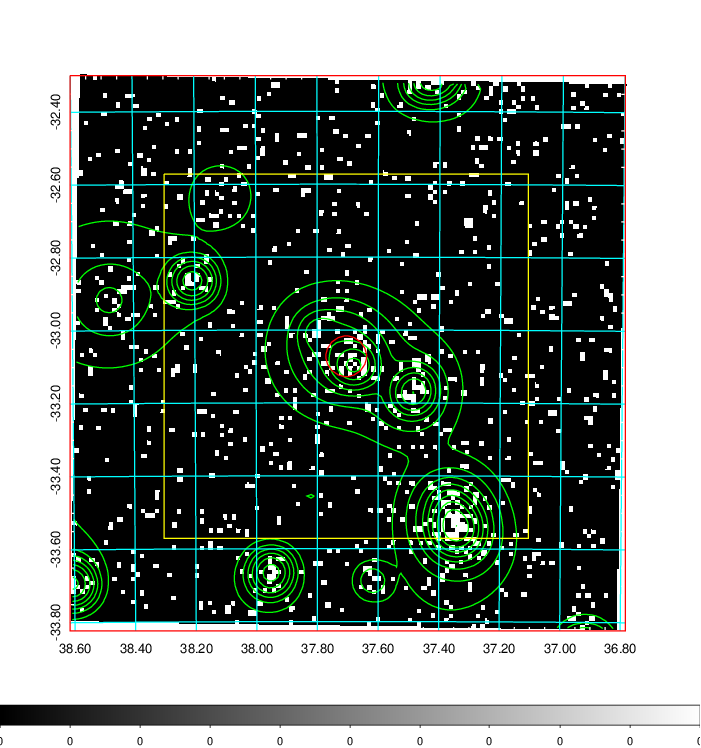
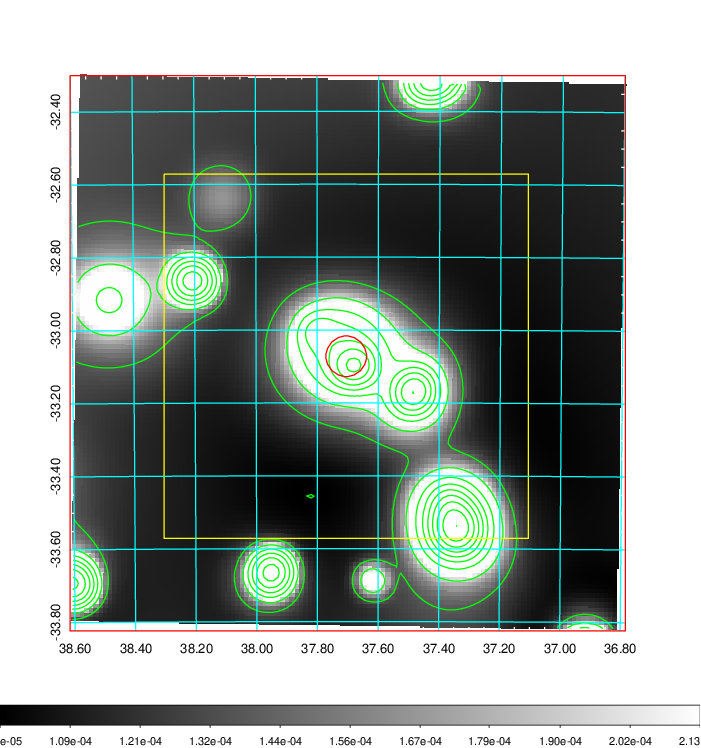
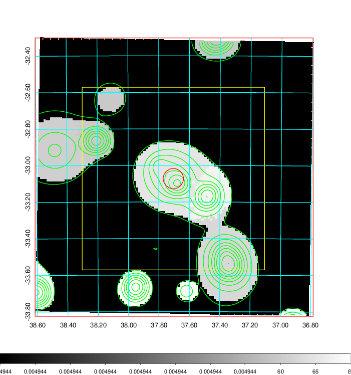
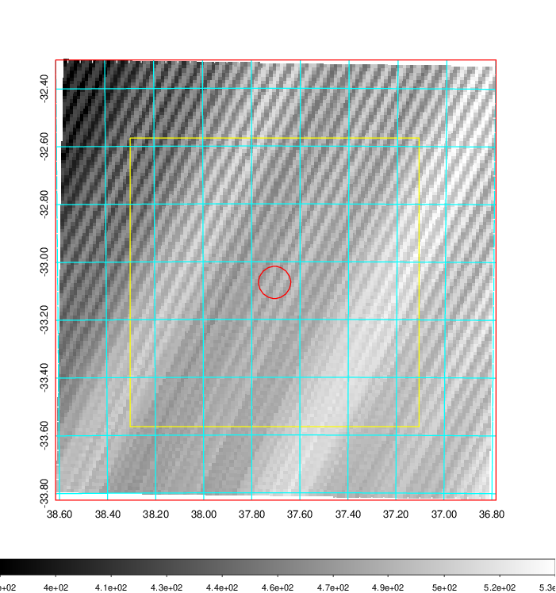
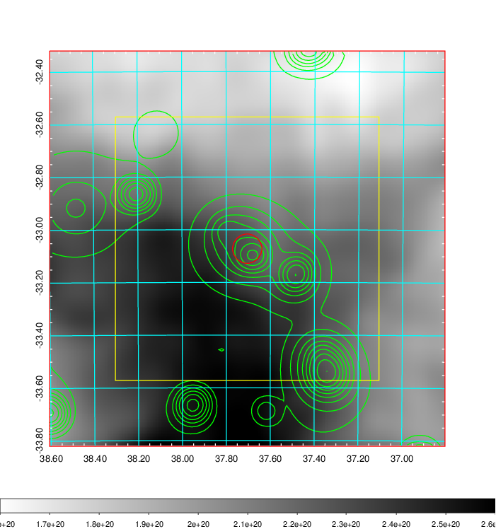
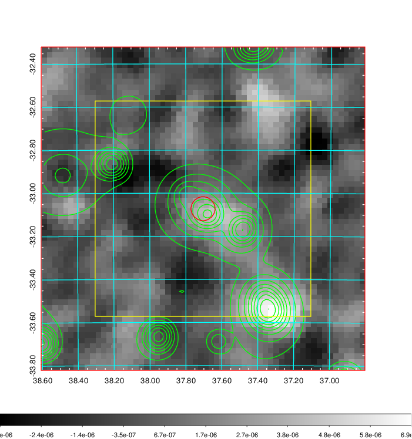
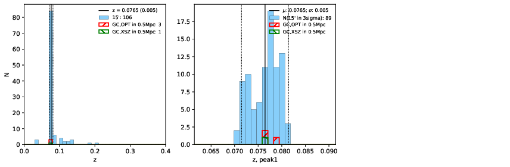
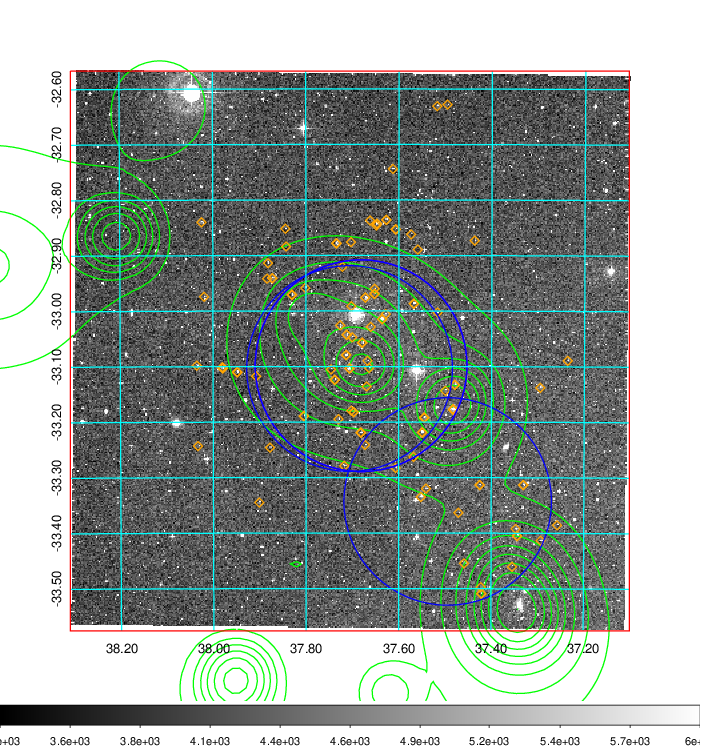
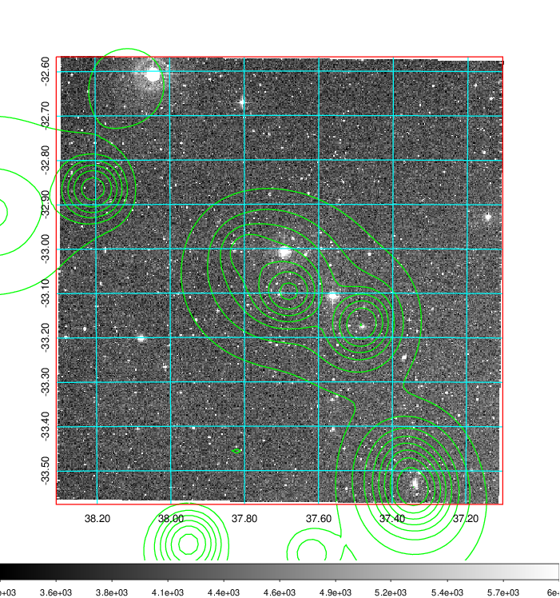
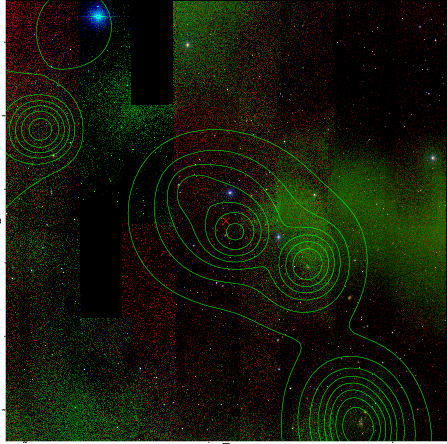

### 109

|Name|RAJ2000[deg]|DEJ2000[deg] |Ext[arcmin]| Ext,ml | z | z_src| C|GC(XSZ,Delta_z<0.01)| GC(OPT,Delta_z<0.01)|GC| R_sig[arcmin] | R500[arcmin] | R500[Mpc]| CRsig[c/s] | CR500[c/s] |L500[1E44 erg/s]|F500[1E-12 erg/s/cm^2]| M500[1E14 Msun]|Tx[keV]|Cnt_sig|Beta|Rc[arcmin]|Comment|Alias|
|---|---|---|---|---|---|------|---|--------|---------|----------|---|---|---|---|---|---|---|---|---|---|---|---|---|---|
|109| 37.705| -33.072| 3.34| 36.74| 0.0765(0.005)| z1, z_xsz| B| MCXC| A, W| A, MCXC, W| 11.725| 8.491| 0.739| 0.140(0.028)| 0.134(0.027)| 0.352(0.055)| 2.450(0.382)| 1.23(0.10)| 2.49(0.12)| 71.1| 0.777(-0.148+0.148)| 5.664(-1.463+1.283)| -| k410|

|[RASS image](../image/109/109_img.pdf)|[filtered image](../image/109/109_fil.pdf)|[Segment image](../image/109/109_seg.pdf)|
|-------------------|--------------------|-------------------|
|   |    |   |

|[Exposure image](../image/109/109_mex.pdf)| [nH image](../image/109/109_nh.pdf)| [Planck image](../image/109/109_p.pdf)|
|-------------------|--------------------|-------------------|
|   |     |  |

|[Redshift Histogram](../image/109/109_zg.pdf) | [DSS image(z1)](../image/109/109_dss_z1.pdf)      |  [DSS image(z2)](../image/109/109_dss_z2.pdf)    |
|-------------------|--------------------|-------------------|
| |  Blue circle for optical clusters;  Magenta circle for XSZ clusters;  all with r=1Mpc;  Only GC with Delta_z<0.01 are shown. |  Blue circle for optical clusters;  Magenta circle for XSZ clusters;  all with r=1Mpc;  Only GC with Delta_z<0.01 are shown.  |

|[known Abell/XSZ clusters](../image/109/109_gc.pdf) | [2MASS image](../image/109/109_2mass.pdf)      |
|-------------------|-------------------|
|  Magenta, blue and green circles  for optical, X-ray and SZ clusters  respectively, with redshift of clusters  labelled. The radius of circles  are 1Mpc.|  |

|[DES image](../image/109/109_des.pdf)   |[ATLAS image](../image/109/109_s.pdf)        |
|-------------------|-------------------|
|   |   |
