

### 110

|Name|RAJ2000[deg]|DEJ2000[deg] |Ext[arcmin]| Ext,ml | z | z_src| C|GC(XSZ,Delta_z<0.01)| GC(OPT,Delta_z<0.01)|GC| R_sig[arcmin] | R500[arcmin] | R500[Mpc]| CRsig[c/s] | CR500[c/s] |L500[1E44 erg/s]|F500[1E-12 erg/s/cm^2]| M500[1E14 Msun]|Tx[keV]|Cnt_sig|Beta|Rc[arcmin]|Comment|Alias|
|---|---|---|---|---|---|------|---|--------|---------|----------|---|---|---|---|---|---|---|---|---|---|---|---|---|---|
|110| 37.983| 1.252| 4.30| 40.76| 0.0225(0.005)| z2, z_xsz| B| MCXC| N| MCXC, N| 10.262| 17.539| 0.478| 0.178(0.047)| 0.202(0.052)| 0.032(0.006)| 2.763(0.556)| 0.32(0.03)| 1.06(0.07)| 46.5| 0.807(-0.165+0.135)| 5.900(-1.601+1.291)| -| k498|

|[RASS image](../image/110/110_img.pdf)|[filtered image](../image/110/110_fil.pdf)|[Segment image](../image/110/110_seg.pdf)|
|-------------------|--------------------|-------------------|
| 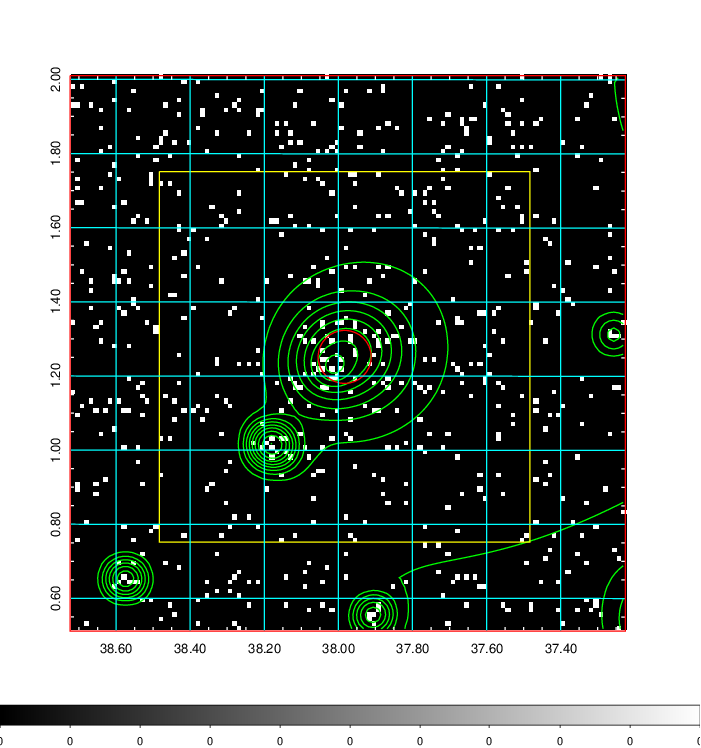  | 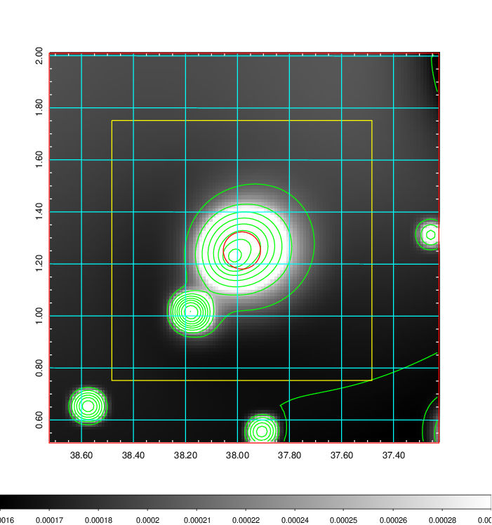   | 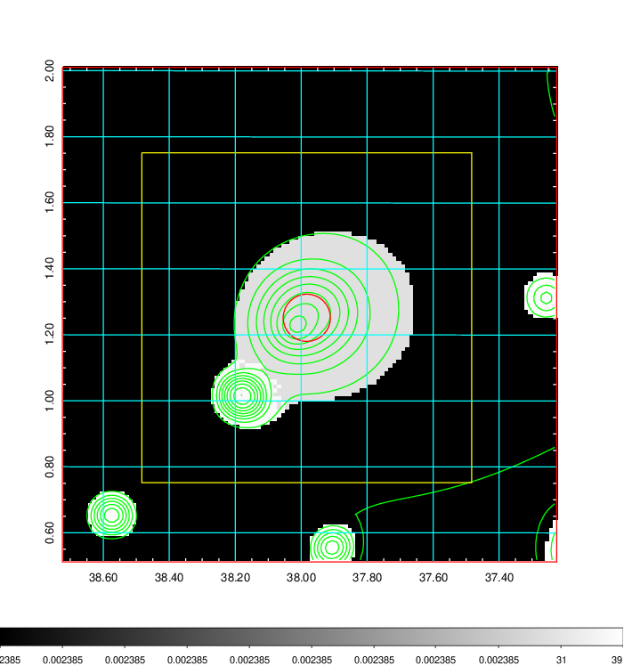  |

|[Exposure image](../image/110/110_mex.pdf)| [nH image](../image/110/110_nh.pdf)| [Planck image](../image/110/110_p.pdf)|
|-------------------|--------------------|-------------------|
|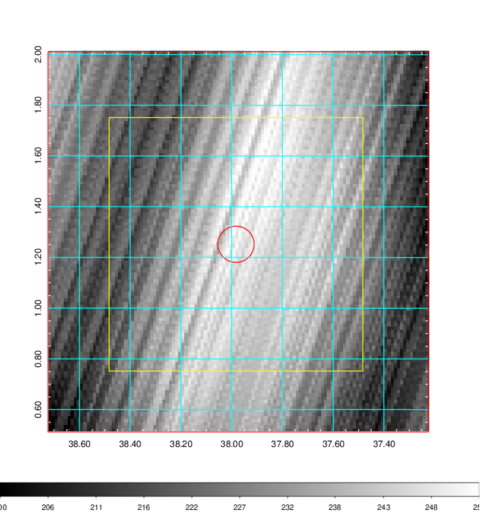   | 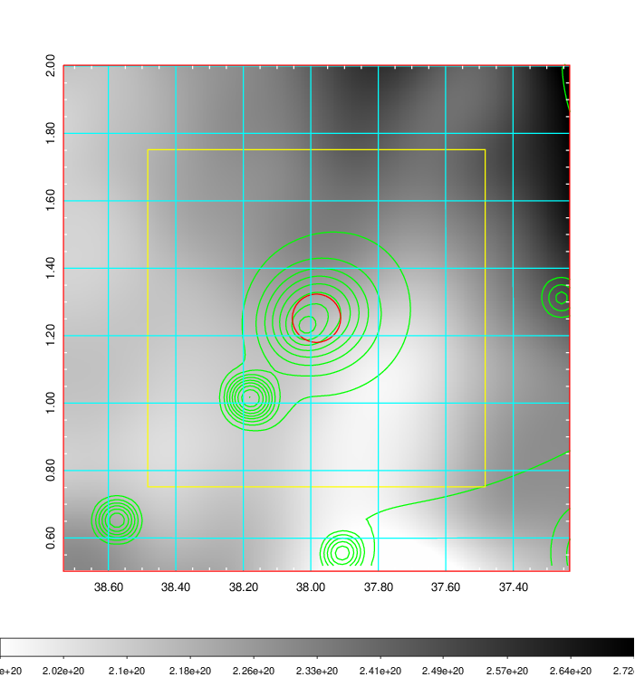    | 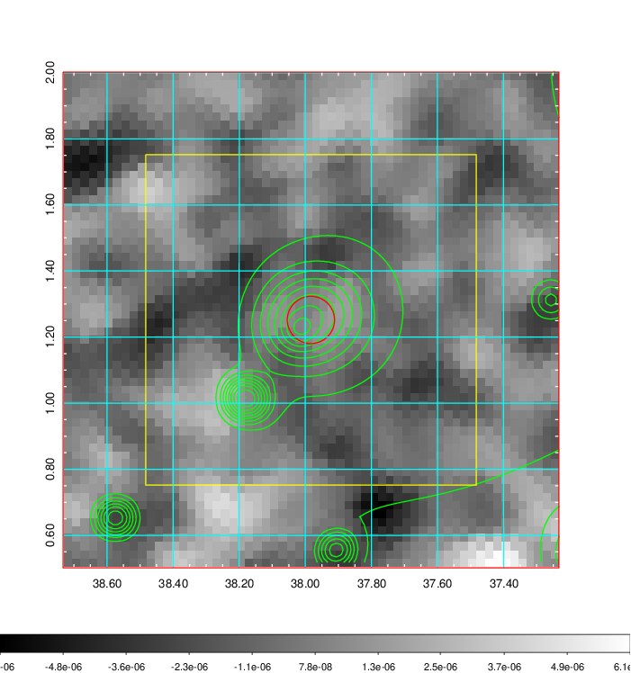 |

|[Redshift Histogram](../image/110/110_zg.pdf) | [DSS image(z1)](../image/110/110_dss_z1.pdf)      |  [DSS image(z2)](../image/110/110_dss_z2.pdf)    |
|-------------------|--------------------|-------------------|
|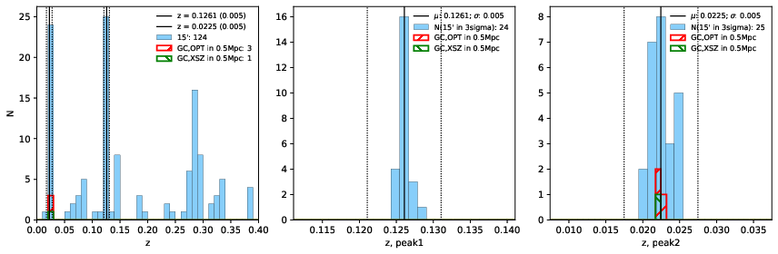 |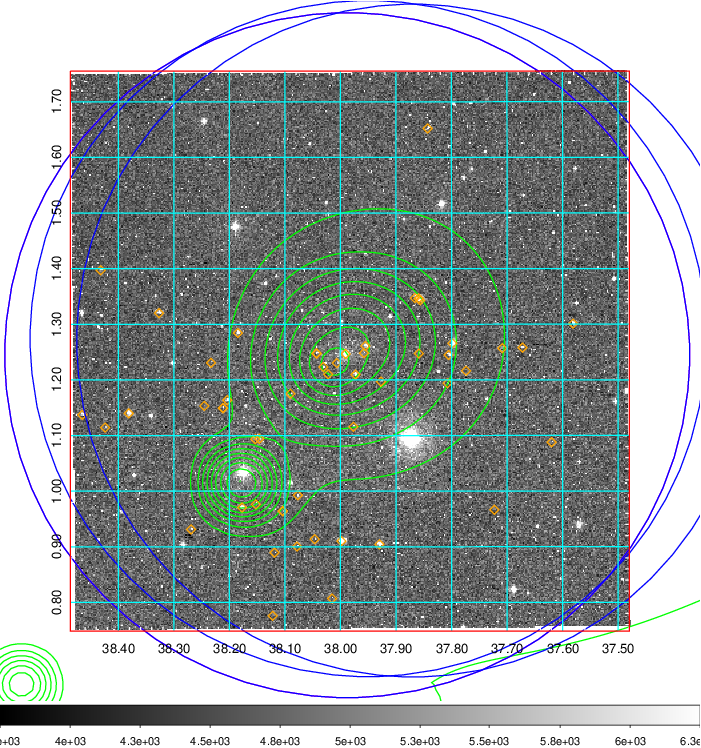  Blue circle for optical clusters;  Magenta circle for XSZ clusters;  all with r=1Mpc;  Only GC with Delta_z<0.01 are shown. | 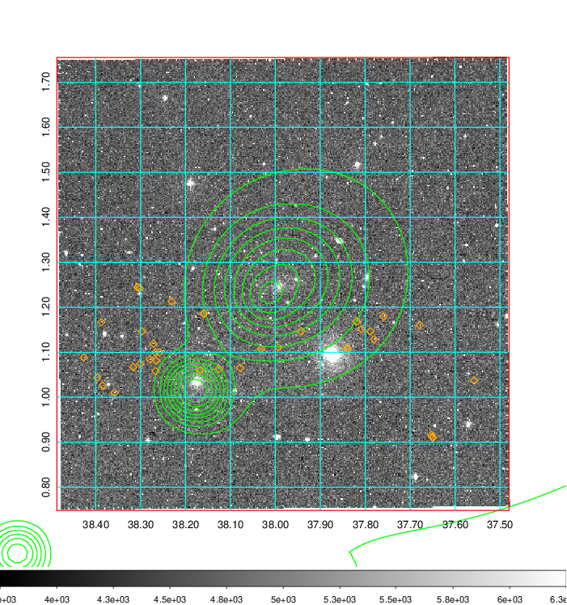 Blue circle for optical clusters;  Magenta circle for XSZ clusters;  all with r=1Mpc;  Only GC with Delta_z<0.01 are shown.  |

|[known Abell/XSZ clusters](../image/110/110_gc.pdf) | [2MASS image](../image/110/110_2mass.pdf)      |[SDSS image](../image/110/110_sdss.pdf)   |
|-------------------|-------------------|-------------------|
|  Magenta, blue and green circles  for optical, X-ray and SZ clusters  respectively, with redshift of clusters  labelled. The radius of circles  are 1Mpc.|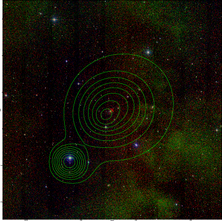  | 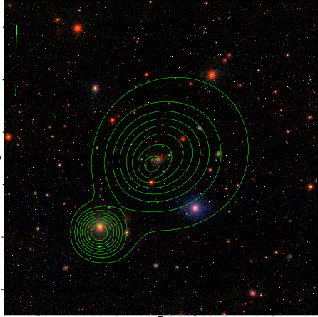  |

|[DES image](../image/110/110_des.pdf)   |
|-------------------|
|   |
