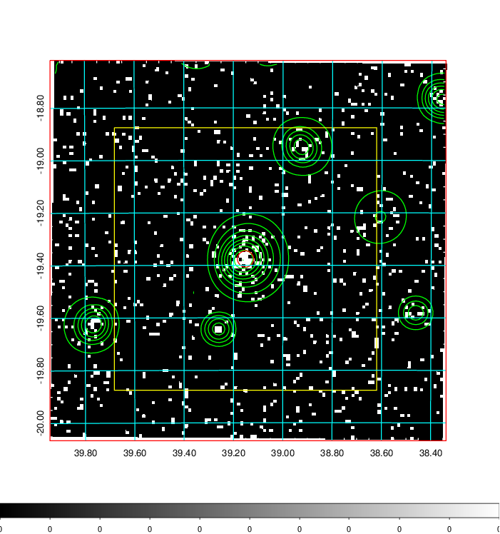
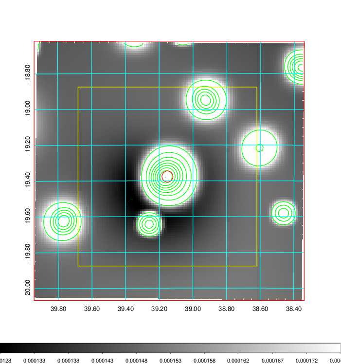
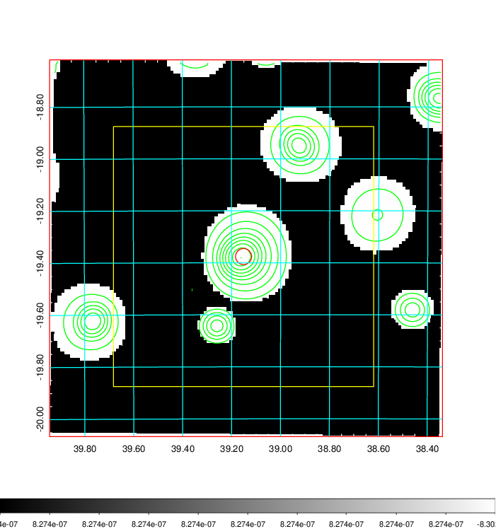
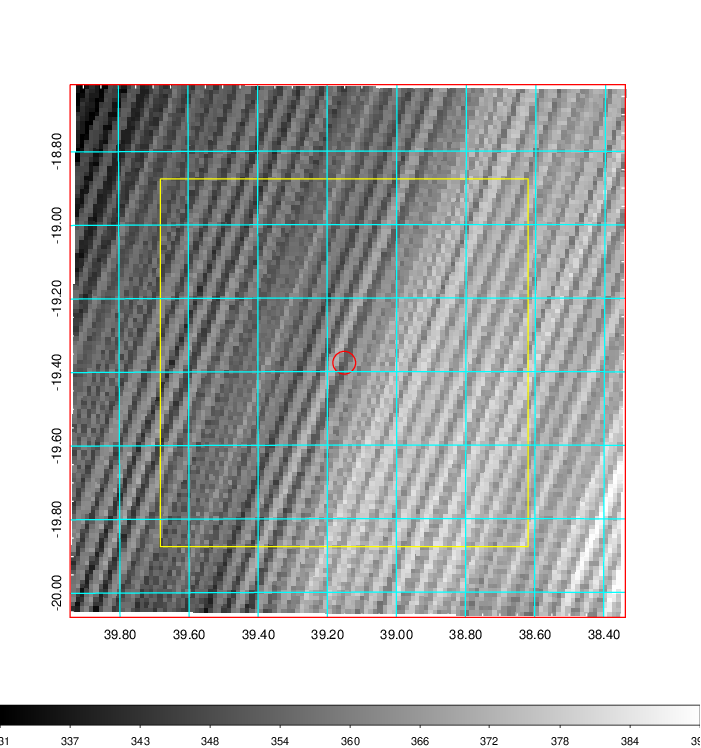
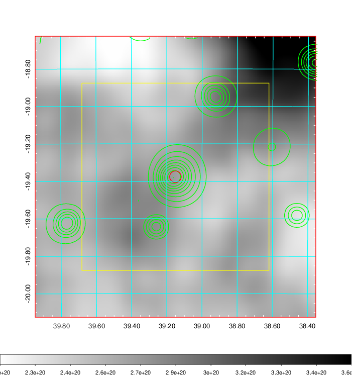
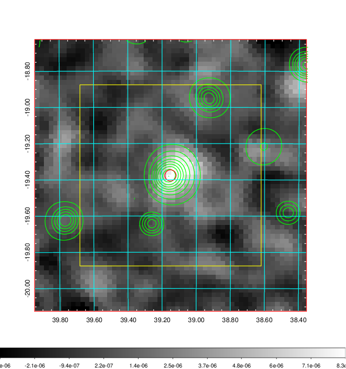
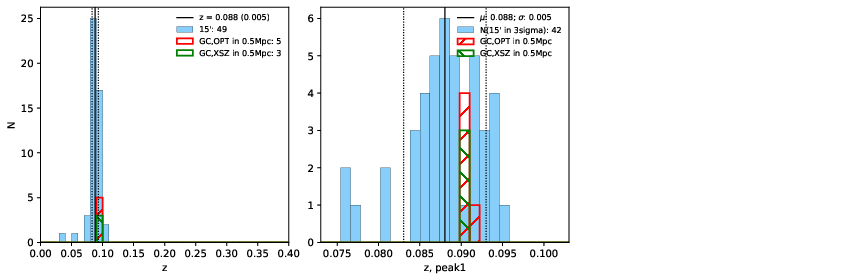
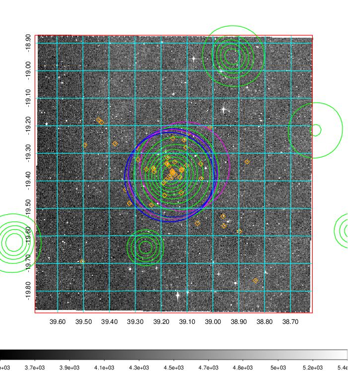
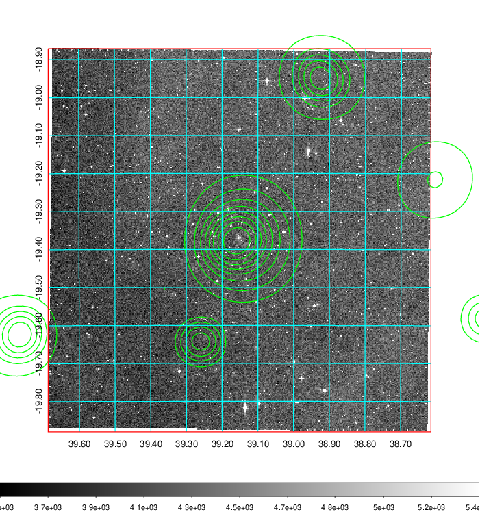
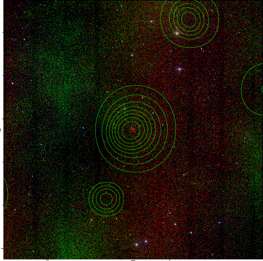

### 112

|Name|RAJ2000[deg]|DEJ2000[deg] |Ext[arcmin]| Ext,ml | z | z_src| C|GC(XSZ,Delta_z<0.01)| GC(OPT,Delta_z<0.01)|GC| R_sig[arcmin] | R500[arcmin] | R500[Mpc]| CRsig[c/s] | CR500[c/s] |L500[1E44 erg/s]|F500[1E-12 erg/s/cm^2]| M500[1E14 Msun]|Tx[keV]|Cnt_sig|Beta|Rc[arcmin]|Comment|Alias|
|---|---|---|---|---|---|------|---|--------|---------|----------|---|---|---|---|---|---|---|---|---|---|---|---|---|---|
|112| 39.151| -19.376| 1.86| 34.23| 0.0880(0.005)| z1, z_xsz| B| MCXC, PSZ2, Tar| A, N, W| A, MCXC, N, PSZ2, Tar, W| 12.212| 8.430| 0.832| 0.191(0.038)| 0.182(0.036)| 0.646(0.065)| 3.343(0.334)| 1.78(0.09)| 3.15(0.10)| 76.1| 0.903(-0.111+0.069)| 3.565(-0.624+0.479)| -| k186|

|[RASS image](../image/112/112_img.pdf)|[filtered image](../image/112/112_fil.pdf)|[Segment image](../image/112/112_seg.pdf)|
|-------------------|--------------------|-------------------|
|   |    |   |

|[Exposure image](../image/112/112_mex.pdf)| [nH image](../image/112/112_nh.pdf)| [Planck image](../image/112/112_p.pdf)|
|-------------------|--------------------|-------------------|
|   |     |  |

|[Redshift Histogram](../image/112/112_zg.pdf) | [DSS image(z1)](../image/112/112_dss_z1.pdf)      |  [DSS image(z2)](../image/112/112_dss_z2.pdf)    |
|-------------------|--------------------|-------------------|
| |  Blue circle for optical clusters;  Magenta circle for XSZ clusters;  all with r=1Mpc;  Only GC with Delta_z<0.01 are shown. |  Blue circle for optical clusters;  Magenta circle for XSZ clusters;  all with r=1Mpc;  Only GC with Delta_z<0.01 are shown.  |

|[known Abell/XSZ clusters](../image/112/112_gc.pdf) | [2MASS image](../image/112/112_2mass.pdf)      |
|-------------------|-------------------|
|  Magenta, blue and green circles  for optical, X-ray and SZ clusters  respectively, with redshift of clusters  labelled. The radius of circles  are 1Mpc.|  |

|[DES image](../image/112/112_des.pdf)   |[ATLAS image](../image/112/112_s.pdf)        |
|-------------------|-------------------|
|   |   |
