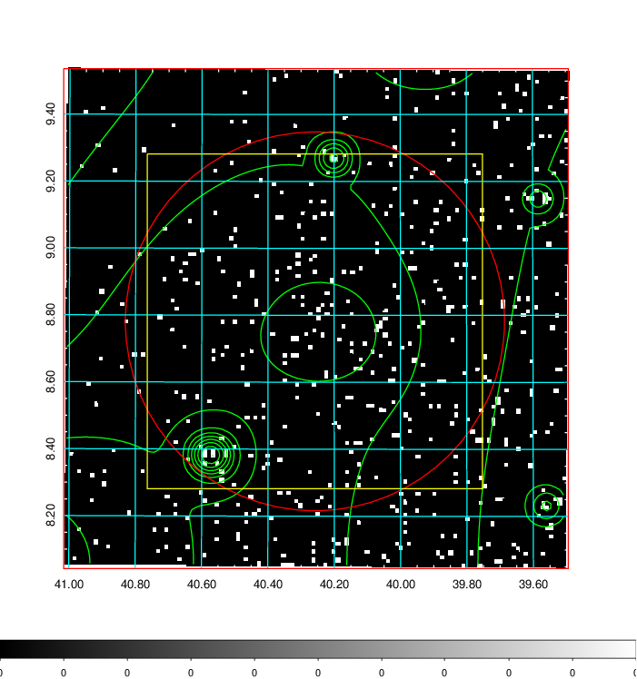
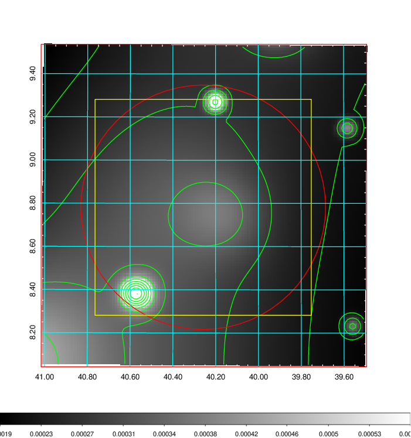
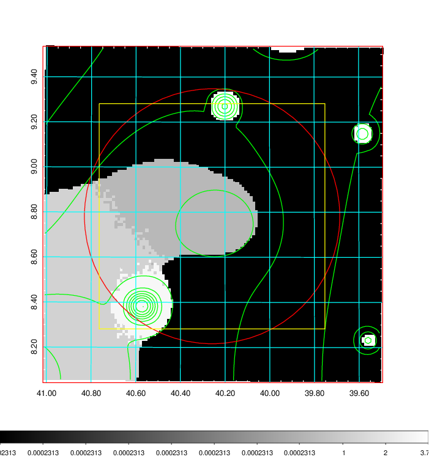
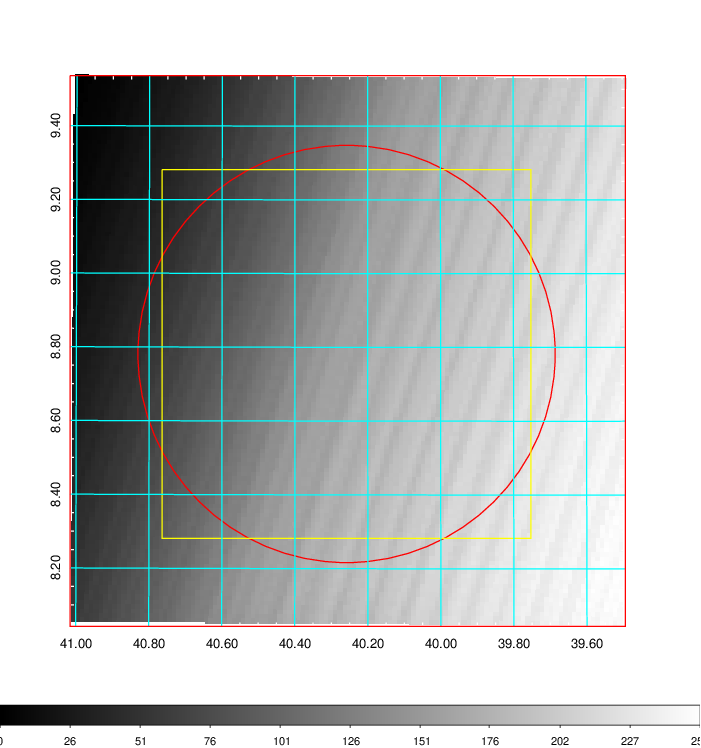
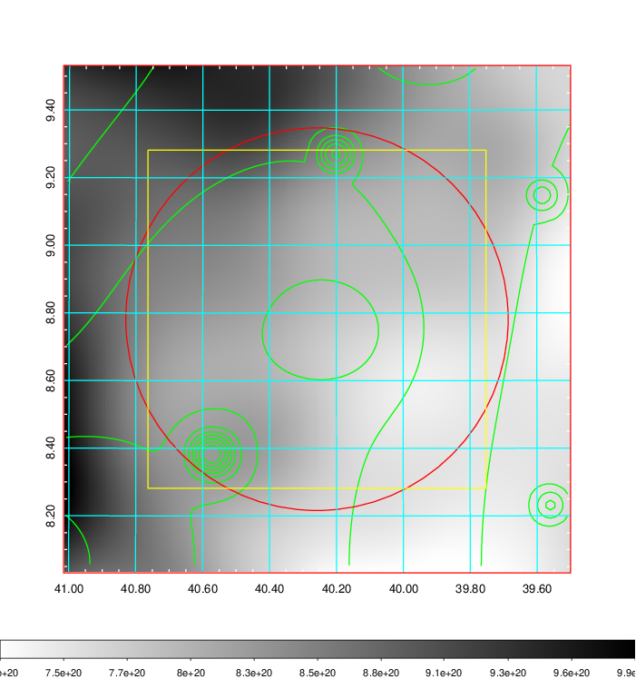
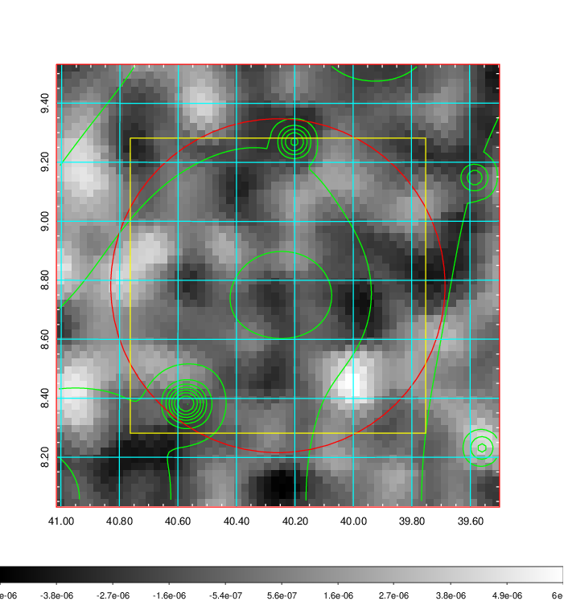
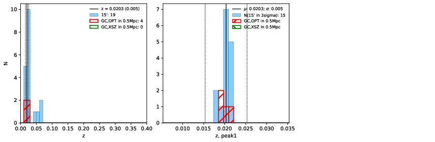
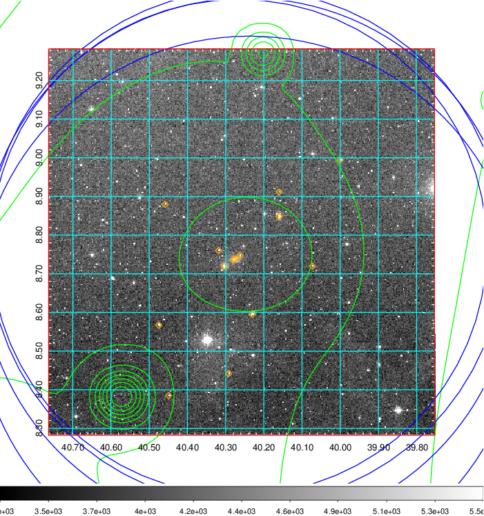
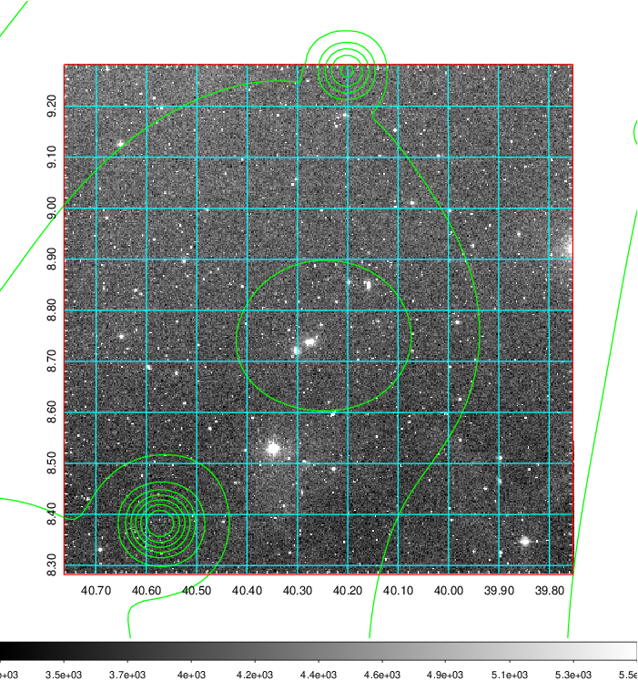
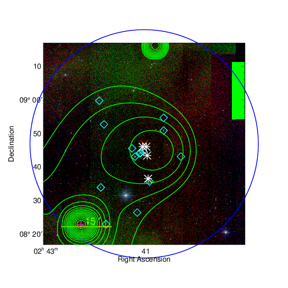

### 113

|Name|RAJ2000[deg]|DEJ2000[deg] |Ext[arcmin]| Ext,ml | z | z_src| C|GC(XSZ,Delta_z<0.01)| GC(OPT,Delta_z<0.01)|GC| R_sig[arcmin] | R500[arcmin] | R500[Mpc]| CRsig[c/s] | CR500[c/s] |L500[1E44 erg/s]|F500[1E-12 erg/s/cm^2]| M500[1E14 Msun]|Tx[keV]|Cnt_sig|Beta|Rc[arcmin]|Comment|Alias|
|---|---|---|---|---|---|------|---|--------|---------|----------|---|---|---|---|---|---|---|---|---|---|---|---|---|---|
|113| 40.258| 8.782| 33.95| 132.30| 0.0203(0.005)| z1, z_opt| S| -| N| N| 11.238| 18.643| 0.460| 0.154(0.056)| 0.173(0.062)| 0.020(0.005)| 2.149(0.500)| 0.28(0.03)| 0.99(0.07)| 35.1| 0.740(-0.167+0.176)| 7.895(-2.382+2.693)| -| t655|

|[RASS image](../image/113/113_img.pdf)|[filtered image](../image/113/113_fil.pdf)|[Segment image](../image/113/113_seg.pdf)|
|-------------------|--------------------|-------------------|
|   |    |   |

|[Exposure image](../image/113/113_mex.pdf)| [nH image](../image/113/113_nh.pdf)| [Planck image](../image/113/113_p.pdf)|
|-------------------|--------------------|-------------------|
|   |     |  |

|[Redshift Histogram](../image/113/113_zg.pdf) | [DSS image(z1)](../image/113/113_dss_z1.pdf)      |  [DSS image(z2)](../image/113/113_dss_z2.pdf)    |
|-------------------|--------------------|-------------------|
| |  Blue circle for optical clusters;  Magenta circle for XSZ clusters;  all with r=1Mpc;  Only GC with Delta_z<0.01 are shown. |  Blue circle for optical clusters;  Magenta circle for XSZ clusters;  all with r=1Mpc;  Only GC with Delta_z<0.01 are shown.  |

|[known Abell/XSZ clusters](../image/113/113_gc.pdf) | [2MASS image](../image/113/113_2mass.pdf)      |
|-------------------|-------------------|
|  Magenta, blue and green circles  for optical, X-ray and SZ clusters  respectively, with redshift of clusters  labelled. The radius of circles  are 1Mpc.|  |

|[PS1 image](../image/113/113_ps1.pdf)            |
|-------------------|
|   |
