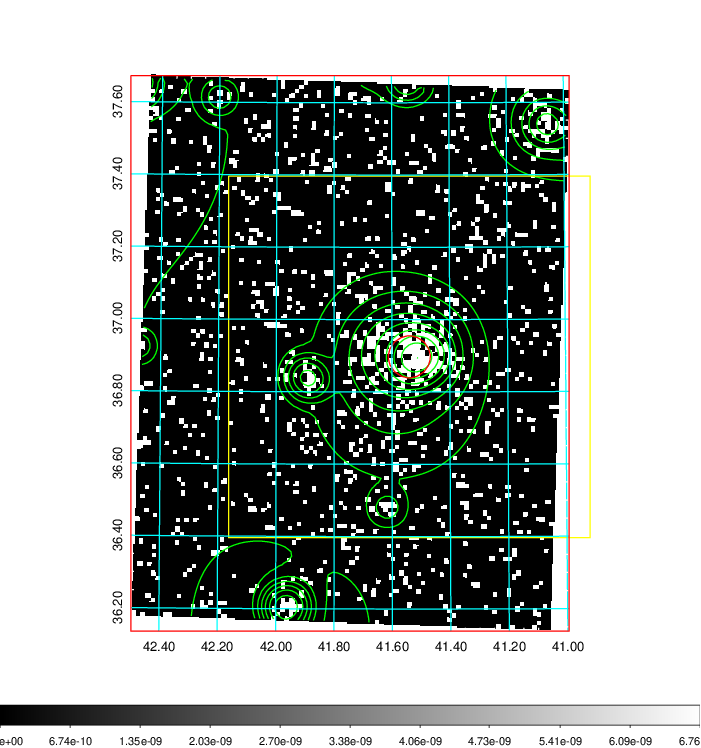
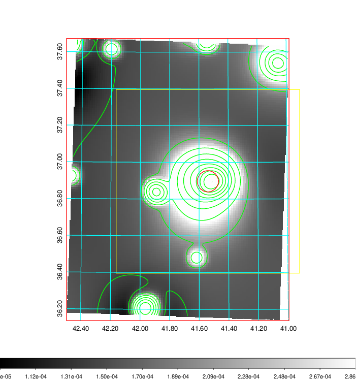
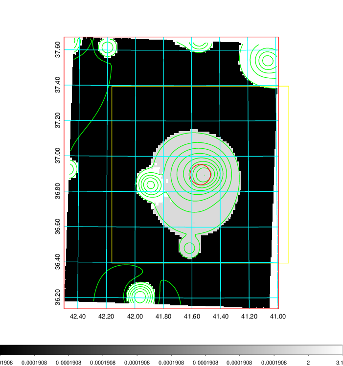
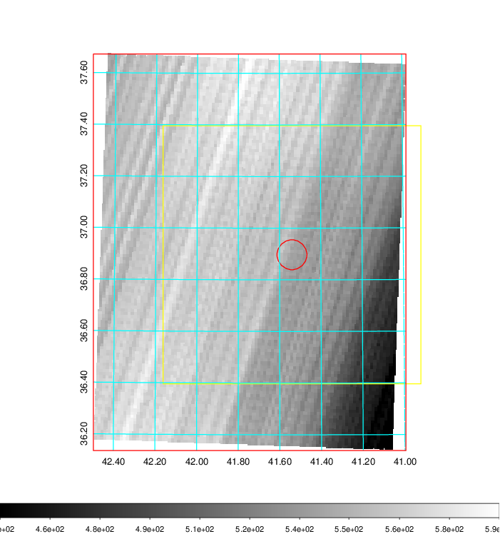
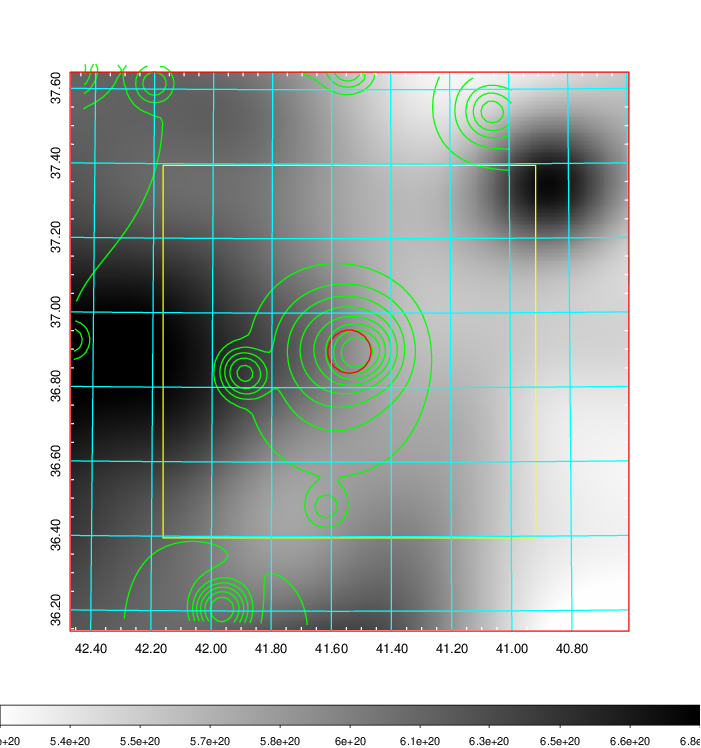
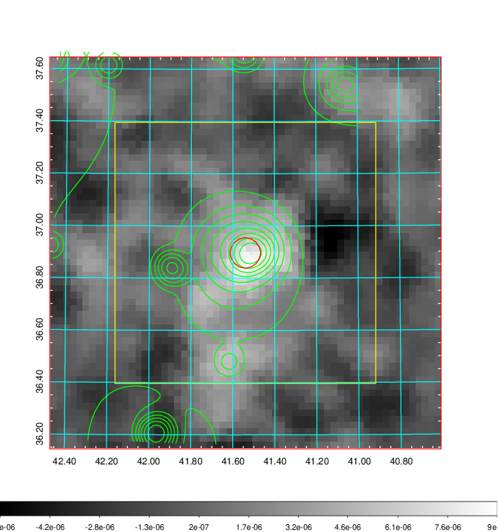
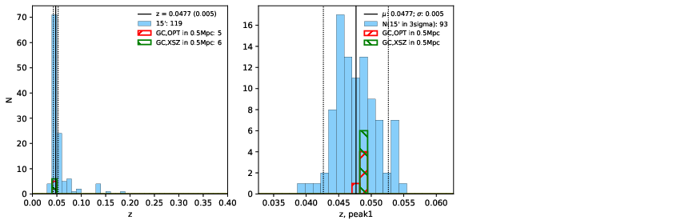
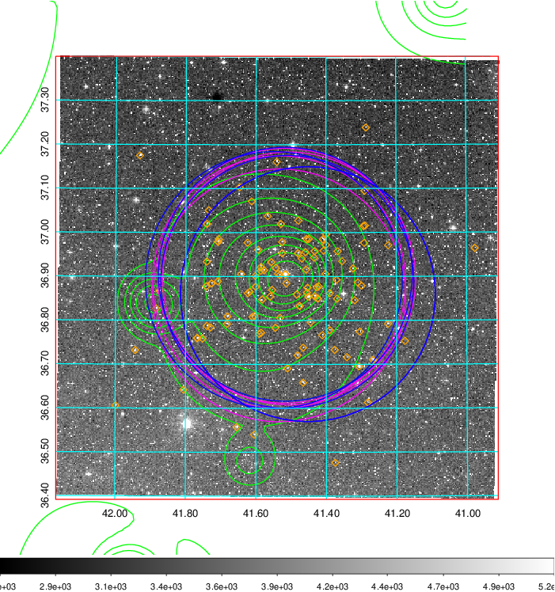
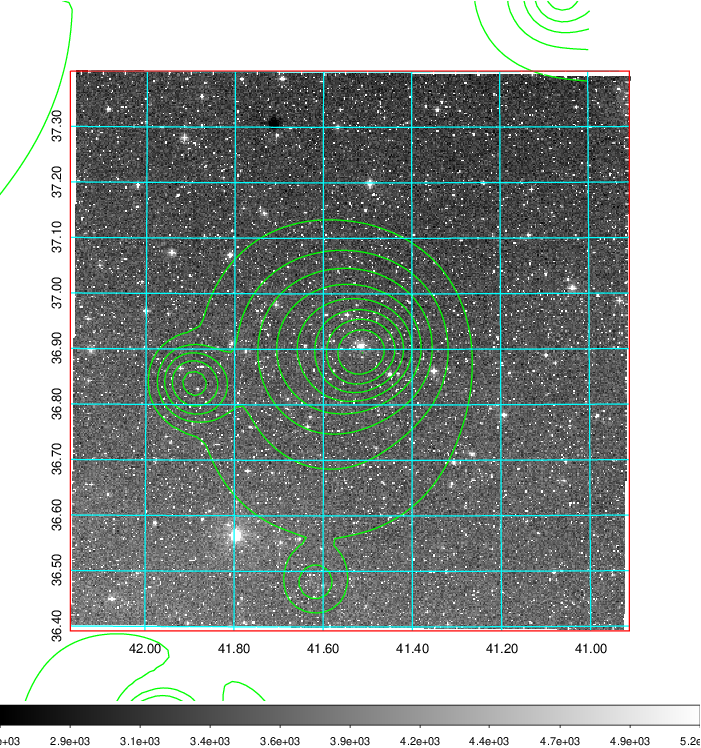
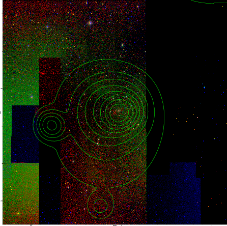

### 114

|Name|RAJ2000[deg]|DEJ2000[deg] |Ext[arcmin]| Ext,ml | z | z_src| C|GC(XSZ,Delta_z<0.01)| GC(OPT,Delta_z<0.01)|GC| R_sig[arcmin] | R500[arcmin] | R500[Mpc]| CRsig[c/s] | CR500[c/s] |L500[1E44 erg/s]|F500[1E-12 erg/s/cm^2]| M500[1E14 Msun]|Tx[keV]|Cnt_sig|Beta|Rc[arcmin]|Comment|Alias|
|---|---|---|---|---|---|------|---|--------|---------|----------|---|---|---|---|---|---|---|---|---|---|---|---|---|---|
|114| 41.540| 36.897| 3.48| 317.85| 0.0477(0.005)| z1, z_xsz| B| L03, MCXC, PSZ2, Tar, XB| A, N, W| A, L03, MCXC, N, PSZ2, Tar, W, XB| 20.750| 15.193| 0.852| 0.645(0.054)| 0.617(0.051)| 0.573(0.023)| 10.691(0.426)| 1.84(0.04)| 3.17(0.04)| 358.7| 0.850(-0.063+0.074)| 6.077(-0.658+0.701)| -| k427|

|[RASS image](../image/114/114_img.pdf)|[filtered image](../image/114/114_fil.pdf)|[Segment image](../image/114/114_seg.pdf)|
|-------------------|--------------------|-------------------|
|   |    |   |

|[Exposure image](../image/114/114_mex.pdf)| [nH image](../image/114/114_nh.pdf)| [Planck image](../image/114/114_p.pdf)|
|-------------------|--------------------|-------------------|
|   |     |  |

|[Redshift Histogram](../image/114/114_zg.pdf) | [DSS image(z1)](../image/114/114_dss_z1.pdf)      |  [DSS image(z2)](../image/114/114_dss_z2.pdf)    |
|-------------------|--------------------|-------------------|
| |  Blue circle for optical clusters;  Magenta circle for XSZ clusters;  all with r=1Mpc;  Only GC with Delta_z<0.01 are shown. |  Blue circle for optical clusters;  Magenta circle for XSZ clusters;  all with r=1Mpc;  Only GC with Delta_z<0.01 are shown.  |

|[known Abell/XSZ clusters](../image/114/114_gc.pdf) | [2MASS image](../image/114/114_2mass.pdf)      |
|-------------------|-------------------|
|  Magenta, blue and green circles  for optical, X-ray and SZ clusters  respectively, with redshift of clusters  labelled. The radius of circles  are 1Mpc.|  |

|[PS1 image](../image/114/114_ps1.pdf)            |
|-------------------|
|   |
