

### 116

|Name|RAJ2000[deg]|DEJ2000[deg] |Ext[arcmin]| Ext,ml | z | z_src| C|GC(XSZ,Delta_z<0.01)| GC(OPT,Delta_z<0.01)|GC| R_sig[arcmin] | R500[arcmin] | R500[Mpc]| CRsig[c/s] | CR500[c/s] |L500[1E44 erg/s]|F500[1E-12 erg/s/cm^2]| M500[1E14 Msun]|Tx[keV]|Cnt_sig|Beta|Rc[arcmin]|Comment|Alias|
|---|---|---|---|---|---|------|---|--------|---------|----------|---|---|---|---|---|---|---|---|---|---|---|---|---|---|
|116| 42.401| -31.178| 2.92| 161.53| 0.0233(0.005)| z1, z_xsz| B| MCXC| A, N| A, MCXC, N, SPI, XCS| 15.812| 20.810| 0.587| 0.454(0.058)| 0.479(0.062)| 0.095(0.008)| 7.731(0.688)| 0.59(0.03)| 1.56(0.05)| 199.9| 0.852(-0.075+0.082)| 5.683(-0.739+0.740)| -| k365|

|[RASS image](../image/116/116_img.pdf)|[filtered image](../image/116/116_fil.pdf)|[Segment image](../image/116/116_seg.pdf)|
|-------------------|--------------------|-------------------|
| 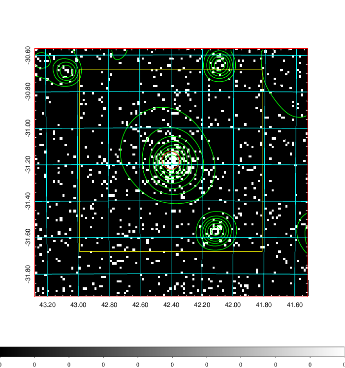  | 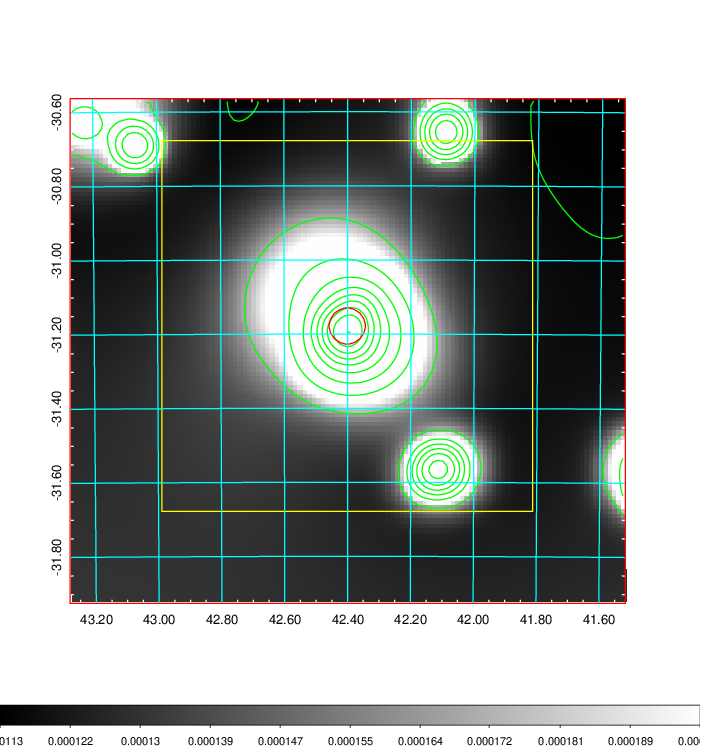   | 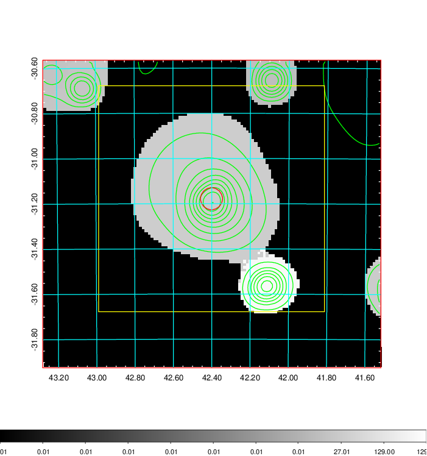  |

|[Exposure image](../image/116/116_mex.pdf)| [nH image](../image/116/116_nh.pdf)| [Planck image](../image/116/116_p.pdf)|
|-------------------|--------------------|-------------------|
|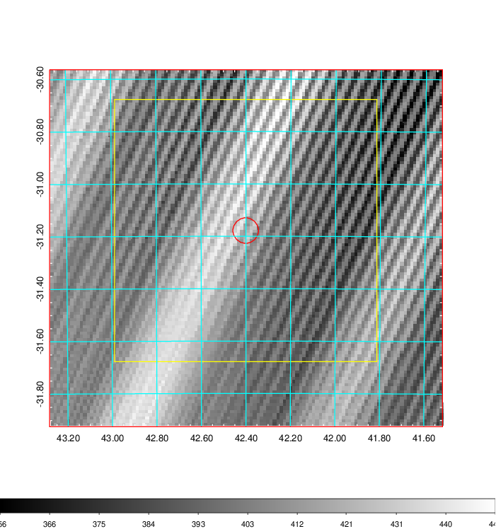   | 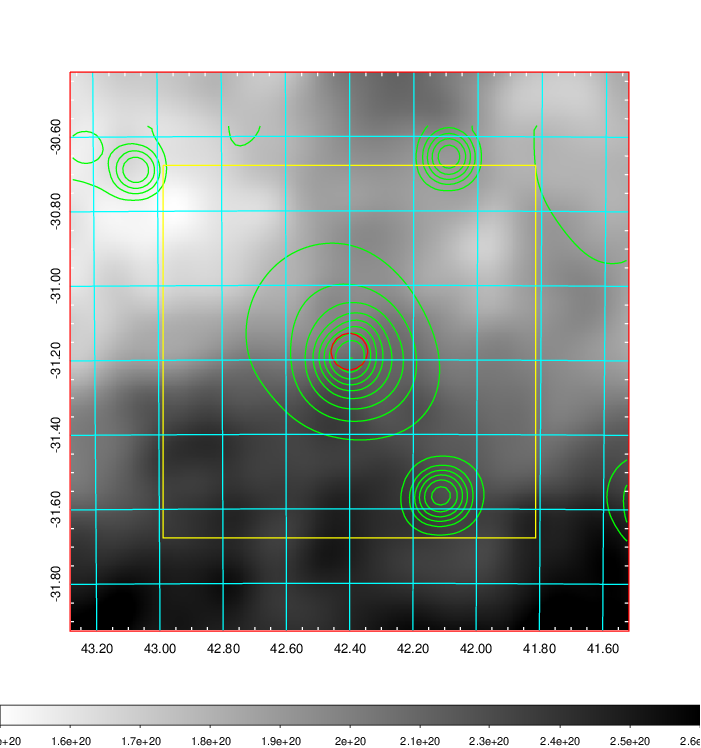    | 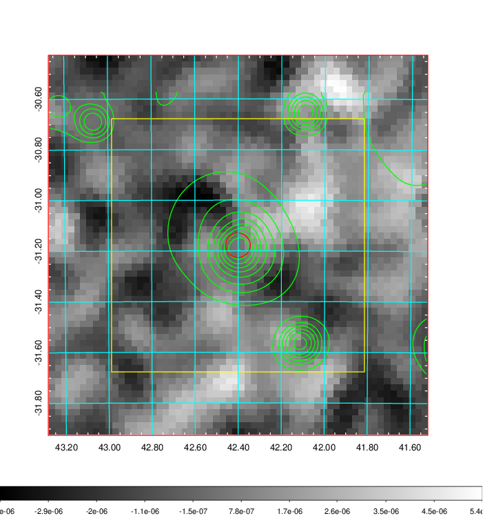 |

|[Redshift Histogram](../image/116/116_zg.pdf) | [DSS image(z1)](../image/116/116_dss_z1.pdf)      |  [DSS image(z2)](../image/116/116_dss_z2.pdf)    |
|-------------------|--------------------|-------------------|
|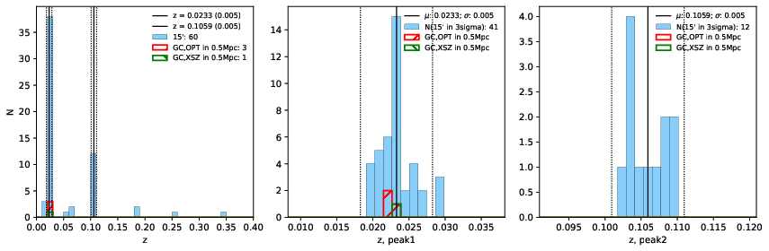 |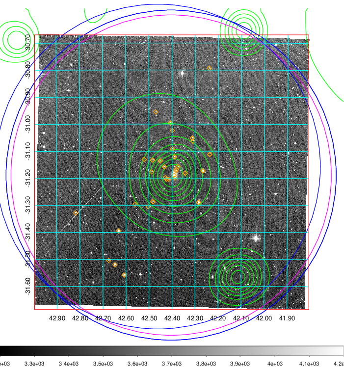  Blue circle for optical clusters;  Magenta circle for XSZ clusters;  all with r=1Mpc;  Only GC with Delta_z<0.01 are shown. | 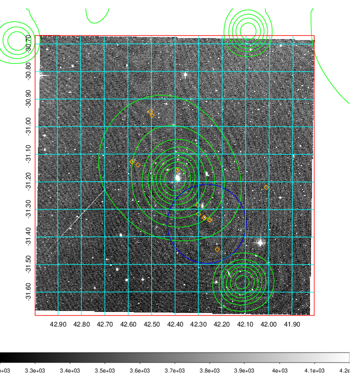 Blue circle for optical clusters;  Magenta circle for XSZ clusters;  all with r=1Mpc;  Only GC with Delta_z<0.01 are shown.  |

|[Previous-identified clusters](../image/116/116_gc.pdf) | [2MASS image](../image/116/116_2mass.pdf)      |
|-------------------|-------------------|
|  Green, magenta, and blue circles  for optical, X-ray and SZ clusters  respectively, with redshift of clusters  labelled. The radius of circles  are 1Mpc.|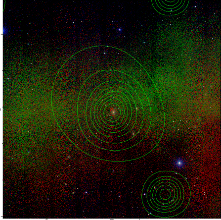  |

|[DES image](../image/116/116_des.pdf)   |[ATLAS image](../image/116/116_s.pdf)        |
|-------------------|-------------------|
| 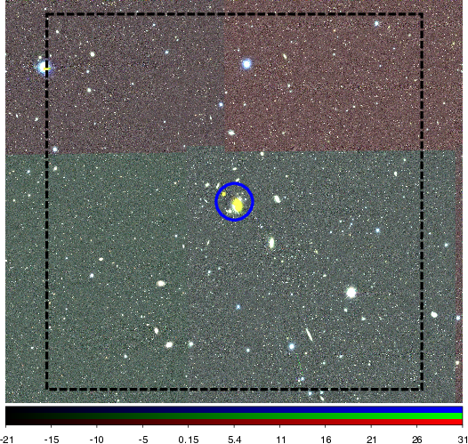  | 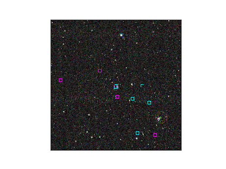  |
