

### 117

|Name|RAJ2000[deg]|DEJ2000[deg] |Ext[arcmin]| Ext,ml | z | z_src| C|GC(XSZ,Delta_z<0.01)| GC(OPT,Delta_z<0.01)|GC| R_sig[arcmin] | R500[arcmin] | R500[Mpc]| CRsig[c/s] | CR500[c/s] |L500[1E44 erg/s]|F500[1E-12 erg/s/cm^2]| M500[1E14 Msun]|Tx[keV]|Cnt_sig|Beta|Rc[arcmin]|Comment|Alias|
|---|---|---|---|---|---|------|---|--------|---------|----------|---|---|---|---|---|---|---|---|---|---|---|---|---|---|
|117| 43.227| -1.282| 2.67| 32.23| 0.0235(0.005)| z1, z_xsz| B| MCXC| N| C, F20, MCXC, N, SPI, W| 14.650| 21.482| 0.611| 0.475(0.079)| 0.515(0.085)| 0.102(0.010)| 8.128(0.825)| 0.66(0.03)| 1.68(0.06)| 72.9| 0.576(-0.056+0.118)| 2.671(-0.678+1.152)| -| k333|

|[RASS image](../image/117/117_img.pdf)|[filtered image](../image/117/117_fil.pdf)|[Segment image](../image/117/117_seg.pdf)|
|-------------------|--------------------|-------------------|
| 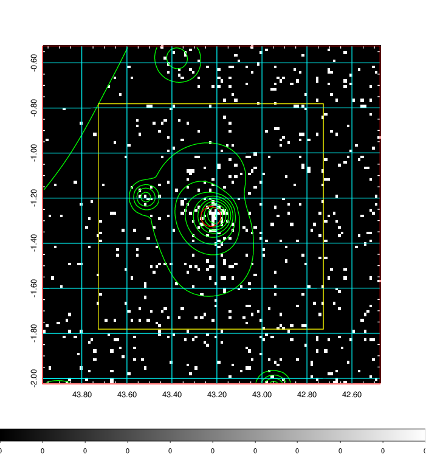  | 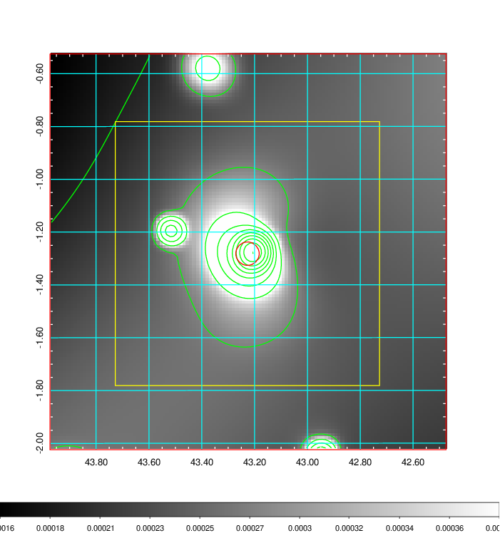   | 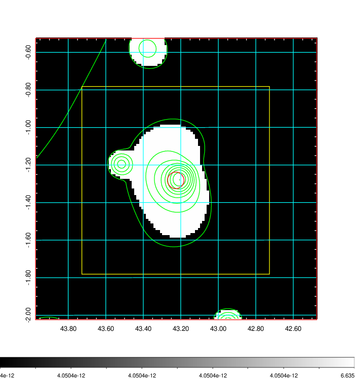  |

|[Exposure image](../image/117/117_mex.pdf)| [nH image](../image/117/117_nh.pdf)| [Planck image](../image/117/117_p.pdf)|
|-------------------|--------------------|-------------------|
|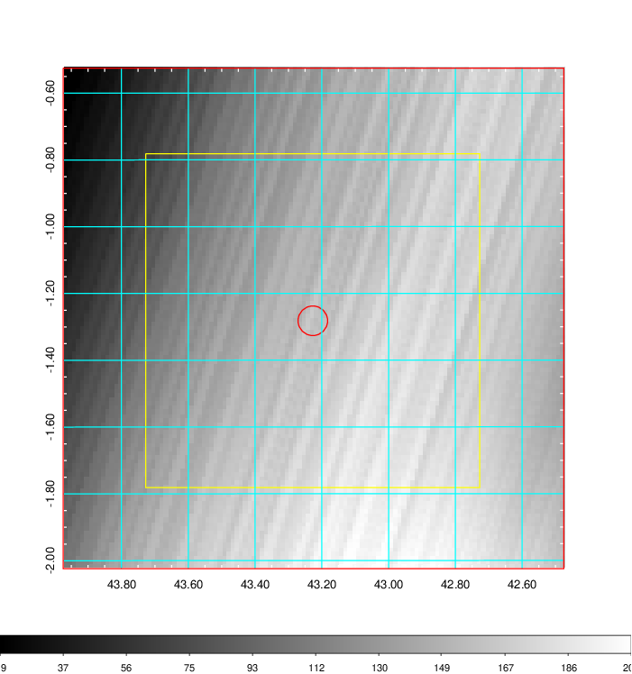   | 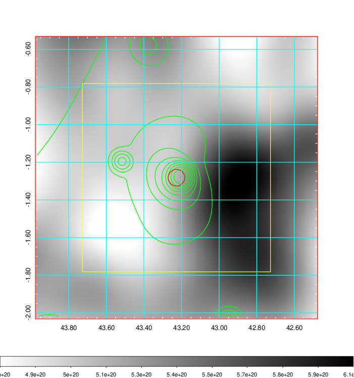    | 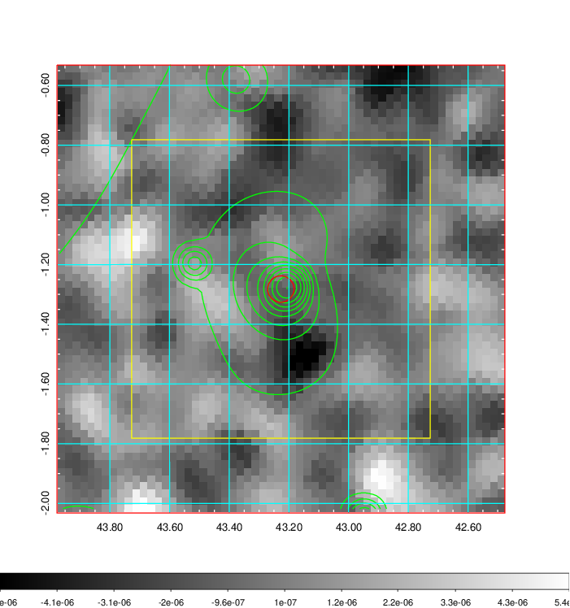 |

|[Redshift Histogram](../image/117/117_zg.pdf) | [DSS image(z1)](../image/117/117_dss_z1.pdf)      |  [DSS image(z2)](../image/117/117_dss_z2.pdf)    |
|-------------------|--------------------|-------------------|
|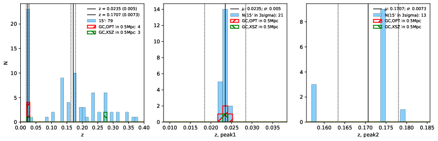 |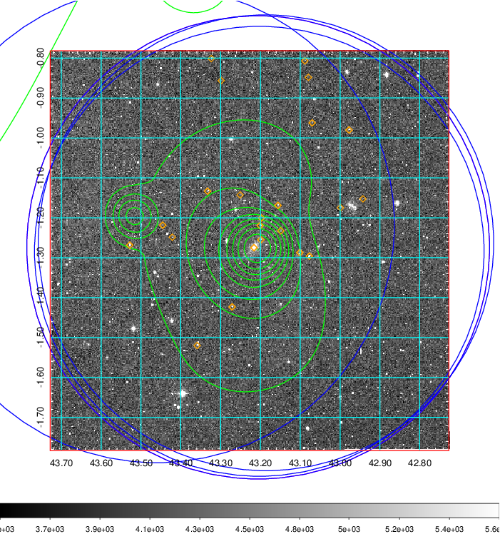  Blue circle for optical clusters;  Magenta circle for XSZ clusters;  all with r=1Mpc;  Only GC with Delta_z<0.01 are shown. | 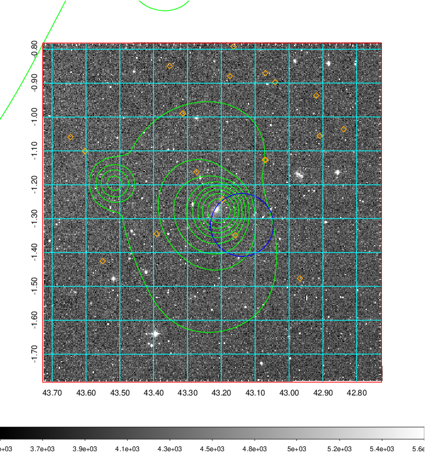 Blue circle for optical clusters;  Magenta circle for XSZ clusters;  all with r=1Mpc;  Only GC with Delta_z<0.01 are shown.  |

|[known Abell/XSZ clusters](../image/117/117_gc.pdf) | [2MASS image](../image/117/117_2mass.pdf)      |[SDSS image](../image/117/117_sdss.pdf)   |
|-------------------|-------------------|-------------------|
|  Magenta, blue and green circles  for optical, X-ray and SZ clusters  respectively, with redshift of clusters  labelled. The radius of circles  are 1Mpc.|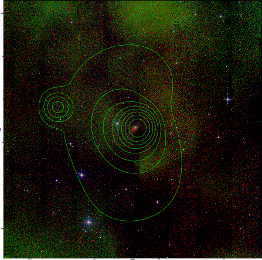  | 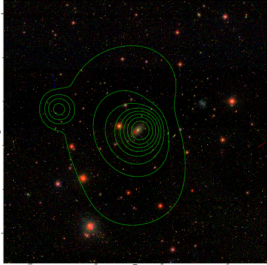  |

|[DES image](../image/117/117_des.pdf)   |
|-------------------|
|   |
