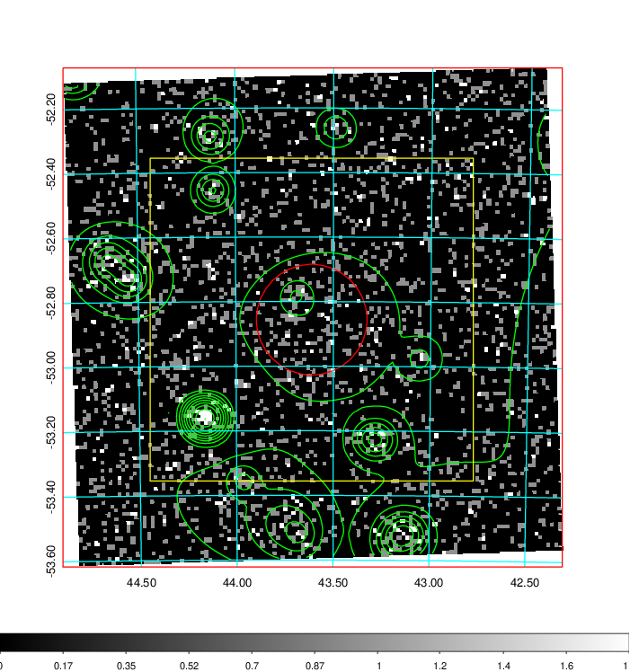
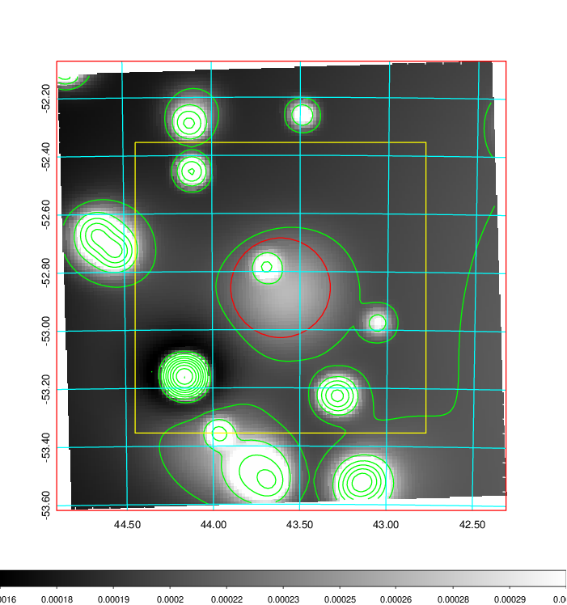
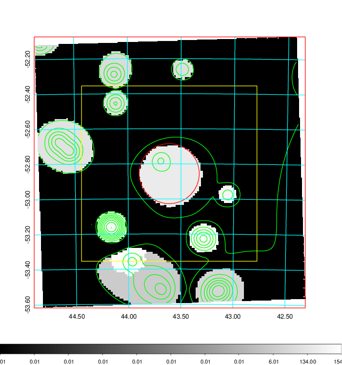
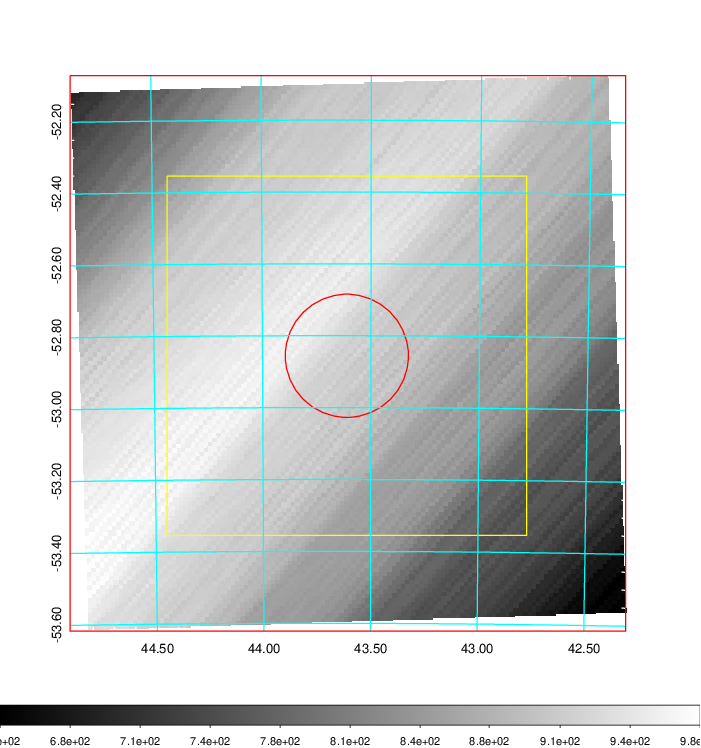
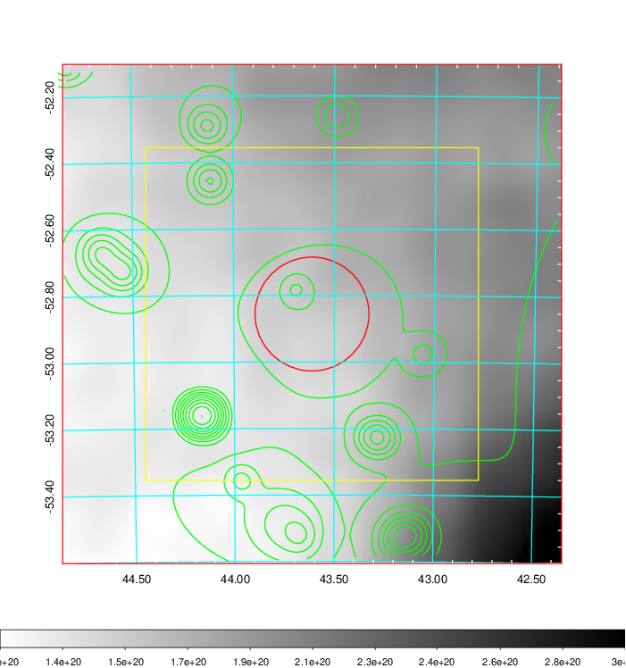
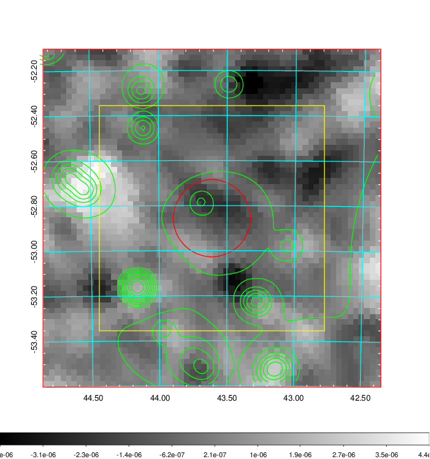
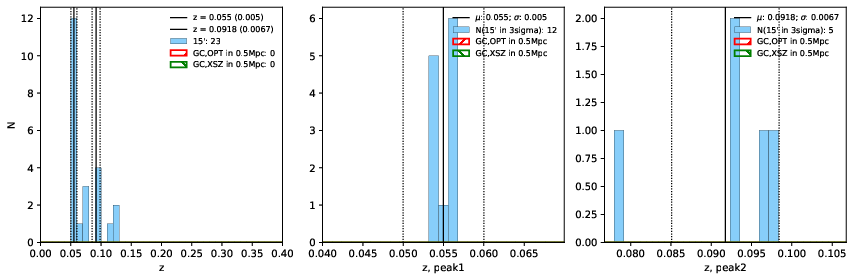
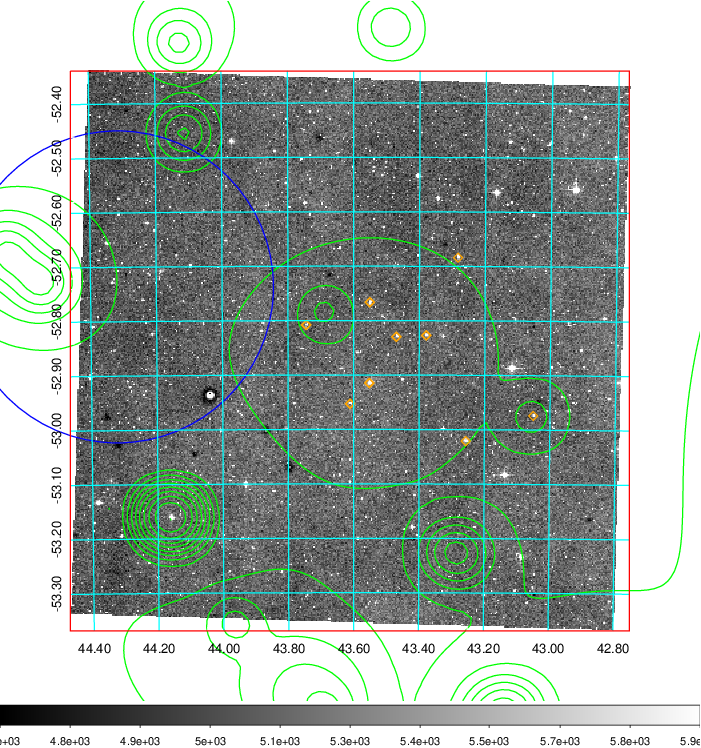
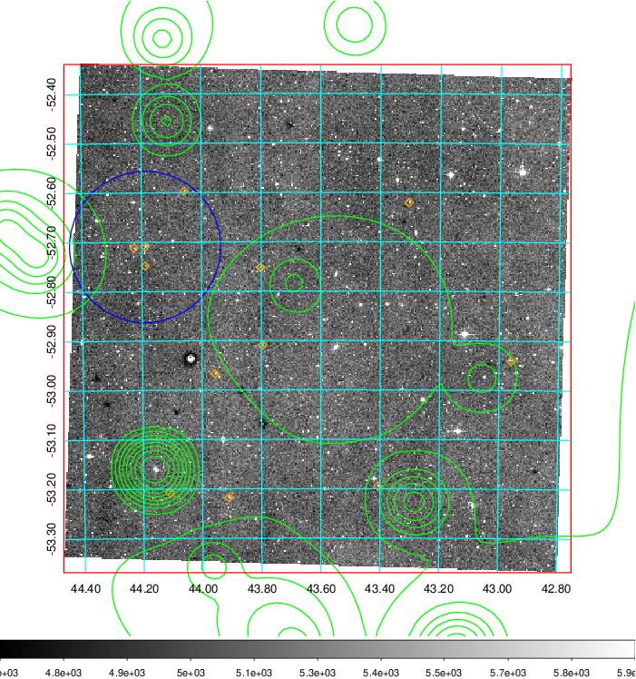
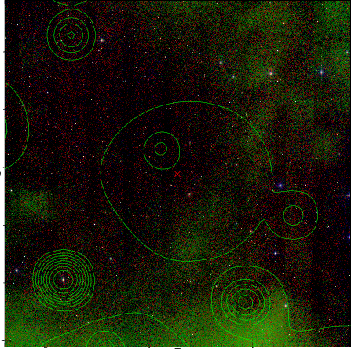

### 118

|Name|RAJ2000[deg]|DEJ2000[deg] |Ext[arcmin]| Ext,ml | z | z_src| C|GC(XSZ,Delta_z<0.01)| GC(OPT,Delta_z<0.01)|GC| R_sig[arcmin] | R500[arcmin] | R500[Mpc]| CRsig[c/s] | CR500[c/s] |L500[1E44 erg/s]|F500[1E-12 erg/s/cm^2]| M500[1E14 Msun]|Tx[keV]|Cnt_sig|Beta|Rc[arcmin]|Comment|Alias|
|---|---|---|---|---|---|------|---|--------|---------|----------|---|---|---|---|---|---|---|---|---|---|---|---|---|---|
|118| 43.611| -52.856| 10.28| 40.47| 0.0550(0.005)| z1,| G| -| -| -| 11.238| 7.791| 0.500| 0.044(0.020)| 0.042(0.019)| 0.046(0.016)| 0.635(0.227)| 0.37(0.07)| 1.19(0.14)| 62.2| 0.802(-0.180+0.140)| 11.267(-2.746+3.263)| -| t451|

|[RASS image](../image/118/118_img.pdf)|[filtered image](../image/118/118_fil.pdf)|[Segment image](../image/118/118_seg.pdf)|
|-------------------|--------------------|-------------------|
|   |    |   |

|[Exposure image](../image/118/118_mex.pdf)| [nH image](../image/118/118_nh.pdf)| [Planck image](../image/118/118_p.pdf)|
|-------------------|--------------------|-------------------|
|   |     |  |

|[Redshift Histogram](../image/118/118_zg.pdf) | [DSS image(z1)](../image/118/118_dss_z1.pdf)      |  [DSS image(z2)](../image/118/118_dss_z2.pdf)    |
|-------------------|--------------------|-------------------|
| |  Blue circle for optical clusters;  Magenta circle for XSZ clusters;  all with r=1Mpc;  Only GC with Delta_z<0.01 are shown. |  Blue circle for optical clusters;  Magenta circle for XSZ clusters;  all with r=1Mpc;  Only GC with Delta_z<0.01 are shown.  |

|[known Abell/XSZ clusters](../image/118/118_gc.pdf) | [2MASS image](../image/118/118_2mass.pdf)      |
|-------------------|-------------------|
|  Magenta, blue and green circles  for optical, X-ray and SZ clusters  respectively, with redshift of clusters  labelled. The radius of circles  are 1Mpc.|  |

|[DES image](../image/118/118_des.pdf)   |
|-------------------|
|   |
