

### 119

|Name|RAJ2000[deg]|DEJ2000[deg] |Ext[arcmin]| Ext,ml | z | z_src| C|GC(XSZ,Delta_z<0.01)| GC(OPT,Delta_z<0.01)|GC| R_sig[arcmin] | R500[arcmin] | R500[Mpc]| CRsig[c/s] | CR500[c/s] |L500[1E44 erg/s]|F500[1E-12 erg/s/cm^2]| M500[1E14 Msun]|Tx[keV]|Cnt_sig|Beta|Rc[arcmin]|Comment|Alias|
|---|---|---|---|---|---|------|---|--------|---------|----------|---|---|---|---|---|---|---|---|---|---|---|---|---|---|
|119| 43.737| -53.497| 4.34| 26.32| 0.0989(0.005)| z2,| G| -| -| -| 42.580| 8.040| 0.881| 0.222(0.051)| 0.196(0.045)| 0.961(0.512)| 3.880(2.066)| 2.14(0.57)| 3.53(0.60)| 467.1| 0.501(-0.001+0.003)| 4.321(-0.123+0.188)| -| t220|

|[RASS image](../image/119/119_img.pdf)|[filtered image](../image/119/119_fil.pdf)|[Segment image](../image/119/119_seg.pdf)|
|-------------------|--------------------|-------------------|
| 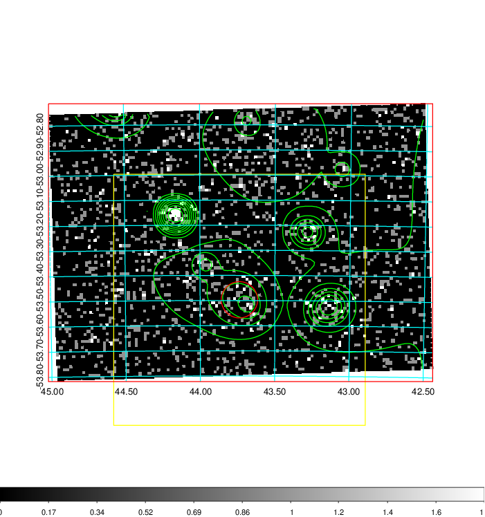  | 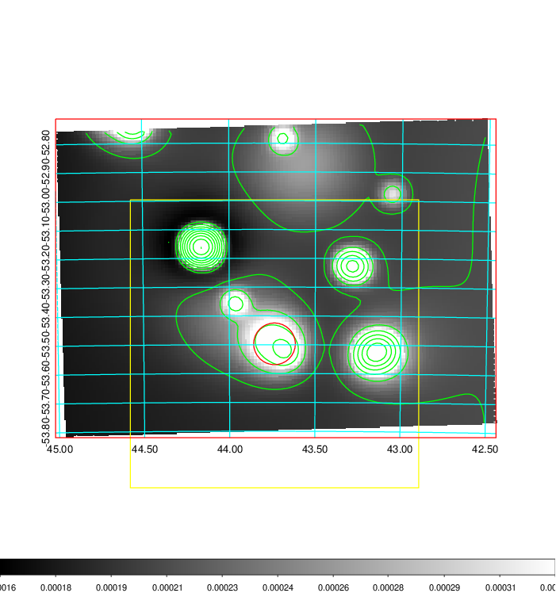   | 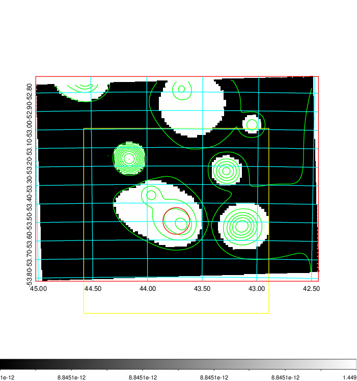  |

|[Exposure image](../image/119/119_mex.pdf)| [nH image](../image/119/119_nh.pdf)| [Planck image](../image/119/119_p.pdf)|
|-------------------|--------------------|-------------------|
|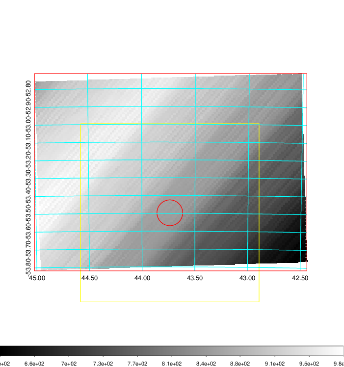   | 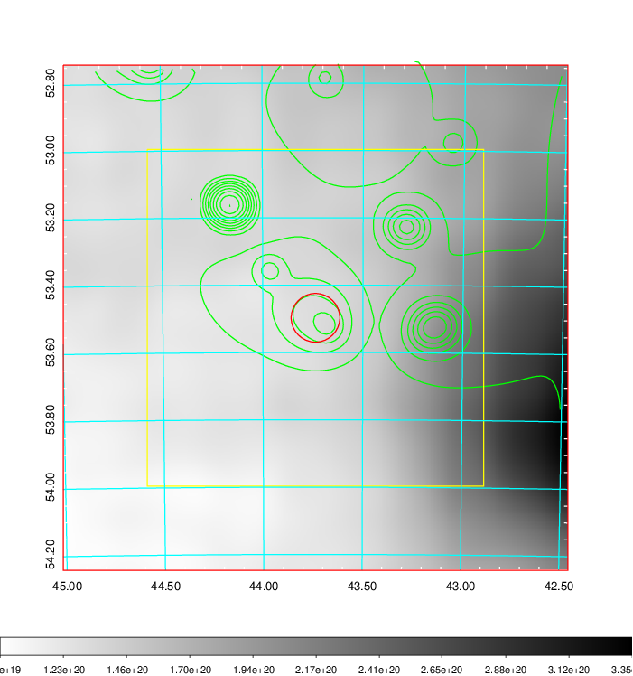    | 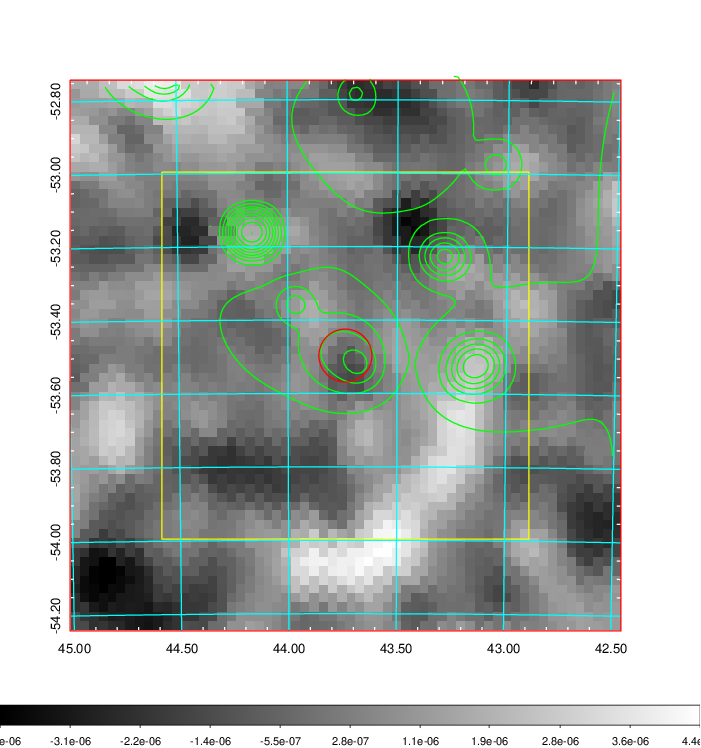 |

|[Redshift Histogram](../image/119/119_zg.pdf) | [DSS image(z1)](../image/119/119_dss_z1.pdf)      |  [DSS image(z2)](../image/119/119_dss_z2.pdf)    |
|-------------------|--------------------|-------------------|
|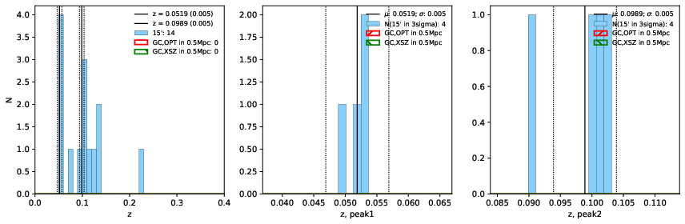 |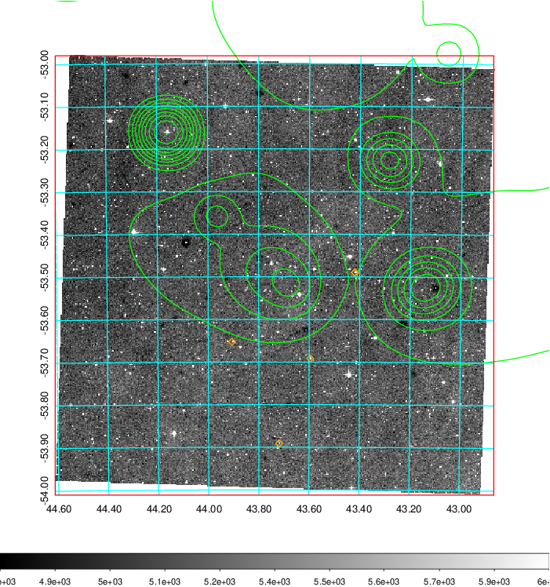  Blue circle for optical clusters;  Magenta circle for XSZ clusters;  all with r=1Mpc;  Only GC with Delta_z<0.01 are shown. | 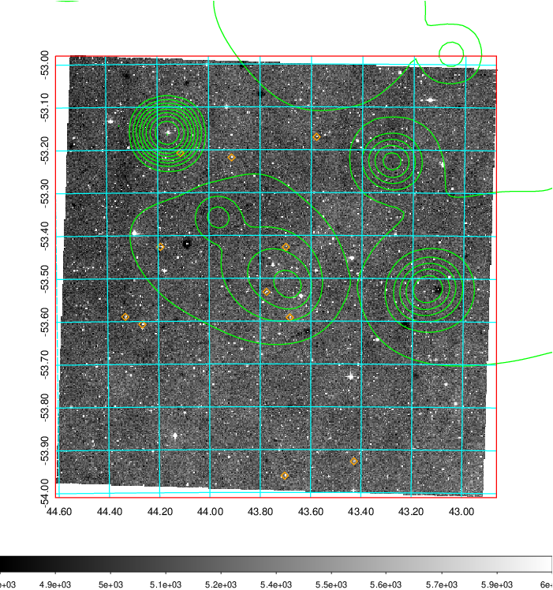 Blue circle for optical clusters;  Magenta circle for XSZ clusters;  all with r=1Mpc;  Only GC with Delta_z<0.01 are shown.  |

|[Previous-identified clusters](../image/119/119_gc.pdf) | [2MASS image](../image/119/119_2mass.pdf)      |
|-------------------|-------------------|
|  Green, magenta, and blue circles  for optical, X-ray and SZ clusters  respectively, with redshift of clusters  labelled. The radius of circles  are 1Mpc.|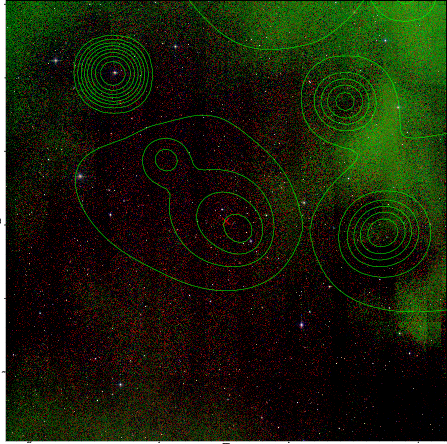  |

|[DES image](../image/119/119_des.pdf)   |
|-------------------|
| 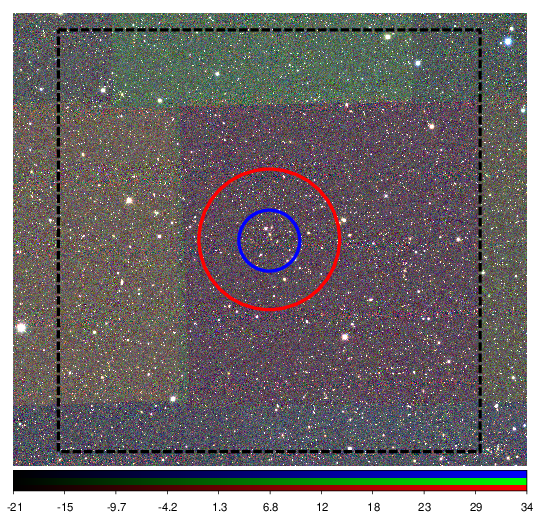  |
