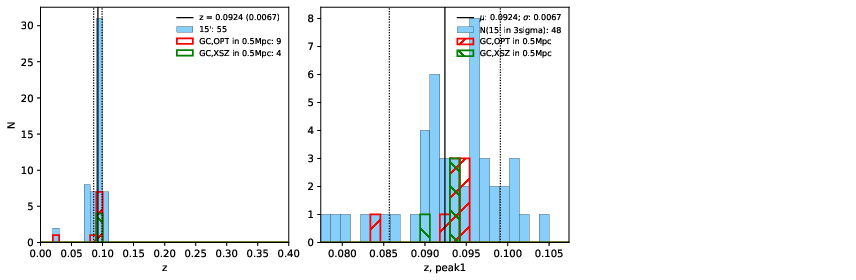

### 12

|Name|RAJ2000[deg]|DEJ2000[deg] |Ext[arcmin]| Ext,ml | z | z_src| C|GC(XSZ,Delta_z<0.01)| GC(OPT,Delta_z<0.01)|GC| R_sig[arcmin] | R500[arcmin] | R500[Mpc]| CRsig[c/s] | CR500[c/s] |L500[1E44 erg/s]|F500[1E-12 erg/s/cm^2]| M500[1E14 Msun]|Tx[keV]|Cnt_sig|Beta|Rc[arcmin]|Comment|Alias|
|---|---|---|---|---|---|------|---|--------|---------|----------|---|---|---|---|---|---|---|---|---|---|---|---|---|---|
|12| 3.406| -19.497| 1.56| 44.28| 0.0924(0.007)| z1, z_xsz| B| MCXC, PSZ2, Tar, XB| A, N, W| A, MCXC, N, PSZ2, Tar, W, XB| 7.338| 9.197| 0.949| 0.297(0.043)| 0.310(0.045)| 1.293(0.092)| 6.037(0.429)| 2.65(0.09)| 4.02(0.09)| 84.3| 0.850(-0.125+0.101)| 3.362(-0.757+0.582)| -| k126|

|[RASS image](../image/12/12_img.pdf)|[filtered image](../image/12/12_fil.pdf)|[Segment image](../image/12/12_seg.pdf)|
|-------------------|--------------------|-------------------|
|   |    |   |

|[Exposure image](../image/12/12_mex.pdf)| [nH image](../image/12/12_nh.pdf)| [Planck image](../image/12/12_p.pdf)|
|-------------------|--------------------|-------------------|
|   |     |  |

|[Redshift Histogram](../image/12/12_zg.pdf) | [DSS image(z1)](../image/12/12_dss_z1.pdf)      |  [DSS image(z2)](../image/12/12_dss_z2.pdf)    |
|-------------------|--------------------|-------------------|
| |  Blue circle for optical clusters;  Magenta circle for XSZ clusters;  all with r=1Mpc;  Only GC with Delta_z<0.01 are shown. |  Blue circle for optical clusters;  Magenta circle for XSZ clusters;  all with r=1Mpc;  Only GC with Delta_z<0.01 are shown.  |

|[known Abell/XSZ clusters](../image/12/12_gc.pdf) | [2MASS image](../image/12/12_2mass.pdf)      |[SDSS image](../image/12/12_sdss.pdf)   |
|-------------------|-------------------|-------------------|
|  Magenta, blue and green circles  for optical, X-ray and SZ clusters  respectively, with redshift of clusters  labelled. The radius of circles  are 1Mpc.|  |   |

|[ATLAS image](../image/12/12_s.pdf)        |
|-------------------|
|   |
