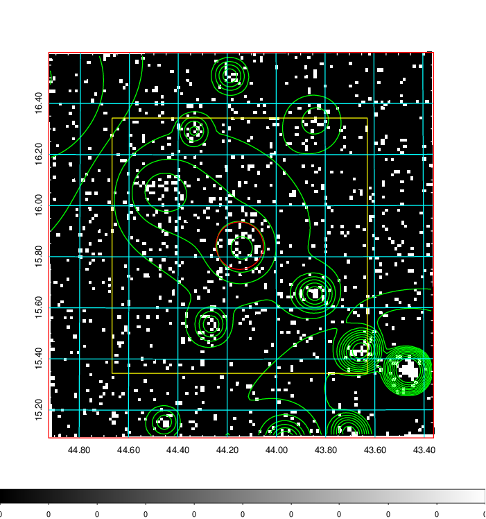
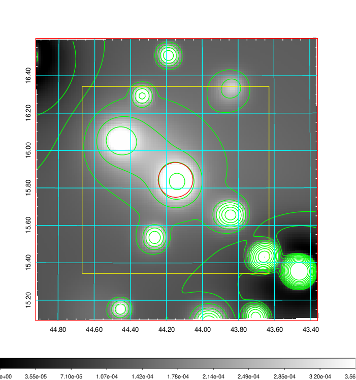
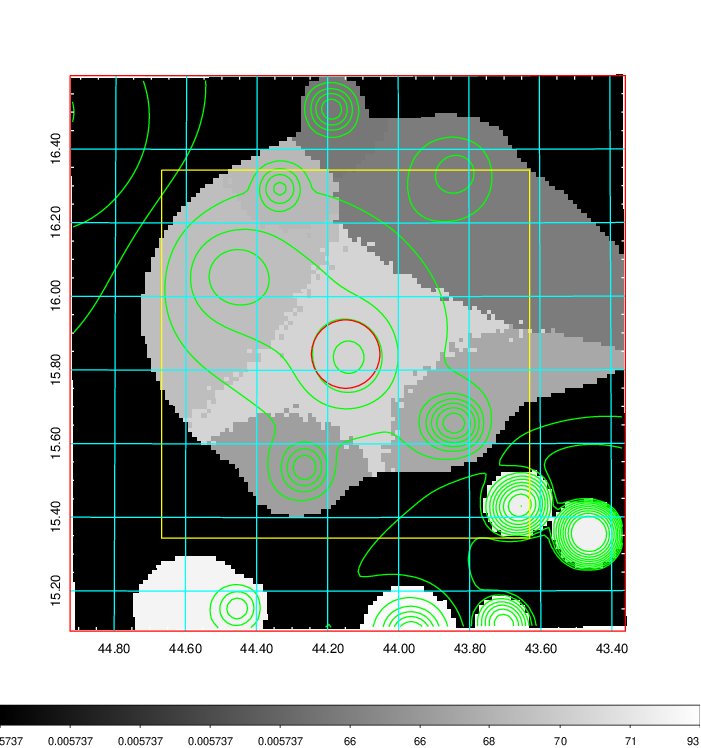
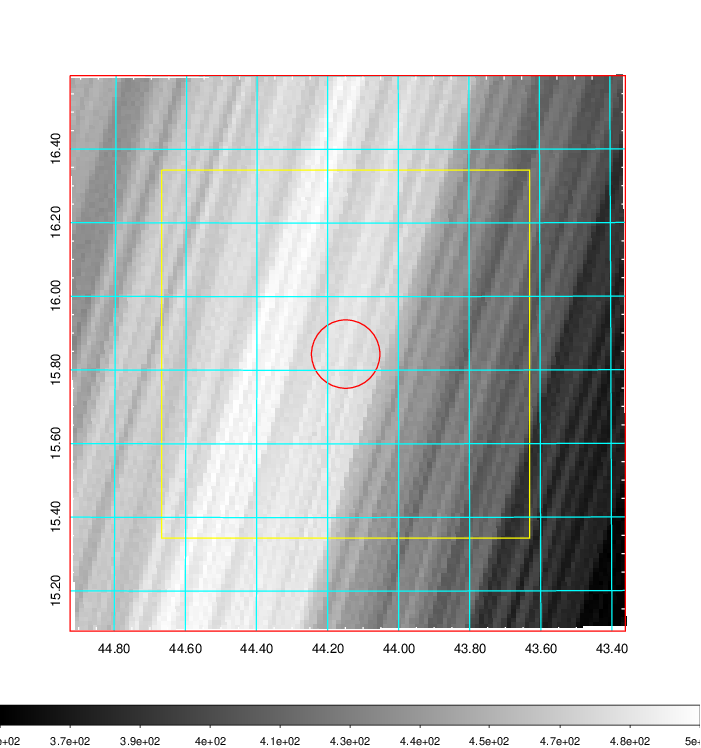
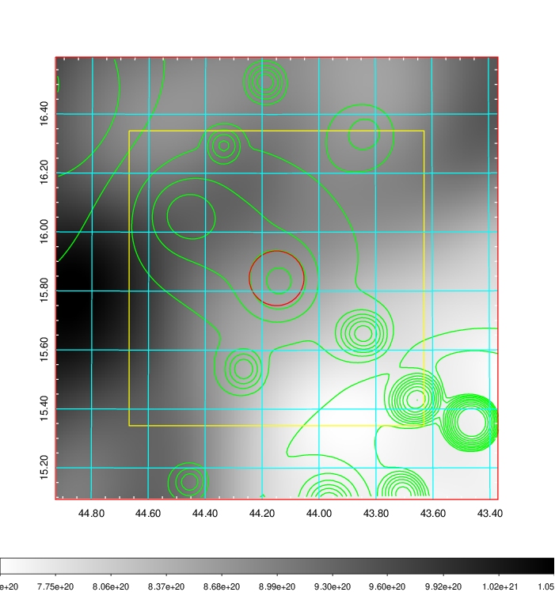
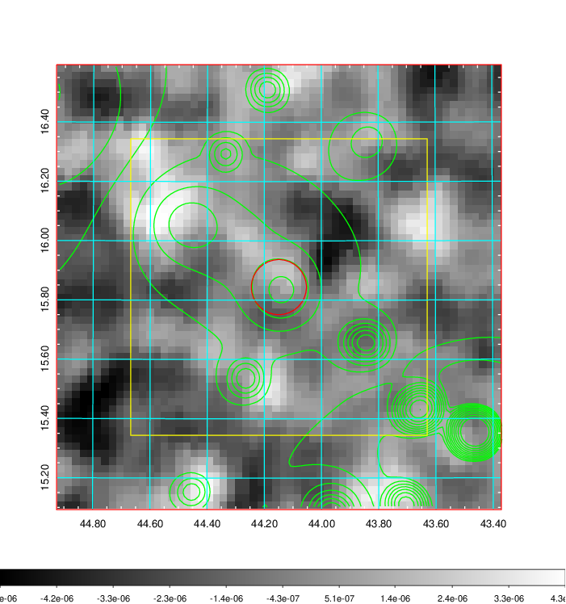
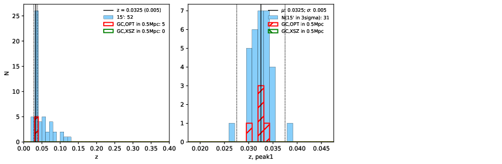
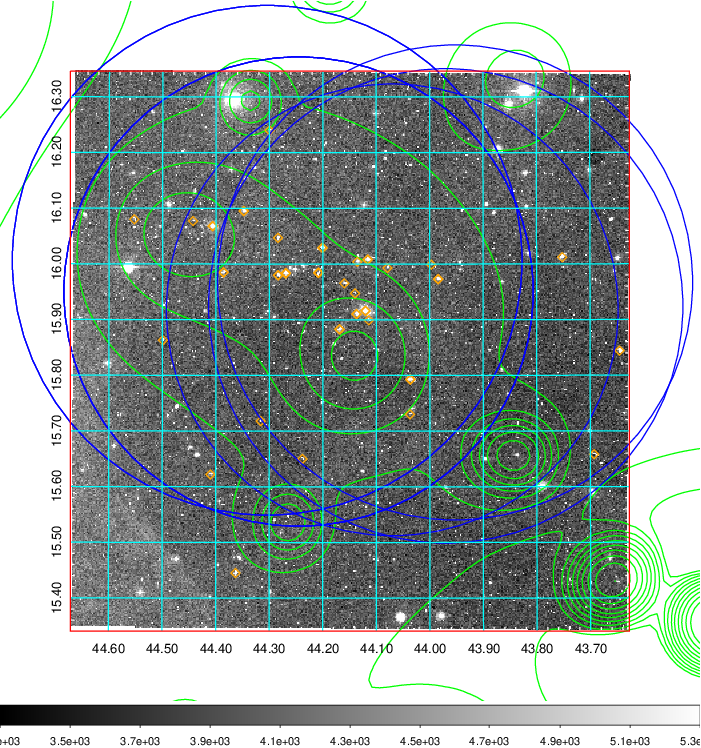
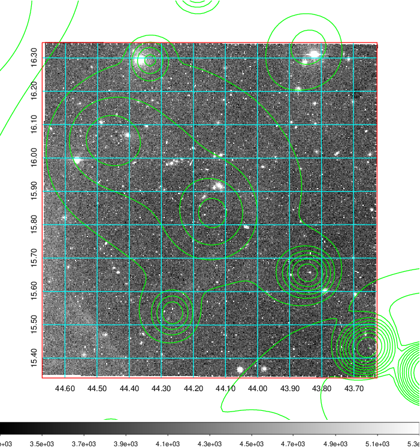
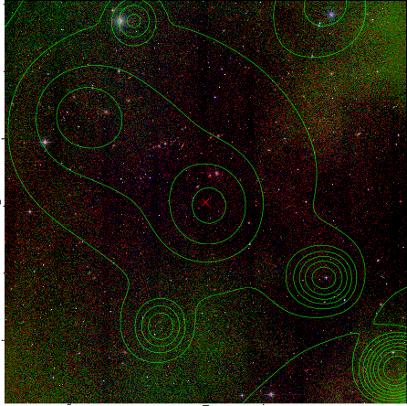

### 120

|Name|RAJ2000[deg]|DEJ2000[deg] |Ext[arcmin]| Ext,ml | z | z_src| C|GC(XSZ,Delta_z<0.01)| GC(OPT,Delta_z<0.01)|GC| R_sig[arcmin] | R500[arcmin] | R500[Mpc]| CRsig[c/s] | CR500[c/s] |L500[1E44 erg/s]|F500[1E-12 erg/s/cm^2]| M500[1E14 Msun]|Tx[keV]|Cnt_sig|Beta|Rc[arcmin]|Comment|Alias|
|---|---|---|---|---|---|------|---|--------|---------|----------|---|---|---|---|---|---|---|---|---|---|---|---|---|---|
|120| 44.149| 15.844| 5.57| 38.75| 0.0325(0.005)| z1, z_opt| S| -| A, N| A, N| 47.530| 17.886| 0.696| 0.510(0.080)| 0.462(0.073)| 0.182(0.038)| 7.455(1.557)| 0.99(0.11)| 2.15(0.15)| 317.8| 0.502(-0.002+0.003)| 9.661(-0.152+0.193)| -| t285|

|[RASS image](../image/120/120_img.pdf)|[filtered image](../image/120/120_fil.pdf)|[Segment image](../image/120/120_seg.pdf)|
|-------------------|--------------------|-------------------|
|   |    |   |

|[Exposure image](../image/120/120_mex.pdf)| [nH image](../image/120/120_nh.pdf)| [Planck image](../image/120/120_p.pdf)|
|-------------------|--------------------|-------------------|
|   |     |  |

|[Redshift Histogram](../image/120/120_zg.pdf) | [DSS image(z1)](../image/120/120_dss_z1.pdf)      |  [DSS image(z2)](../image/120/120_dss_z2.pdf)    |
|-------------------|--------------------|-------------------|
| |  Blue circle for optical clusters;  Magenta circle for XSZ clusters;  all with r=1Mpc;  Only GC with Delta_z<0.01 are shown. |  Blue circle for optical clusters;  Magenta circle for XSZ clusters;  all with r=1Mpc;  Only GC with Delta_z<0.01 are shown.  |

|[known Abell/XSZ clusters](../image/120/120_gc.pdf) | [2MASS image](../image/120/120_2mass.pdf)      |
|-------------------|-------------------|
|  Magenta, blue and green circles  for optical, X-ray and SZ clusters  respectively, with redshift of clusters  labelled. The radius of circles  are 1Mpc.|  |

|[PS1 image](../image/120/120_ps1.pdf)            |
|-------------------|
|   |
