

### 121

|Name|RAJ2000[deg]|DEJ2000[deg] |Ext[arcmin]| Ext,ml | z | z_src| C|GC(XSZ,Delta_z<0.01)| GC(OPT,Delta_z<0.01)|GC| R_sig[arcmin] | R500[arcmin] | R500[Mpc]| CRsig[c/s] | CR500[c/s] |L500[1E44 erg/s]|F500[1E-12 erg/s/cm^2]| M500[1E14 Msun]|Tx[keV]|Cnt_sig|Beta|Rc[arcmin]|Comment|Alias|
|---|---|---|---|---|---|------|---|--------|---------|----------|---|---|---|---|---|---|---|---|---|---|---|---|---|---|
|121| 44.332| -64.837| 11.91| 37.78| 0.1290(0.000)| -| G| -| -| N| 13.675| 5.535| 0.765| 0.063(0.048)| 0.057(0.044)| 0.458(0.245)| 1.045(0.559)| 1.44(0.39)| 2.79(0.47)| 52.1| 0.806(-0.178+0.138)| 5.465(-1.821+1.660)| $z$ of BCG| t486|

|[RASS image](../image/121/121_img.pdf)|[filtered image](../image/121/121_fil.pdf)|[Segment image](../image/121/121_seg.pdf)|
|-------------------|--------------------|-------------------|
| 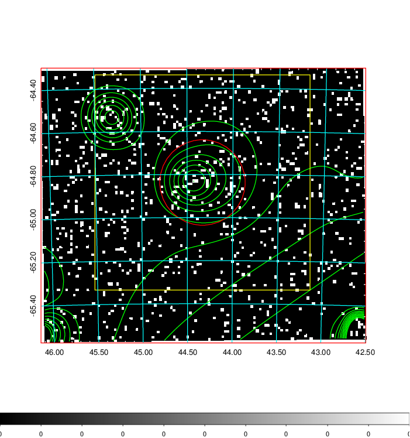  | 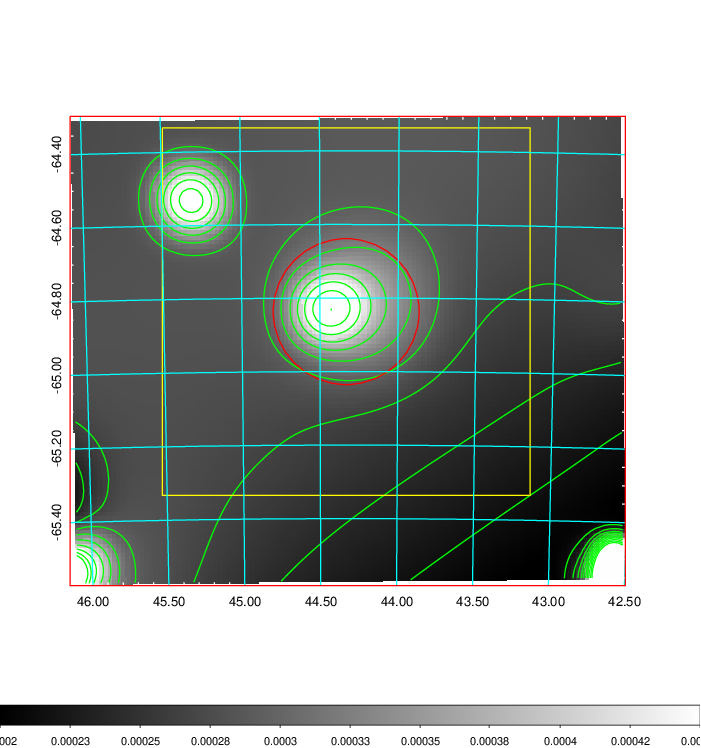   | 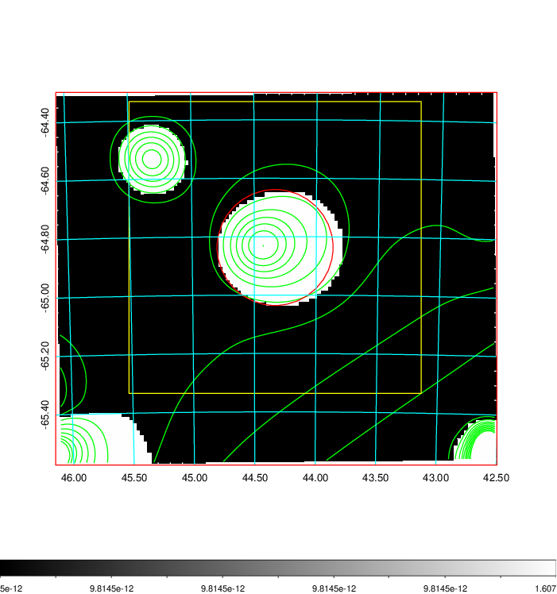  |

|[Exposure image](../image/121/121_mex.pdf)| [nH image](../image/121/121_nh.pdf)| [Planck image](../image/121/121_p.pdf)|
|-------------------|--------------------|-------------------|
|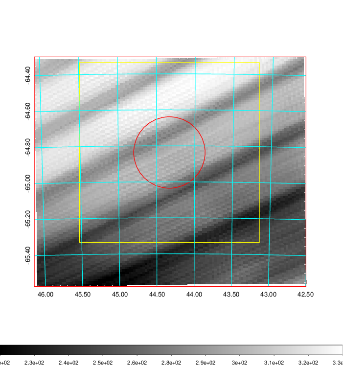   | 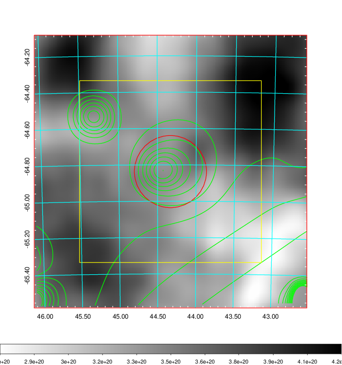    | 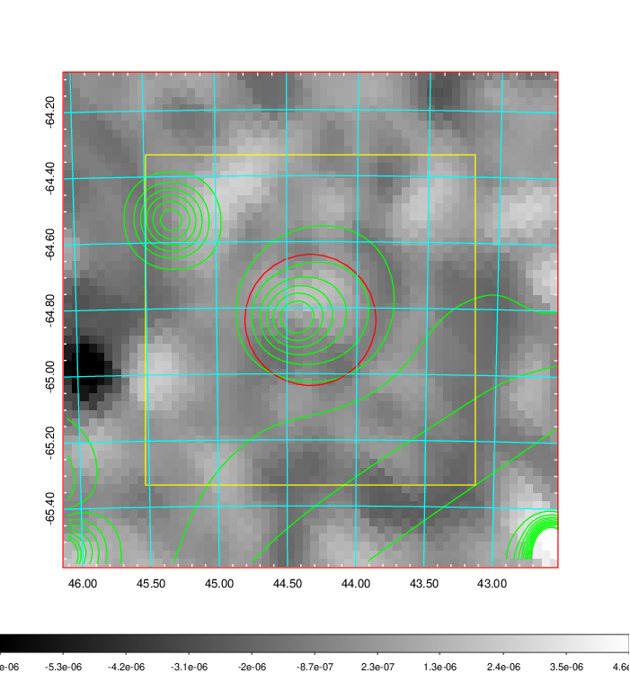 |

|[Redshift Histogram](../image/121/121_zg.pdf) | [DSS image(z1)](../image/121/121_dss_z1.pdf)      |  [DSS image(z2)](../image/121/121_dss_z2.pdf)    |
|-------------------|--------------------|-------------------|
|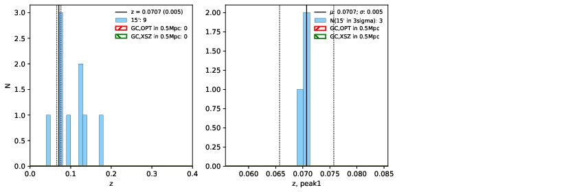 |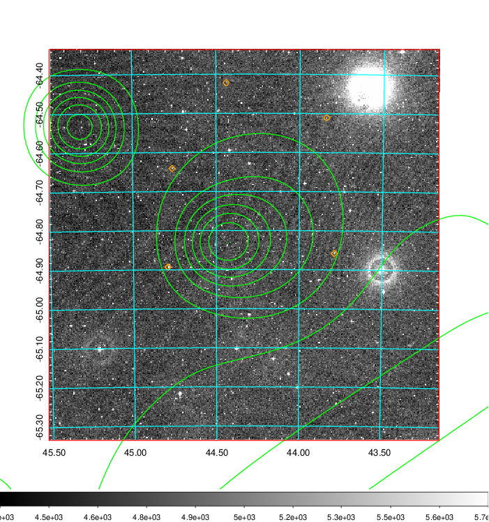  Blue circle for optical clusters;  Magenta circle for XSZ clusters;  all with r=1Mpc;  Only GC with Delta_z<0.01 are shown. | 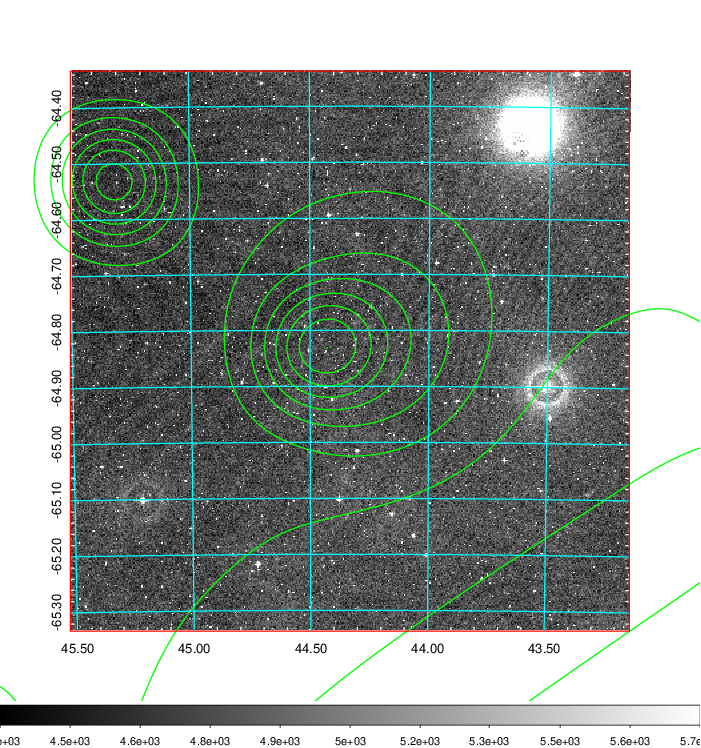 Blue circle for optical clusters;  Magenta circle for XSZ clusters;  all with r=1Mpc;  Only GC with Delta_z<0.01 are shown.  |

|[Previous-identified clusters](../image/121/121_gc.pdf) | [2MASS image](../image/121/121_2mass.pdf)      |
|-------------------|-------------------|
|  Green, magenta, and blue circles  for optical, X-ray and SZ clusters  respectively, with redshift of clusters  labelled. The radius of circles  are 1Mpc.|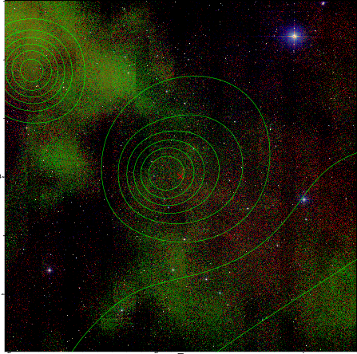  |

|[DES image](../image/121/121_des.pdf)   |
|-------------------|
| 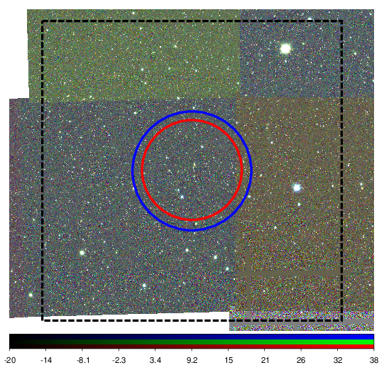  |
