

### 122

|Name|RAJ2000[deg]|DEJ2000[deg] |Ext[arcmin]| Ext,ml | z | z_src| C|GC(XSZ,Delta_z<0.01)| GC(OPT,Delta_z<0.01)|GC| R_sig[arcmin] | R500[arcmin] | R500[Mpc]| CRsig[c/s] | CR500[c/s] |L500[1E44 erg/s]|F500[1E-12 erg/s/cm^2]| M500[1E14 Msun]|Tx[keV]|Cnt_sig|Beta|Rc[arcmin]|Comment|Alias|
|---|---|---|---|---|---|------|---|--------|---------|----------|---|---|---|---|---|---|---|---|---|---|---|---|---|---|
|122| 44.411| 5.948| 4.40| 236.19| 0.0232(0.005)| z1, z_xsz| B| MCXC, XB| A, N| A, MCXC, N, XB| 36.145| 25.134| 0.706| 1.011(0.110)| 0.962(0.105)| 0.189(0.011)| 15.484(0.923)| 1.02(0.03)| 2.19(0.04)| 196.6| 0.608(-0.025+0.029)| 7.365(-0.685+0.755)| -| k501|

|[RASS image](../image/122/122_img.pdf)|[filtered image](../image/122/122_fil.pdf)|[Segment image](../image/122/122_seg.pdf)|
|-------------------|--------------------|-------------------|
| 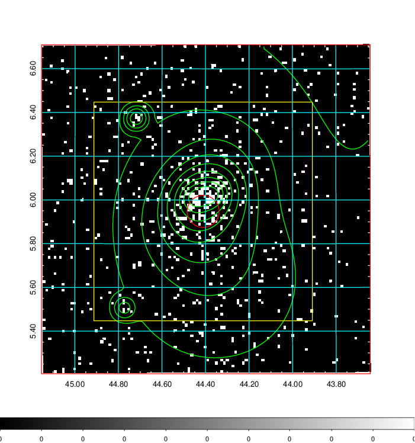  | 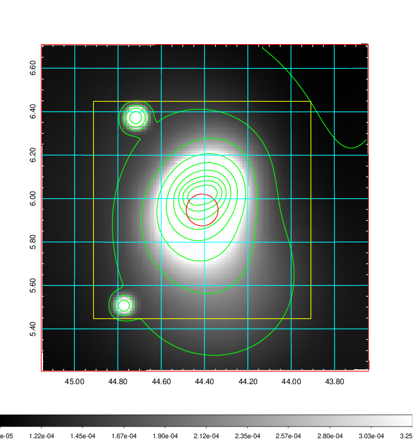   | 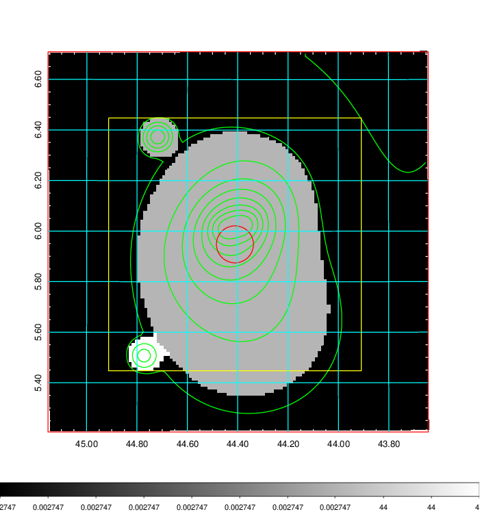  |

|[Exposure image](../image/122/122_mex.pdf)| [nH image](../image/122/122_nh.pdf)| [Planck image](../image/122/122_p.pdf)|
|-------------------|--------------------|-------------------|
|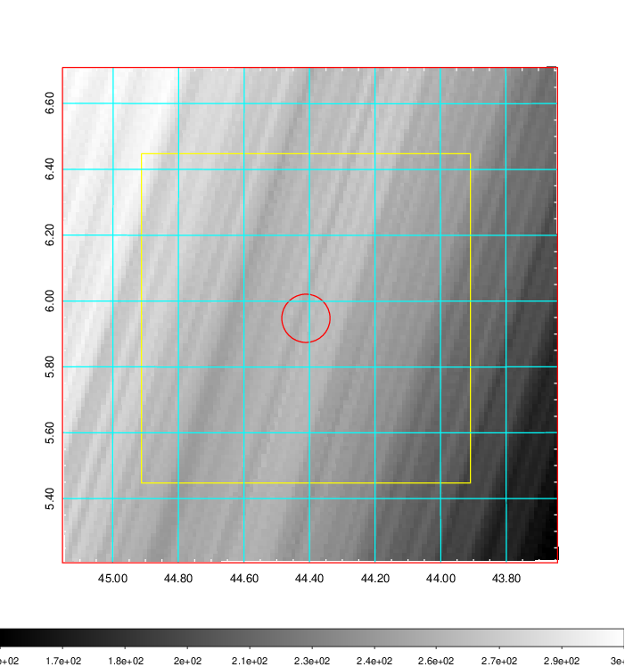   | 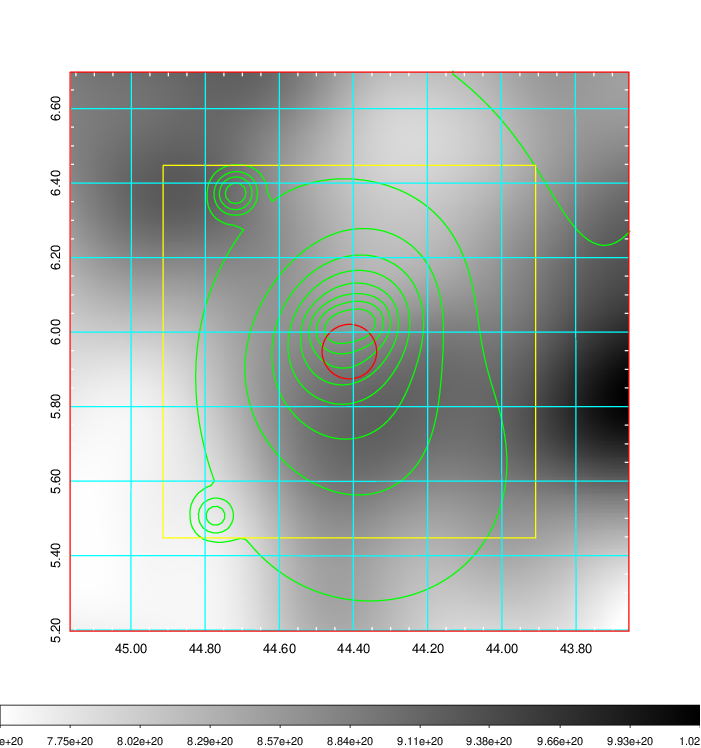    | 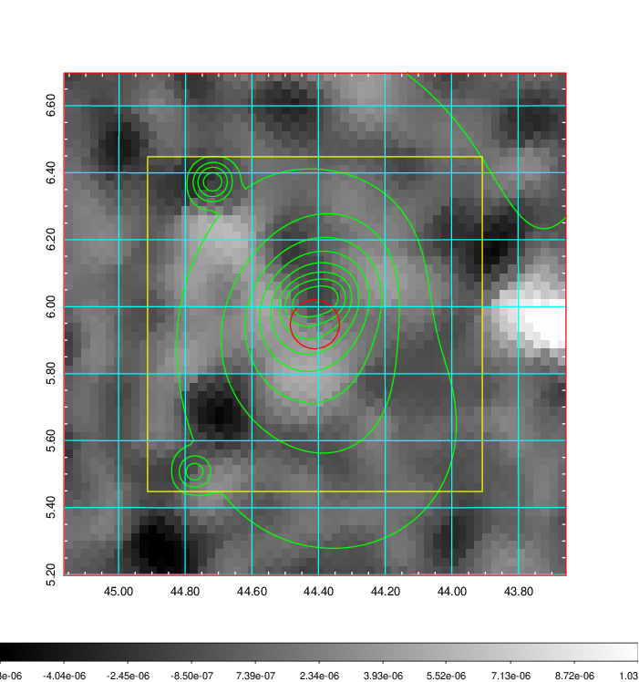 |

|[Redshift Histogram](../image/122/122_zg.pdf) | [DSS image(z1)](../image/122/122_dss_z1.pdf)      |  [DSS image(z2)](../image/122/122_dss_z2.pdf)    |
|-------------------|--------------------|-------------------|
|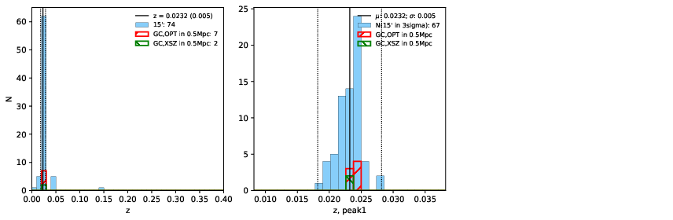 |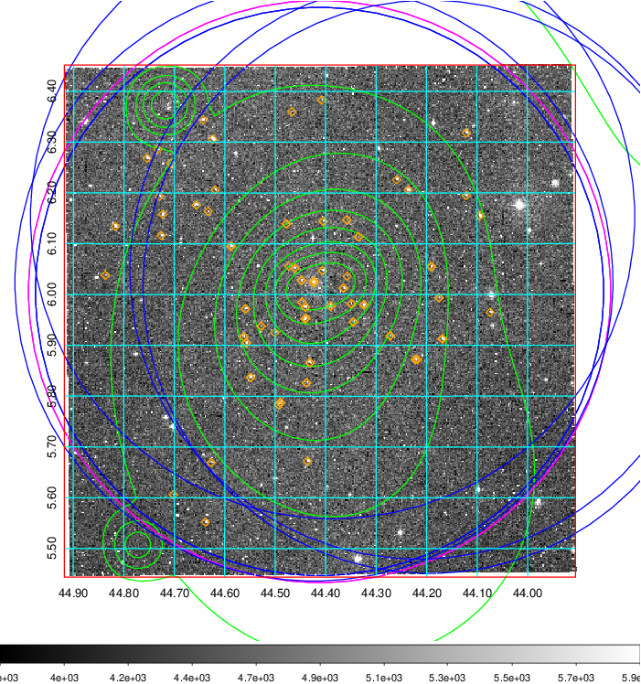  Blue circle for optical clusters;  Magenta circle for XSZ clusters;  all with r=1Mpc;  Only GC with Delta_z<0.01 are shown. | 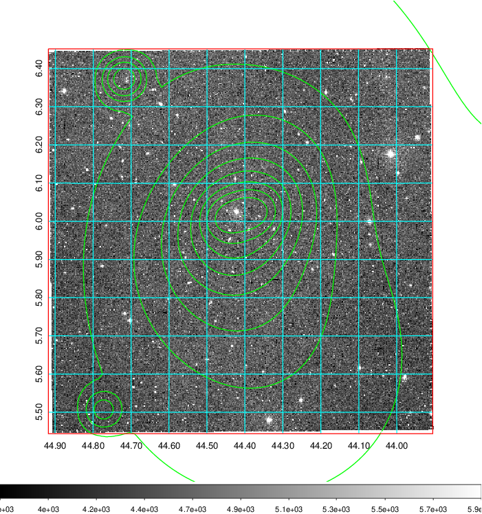 Blue circle for optical clusters;  Magenta circle for XSZ clusters;  all with r=1Mpc;  Only GC with Delta_z<0.01 are shown.  |

|[known Abell/XSZ clusters](../image/122/122_gc.pdf) | [2MASS image](../image/122/122_2mass.pdf)      |[SDSS image](../image/122/122_sdss.pdf)   |
|-------------------|-------------------|-------------------|
|  Magenta, blue and green circles  for optical, X-ray and SZ clusters  respectively, with redshift of clusters  labelled. The radius of circles  are 1Mpc.|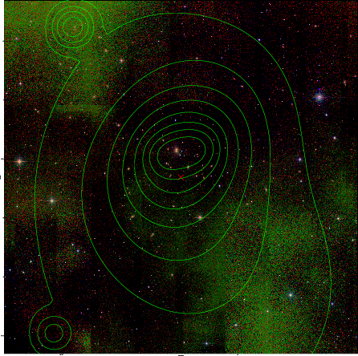  | 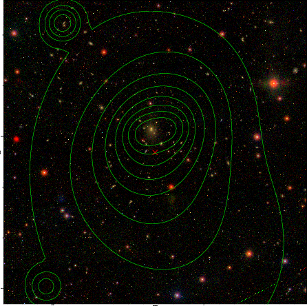  |

