

### 123

|Name|RAJ2000[deg]|DEJ2000[deg] |Ext[arcmin]| Ext,ml | z | z_src| C|GC(XSZ,Delta_z<0.01)| GC(OPT,Delta_z<0.01)|GC| R_sig[arcmin] | R500[arcmin] | R500[Mpc]| CRsig[c/s] | CR500[c/s] |L500[1E44 erg/s]|F500[1E-12 erg/s/cm^2]| M500[1E14 Msun]|Tx[keV]|Cnt_sig|Beta|Rc[arcmin]|Comment|Alias|
|---|---|---|---|---|---|------|---|--------|---------|----------|---|---|---|---|---|---|---|---|---|---|---|---|---|---|
|123| 44.441| 16.047| 6.62| 30.96| 0.0320(0.005)| z1, z_opt| S| -| N| A, N, W| 18.775| 13.616| 0.522| 0.134(0.050)| 0.128(0.048)| 0.040(0.011)| 1.684(0.481)| 0.42(0.06)| 1.26(0.12)| 99.1| 0.848(-0.138+0.105)| 10.401(-2.175+1.655)| -| t330|

|[RASS image](../image/123/123_img.pdf)|[filtered image](../image/123/123_fil.pdf)|[Segment image](../image/123/123_seg.pdf)|
|-------------------|--------------------|-------------------|
| 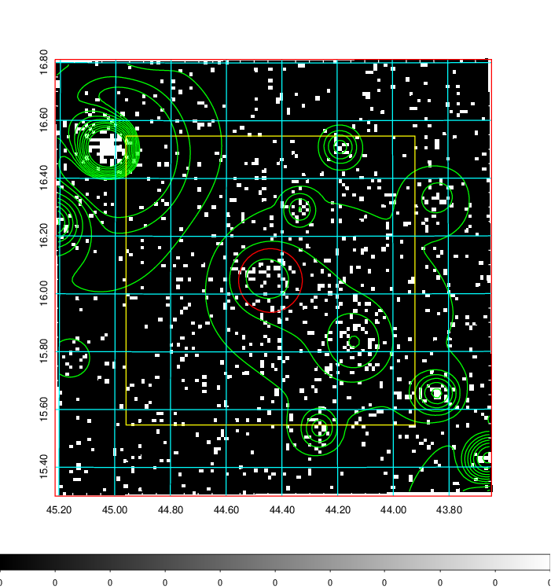  | 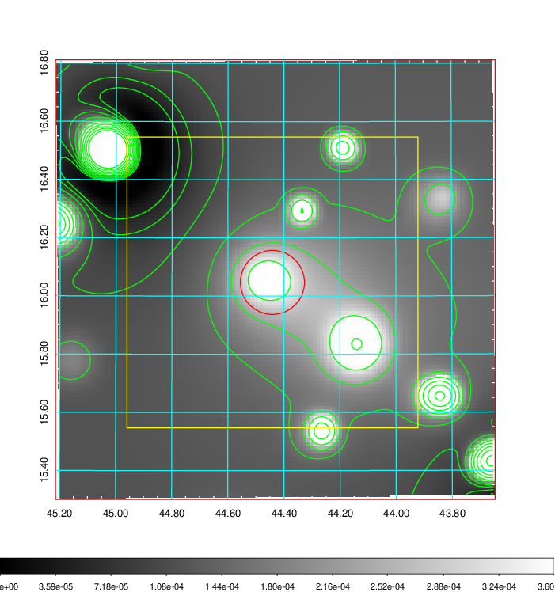   | 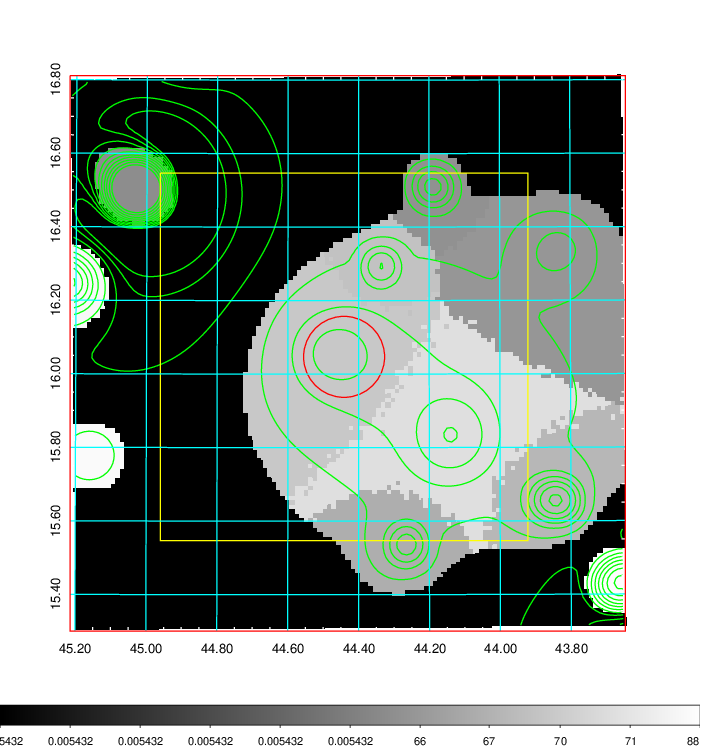  |

|[Exposure image](../image/123/123_mex.pdf)| [nH image](../image/123/123_nh.pdf)| [Planck image](../image/123/123_p.pdf)|
|-------------------|--------------------|-------------------|
|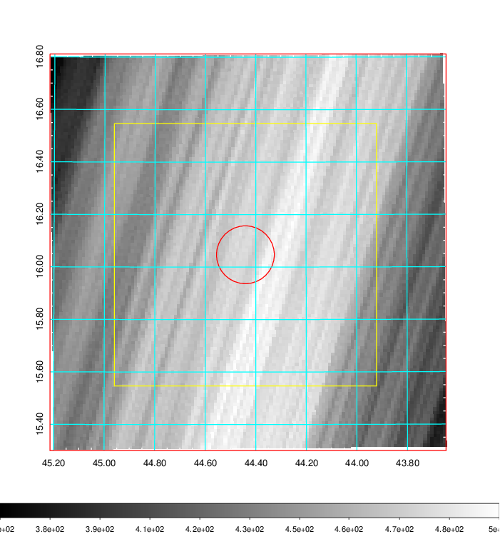   | 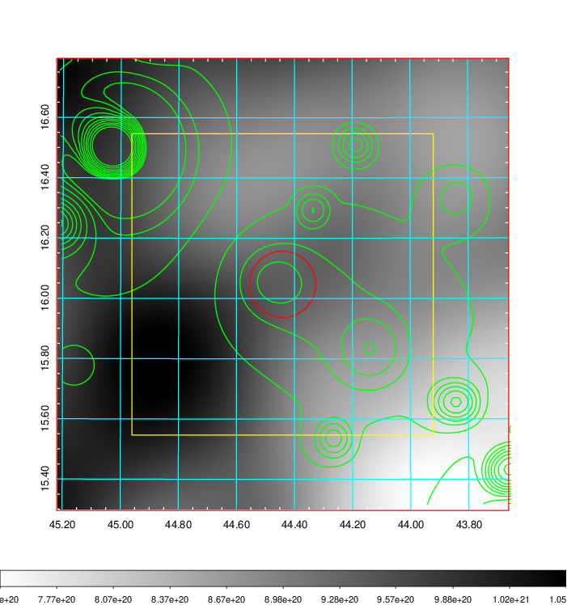    | 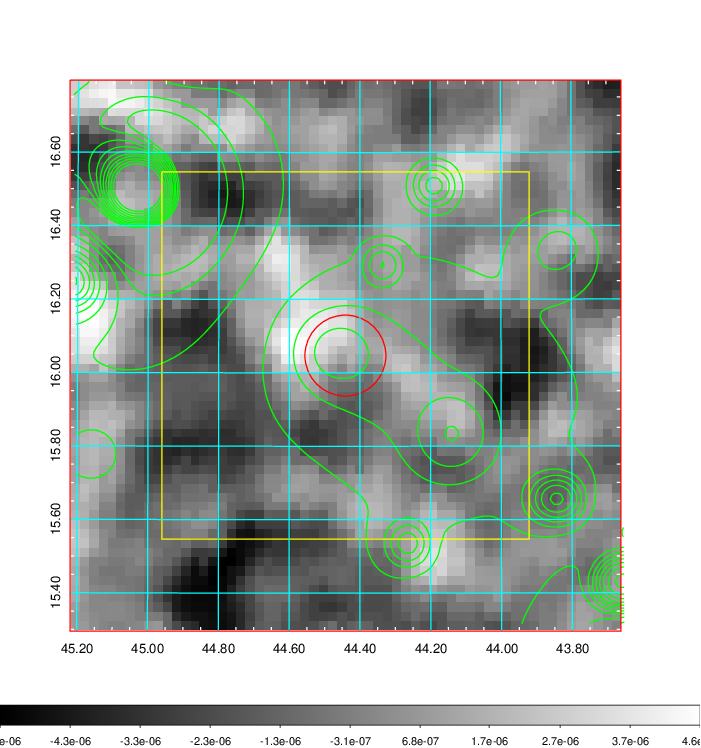 |

|[Redshift Histogram](../image/123/123_zg.pdf) | [DSS image(z1)](../image/123/123_dss_z1.pdf)      |  [DSS image(z2)](../image/123/123_dss_z2.pdf)    |
|-------------------|--------------------|-------------------|
|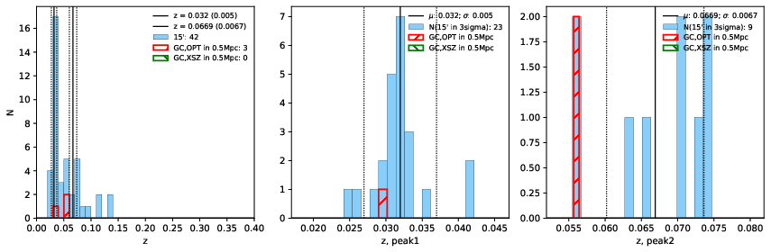 |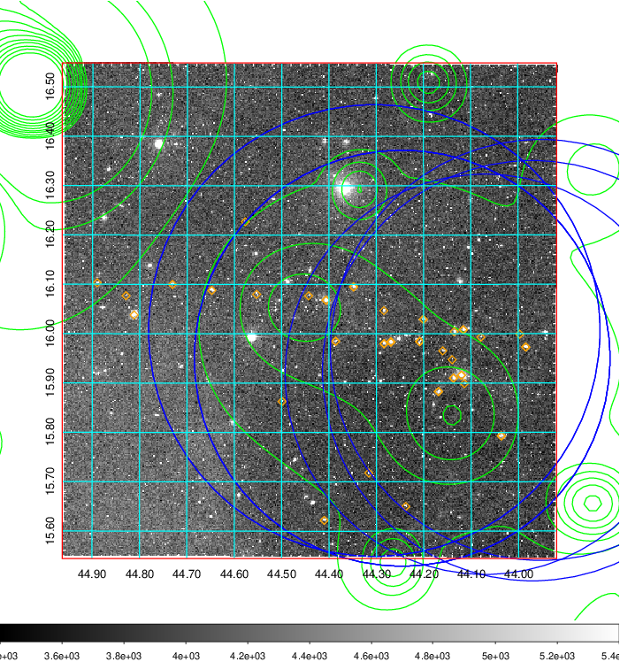  Blue circle for optical clusters;  Magenta circle for XSZ clusters;  all with r=1Mpc;  Only GC with Delta_z<0.01 are shown. | 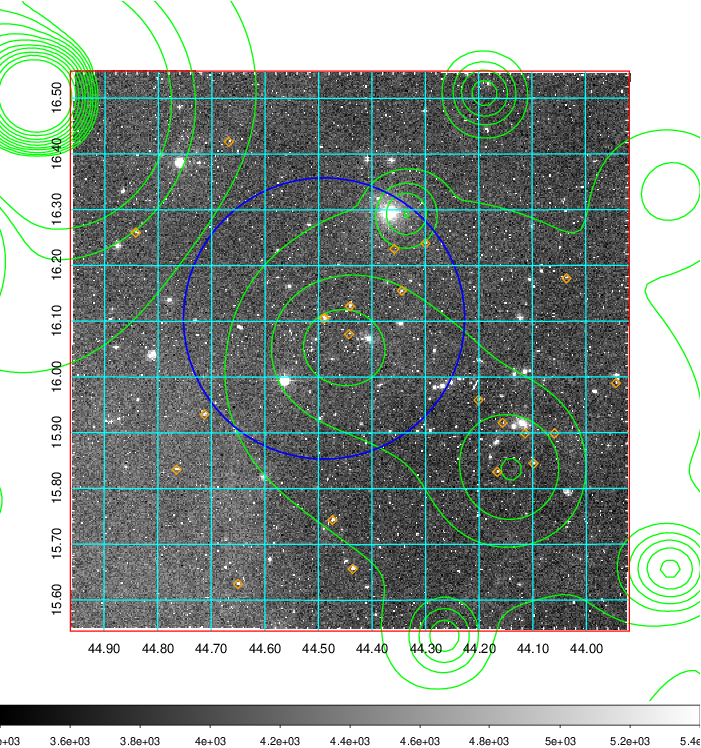 Blue circle for optical clusters;  Magenta circle for XSZ clusters;  all with r=1Mpc;  Only GC with Delta_z<0.01 are shown.  |

|[Previous-identified clusters](../image/123/123_gc.pdf) | [2MASS image](../image/123/123_2mass.pdf)      |
|-------------------|-------------------|
|  Green, magenta, and blue circles  for optical, X-ray and SZ clusters  respectively, with redshift of clusters  labelled. The radius of circles  are 1Mpc.|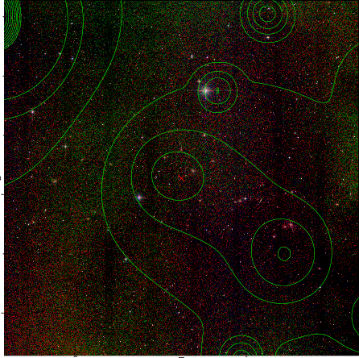  |

|[PS1 image](../image/123/123_ps1.pdf)            |
|-------------------|
| 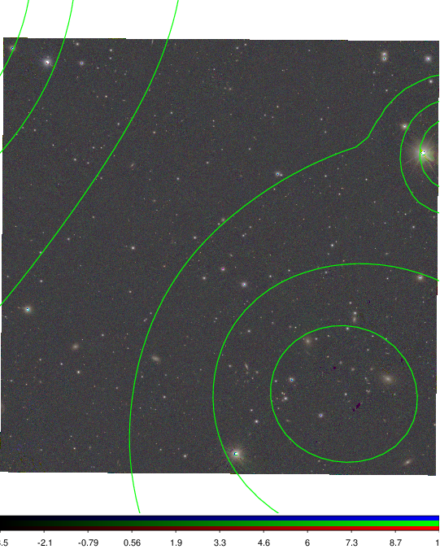  |
