

### 124

|Name|RAJ2000[deg]|DEJ2000[deg] |Ext[arcmin]| Ext,ml | z | z_src| C|GC(XSZ,Delta_z<0.01)| GC(OPT,Delta_z<0.01)|GC| R_sig[arcmin] | R500[arcmin] | R500[Mpc]| CRsig[c/s] | CR500[c/s] |L500[1E44 erg/s]|F500[1E-12 erg/s/cm^2]| M500[1E14 Msun]|Tx[keV]|Cnt_sig|Beta|Rc[arcmin]|Comment|Alias|
|---|---|---|---|---|---|------|---|--------|---------|----------|---|---|---|---|---|---|---|---|---|---|---|---|---|---|
|124| 44.451| 13.050| 3.22| 581.42| 0.0720(0.006)| z1, z_xsz| B| MCXC, PSZ2, Tar, XB| A, N| A, MCXC, N, PSZ2, Tar, W, XB| 24.700| 13.716| 1.129| 1.048(0.078)| 0.976(0.073)| 2.153(0.053)| 17.020(0.422)| 4.38(0.05)| 5.45(0.04)| 517.2| 0.795(-0.044+0.053)| 5.062(-0.445+0.505)| -| k399|

|[RASS image](../image/124/124_img.pdf)|[filtered image](../image/124/124_fil.pdf)|[Segment image](../image/124/124_seg.pdf)|
|-------------------|--------------------|-------------------|
| 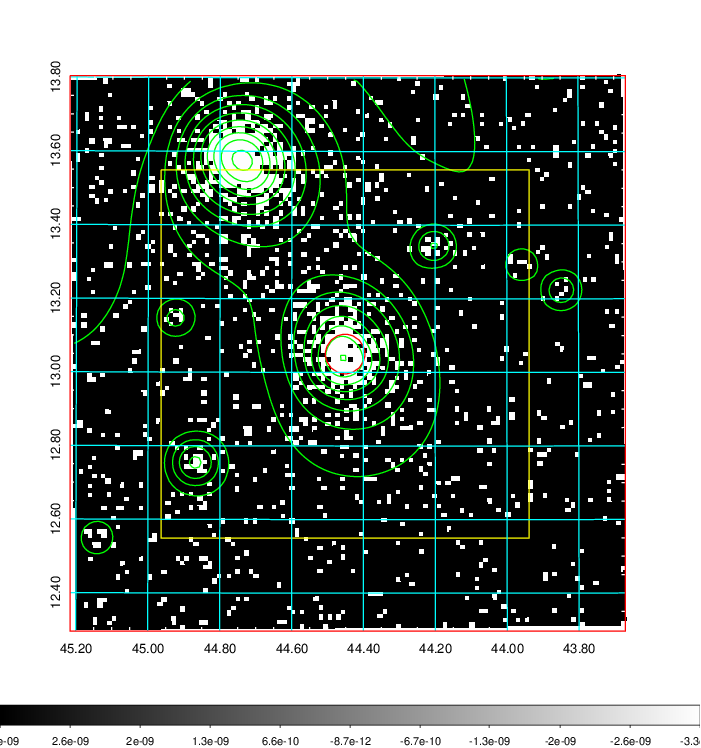  | 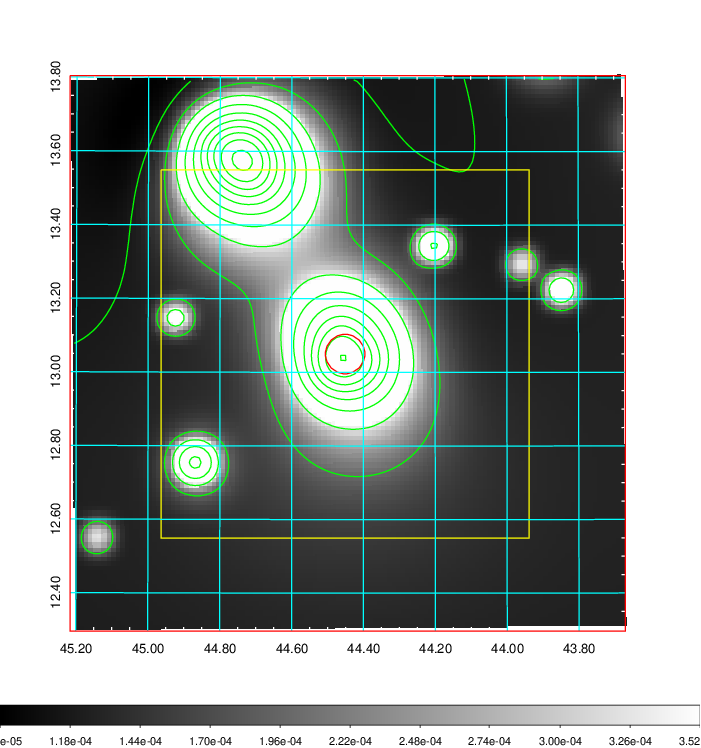   | 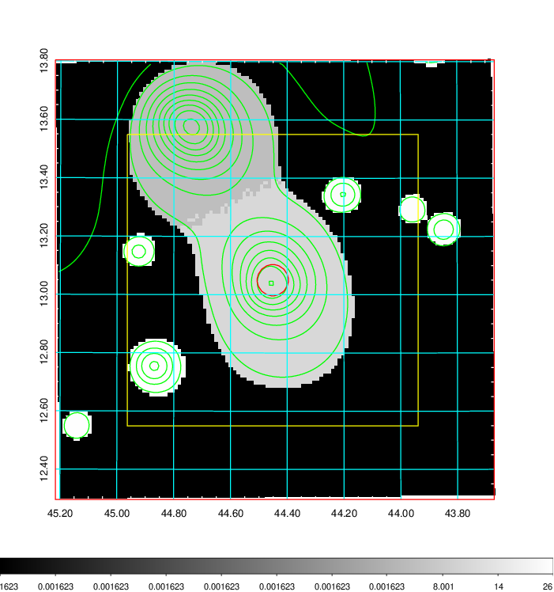  |

|[Exposure image](../image/124/124_mex.pdf)| [nH image](../image/124/124_nh.pdf)| [Planck image](../image/124/124_p.pdf)|
|-------------------|--------------------|-------------------|
|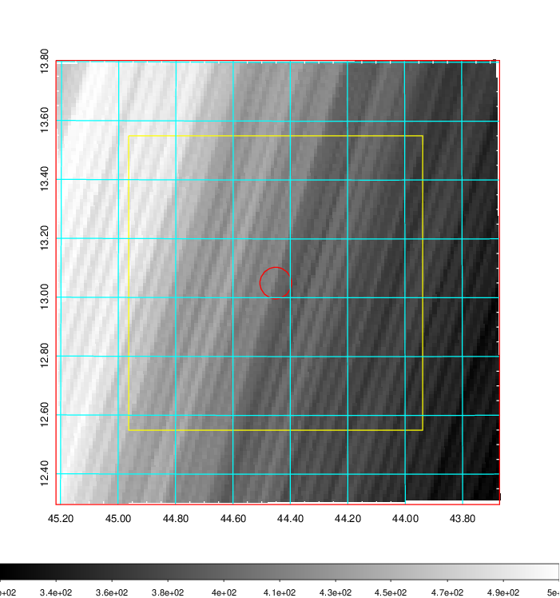   | 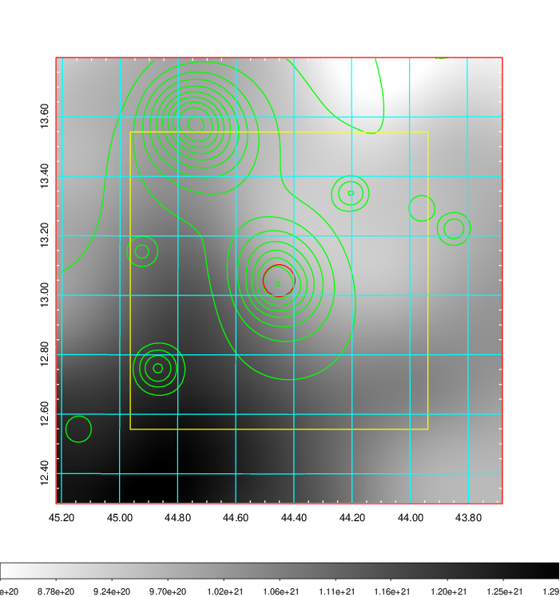    | 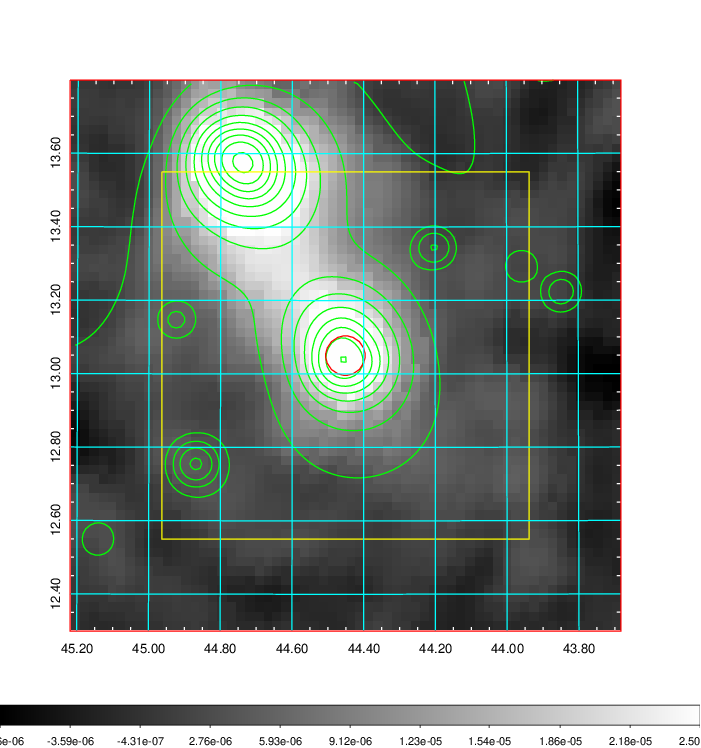 |

|[Redshift Histogram](../image/124/124_zg.pdf) | [DSS image(z1)](../image/124/124_dss_z1.pdf)      |  [DSS image(z2)](../image/124/124_dss_z2.pdf)    |
|-------------------|--------------------|-------------------|
|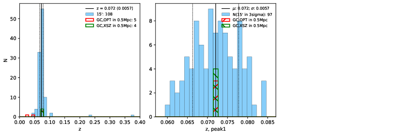 |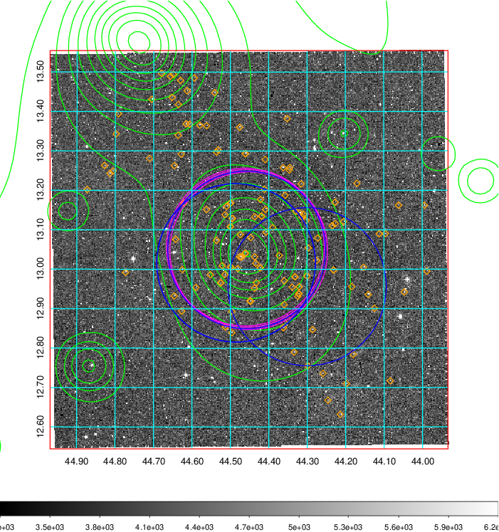  Blue circle for optical clusters;  Magenta circle for XSZ clusters;  all with r=1Mpc;  Only GC with Delta_z<0.01 are shown. | 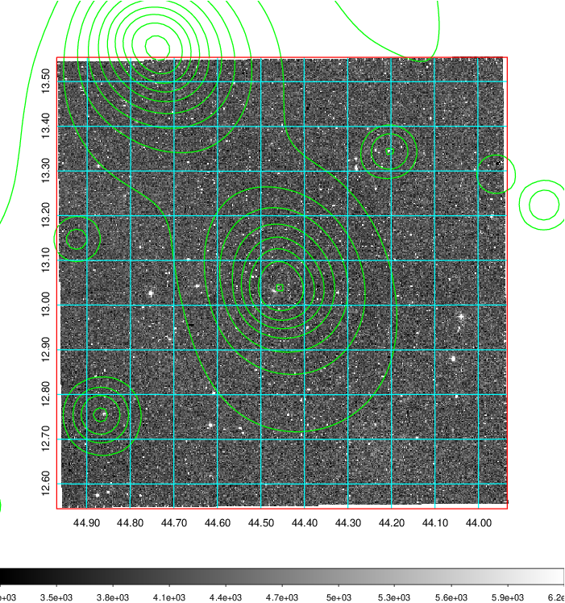 Blue circle for optical clusters;  Magenta circle for XSZ clusters;  all with r=1Mpc;  Only GC with Delta_z<0.01 are shown.  |

|[Previous-identified clusters](../image/124/124_gc.pdf) | [2MASS image](../image/124/124_2mass.pdf)      |
|-------------------|-------------------|
|  Green, magenta, and blue circles  for optical, X-ray and SZ clusters  respectively, with redshift of clusters  labelled. The radius of circles  are 1Mpc.|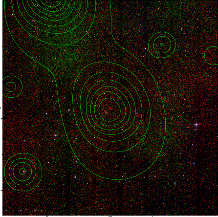  |

|[PS1 image](../image/124/124_ps1.pdf)            |
|-------------------|
| 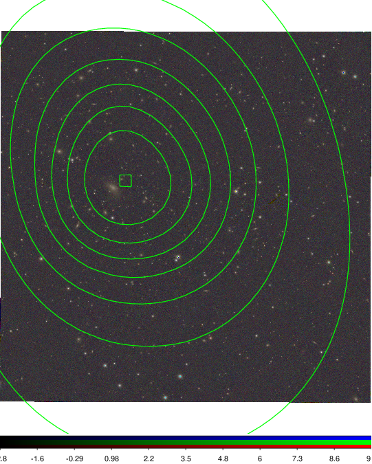  |
