

### 125

|Name|RAJ2000[deg]|DEJ2000[deg] |Ext[arcmin]| Ext,ml | z | z_src| C|GC(XSZ,Delta_z<0.01)| GC(OPT,Delta_z<0.01)|GC| R_sig[arcmin] | R500[arcmin] | R500[Mpc]| CRsig[c/s] | CR500[c/s] |L500[1E44 erg/s]|F500[1E-12 erg/s/cm^2]| M500[1E14 Msun]|Tx[keV]|Cnt_sig|Beta|Rc[arcmin]|Comment|Alias|
|---|---|---|---|---|---|------|---|--------|---------|----------|---|---|---|---|---|---|---|---|---|---|---|---|---|---|
|125| 44.604| -52.697| 3.25| 26.72| 0.0744(0.005)| z1, z_opt| S| -| A, W| A, N, Tar, W| 11.238| 7.471| 0.634| 0.071(0.022)| 0.068(0.021)| 0.171(0.042)| 1.261(0.309)| 0.78(0.10)| 1.87(0.15)| 64.1| 0.906(-0.113+0.068)| 5.604(-0.813+0.704)| An SZ cluster with no $z$ and offset = 0.21 Mpc| t146|

|[RASS image](../image/125/125_img.pdf)|[filtered image](../image/125/125_fil.pdf)|[Segment image](../image/125/125_seg.pdf)|
|-------------------|--------------------|-------------------|
| 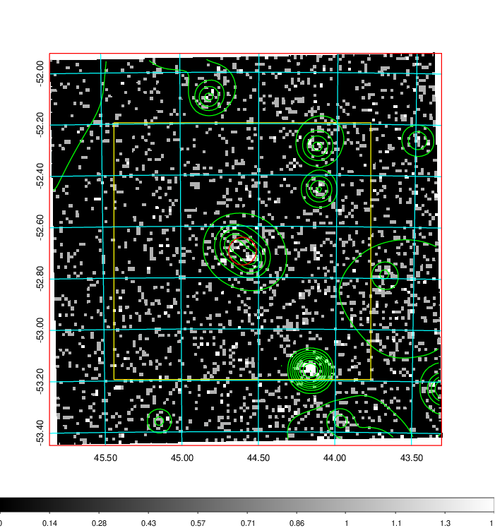  | 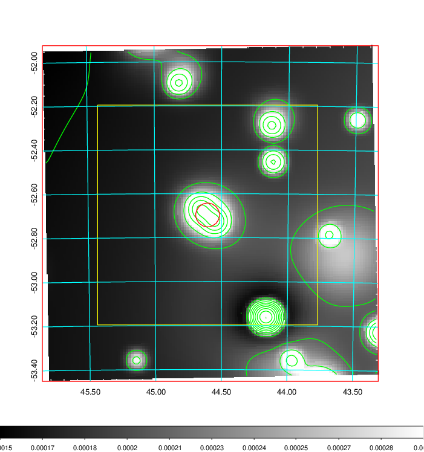   | 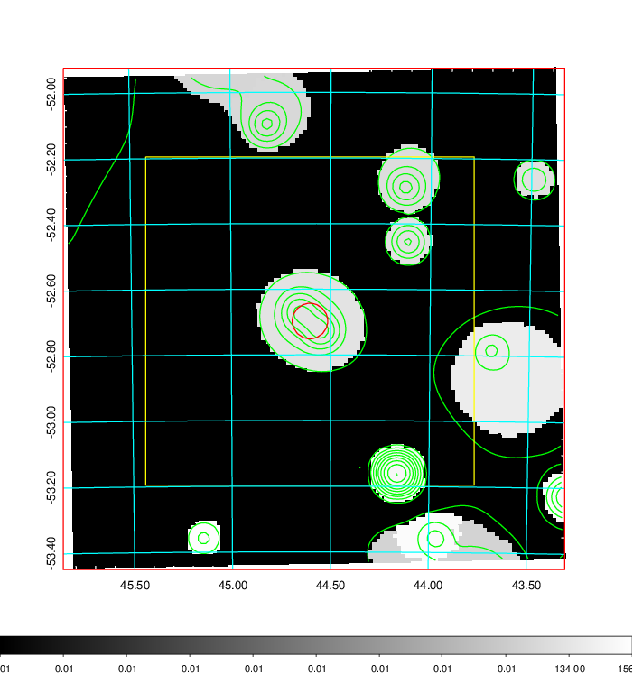  |

|[Exposure image](../image/125/125_mex.pdf)| [nH image](../image/125/125_nh.pdf)| [Planck image](../image/125/125_p.pdf)|
|-------------------|--------------------|-------------------|
|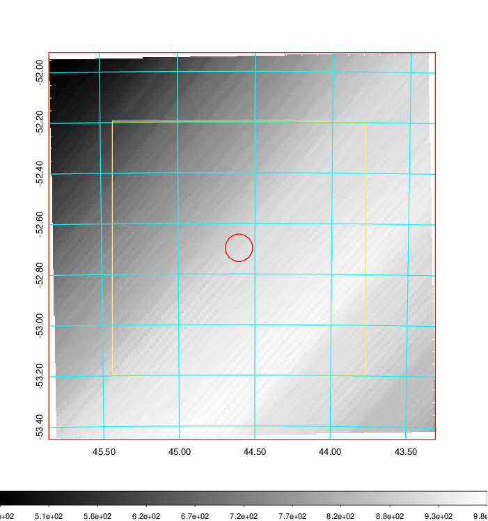   | 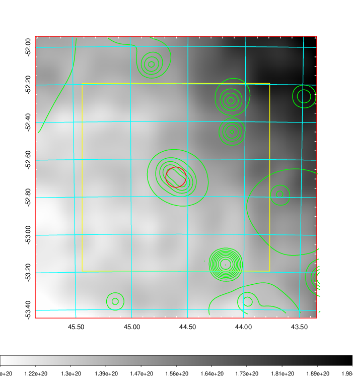    | 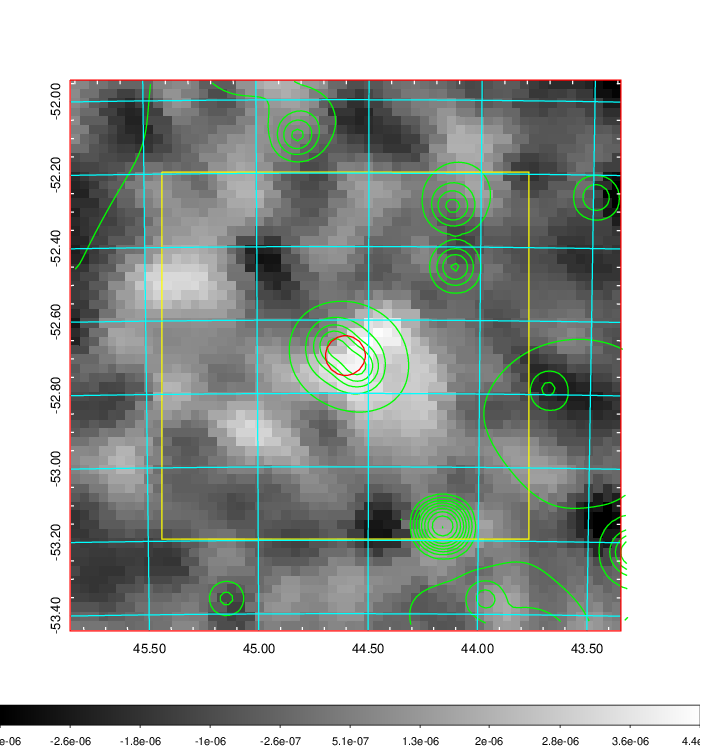 |

|[Redshift Histogram](../image/125/125_zg.pdf) | [DSS image(z1)](../image/125/125_dss_z1.pdf)      |  [DSS image(z2)](../image/125/125_dss_z2.pdf)    |
|-------------------|--------------------|-------------------|
|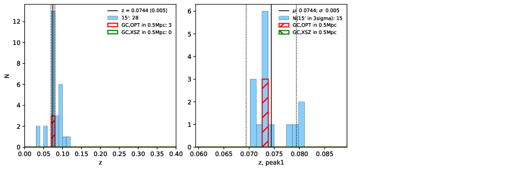 |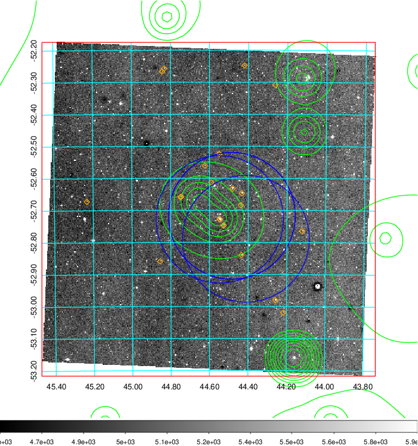  Blue circle for optical clusters;  Magenta circle for XSZ clusters;  all with r=1Mpc;  Only GC with Delta_z<0.01 are shown. | 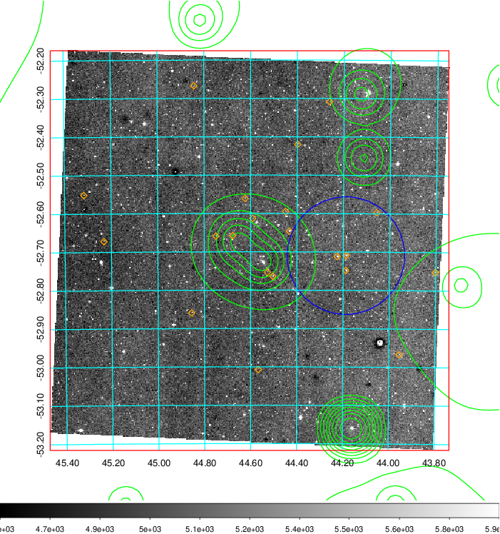 Blue circle for optical clusters;  Magenta circle for XSZ clusters;  all with r=1Mpc;  Only GC with Delta_z<0.01 are shown.  |

|[Previous-identified clusters](../image/125/125_gc.pdf) | [2MASS image](../image/125/125_2mass.pdf)      |
|-------------------|-------------------|
|  Green, magenta, and blue circles  for optical, X-ray and SZ clusters  respectively, with redshift of clusters  labelled. The radius of circles  are 1Mpc.|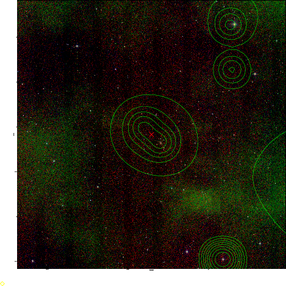  |

|[DES image](../image/125/125_des.pdf)   |
|-------------------|
| 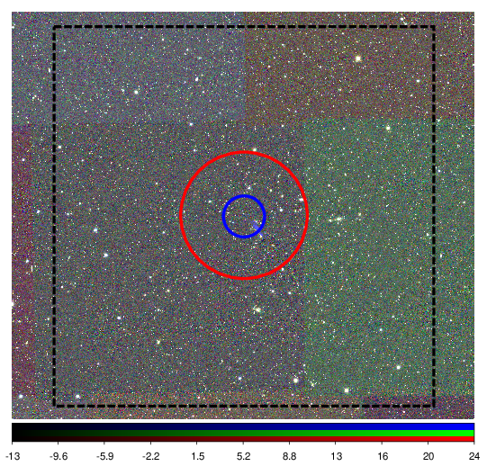  |
