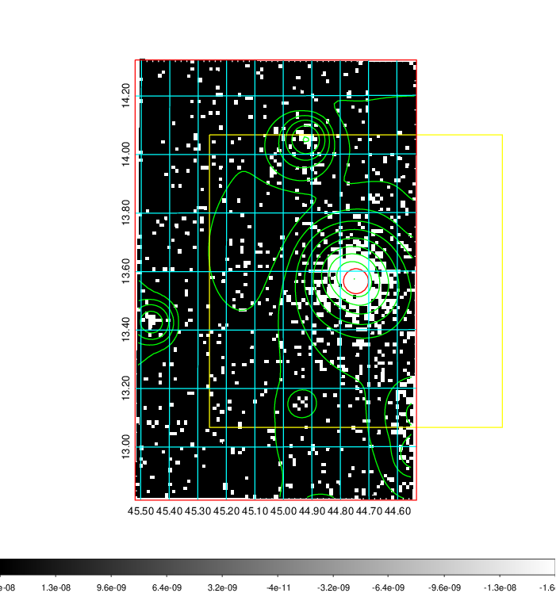
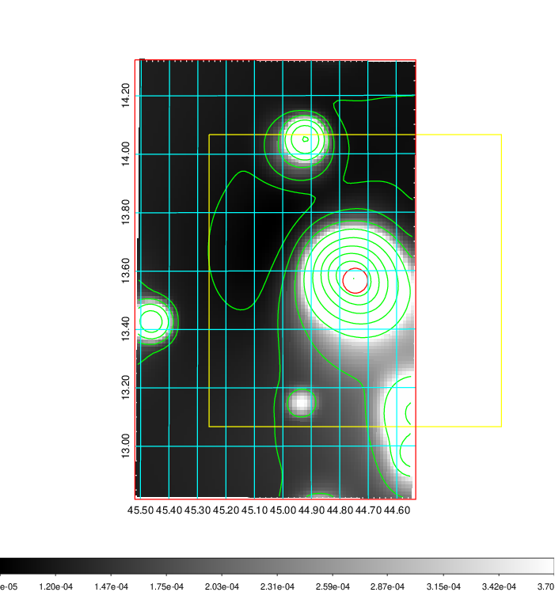
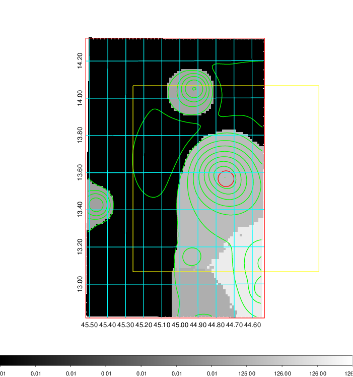
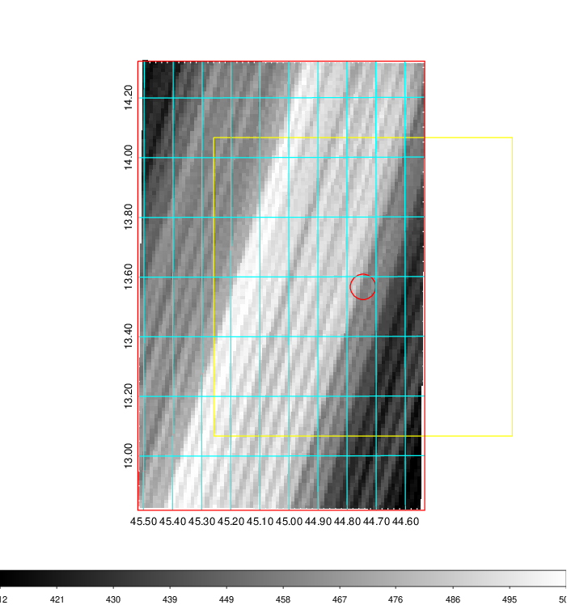
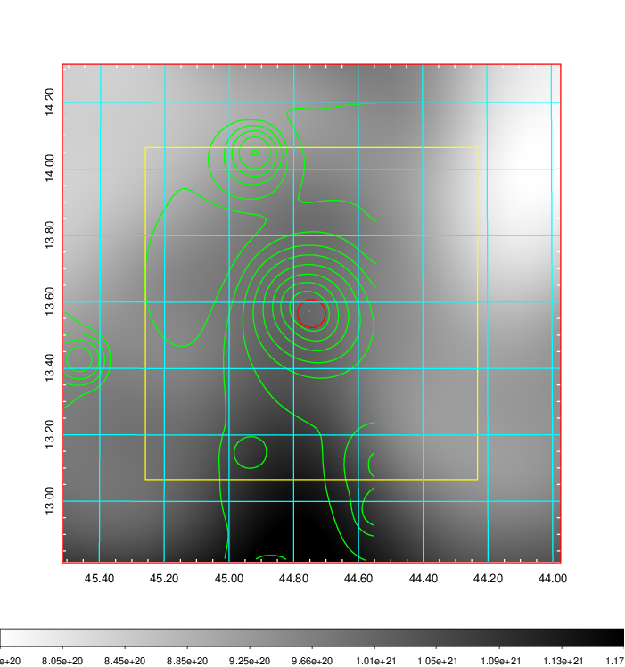
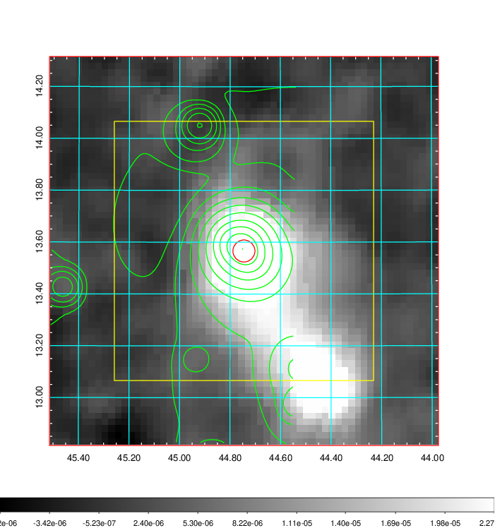
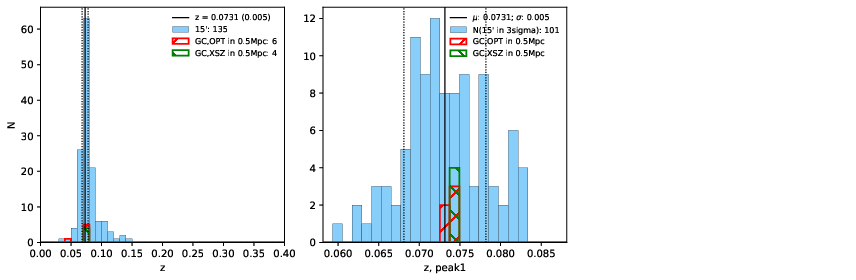
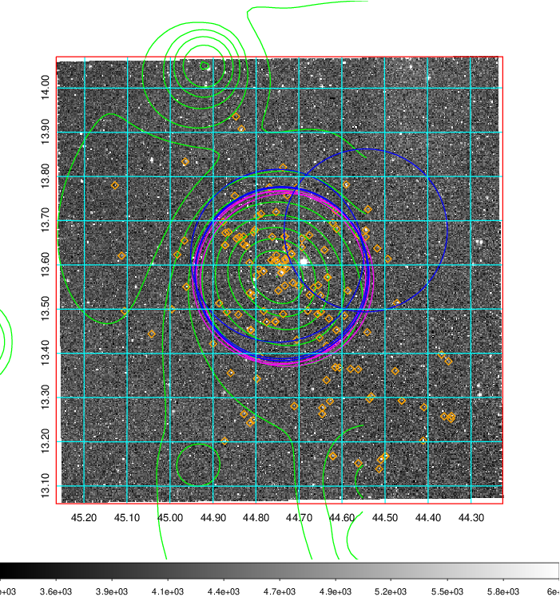
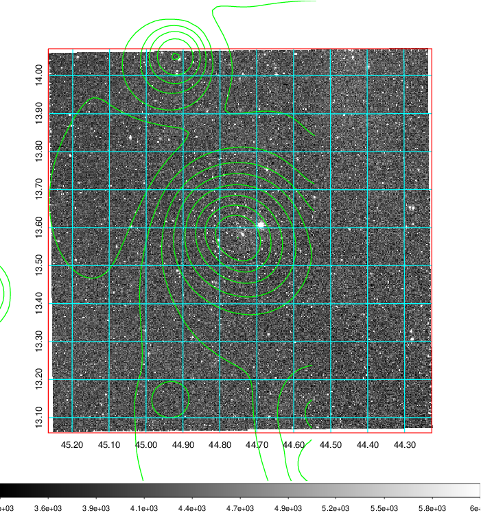

### 126

|Name|RAJ2000[deg]|DEJ2000[deg] |Ext[arcmin]| Ext,ml | z | z_src| C|GC(XSZ,Delta_z<0.01)| GC(OPT,Delta_z<0.01)|GC| R_sig[arcmin] | R500[arcmin] | R500[Mpc]| CRsig[c/s] | CR500[c/s] |L500[1E44 erg/s]|F500[1E-12 erg/s/cm^2]| M500[1E14 Msun]|Tx[keV]|Cnt_sig|Beta|Rc[arcmin]|Comment|Alias|
|---|---|---|---|---|---|------|---|--------|---------|----------|---|---|---|---|---|---|---|---|---|---|---|---|---|---|
|126| 44.745| 13.566| 2.55| 1143.91| 0.0731(0.005)| z1, z_xsz| B| MCXC, PSZ2, Tar, XB| A, N, W| A, MCXC, N, PSZ2, SWXCS, Tar, W, XB| 17.788| 15.251| 1.273| 1.699(0.069)| 1.660(0.068)| 3.839(0.047)| 29.403(0.361)| 6.28(0.04)| 6.81(0.03)| 831.8| 0.977(-0.030+0.017)| 5.478(-0.210+0.144)| -| k308|

|[RASS image](../image/126/126_img.pdf)|[filtered image](../image/126/126_fil.pdf)|[Segment image](../image/126/126_seg.pdf)|
|-------------------|--------------------|-------------------|
|   |    |   |

|[Exposure image](../image/126/126_mex.pdf)| [nH image](../image/126/126_nh.pdf)| [Planck image](../image/126/126_p.pdf)|
|-------------------|--------------------|-------------------|
|   |     |  |

|[Redshift Histogram](../image/126/126_zg.pdf) | [DSS image(z1)](../image/126/126_dss_z1.pdf)      |  [DSS image(z2)](../image/126/126_dss_z2.pdf)    |
|-------------------|--------------------|-------------------|
| |  Blue circle for optical clusters;  Magenta circle for XSZ clusters;  all with r=1Mpc;  Only GC with Delta_z<0.01 are shown. |  Blue circle for optical clusters;  Magenta circle for XSZ clusters;  all with r=1Mpc;  Only GC with Delta_z<0.01 are shown.  |

|[known Abell/XSZ clusters](../image/126/126_gc.pdf) | [2MASS image](../image/126/126_2mass.pdf)      |
|-------------------|-------------------|
|  Magenta, blue and green circles  for optical, X-ray and SZ clusters  respectively, with redshift of clusters  labelled. The radius of circles  are 1Mpc.|  |

|[PS1 image](../image/126/126_ps1.pdf)            |
|-------------------|
|   |
