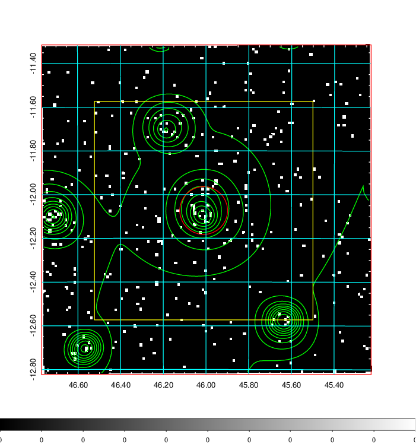
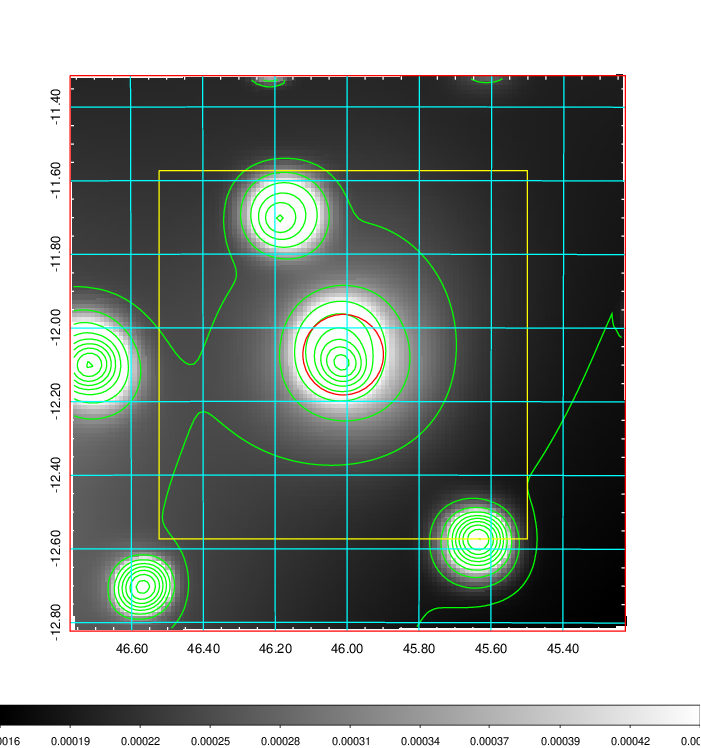
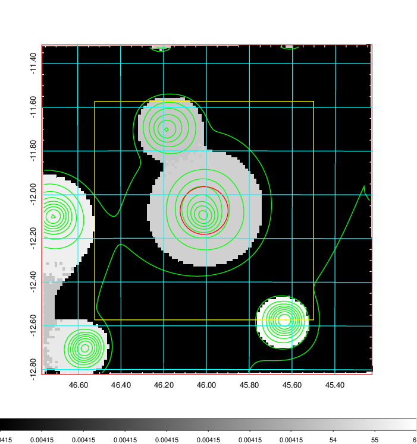
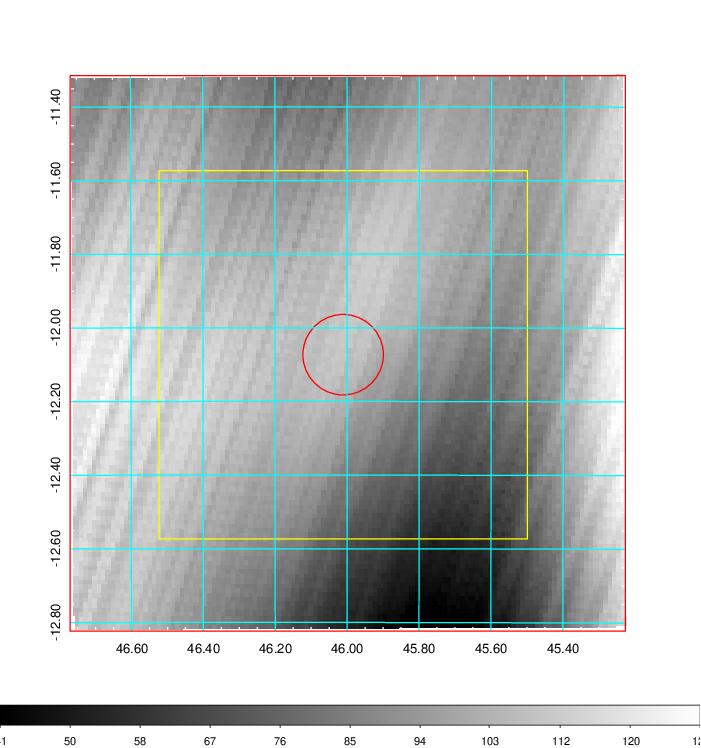
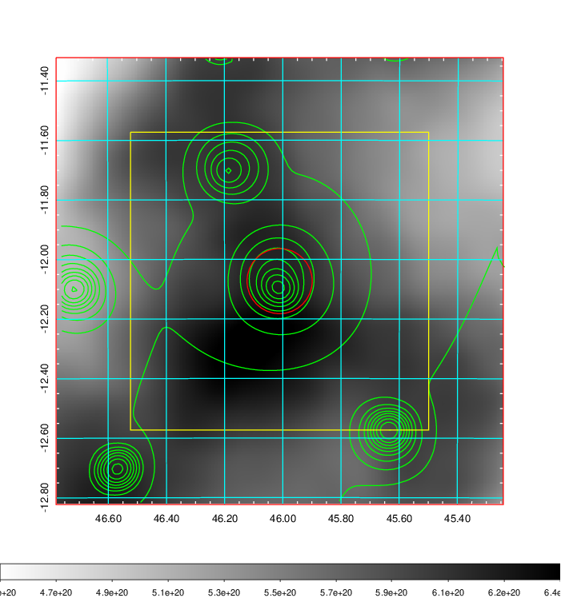
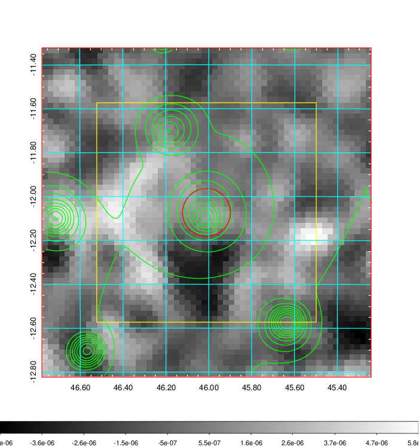
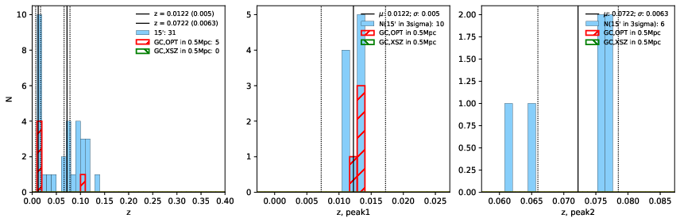
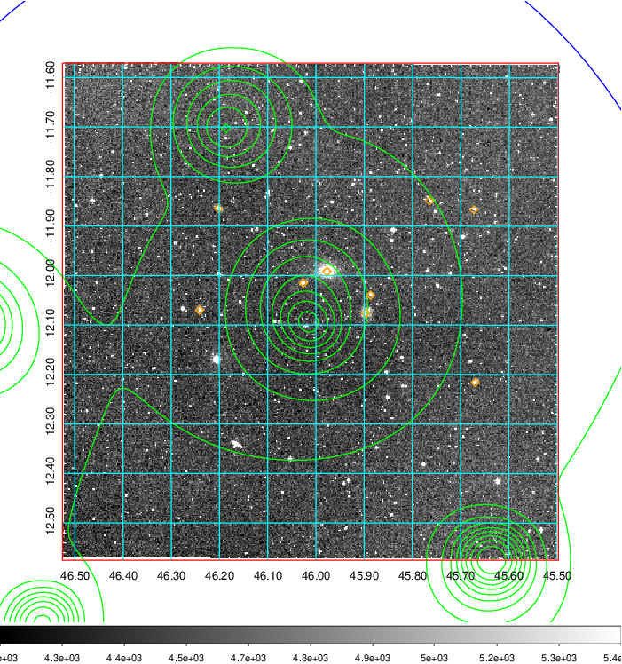
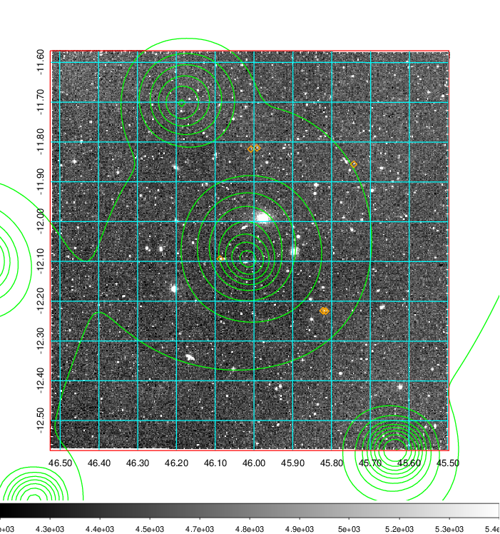
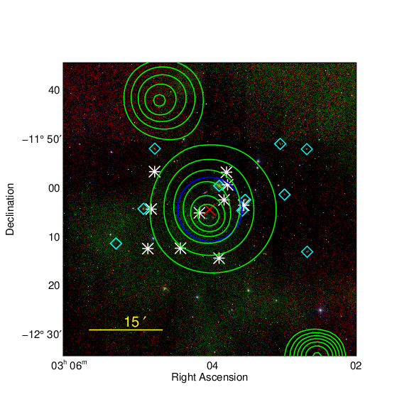

### 127

|Name|RAJ2000[deg]|DEJ2000[deg] |Ext[arcmin]| Ext,ml | z | z_src| C|GC(XSZ,Delta_z<0.01)| GC(OPT,Delta_z<0.01)|GC| R_sig[arcmin] | R500[arcmin] | R500[Mpc]| CRsig[c/s] | CR500[c/s] |L500[1E44 erg/s]|F500[1E-12 erg/s/cm^2]| M500[1E14 Msun]|Tx[keV]|Cnt_sig|Beta|Rc[arcmin]|Comment|Alias|
|---|---|---|---|---|---|------|---|--------|---------|----------|---|---|---|---|---|---|---|---|---|---|---|---|---|---|
|127| 46.011| -12.073| 6.56| 26.48| 0.0122(0.005)| z1, z_opt| S| -| N| N, W| 12.700| 27.580| 0.413| 0.214(0.083)| 0.265(0.101)| 0.011(0.003)| 3.366(0.994)| 0.20(0.03)| 0.80(0.08)| 33.2| 0.712(-0.150+0.185)| 4.704(-1.520+1.710)| -| t329|

|[RASS image](../image/127/127_img.pdf)|[filtered image](../image/127/127_fil.pdf)|[Segment image](../image/127/127_seg.pdf)|
|-------------------|--------------------|-------------------|
|   |    |   |

|[Exposure image](../image/127/127_mex.pdf)| [nH image](../image/127/127_nh.pdf)| [Planck image](../image/127/127_p.pdf)|
|-------------------|--------------------|-------------------|
|   |     |  |

|[Redshift Histogram](../image/127/127_zg.pdf) | [DSS image(z1)](../image/127/127_dss_z1.pdf)      |  [DSS image(z2)](../image/127/127_dss_z2.pdf)    |
|-------------------|--------------------|-------------------|
| |  Blue circle for optical clusters;  Magenta circle for XSZ clusters;  all with r=1Mpc;  Only GC with Delta_z<0.01 are shown. |  Blue circle for optical clusters;  Magenta circle for XSZ clusters;  all with r=1Mpc;  Only GC with Delta_z<0.01 are shown.  |

|[known Abell/XSZ clusters](../image/127/127_gc.pdf) | [2MASS image](../image/127/127_2mass.pdf)      |
|-------------------|-------------------|
|  Magenta, blue and green circles  for optical, X-ray and SZ clusters  respectively, with redshift of clusters  labelled. The radius of circles  are 1Mpc.|  |

|[DES image](../image/127/127_des.pdf)   |[ATLAS image](../image/127/127_s.pdf)        |
|-------------------|-------------------|
|   |   |
