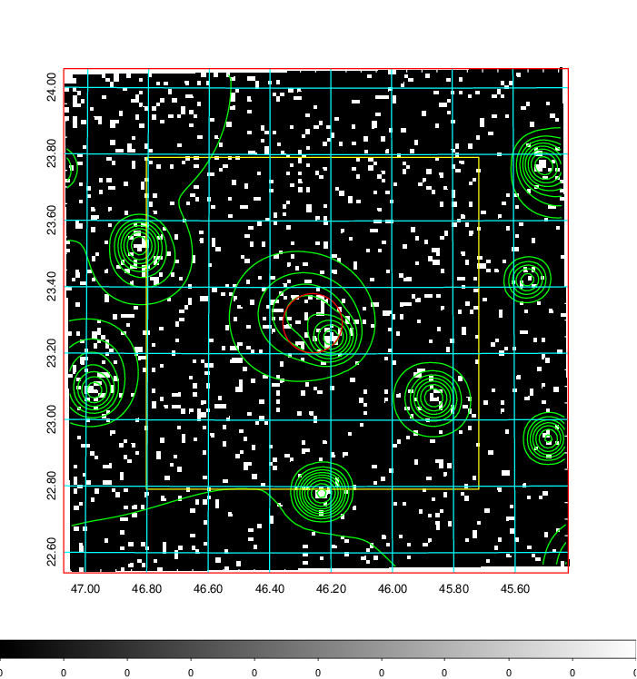
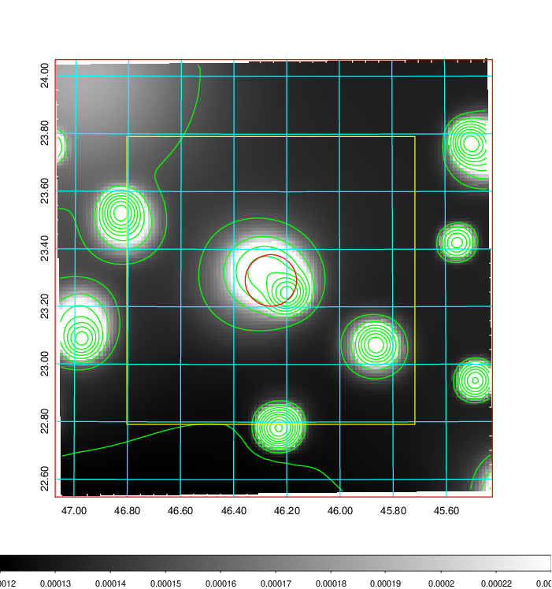
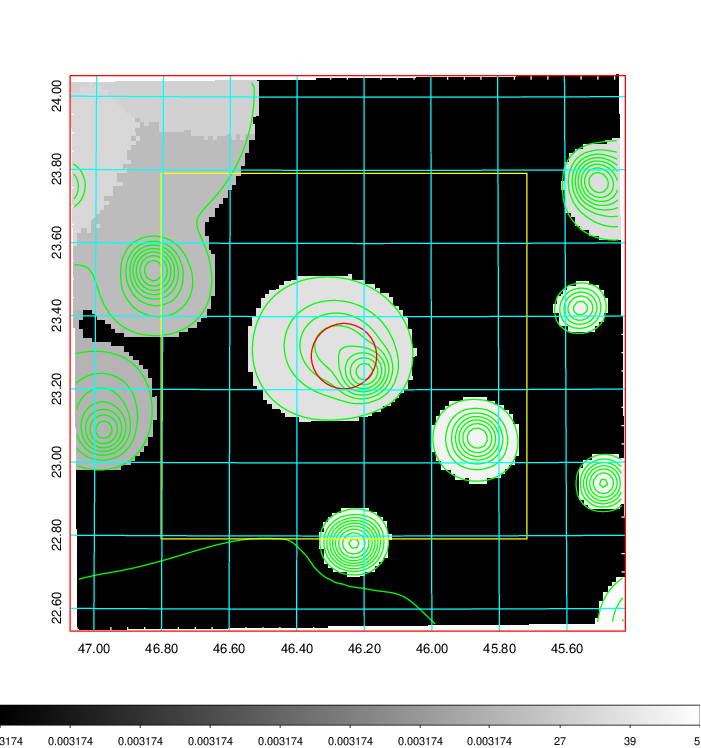
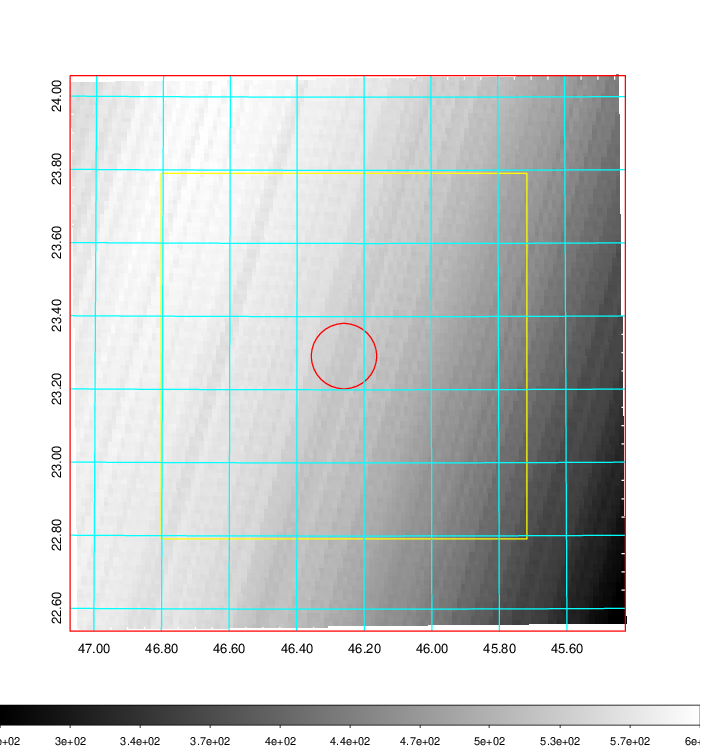
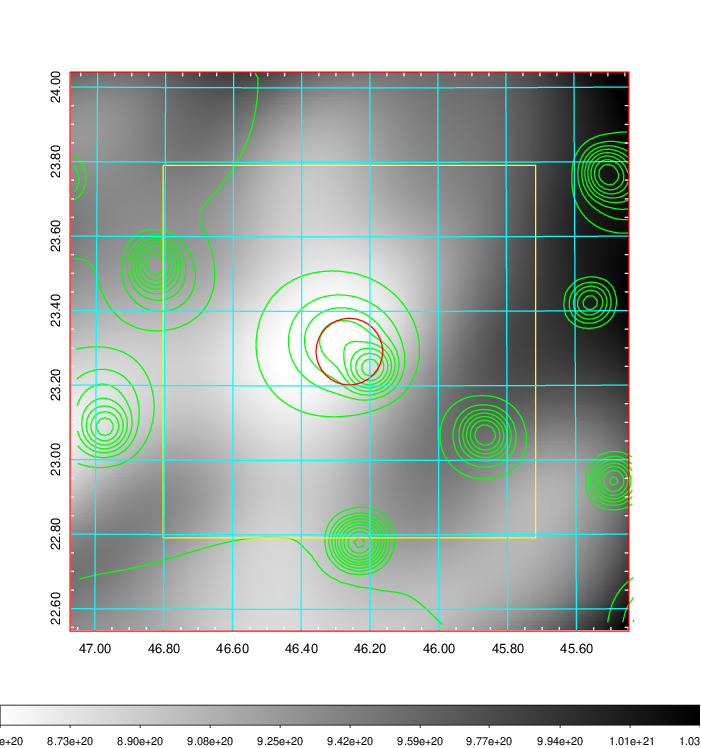
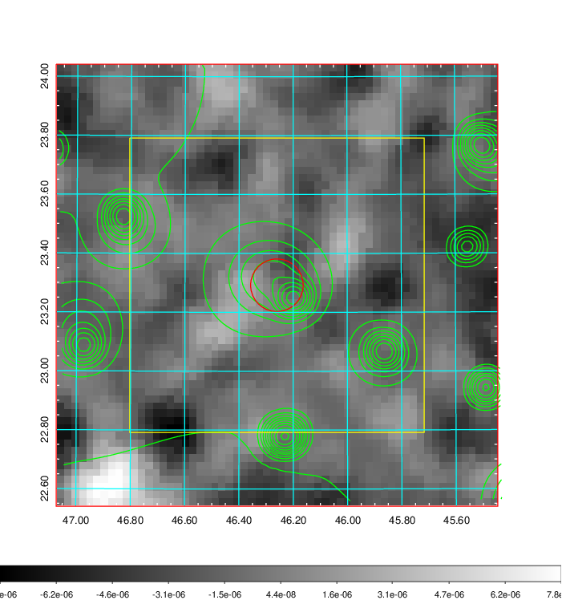
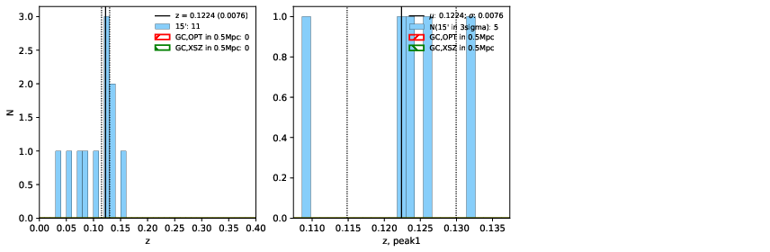
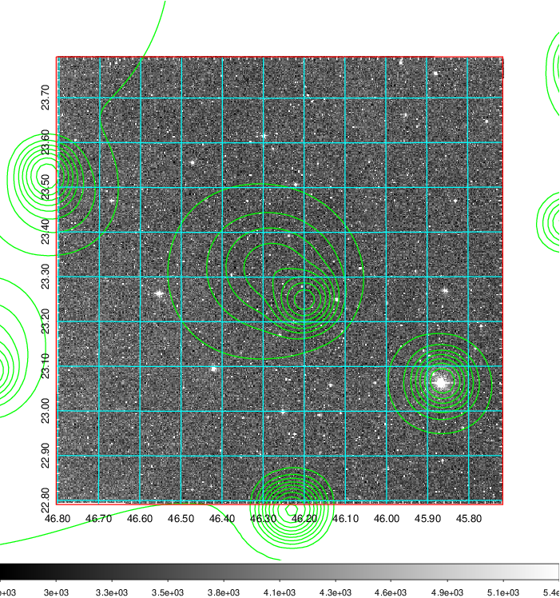
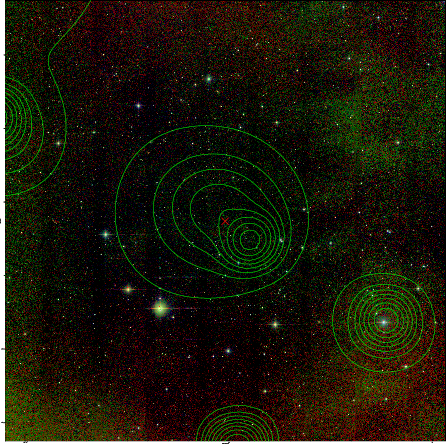
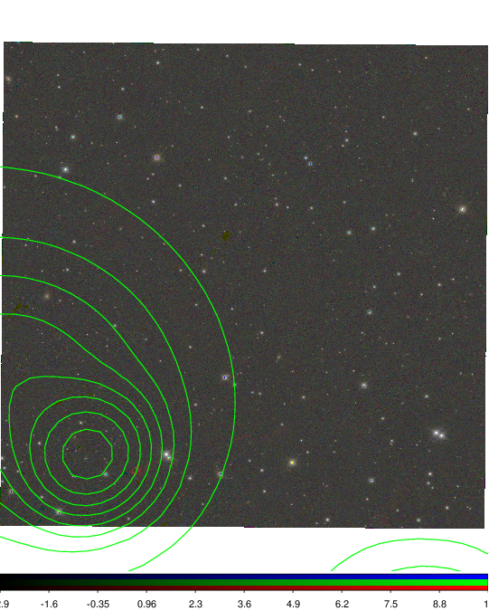

### 128

|Name|RAJ2000[deg]|DEJ2000[deg] |Ext[arcmin]| Ext,ml | z | z_src| C|GC(XSZ,Delta_z<0.01)| GC(OPT,Delta_z<0.01)|GC| R_sig[arcmin] | R500[arcmin] | R500[Mpc]| CRsig[c/s] | CR500[c/s] |L500[1E44 erg/s]|F500[1E-12 erg/s/cm^2]| M500[1E14 Msun]|Tx[keV]|Cnt_sig|Beta|Rc[arcmin]|Comment|Alias|
|---|---|---|---|---|---|------|---|--------|---------|----------|---|---|---|---|---|---|---|---|---|---|---|---|---|---|
|128| 46.260| 23.292| 5.36| 32.66| 0.1224(0.008)| z1,| G| -| -| N, W| 10.262| 5.297| 0.699| 0.040(0.024)| 0.037(0.023)| 0.236(0.064)| 0.604(0.163)| 1.10(0.15)| 2.35(0.20)| 46.6| 0.855(-0.161+0.105)| 6.792(-1.565+1.337)| -| t275|

|[RASS image](../image/128/128_img.pdf)|[filtered image](../image/128/128_fil.pdf)|[Segment image](../image/128/128_seg.pdf)|
|-------------------|--------------------|-------------------|
|   |    |   |

|[Exposure image](../image/128/128_mex.pdf)| [nH image](../image/128/128_nh.pdf)| [Planck image](../image/128/128_p.pdf)|
|-------------------|--------------------|-------------------|
|   |     |  |

|[Redshift Histogram](../image/128/128_zg.pdf) | [DSS image(z1)](../image/128/128_dss_z1.pdf)      |  [DSS image(z2)](../image/128/128_dss_z2.pdf)    |
|-------------------|--------------------|-------------------|
| |  Blue circle for optical clusters;  Magenta circle for XSZ clusters;  all with r=1Mpc;  Only GC with Delta_z<0.01 are shown. |  Blue circle for optical clusters;  Magenta circle for XSZ clusters;  all with r=1Mpc;  Only GC with Delta_z<0.01 are shown.  |

|[Previous-identified clusters](../image/128/128_gc.pdf) | [2MASS image](../image/128/128_2mass.pdf)      |
|-------------------|-------------------|
|  Green, magenta, and blue circles  for optical, X-ray and SZ clusters  respectively, with redshift of clusters  labelled. The radius of circles  are 1Mpc.|  |

|[PS1 image](../image/128/128_ps1.pdf)            |
|-------------------|
|   |
