

### 13

|Name|RAJ2000[deg]|DEJ2000[deg] |Ext[arcmin]| Ext,ml | z | z_src| C|GC(XSZ,Delta_z<0.01)| GC(OPT,Delta_z<0.01)|GC| R_sig[arcmin] | R500[arcmin] | R500[Mpc]| CRsig[c/s] | CR500[c/s] |L500[1E44 erg/s]|F500[1E-12 erg/s/cm^2]| M500[1E14 Msun]|Tx[keV]|Cnt_sig|Beta|Rc[arcmin]|Comment|Alias|
|---|---|---|---|---|---|------|---|--------|---------|----------|---|---|---|---|---|---|---|---|---|---|---|---|---|---|
|13| 3.570| 8.937| 1.64| 37.59| 0.1649(0.005)| z1, z_xsz| B| MCXC| N, W| F20, MCXC, N, W| 18.775| 5.519| 0.936| 0.099(0.042)| 0.089(0.038)| 1.193(0.228)| 1.592(0.304)| 2.74(0.26)| 4.20(0.25)| 74.6| 0.935(-0.083+0.047)| 3.514(-0.458+0.393)| -| k145|

|[RASS image](../image/13/13_img.pdf)|[filtered image](../image/13/13_fil.pdf)|[Segment image](../image/13/13_seg.pdf)|
|-------------------|--------------------|-------------------|
| 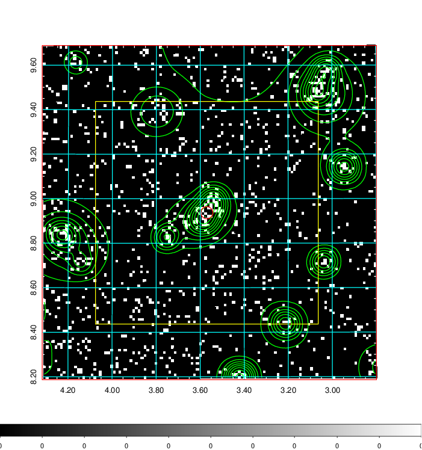  | 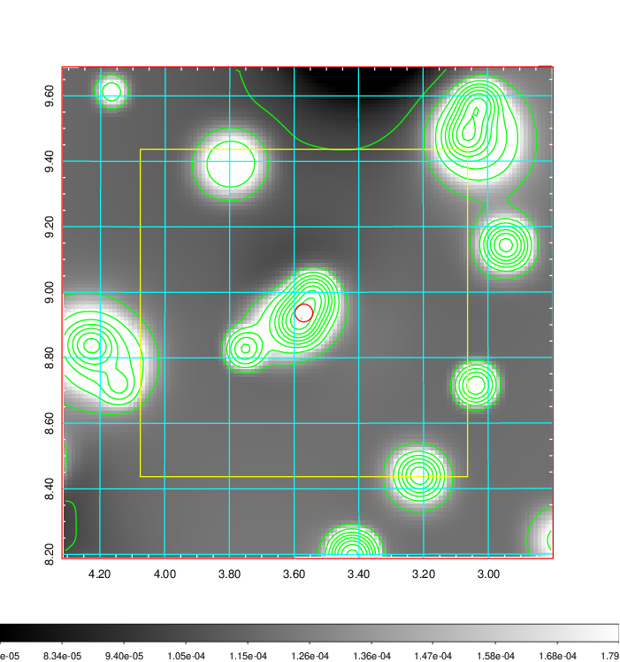   | 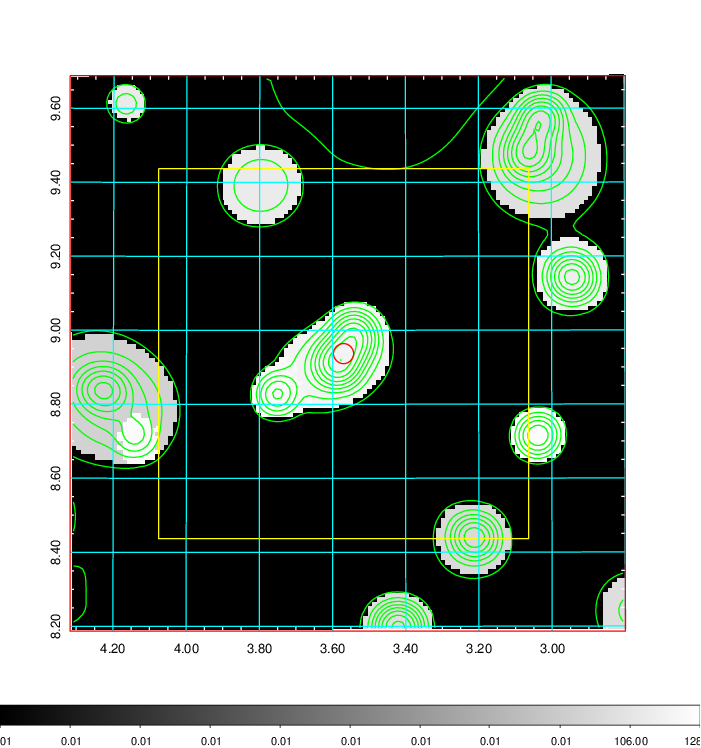  |

|[Exposure image](../image/13/13_mex.pdf)| [nH image](../image/13/13_nh.pdf)| [Planck image](../image/13/13_p.pdf)|
|-------------------|--------------------|-------------------|
|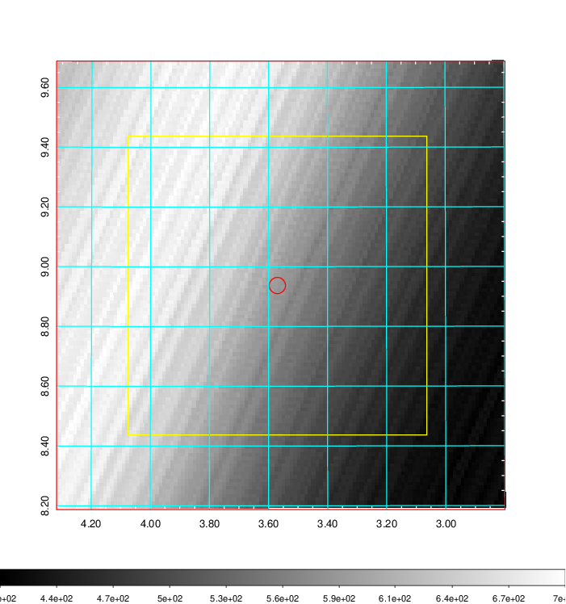   | 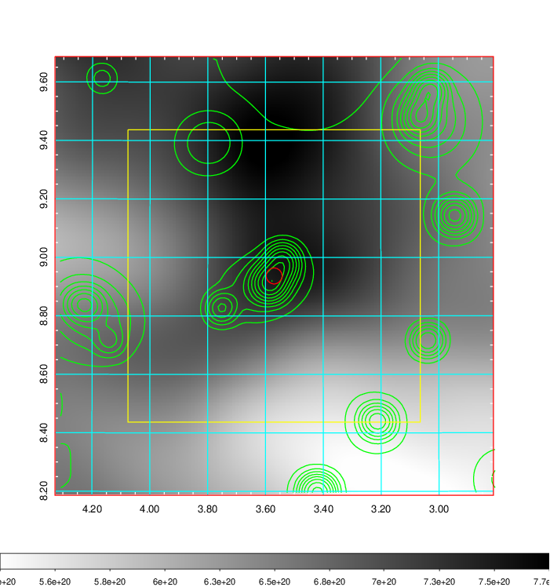    | 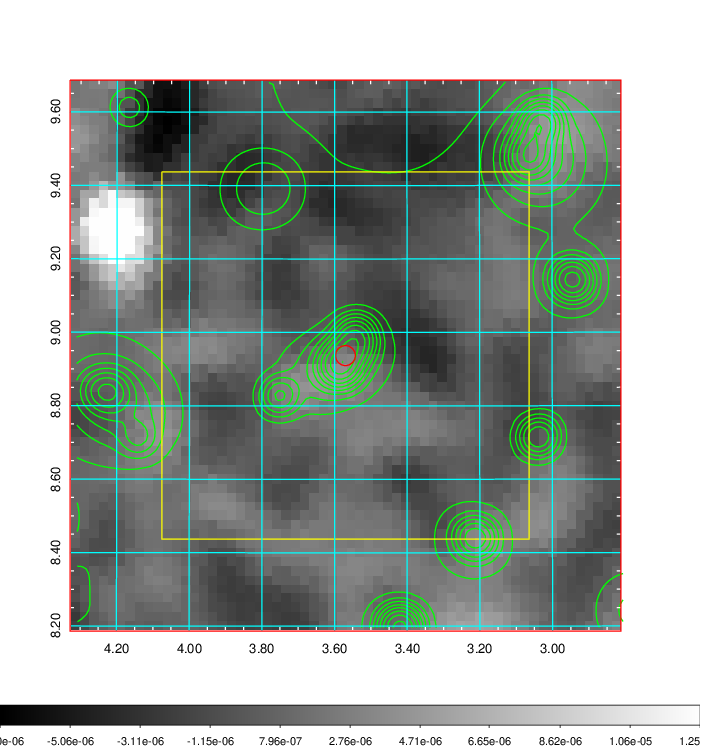 |

|[Redshift Histogram](../image/13/13_zg.pdf) | [DSS image(z1)](../image/13/13_dss_z1.pdf)      |  [DSS image(z2)](../image/13/13_dss_z2.pdf)    |
|-------------------|--------------------|-------------------|
|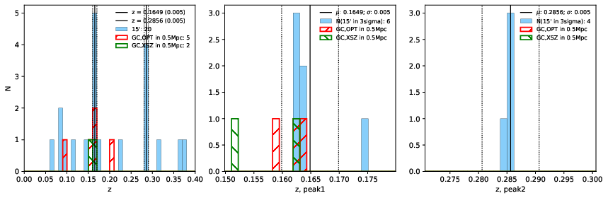 |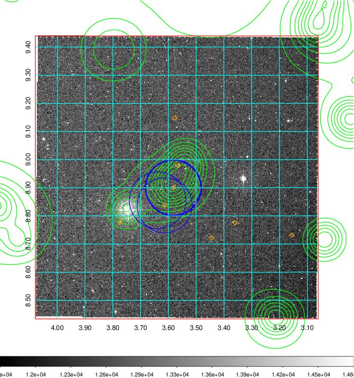  Blue circle for optical clusters;  Magenta circle for XSZ clusters;  all with r=1Mpc;  Only GC with Delta_z<0.01 are shown. | 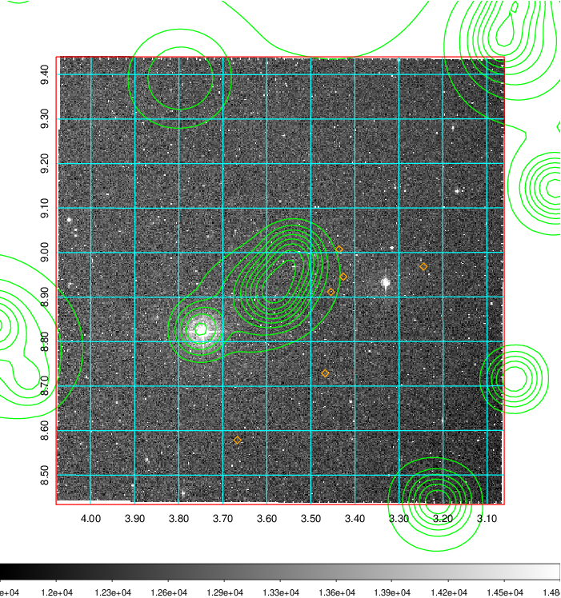 Blue circle for optical clusters;  Magenta circle for XSZ clusters;  all with r=1Mpc;  Only GC with Delta_z<0.01 are shown.  |

|[known Abell/XSZ clusters](../image/13/13_gc.pdf) | [2MASS image](../image/13/13_2mass.pdf)      |[SDSS image](../image/13/13_sdss.pdf)   |
|-------------------|-------------------|-------------------|
|  Magenta, blue and green circles  for optical, X-ray and SZ clusters  respectively, with redshift of clusters  labelled. The radius of circles  are 1Mpc.|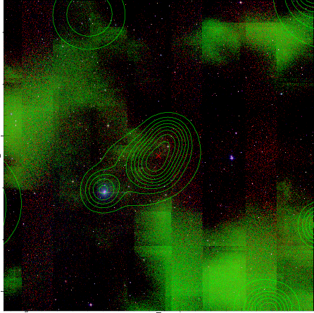  | 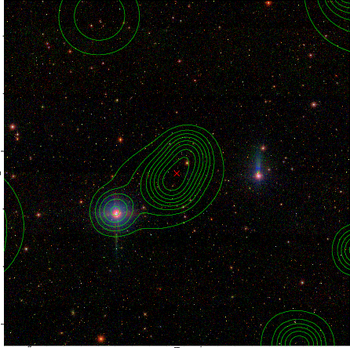  |

