

### 130

|Name|RAJ2000[deg]|DEJ2000[deg] |Ext[arcmin]| Ext,ml | z | z_src| C|GC(XSZ,Delta_z<0.01)| GC(OPT,Delta_z<0.01)|GC| R_sig[arcmin] | R500[arcmin] | R500[Mpc]| CRsig[c/s] | CR500[c/s] |L500[1E44 erg/s]|F500[1E-12 erg/s/cm^2]| M500[1E14 Msun]|Tx[keV]|Cnt_sig|Beta|Rc[arcmin]|Comment|Alias|
|---|---|---|---|---|---|------|---|--------|---------|----------|---|---|---|---|---|---|---|---|---|---|---|---|---|---|
|130| 47.887| -26.931| 3.56| 28.21| 0.0682(0.005)| z1, z_xsz| B| MCXC, PSZ2, Tar| A, N, W| A, MCXC, N, PSZ2, Tar, W| 8.800| 9.756| 0.764| 0.195(0.045)| 0.199(0.046)| 0.432(0.066)| 3.828(0.581)| 1.35(0.10)| 2.63(0.13)| 37.5| 0.901(-0.119+0.072)| 6.777(-1.009+0.825)| -| k441|

|[RASS image](../image/130/130_img.pdf)|[filtered image](../image/130/130_fil.pdf)|[Segment image](../image/130/130_seg.pdf)|
|-------------------|--------------------|-------------------|
| 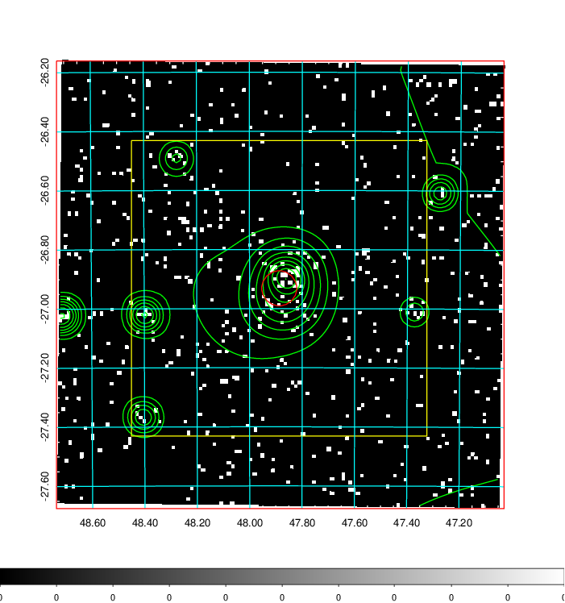  | 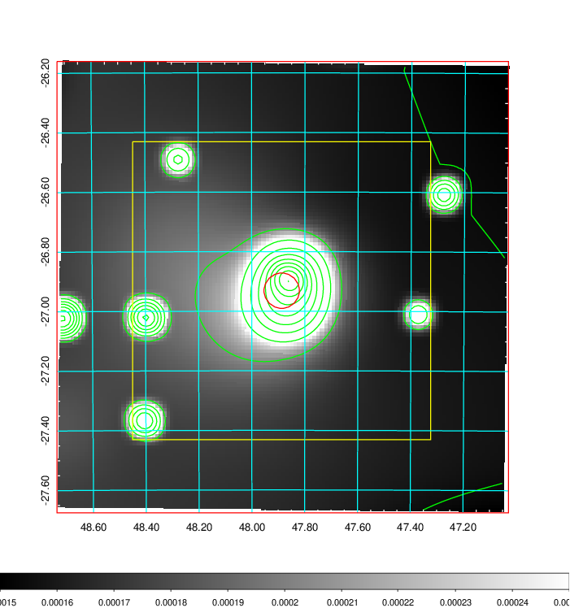   | 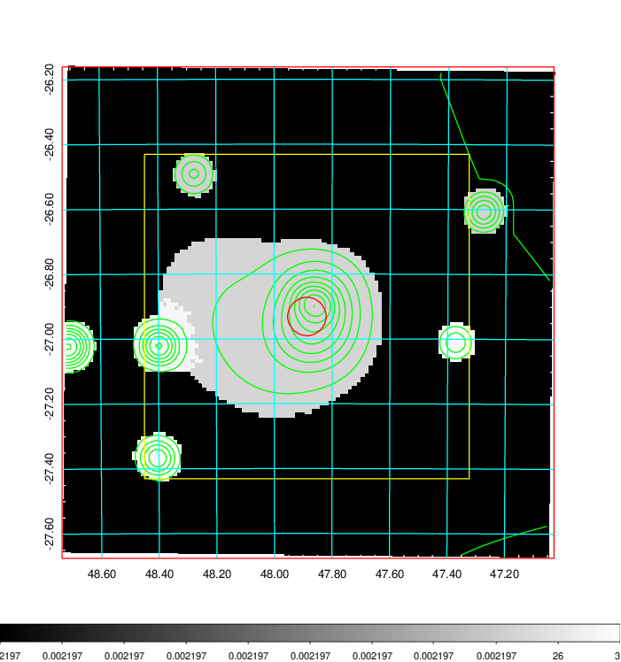  |

|[Exposure image](../image/130/130_mex.pdf)| [nH image](../image/130/130_nh.pdf)| [Planck image](../image/130/130_p.pdf)|
|-------------------|--------------------|-------------------|
|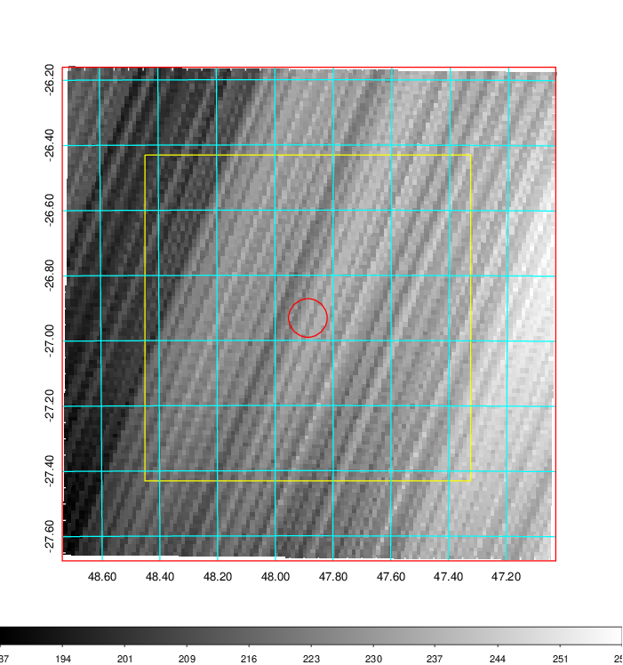   | 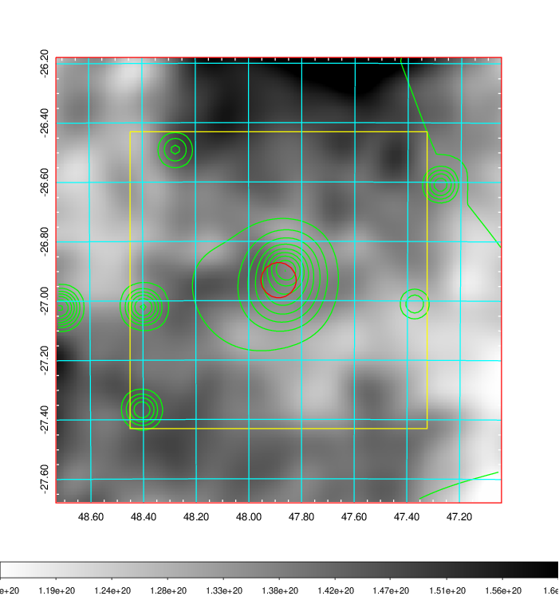    | 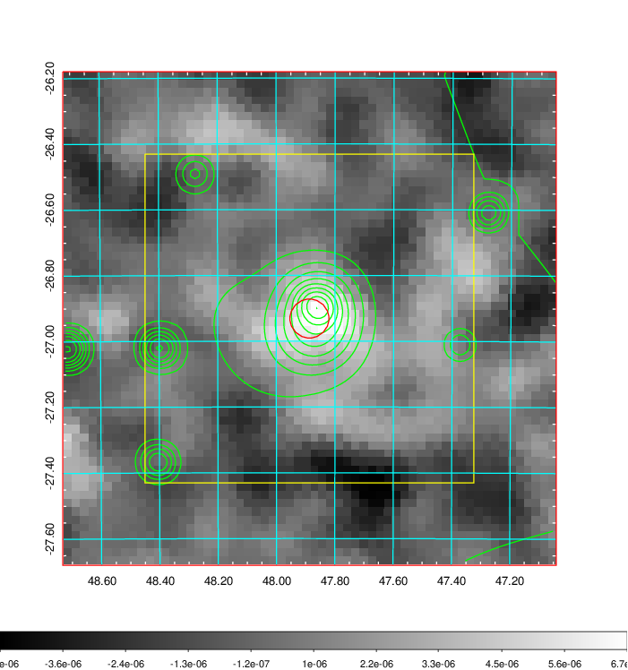 |

|[Redshift Histogram](../image/130/130_zg.pdf) | [DSS image(z1)](../image/130/130_dss_z1.pdf)      |  [DSS image(z2)](../image/130/130_dss_z2.pdf)    |
|-------------------|--------------------|-------------------|
|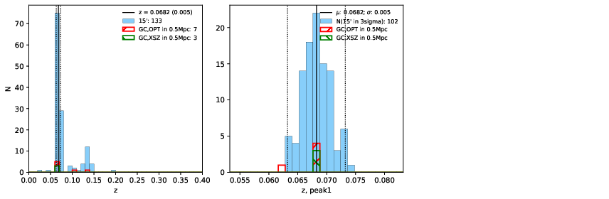 |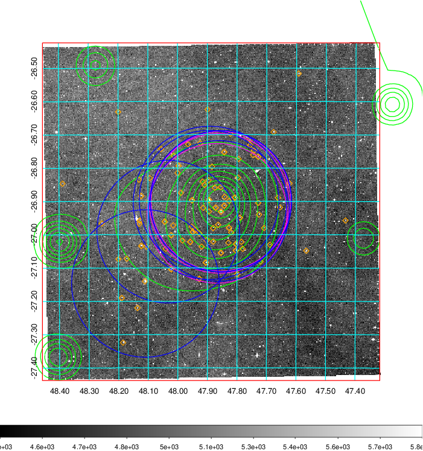  Blue circle for optical clusters;  Magenta circle for XSZ clusters;  all with r=1Mpc;  Only GC with Delta_z<0.01 are shown. | 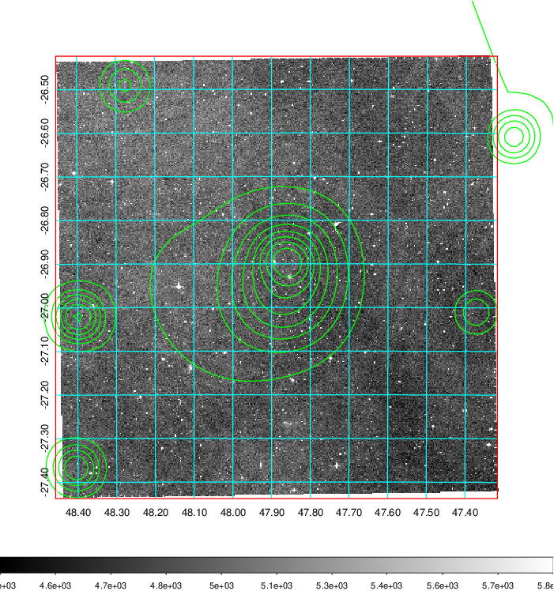 Blue circle for optical clusters;  Magenta circle for XSZ clusters;  all with r=1Mpc;  Only GC with Delta_z<0.01 are shown.  |

|[Previous-identified clusters](../image/130/130_gc.pdf) | [2MASS image](../image/130/130_2mass.pdf)      |
|-------------------|-------------------|
|  Green, magenta, and blue circles  for optical, X-ray and SZ clusters  respectively, with redshift of clusters  labelled. The radius of circles  are 1Mpc.|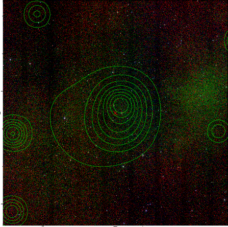  |

|[DES image](../image/130/130_des.pdf)   |[ATLAS image](../image/130/130_s.pdf)        |
|-------------------|-------------------|
| 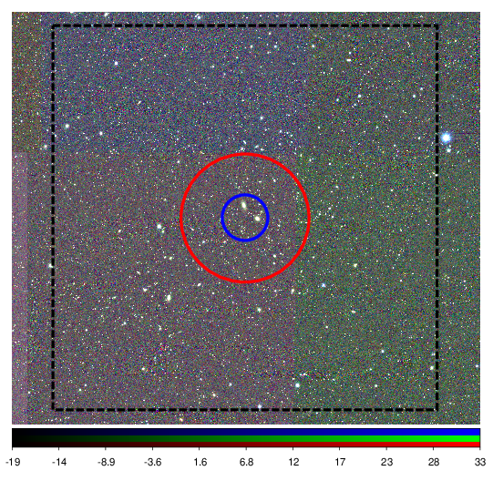  | 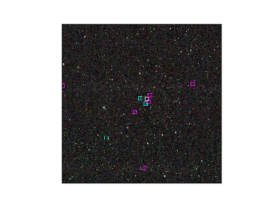  |
