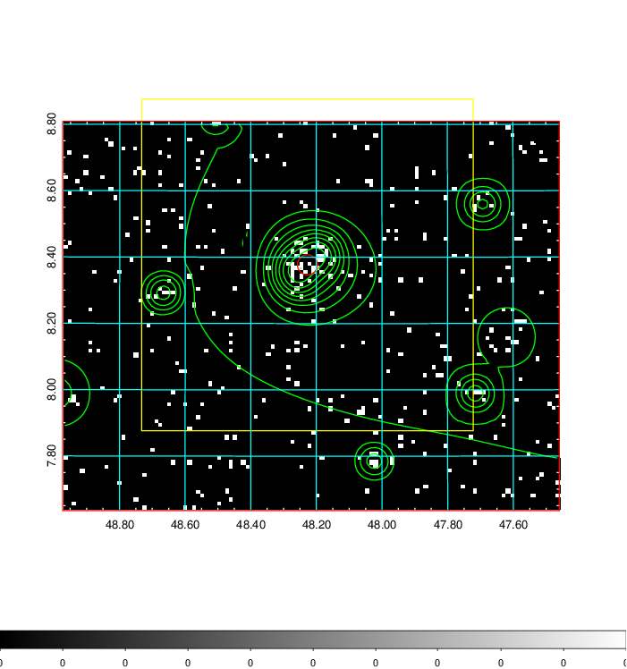
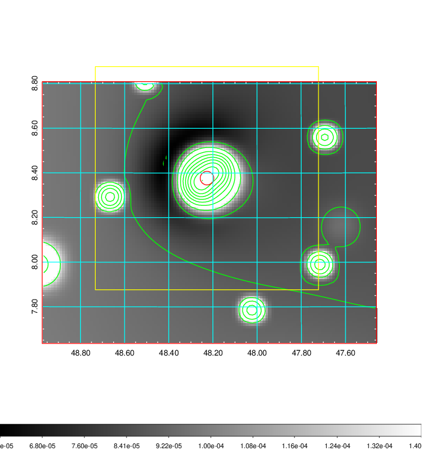
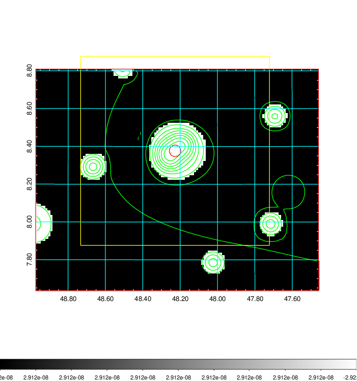
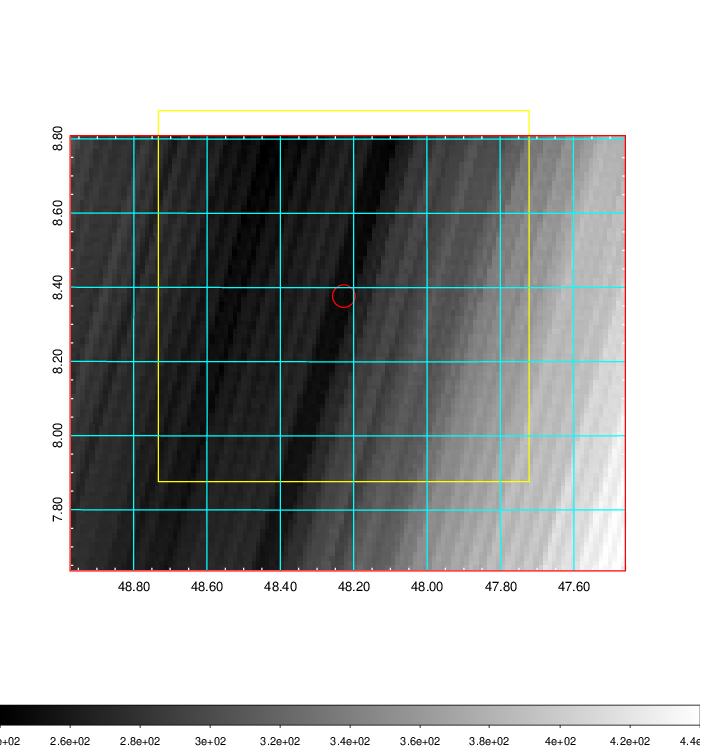
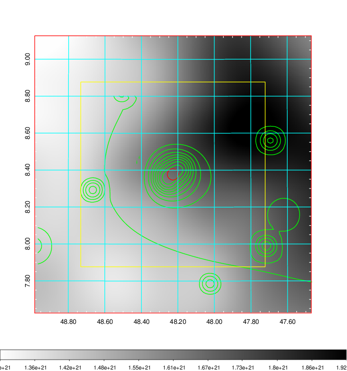
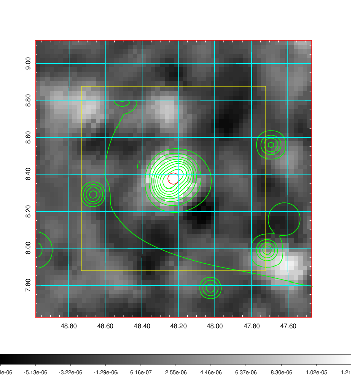
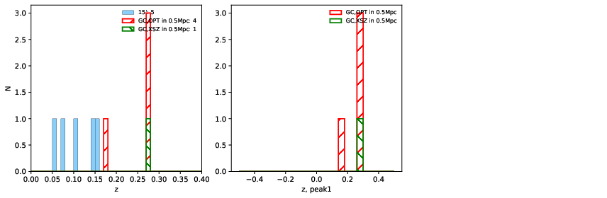
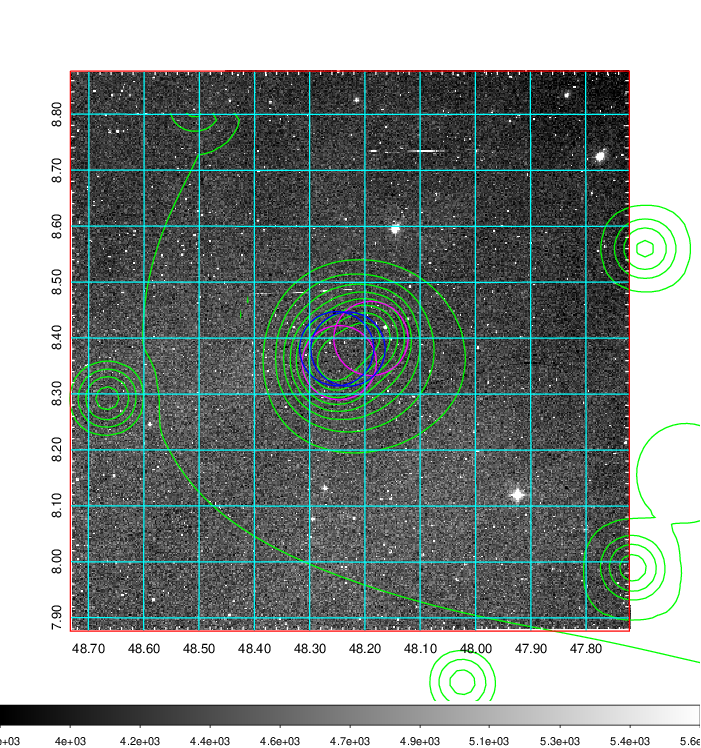
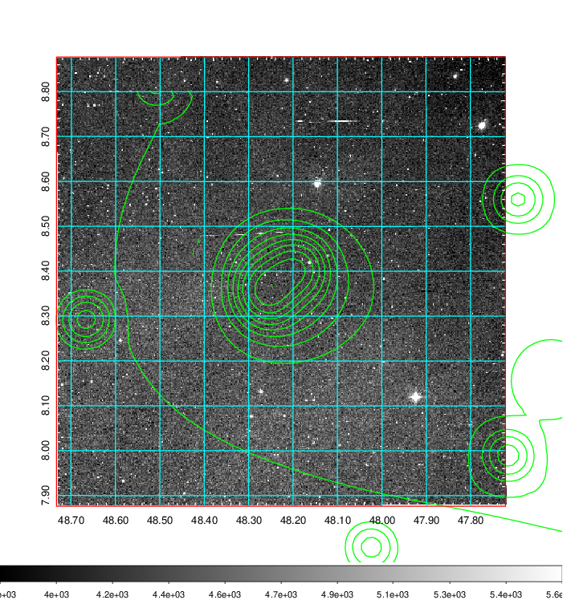
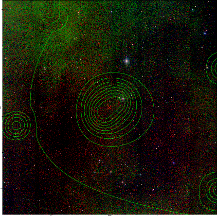

### 131

|Name|RAJ2000[deg]|DEJ2000[deg] |Ext[arcmin]| Ext,ml | z | z_src| C|GC(XSZ,Delta_z<0.01)| GC(OPT,Delta_z<0.01)|GC| R_sig[arcmin] | R500[arcmin] | R500[Mpc]| CRsig[c/s] | CR500[c/s] |L500[1E44 erg/s]|F500[1E-12 erg/s/cm^2]| M500[1E14 Msun]|Tx[keV]|Cnt_sig|Beta|Rc[arcmin]|Comment|Alias|
|---|---|---|---|---|---|------|---|--------|---------|----------|---|---|---|---|---|---|---|---|---|---|---|---|---|---|
|131| 48.227| 8.377| 1.83| 31.49| 0.2700(0.000)| z_xsz| B| PSZ2| N| N, PSZ2, Tar| 4.412| 4.959| 1.230| 0.123(0.033)| 0.126(0.034)| 4.978(0.298)| 2.198(0.132)| 6.97(0.19)| 7.76(0.14)| 34.8| 0.940(-0.076+0.043)| 3.987(-0.456+0.423)| -| k177|

|[RASS image](../image/131/131_img.pdf)|[filtered image](../image/131/131_fil.pdf)|[Segment image](../image/131/131_seg.pdf)|
|-------------------|--------------------|-------------------|
|   |    |   |

|[Exposure image](../image/131/131_mex.pdf)| [nH image](../image/131/131_nh.pdf)| [Planck image](../image/131/131_p.pdf)|
|-------------------|--------------------|-------------------|
|   |     |  |

|[Redshift Histogram](../image/131/131_zg.pdf) | [DSS image(z1)](../image/131/131_dss_z1.pdf)      |  [DSS image(z2)](../image/131/131_dss_z2.pdf)    |
|-------------------|--------------------|-------------------|
| |  Blue circle for optical clusters;  Magenta circle for XSZ clusters;  all with r=1Mpc;  Only GC with Delta_z<0.01 are shown. |  Blue circle for optical clusters;  Magenta circle for XSZ clusters;  all with r=1Mpc;  Only GC with Delta_z<0.01 are shown.  |

|[known Abell/XSZ clusters](../image/131/131_gc.pdf) | [2MASS image](../image/131/131_2mass.pdf)      |
|-------------------|-------------------|
|  Magenta, blue and green circles  for optical, X-ray and SZ clusters  respectively, with redshift of clusters  labelled. The radius of circles  are 1Mpc.|  |

|[PS1 image](../image/131/131_ps1.pdf)            |
|-------------------|
|   |
