

### 135

|Name|RAJ2000[deg]|DEJ2000[deg] |Ext[arcmin]| Ext,ml | z | z_src| C|GC(XSZ,Delta_z<0.01)| GC(OPT,Delta_z<0.01)|GC| R_sig[arcmin] | R500[arcmin] | R500[Mpc]| CRsig[c/s] | CR500[c/s] |L500[1E44 erg/s]|F500[1E-12 erg/s/cm^2]| M500[1E14 Msun]|Tx[keV]|Cnt_sig|Beta|Rc[arcmin]|Comment|Alias|
|---|---|---|---|---|---|------|---|--------|---------|----------|---|---|---|---|---|---|---|---|---|---|---|---|---|---|
|135| 49.487| -45.750| 3.78| 37.13| 0.0751(0.006)| z1, z_opt| S| -| A, W| A, N, W| 39.610| 8.732| 0.747| 0.166(0.085)| 0.147(0.076)| 0.378(0.156)| 2.737(1.132)| 1.27(0.27)| 2.54(0.34)| 116.2| 0.912(-0.104+0.064)| 6.219(-0.894+0.703)| -| t182|

|[RASS image](../image/135/135_img.pdf)|[filtered image](../image/135/135_fil.pdf)|[Segment image](../image/135/135_seg.pdf)|
|-------------------|--------------------|-------------------|
| 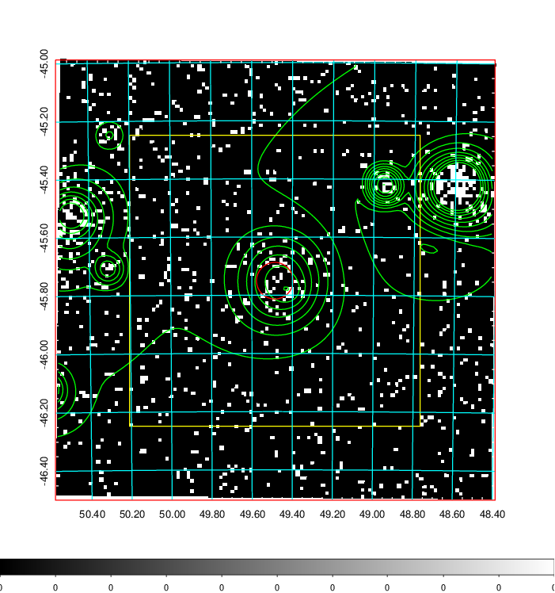  | 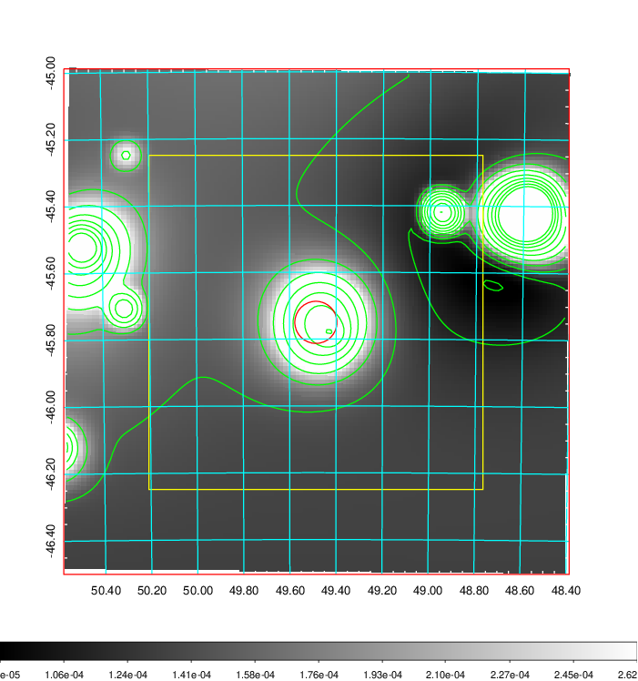   | 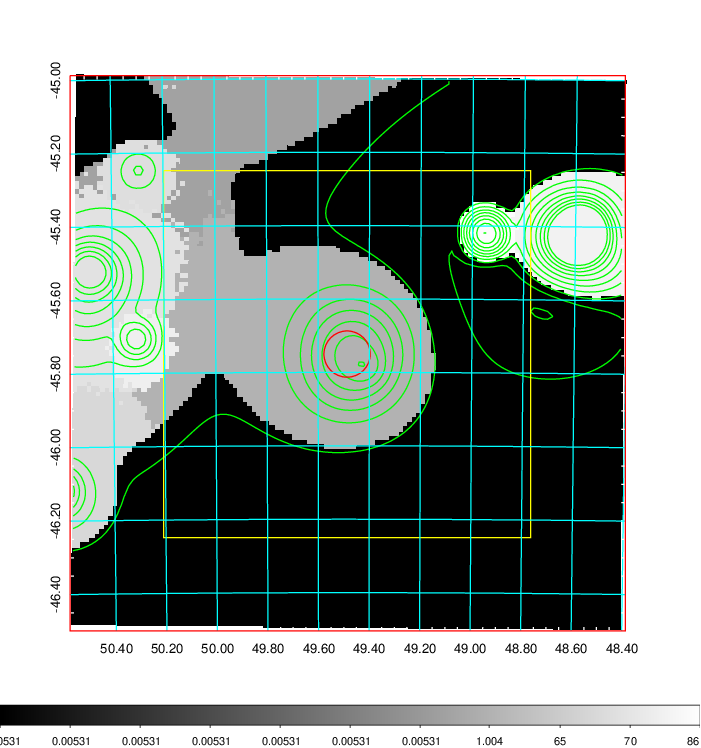  |

|[Exposure image](../image/135/135_mex.pdf)| [nH image](../image/135/135_nh.pdf)| [Planck image](../image/135/135_p.pdf)|
|-------------------|--------------------|-------------------|
|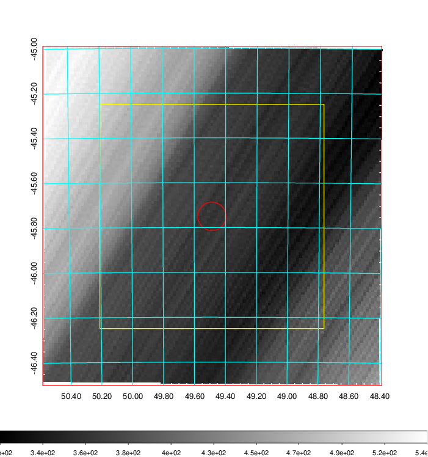   | 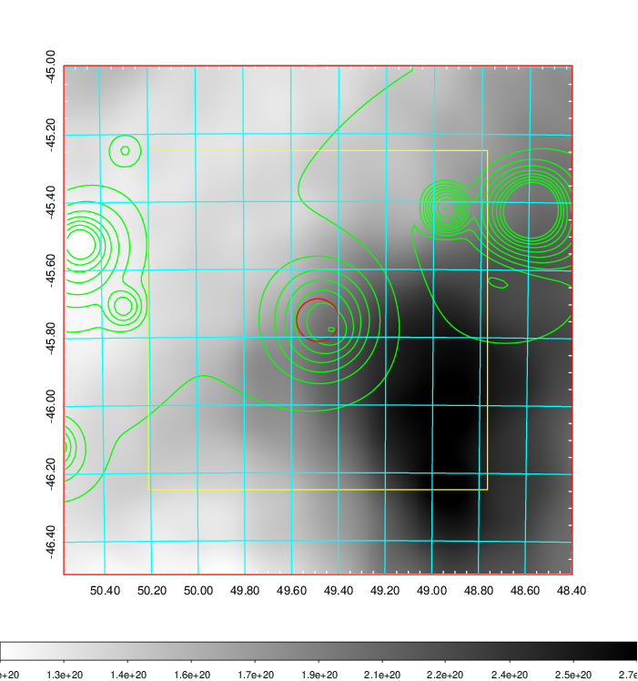    | 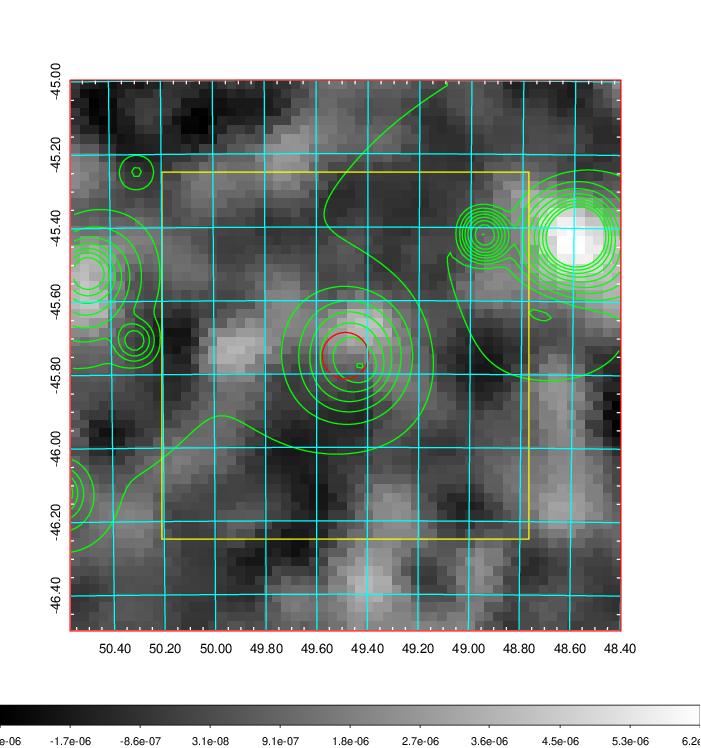 |

|[Redshift Histogram](../image/135/135_zg.pdf) | [DSS image(z1)](../image/135/135_dss_z1.pdf)      |  [DSS image(z2)](../image/135/135_dss_z2.pdf)    |
|-------------------|--------------------|-------------------|
|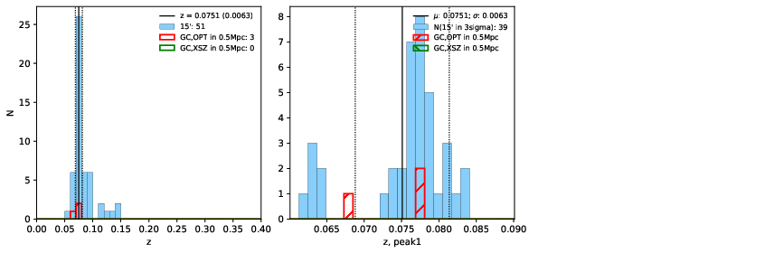 |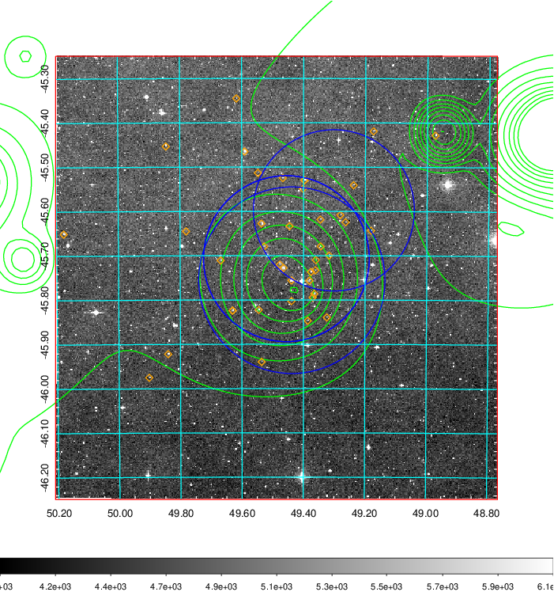  Blue circle for optical clusters;  Magenta circle for XSZ clusters;  all with r=1Mpc;  Only GC with Delta_z<0.01 are shown. | 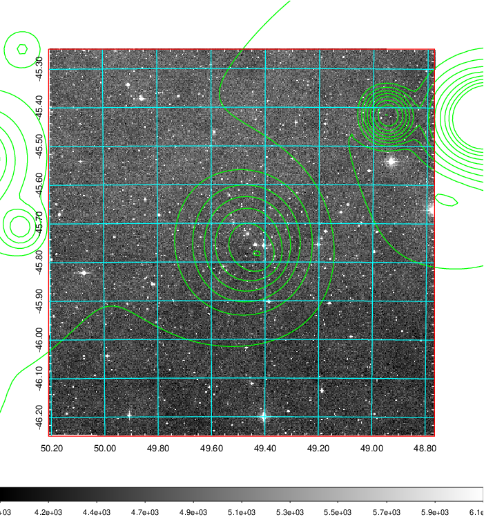 Blue circle for optical clusters;  Magenta circle for XSZ clusters;  all with r=1Mpc;  Only GC with Delta_z<0.01 are shown.  |

|[Previous-identified clusters](../image/135/135_gc.pdf) | [2MASS image](../image/135/135_2mass.pdf)      |
|-------------------|-------------------|
|  Green, magenta, and blue circles  for optical, X-ray and SZ clusters  respectively, with redshift of clusters  labelled. The radius of circles  are 1Mpc.|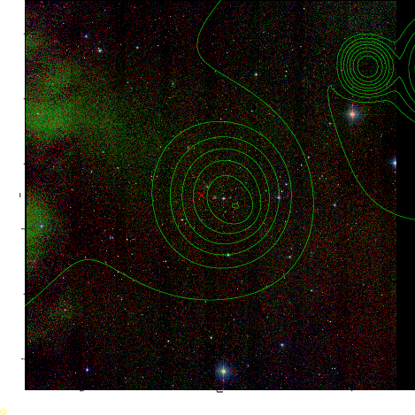  |

|[DES image](../image/135/135_des.pdf)   |
|-------------------|
| 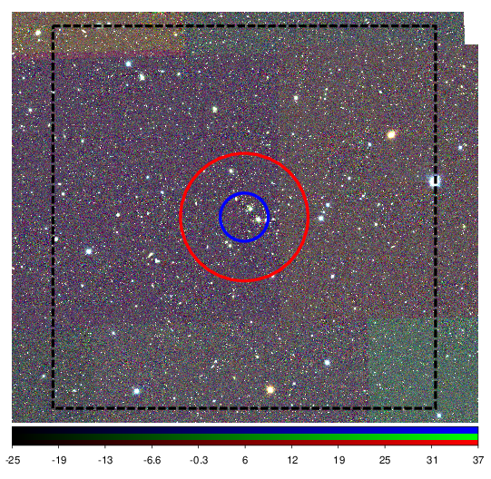  |
