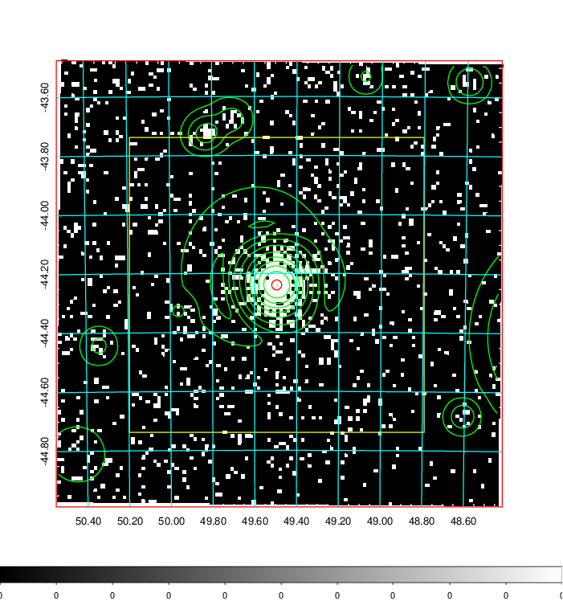
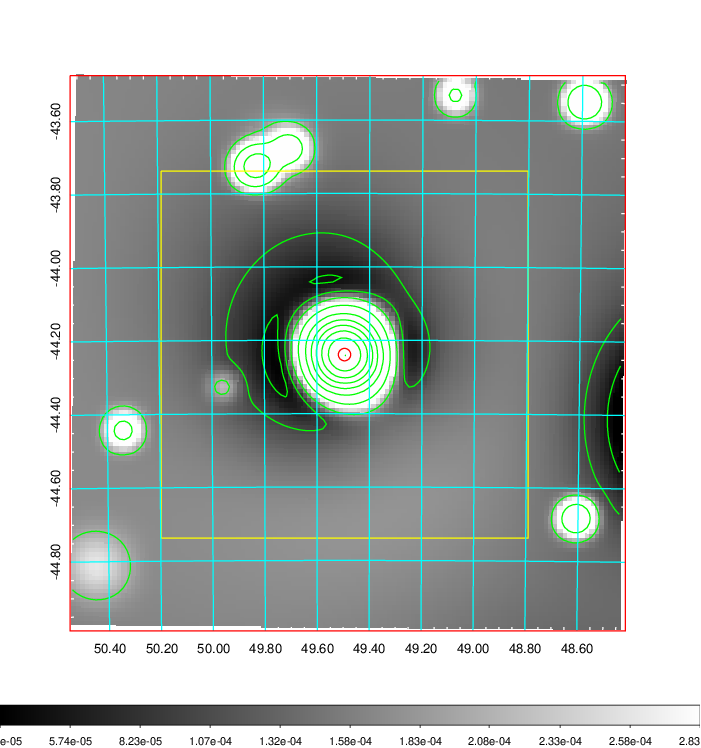
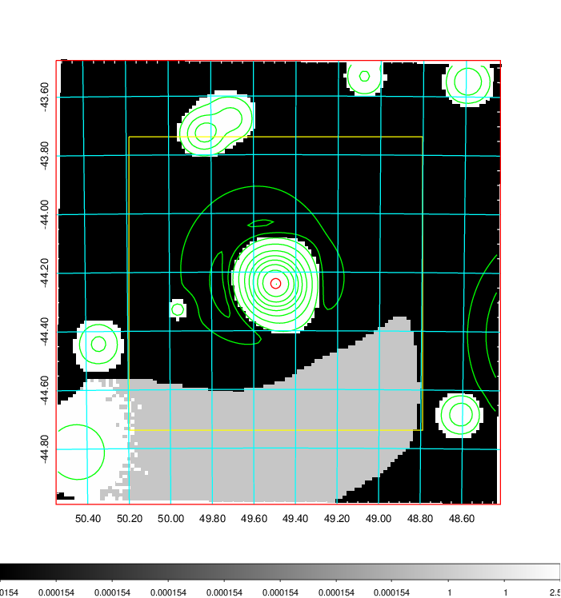
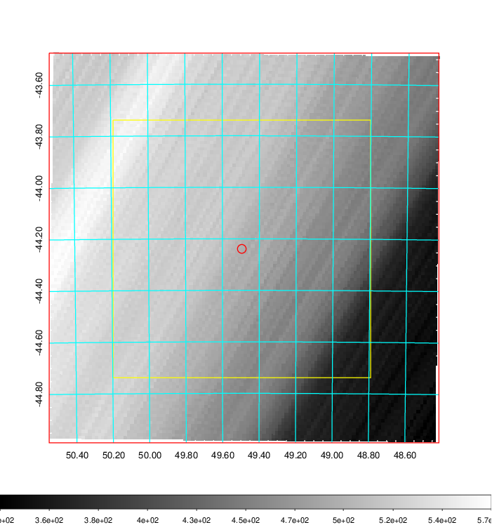
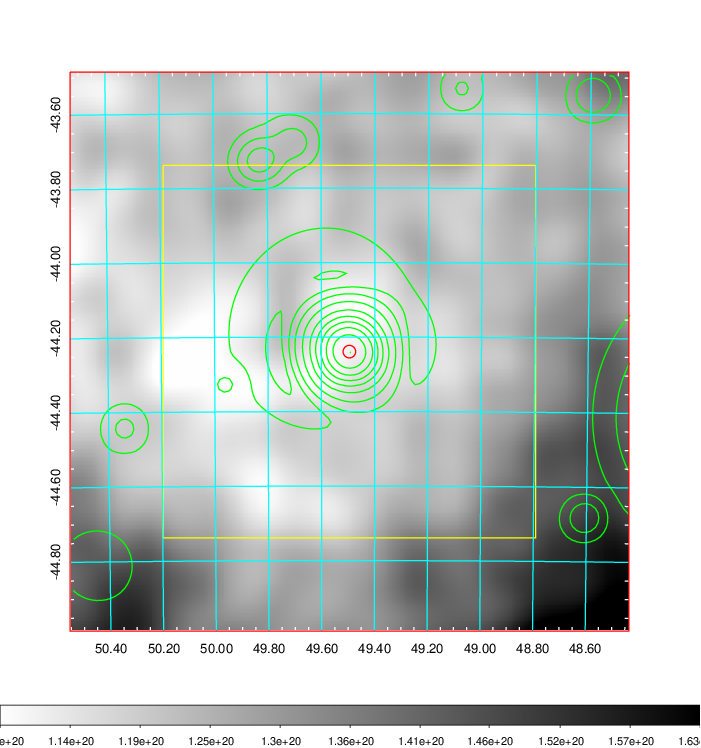
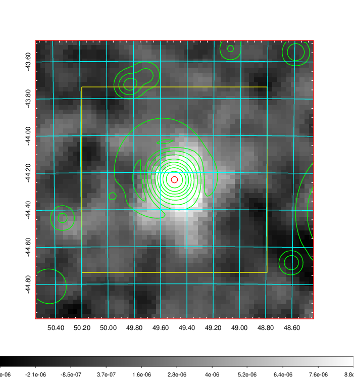
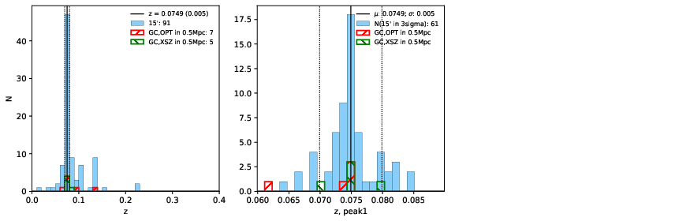
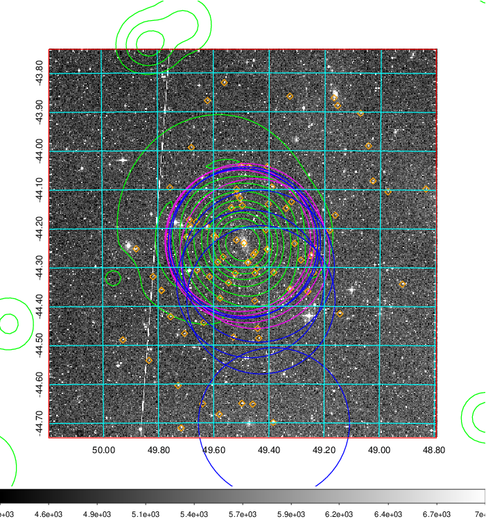
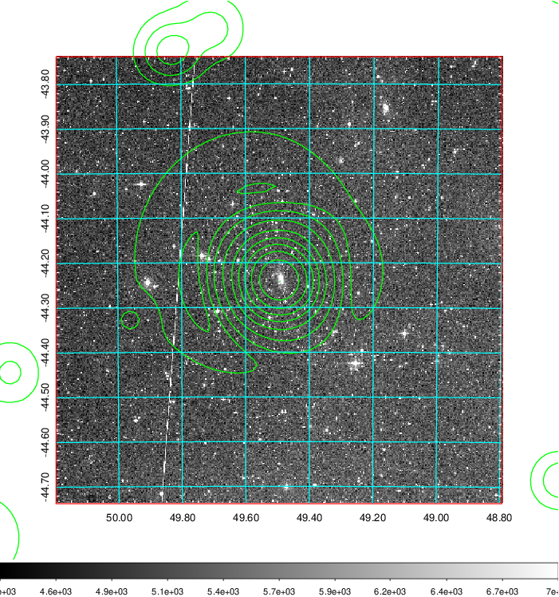
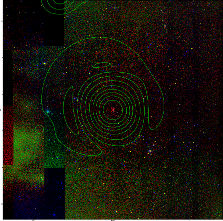

### 136

|Name|RAJ2000[deg]|DEJ2000[deg] |Ext[arcmin]| Ext,ml | z | z_src| C|GC(XSZ,Delta_z<0.01)| GC(OPT,Delta_z<0.01)|GC| R_sig[arcmin] | R500[arcmin] | R500[Mpc]| CRsig[c/s] | CR500[c/s] |L500[1E44 erg/s]|F500[1E-12 erg/s/cm^2]| M500[1E14 Msun]|Tx[keV]|Cnt_sig|Beta|Rc[arcmin]|Comment|Alias|
|---|---|---|---|---|---|------|---|--------|---------|----------|---|---|---|---|---|---|---|---|---|---|---|---|---|---|
|136| 49.495| -44.239| 1.02| 305.17| 0.0749(0.005)| z1, z_xsz| B| MCXC, PSZ2, Tar, XB| A, N| A, MCXC, N, PSZ2, Tar, W, XB| 11.725| 14.027| 1.197| 1.381(0.058)| 1.428(0.060)| 3.981(0.076)| 28.966(0.551)| 5.24(0.05)| 6.09(0.04)| 714.4| 0.682(-0.037+0.044)| 1.693(-0.245+0.271)| -| k033|

|[RASS image](../image/136/136_img.pdf)|[filtered image](../image/136/136_fil.pdf)|[Segment image](../image/136/136_seg.pdf)|
|-------------------|--------------------|-------------------|
|   |    |   |

|[Exposure image](../image/136/136_mex.pdf)| [nH image](../image/136/136_nh.pdf)| [Planck image](../image/136/136_p.pdf)|
|-------------------|--------------------|-------------------|
|   |     |  |

|[Redshift Histogram](../image/136/136_zg.pdf) | [DSS image(z1)](../image/136/136_dss_z1.pdf)      |  [DSS image(z2)](../image/136/136_dss_z2.pdf)    |
|-------------------|--------------------|-------------------|
| |  Blue circle for optical clusters;  Magenta circle for XSZ clusters;  all with r=1Mpc;  Only GC with Delta_z<0.01 are shown. |  Blue circle for optical clusters;  Magenta circle for XSZ clusters;  all with r=1Mpc;  Only GC with Delta_z<0.01 are shown.  |

|[known Abell/XSZ clusters](../image/136/136_gc.pdf) | [2MASS image](../image/136/136_2mass.pdf)      |
|-------------------|-------------------|
|  Magenta, blue and green circles  for optical, X-ray and SZ clusters  respectively, with redshift of clusters  labelled. The radius of circles  are 1Mpc.|  |

|[DES image](../image/136/136_des.pdf)   |
|-------------------|
|   |
