

### 138

|Name|RAJ2000[deg]|DEJ2000[deg] |Ext[arcmin]| Ext,ml | z | z_src| C|GC(XSZ,Delta_z<0.01)| GC(OPT,Delta_z<0.01)|GC| R_sig[arcmin] | R500[arcmin] | R500[Mpc]| CRsig[c/s] | CR500[c/s] |L500[1E44 erg/s]|F500[1E-12 erg/s/cm^2]| M500[1E14 Msun]|Tx[keV]|Cnt_sig|Beta|Rc[arcmin]|Comment|Alias|
|---|---|---|---|---|---|------|---|--------|---------|----------|---|---|---|---|---|---|---|---|---|---|---|---|---|---|
|138| 50.545| -53.175| 1.75| 60.02| 0.0741(0.008)| z1, z_xsz| B| MCXC| N, W| MCXC, N, W| 7.825| 9.032| 0.763| 0.162(0.023)| 0.166(0.023)| 0.430(0.037)| 3.202(0.274)| 1.36(0.06)| 2.64(0.07)| 124.8| 0.956(-0.060+0.032)| 4.923(-0.374+0.301)| -| k165|

|[RASS image](../image/138/138_img.pdf)|[filtered image](../image/138/138_fil.pdf)|[Segment image](../image/138/138_seg.pdf)|
|-------------------|--------------------|-------------------|
| 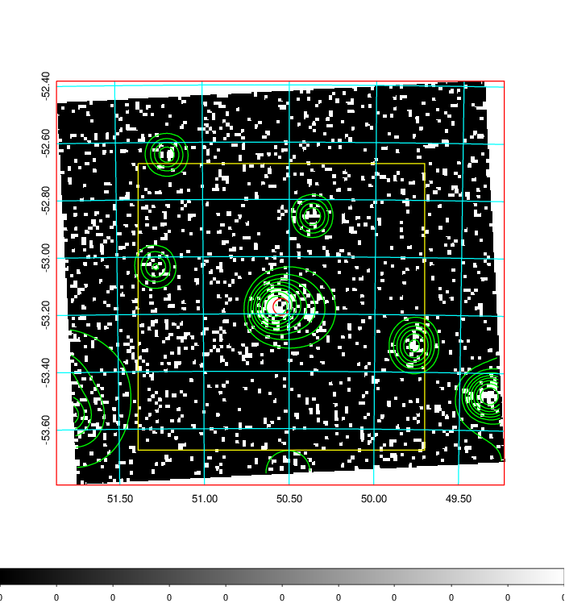  | 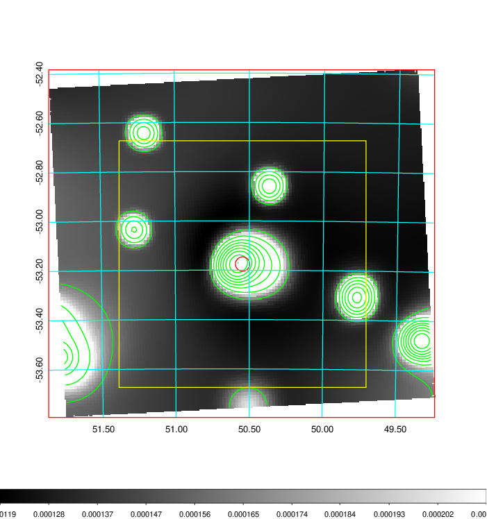   | 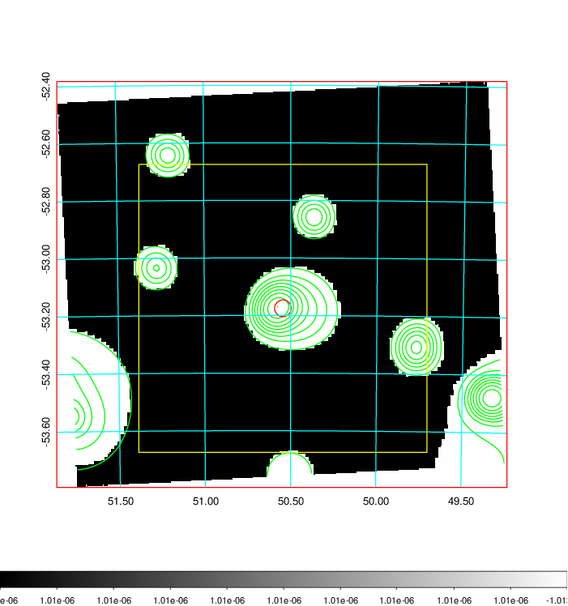  |

|[Exposure image](../image/138/138_mex.pdf)| [nH image](../image/138/138_nh.pdf)| [Planck image](../image/138/138_p.pdf)|
|-------------------|--------------------|-------------------|
|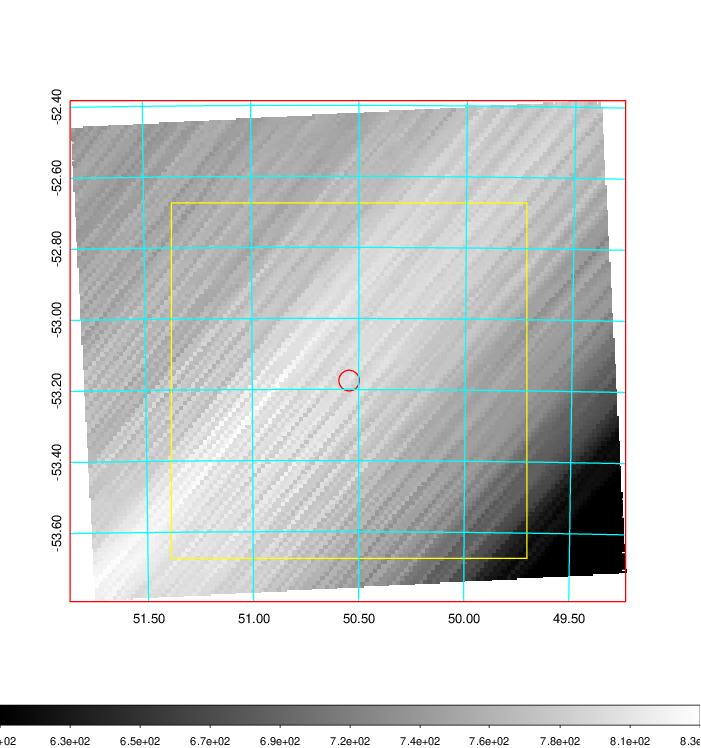   | 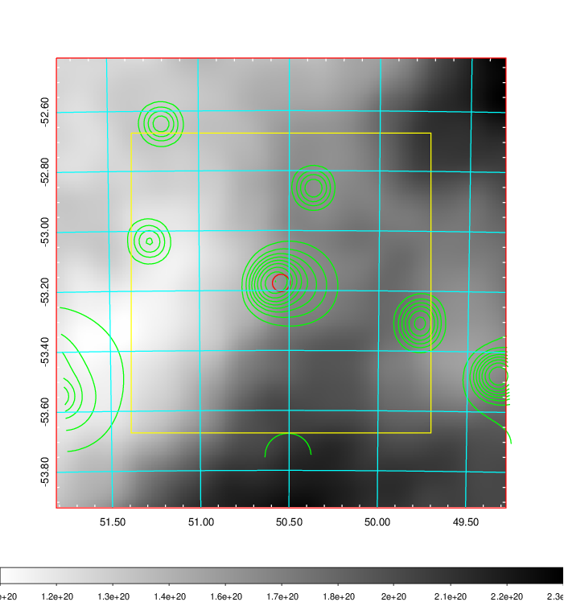    | 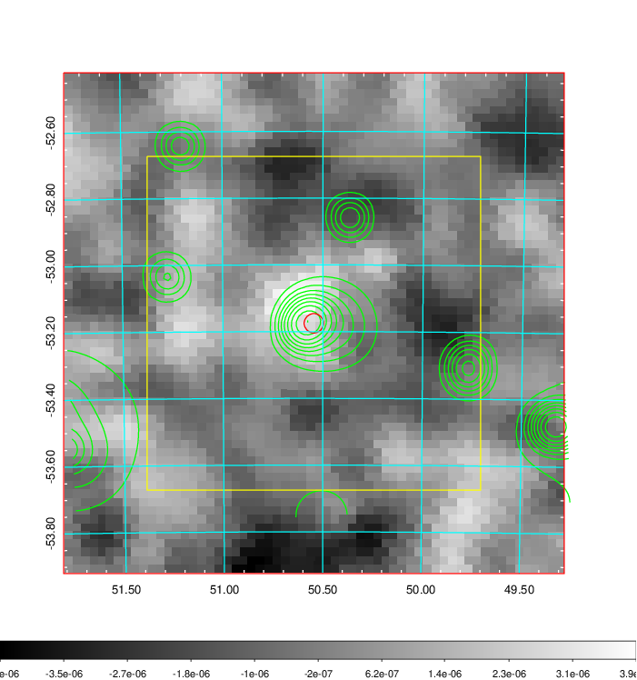 |

|[Redshift Histogram](../image/138/138_zg.pdf) | [DSS image(z1)](../image/138/138_dss_z1.pdf)      |  [DSS image(z2)](../image/138/138_dss_z2.pdf)    |
|-------------------|--------------------|-------------------|
|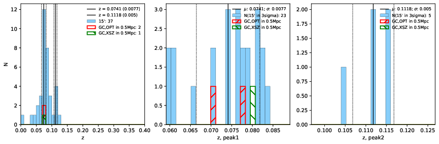 |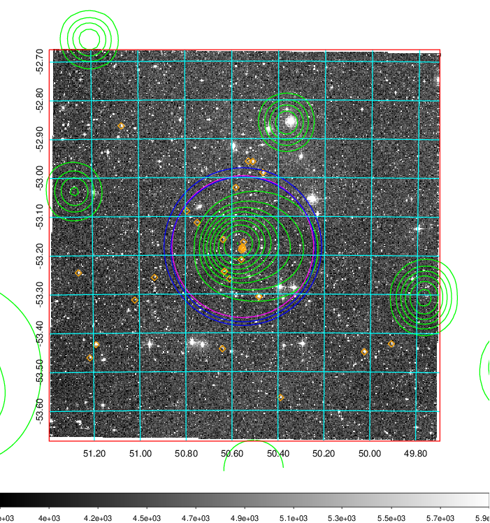  Blue circle for optical clusters;  Magenta circle for XSZ clusters;  all with r=1Mpc;  Only GC with Delta_z<0.01 are shown. | 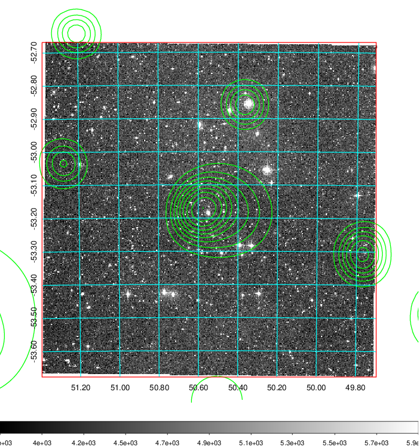 Blue circle for optical clusters;  Magenta circle for XSZ clusters;  all with r=1Mpc;  Only GC with Delta_z<0.01 are shown.  |

|[Previous-identified clusters](../image/138/138_gc.pdf) | [2MASS image](../image/138/138_2mass.pdf)      |
|-------------------|-------------------|
|  Green, magenta, and blue circles  for optical, X-ray and SZ clusters  respectively, with redshift of clusters  labelled. The radius of circles  are 1Mpc.|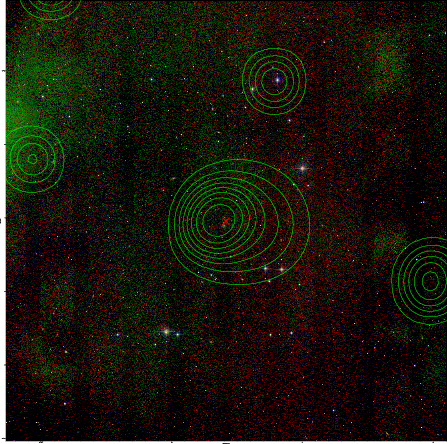  |

|[DES image](../image/138/138_des.pdf)   |
|-------------------|
| 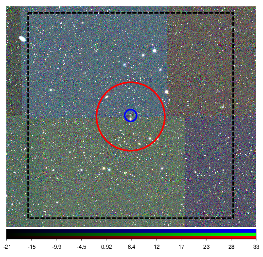  |
