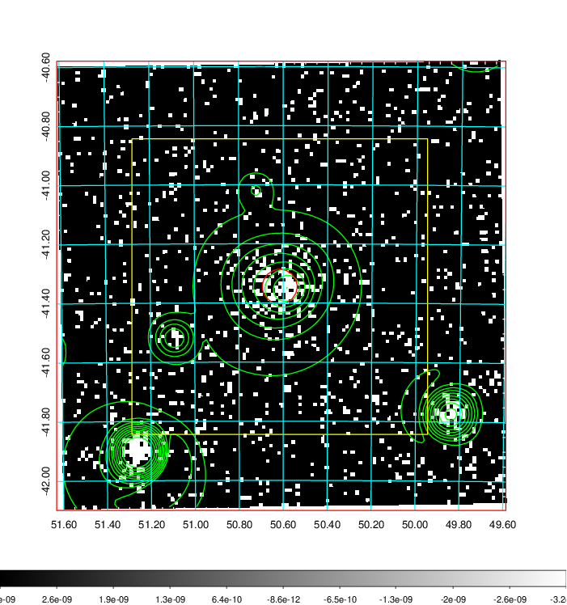
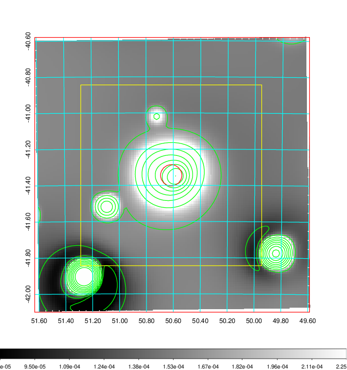
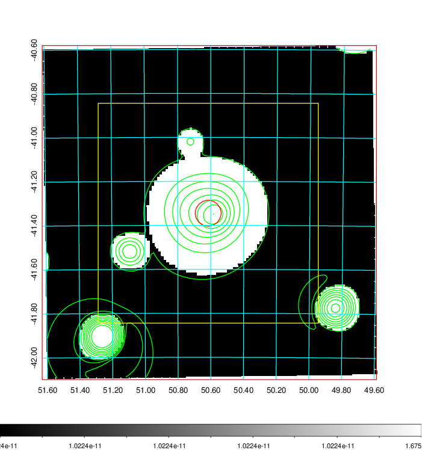
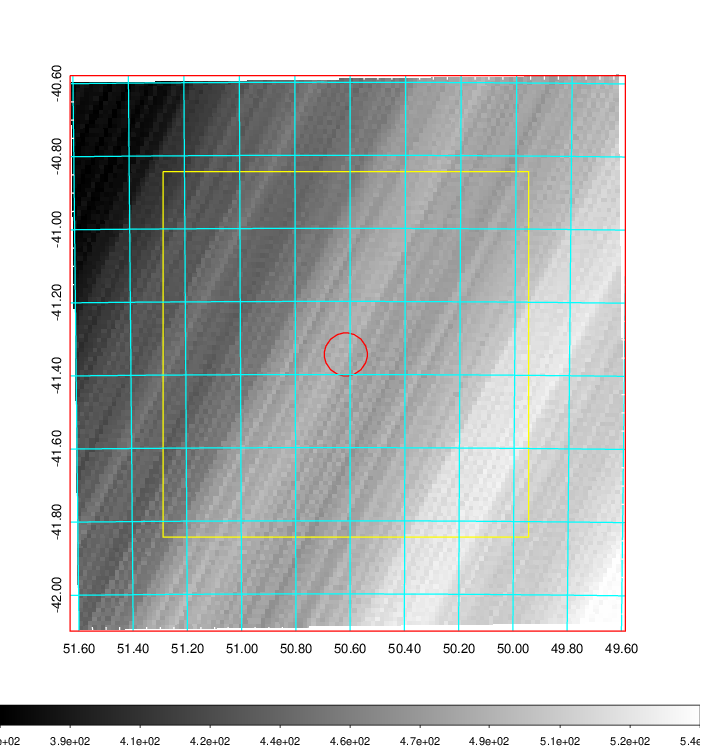
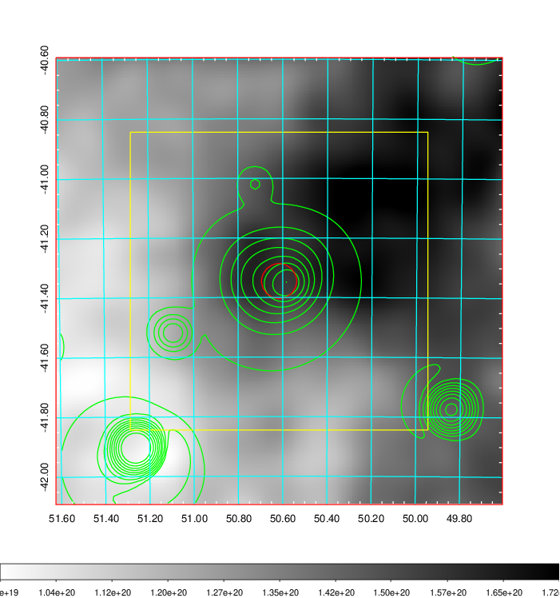
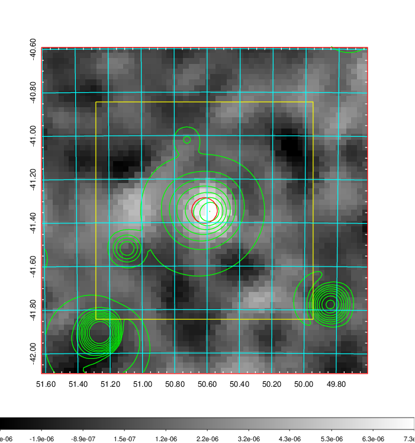
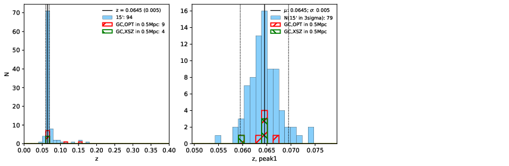
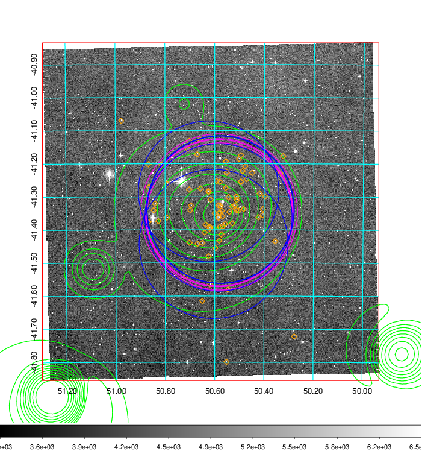
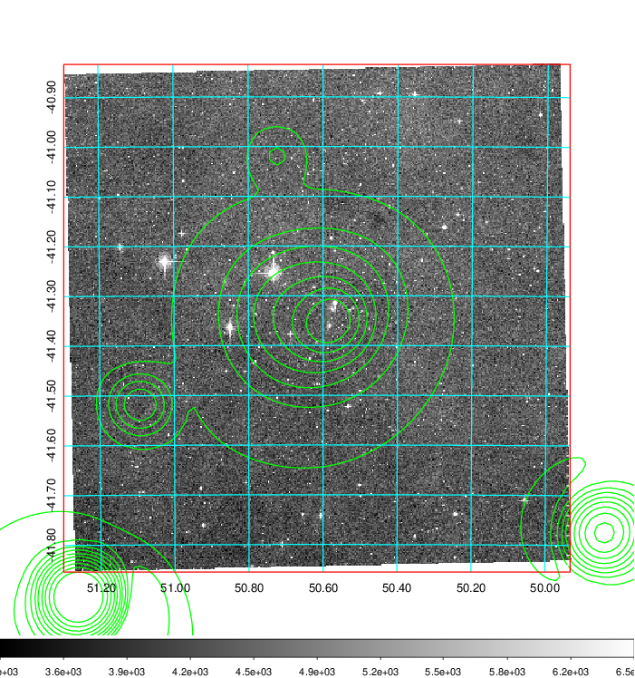
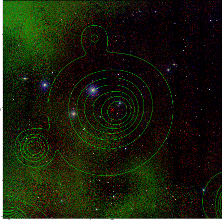

### 139

|Name|RAJ2000[deg]|DEJ2000[deg] |Ext[arcmin]| Ext,ml | z | z_src| C|GC(XSZ,Delta_z<0.01)| GC(OPT,Delta_z<0.01)|GC| R_sig[arcmin] | R500[arcmin] | R500[Mpc]| CRsig[c/s] | CR500[c/s] |L500[1E44 erg/s]|F500[1E-12 erg/s/cm^2]| M500[1E14 Msun]|Tx[keV]|Cnt_sig|Beta|Rc[arcmin]|Comment|Alias|
|---|---|---|---|---|---|------|---|--------|---------|----------|---|---|---|---|---|---|---|---|---|---|---|---|---|---|
|139| 50.616| -41.345| 3.54| 150.15| 0.0645(0.005)| z1, z_xsz| B| MCXC, PSZ2, Tar| A, N, W| A, MCXC, N, PSZ2, Tar, W| 9.288| 11.153| 0.830| 0.320(0.036)| 0.331(0.037)| 0.637(0.043)| 6.341(0.428)| 1.73(0.06)| 3.06(0.07)| 145.3| 0.950(-0.067+0.037)| 6.442(-0.514+0.388)| -| k437|

|[RASS image](../image/139/139_img.pdf)|[filtered image](../image/139/139_fil.pdf)|[Segment image](../image/139/139_seg.pdf)|
|-------------------|--------------------|-------------------|
|   |    |   |

|[Exposure image](../image/139/139_mex.pdf)| [nH image](../image/139/139_nh.pdf)| [Planck image](../image/139/139_p.pdf)|
|-------------------|--------------------|-------------------|
|   |     |  |

|[Redshift Histogram](../image/139/139_zg.pdf) | [DSS image(z1)](../image/139/139_dss_z1.pdf)      |  [DSS image(z2)](../image/139/139_dss_z2.pdf)    |
|-------------------|--------------------|-------------------|
| |  Blue circle for optical clusters;  Magenta circle for XSZ clusters;  all with r=1Mpc;  Only GC with Delta_z<0.01 are shown. |  Blue circle for optical clusters;  Magenta circle for XSZ clusters;  all with r=1Mpc;  Only GC with Delta_z<0.01 are shown.  |

|[known Abell/XSZ clusters](../image/139/139_gc.pdf) | [2MASS image](../image/139/139_2mass.pdf)      |
|-------------------|-------------------|
|  Magenta, blue and green circles  for optical, X-ray and SZ clusters  respectively, with redshift of clusters  labelled. The radius of circles  are 1Mpc.|  |

|[DES image](../image/139/139_des.pdf)   |
|-------------------|
|   |
