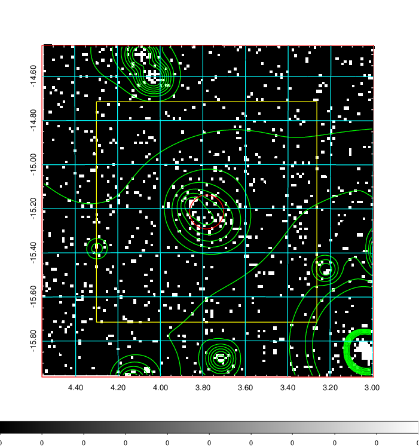
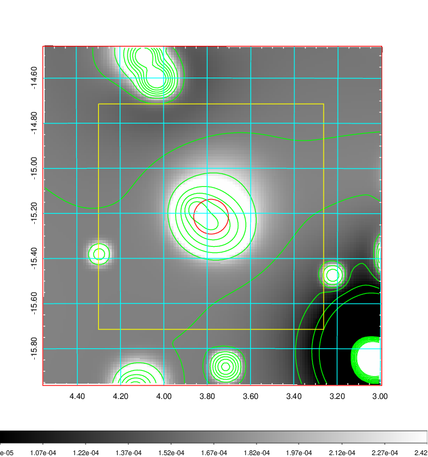
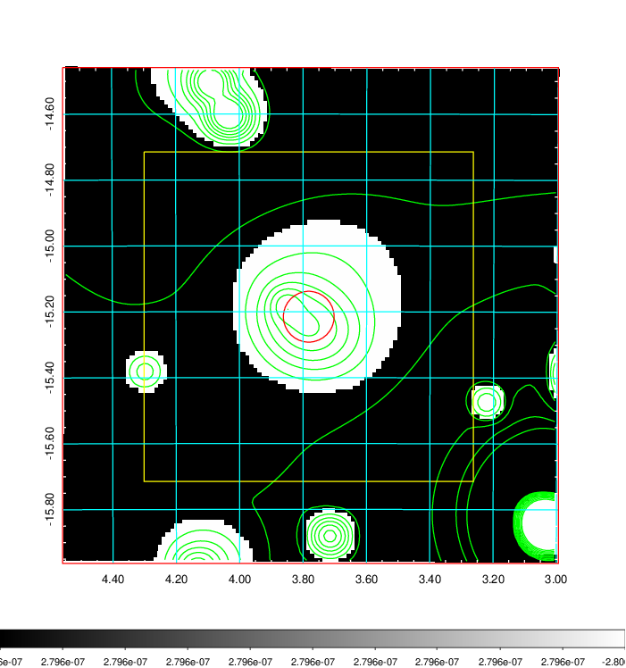
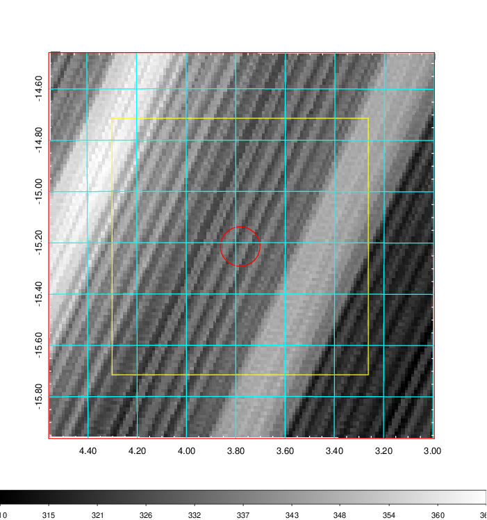
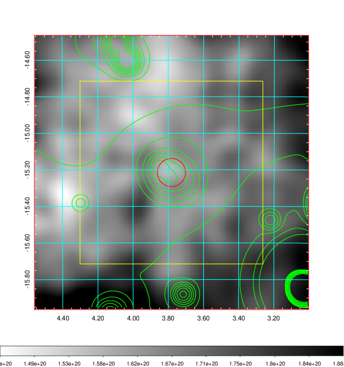
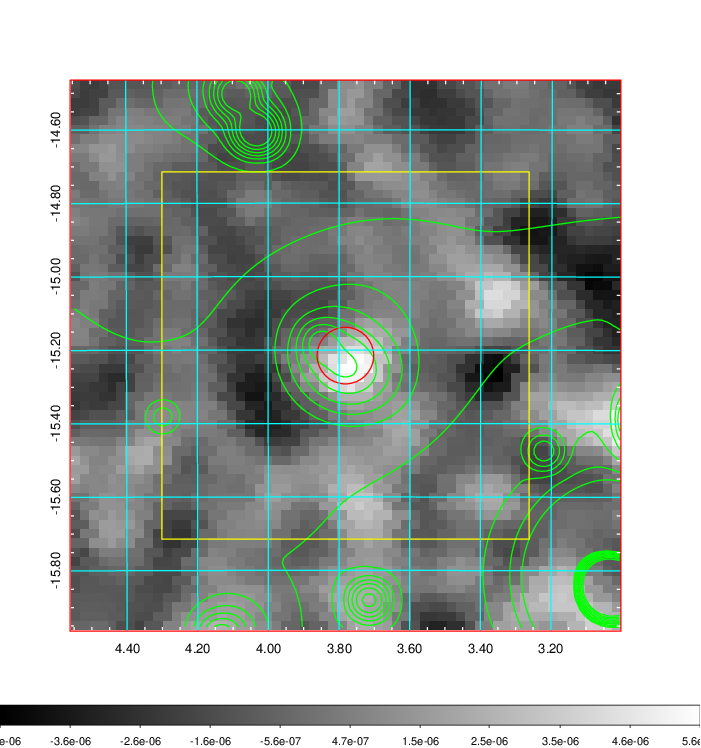
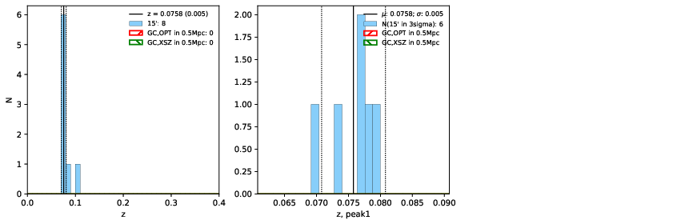
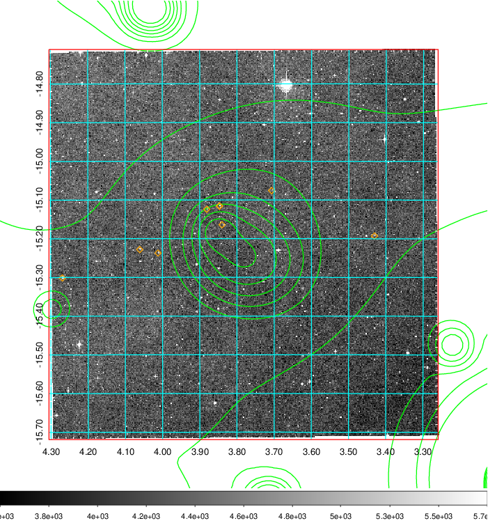
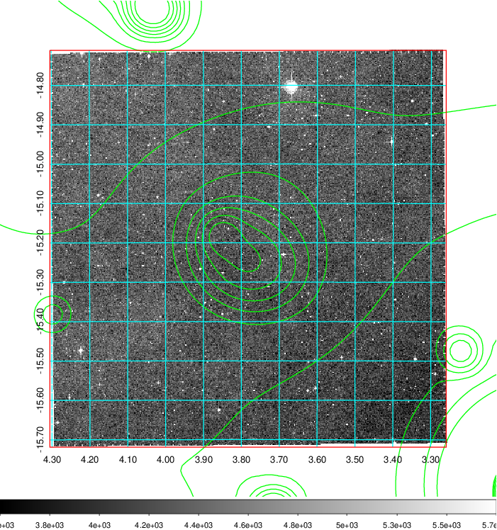
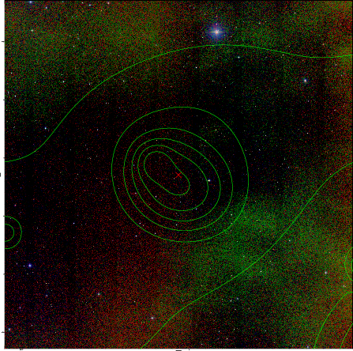

### 14

|Name|RAJ2000[deg]|DEJ2000[deg] |Ext[arcmin]| Ext,ml | z | z_src| C|GC(XSZ,Delta_z<0.01)| GC(OPT,Delta_z<0.01)|GC| R_sig[arcmin] | R500[arcmin] | R500[Mpc]| CRsig[c/s] | CR500[c/s] |L500[1E44 erg/s]|F500[1E-12 erg/s/cm^2]| M500[1E14 Msun]|Tx[keV]|Cnt_sig|Beta|Rc[arcmin]|Comment|Alias|
|---|---|---|---|---|---|------|---|--------|---------|----------|---|---|---|---|---|---|---|---|---|---|---|---|---|---|
|14| 3.782| -15.215| 4.62| 48.79| 0.0758(0.005)| z1,| G| -| -| Tar, W| 9.775| 8.788| 0.758| 0.159(0.038)| 0.156(0.038)| 0.419(0.069)| 2.970(0.488)| 1.33(0.11)| 2.62(0.14)| 52.8| 0.913(-0.110+0.063)| 8.758(-1.060+0.919)| An SZ cluster with no $z$ and offset = 0.28 Mpc| t235|

|[RASS image](../image/14/14_img.pdf)|[filtered image](../image/14/14_fil.pdf)|[Segment image](../image/14/14_seg.pdf)|
|-------------------|--------------------|-------------------|
|   |    |   |

|[Exposure image](../image/14/14_mex.pdf)| [nH image](../image/14/14_nh.pdf)| [Planck image](../image/14/14_p.pdf)|
|-------------------|--------------------|-------------------|
|   |     |  |

|[Redshift Histogram](../image/14/14_zg.pdf) | [DSS image(z1)](../image/14/14_dss_z1.pdf)      |  [DSS image(z2)](../image/14/14_dss_z2.pdf)    |
|-------------------|--------------------|-------------------|
| |  Blue circle for optical clusters;  Magenta circle for XSZ clusters;  all with r=1Mpc;  Only GC with Delta_z<0.01 are shown. |  Blue circle for optical clusters;  Magenta circle for XSZ clusters;  all with r=1Mpc;  Only GC with Delta_z<0.01 are shown.  |

|[known Abell/XSZ clusters](../image/14/14_gc.pdf) | [2MASS image](../image/14/14_2mass.pdf)      |
|-------------------|-------------------|
|  Magenta, blue and green circles  for optical, X-ray and SZ clusters  respectively, with redshift of clusters  labelled. The radius of circles  are 1Mpc.|  |

|[ATLAS image](../image/14/14_s.pdf)        |
|-------------------|
|   |
