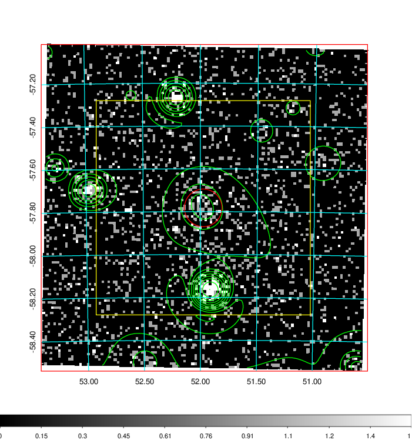
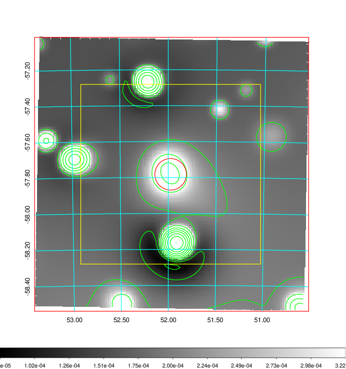
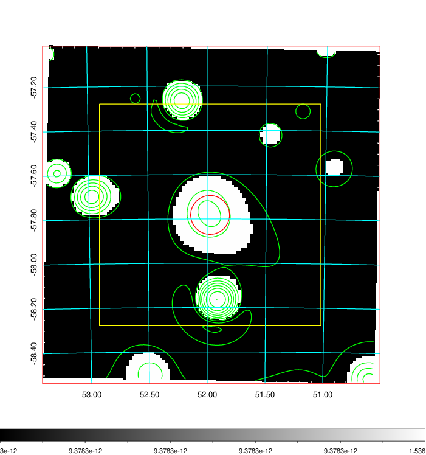
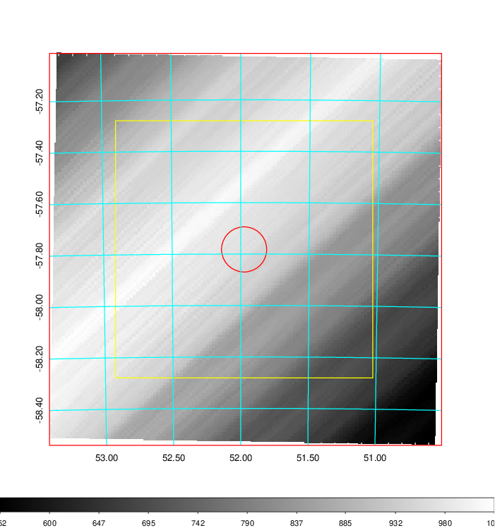
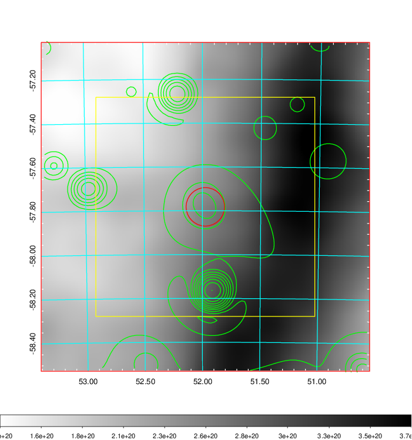
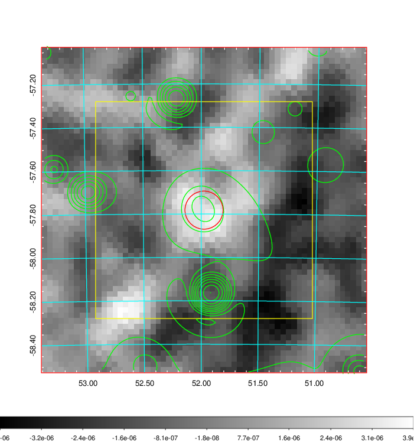
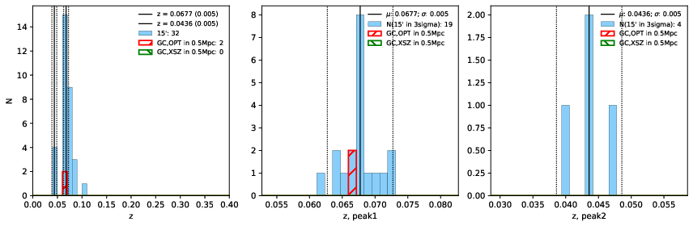
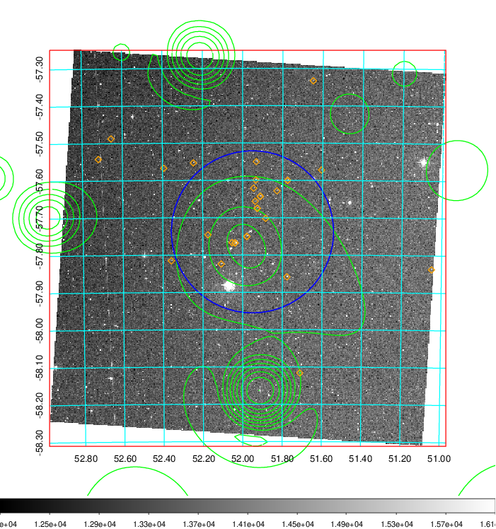
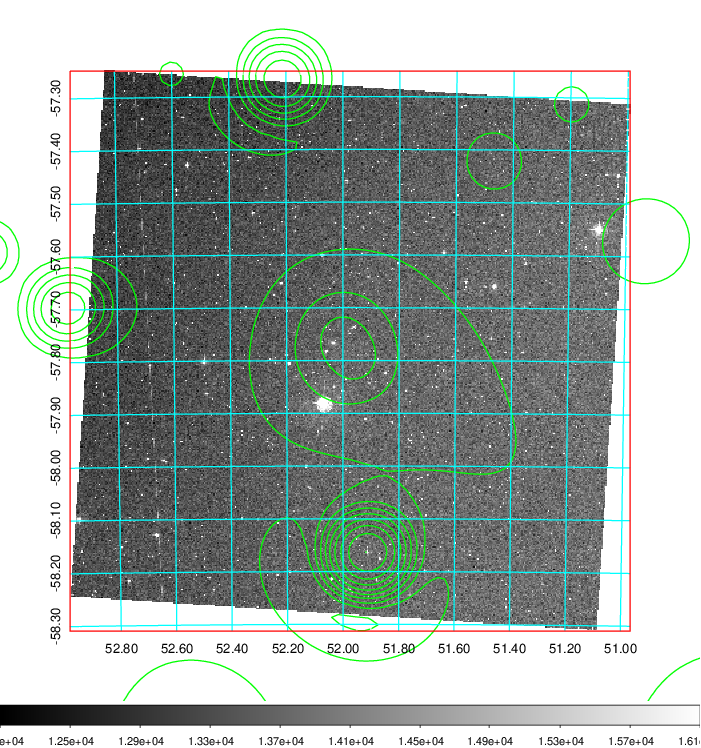
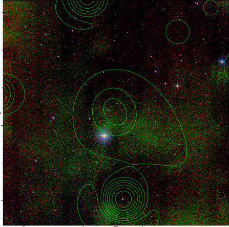

### 140

|Name|RAJ2000[deg]|DEJ2000[deg] |Ext[arcmin]| Ext,ml | z | z_src| C|GC(XSZ,Delta_z<0.01)| GC(OPT,Delta_z<0.01)|GC| R_sig[arcmin] | R500[arcmin] | R500[Mpc]| CRsig[c/s] | CR500[c/s] |L500[1E44 erg/s]|F500[1E-12 erg/s/cm^2]| M500[1E14 Msun]|Tx[keV]|Cnt_sig|Beta|Rc[arcmin]|Comment|Alias|
|---|---|---|---|---|---|------|---|--------|---------|----------|---|---|---|---|---|---|---|---|---|---|---|---|---|---|
|140| 51.975| -57.782| 5.27| 67.47| 0.0677(0.005)| z1, z_opt| S| -| A| A| 11.725| 8.449| 0.657| 0.101(0.022)| 0.097(0.021)| 0.187(0.033)| 1.686(0.293)| 0.86(0.08)| 1.99(0.11)| 107.7| 0.823(-0.152+0.122)| 6.481(-1.475+1.143)| -| t272|

|[RASS image](../image/140/140_img.pdf)|[filtered image](../image/140/140_fil.pdf)|[Segment image](../image/140/140_seg.pdf)|
|-------------------|--------------------|-------------------|
|   |    |   |

|[Exposure image](../image/140/140_mex.pdf)| [nH image](../image/140/140_nh.pdf)| [Planck image](../image/140/140_p.pdf)|
|-------------------|--------------------|-------------------|
|   |     |  |

|[Redshift Histogram](../image/140/140_zg.pdf) | [DSS image(z1)](../image/140/140_dss_z1.pdf)      |  [DSS image(z2)](../image/140/140_dss_z2.pdf)    |
|-------------------|--------------------|-------------------|
| |  Blue circle for optical clusters;  Magenta circle for XSZ clusters;  all with r=1Mpc;  Only GC with Delta_z<0.01 are shown. |  Blue circle for optical clusters;  Magenta circle for XSZ clusters;  all with r=1Mpc;  Only GC with Delta_z<0.01 are shown.  |

|[known Abell/XSZ clusters](../image/140/140_gc.pdf) | [2MASS image](../image/140/140_2mass.pdf)      |
|-------------------|-------------------|
|  Magenta, blue and green circles  for optical, X-ray and SZ clusters  respectively, with redshift of clusters  labelled. The radius of circles  are 1Mpc.|  |

|[DES image](../image/140/140_des.pdf)   |
|-------------------|
|   |
