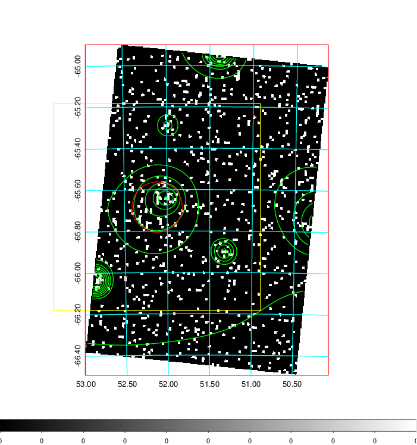
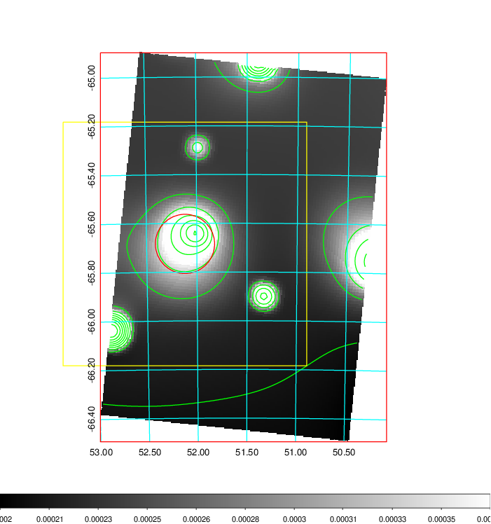
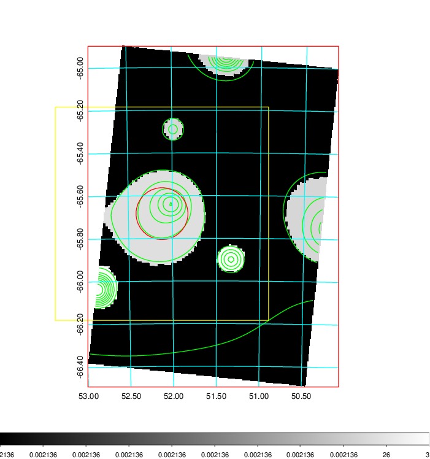
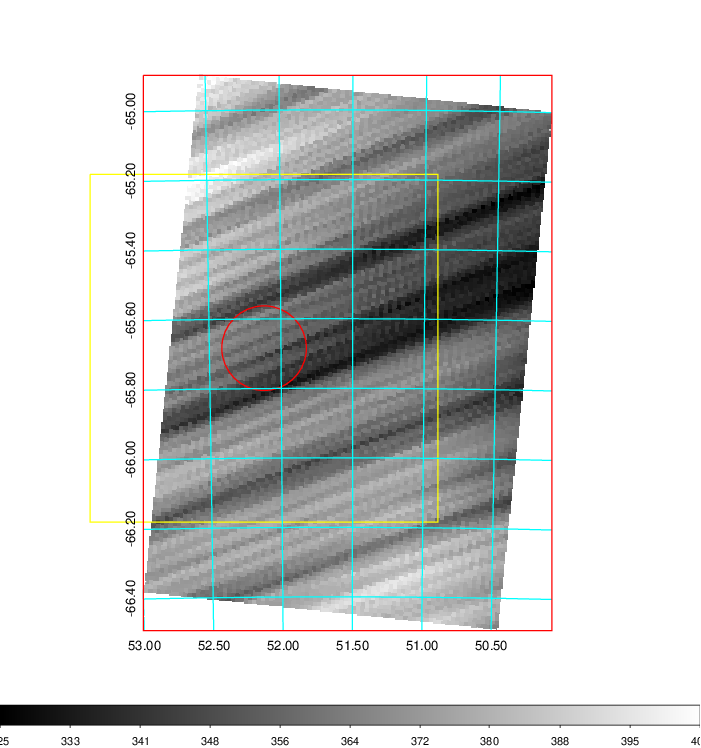
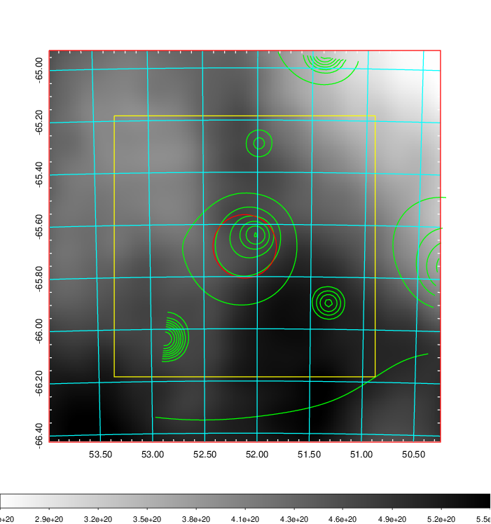
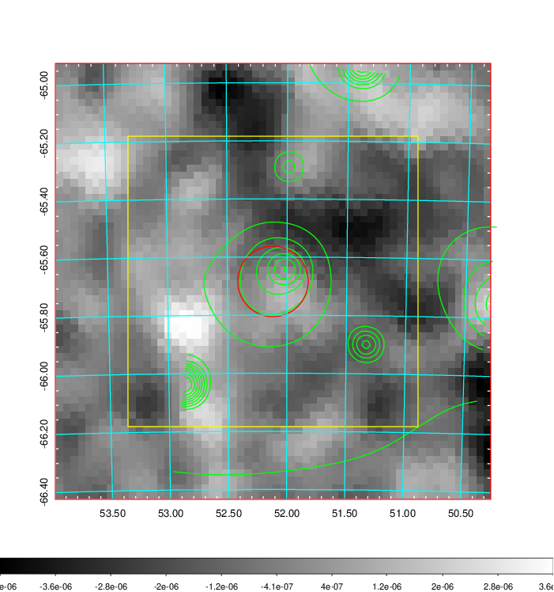
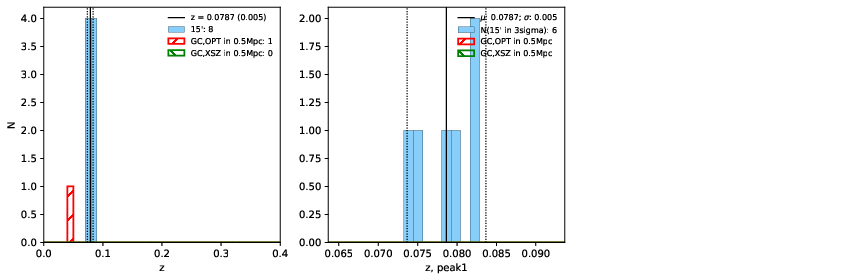
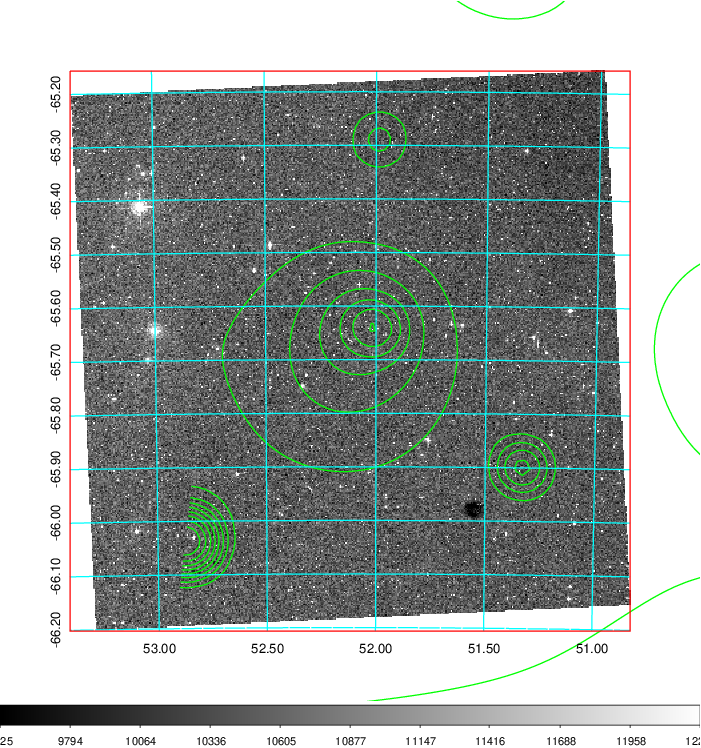
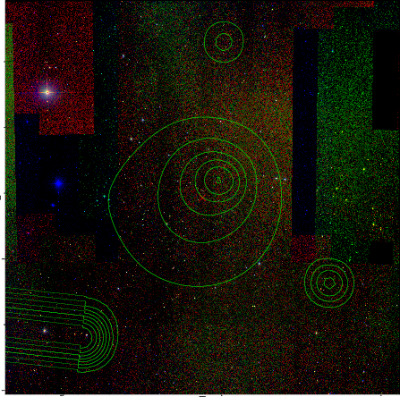
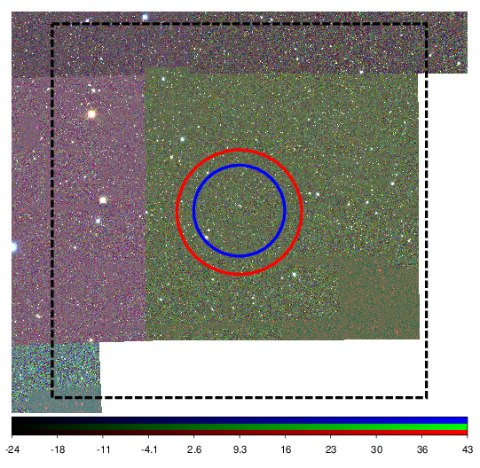

### 141

|Name|RAJ2000[deg]|DEJ2000[deg] |Ext[arcmin]| Ext,ml | z | z_src| C|GC(XSZ,Delta_z<0.01)| GC(OPT,Delta_z<0.01)|GC| R_sig[arcmin] | R500[arcmin] | R500[Mpc]| CRsig[c/s] | CR500[c/s] |L500[1E44 erg/s]|F500[1E-12 erg/s/cm^2]| M500[1E14 Msun]|Tx[keV]|Cnt_sig|Beta|Rc[arcmin]|Comment|Alias|
|---|---|---|---|---|---|------|---|--------|---------|----------|---|---|---|---|---|---|---|---|---|---|---|---|---|---|
|141| 52.118| -65.684| 7.30| 27.90| 0.0787(0.005)| z1,| G| -| -| N| 7.338| 7.564| 0.675| 0.077(0.033)| 0.078(0.033)| 0.200(0.041)| 1.313(0.271)| 0.94(0.10)| 2.12(0.14)| 32.4| 0.846(-0.167+0.111)| 9.732(-1.921+1.875)| -| t368|

|[RASS image](../image/141/141_img.pdf)|[filtered image](../image/141/141_fil.pdf)|[Segment image](../image/141/141_seg.pdf)|
|-------------------|--------------------|-------------------|
|   |    |   |

|[Exposure image](../image/141/141_mex.pdf)| [nH image](../image/141/141_nh.pdf)| [Planck image](../image/141/141_p.pdf)|
|-------------------|--------------------|-------------------|
|   |     |  |

|[Redshift Histogram](../image/141/141_zg.pdf) | [DSS image(z1)](../image/141/141_dss_z1.pdf)      |  [DSS image(z2)](../image/141/141_dss_z2.pdf)    |
|-------------------|--------------------|-------------------|
| |  Blue circle for optical clusters;  Magenta circle for XSZ clusters;  all with r=1Mpc;  Only GC with Delta_z<0.01 are shown. |  Blue circle for optical clusters;  Magenta circle for XSZ clusters;  all with r=1Mpc;  Only GC with Delta_z<0.01 are shown.  |

|[Previous-identified clusters](../image/141/141_gc.pdf) | [2MASS image](../image/141/141_2mass.pdf)      |
|-------------------|-------------------|
|  Green, magenta, and blue circles  for optical, X-ray and SZ clusters  respectively, with redshift of clusters  labelled. The radius of circles  are 1Mpc.|  |

|[DES image](../image/141/141_des.pdf)   |
|-------------------|
|   |
