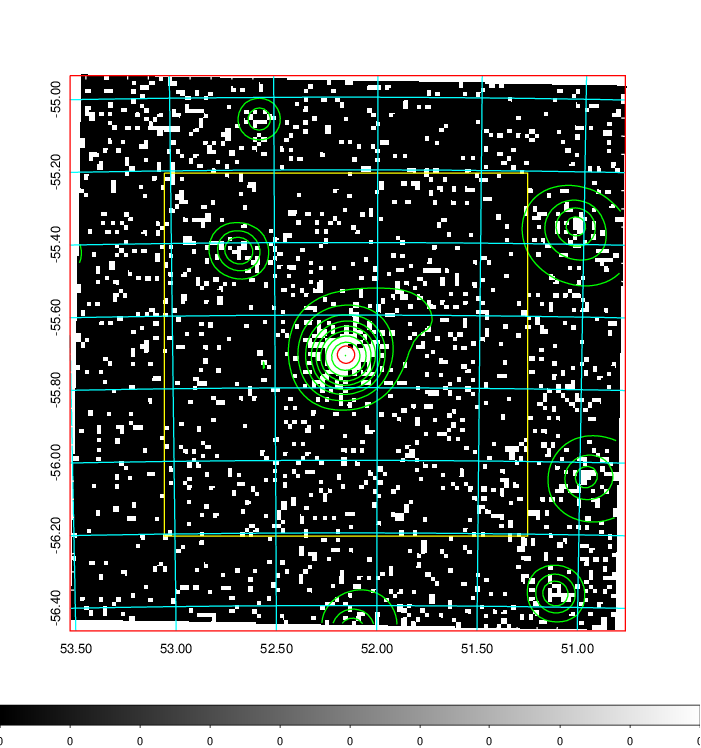
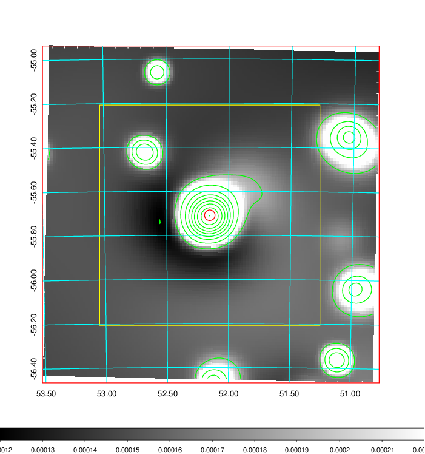
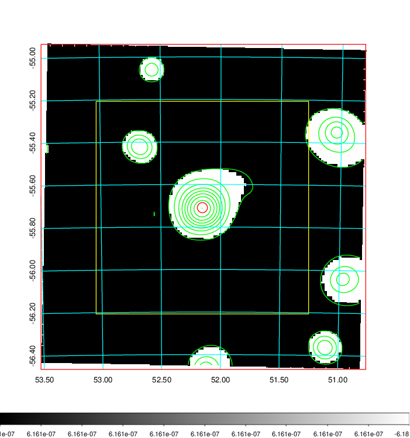
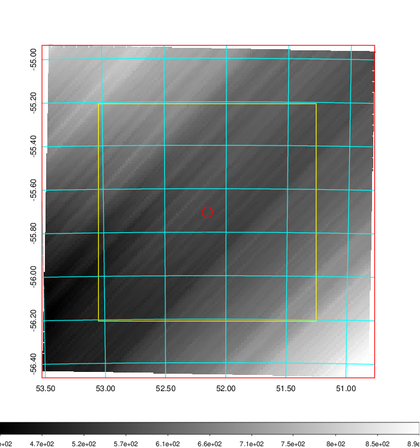
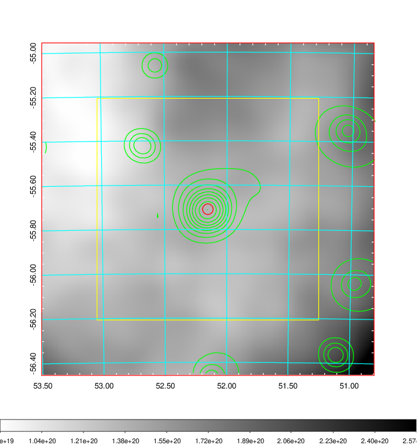
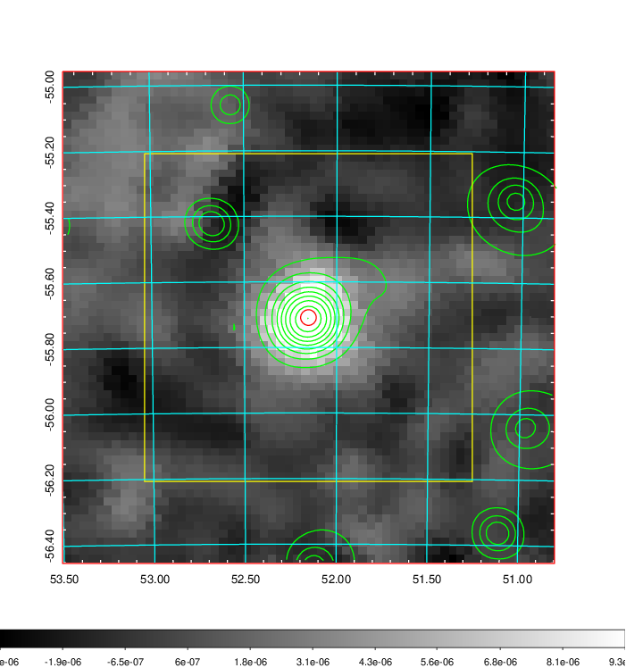
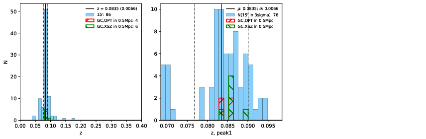
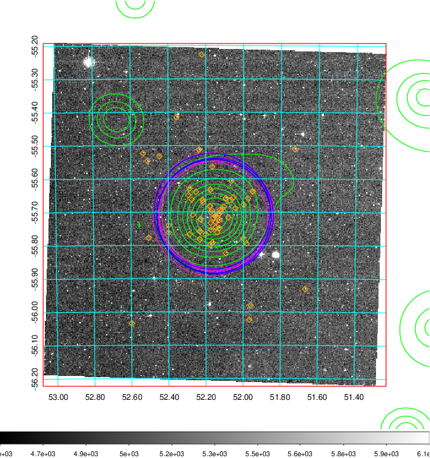
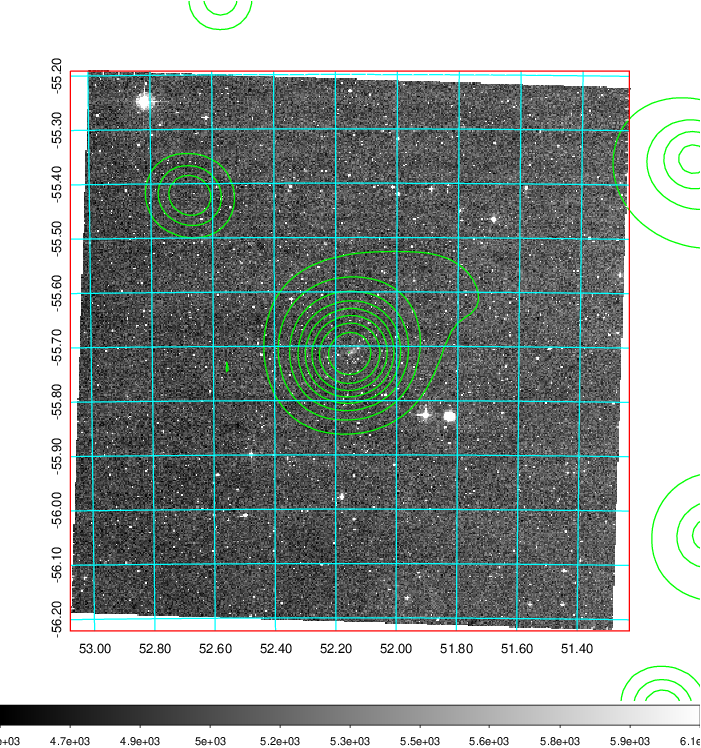
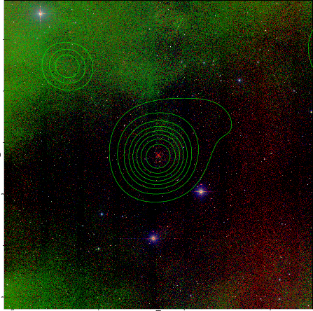

### 142

|Name|RAJ2000[deg]|DEJ2000[deg] |Ext[arcmin]| Ext,ml | z | z_src| C|GC(XSZ,Delta_z<0.01)| GC(OPT,Delta_z<0.01)|GC| R_sig[arcmin] | R500[arcmin] | R500[Mpc]| CRsig[c/s] | CR500[c/s] |L500[1E44 erg/s]|F500[1E-12 erg/s/cm^2]| M500[1E14 Msun]|Tx[keV]|Cnt_sig|Beta|Rc[arcmin]|Comment|Alias|
|---|---|---|---|---|---|------|---|--------|---------|----------|---|---|---|---|---|---|---|---|---|---|---|---|---|---|
|142| 52.153| -55.709| 1.43| 123.25| 0.0835(0.007)| z1, z_xsz| B| B15, MCXC, PSZ2, Tar, XB| A, N, W| A, B15, MCXC, N, PSZ2, Tar, W, XB| 13.675| 10.472| 0.986| 0.475(0.038)| 0.457(0.037)| 1.582(0.067)| 9.151(0.387)| 2.95(0.06)| 4.29(0.06)| 240.1| 0.888(-0.093+0.076)| 3.577(-0.514+0.395)| -| k103|

|[RASS image](../image/142/142_img.pdf)|[filtered image](../image/142/142_fil.pdf)|[Segment image](../image/142/142_seg.pdf)|
|-------------------|--------------------|-------------------|
|   |    |   |

|[Exposure image](../image/142/142_mex.pdf)| [nH image](../image/142/142_nh.pdf)| [Planck image](../image/142/142_p.pdf)|
|-------------------|--------------------|-------------------|
|   |     |  |

|[Redshift Histogram](../image/142/142_zg.pdf) | [DSS image(z1)](../image/142/142_dss_z1.pdf)      |  [DSS image(z2)](../image/142/142_dss_z2.pdf)    |
|-------------------|--------------------|-------------------|
| |  Blue circle for optical clusters;  Magenta circle for XSZ clusters;  all with r=1Mpc;  Only GC with Delta_z<0.01 are shown. |  Blue circle for optical clusters;  Magenta circle for XSZ clusters;  all with r=1Mpc;  Only GC with Delta_z<0.01 are shown.  |

|[known Abell/XSZ clusters](../image/142/142_gc.pdf) | [2MASS image](../image/142/142_2mass.pdf)      |
|-------------------|-------------------|
|  Magenta, blue and green circles  for optical, X-ray and SZ clusters  respectively, with redshift of clusters  labelled. The radius of circles  are 1Mpc.|  |

|[DES image](../image/142/142_des.pdf)   |
|-------------------|
|   |
