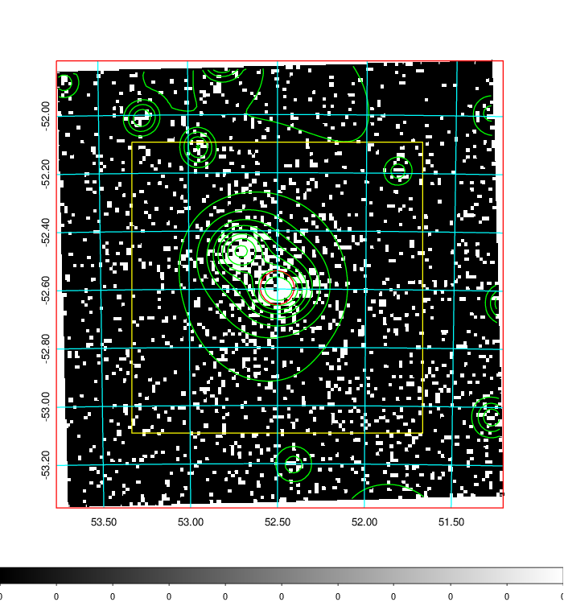
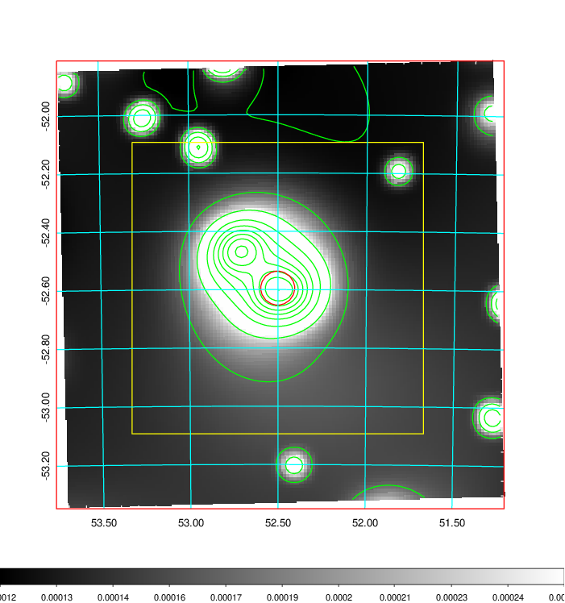
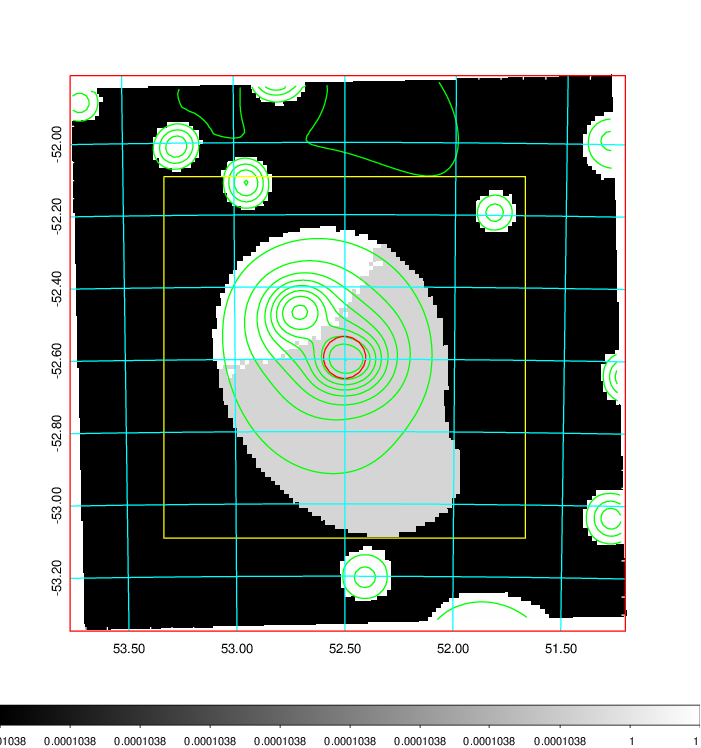
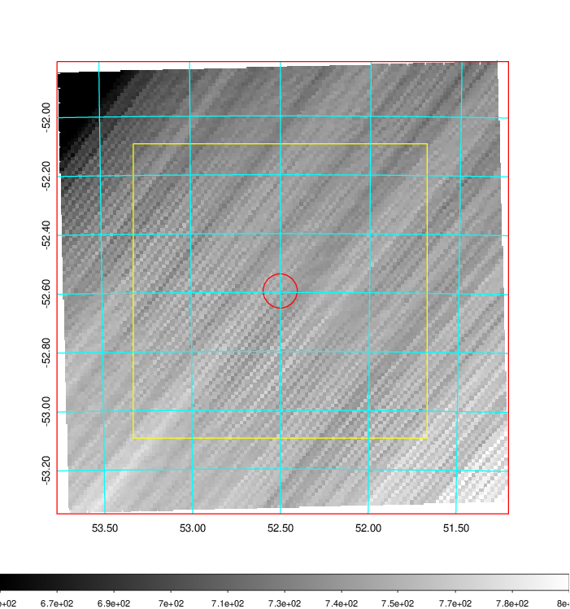
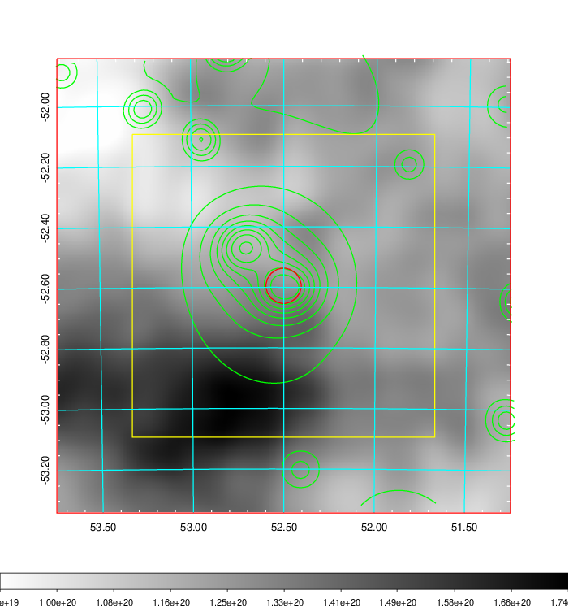
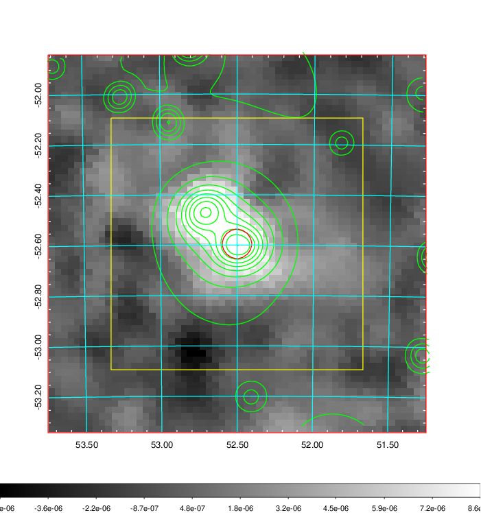
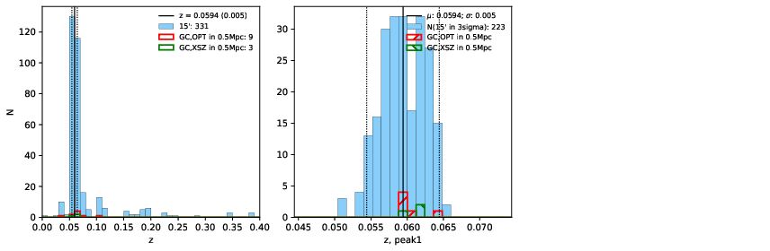
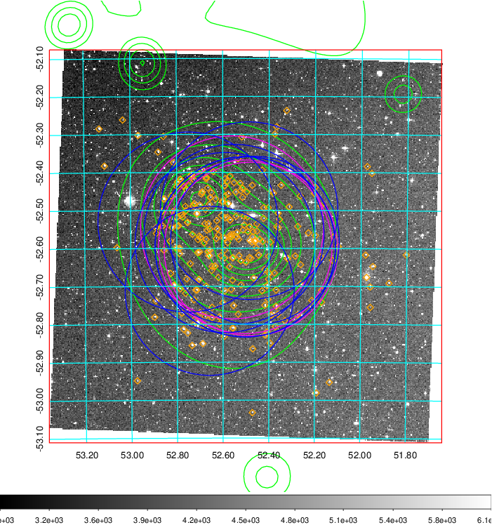
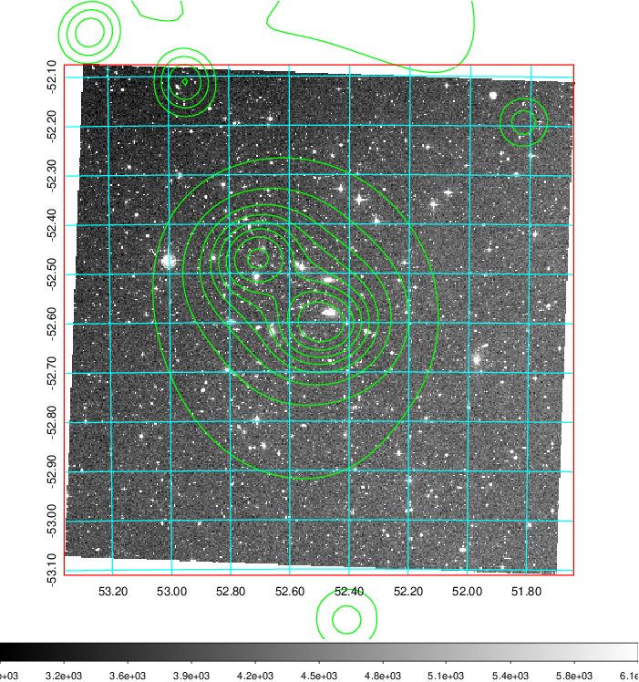
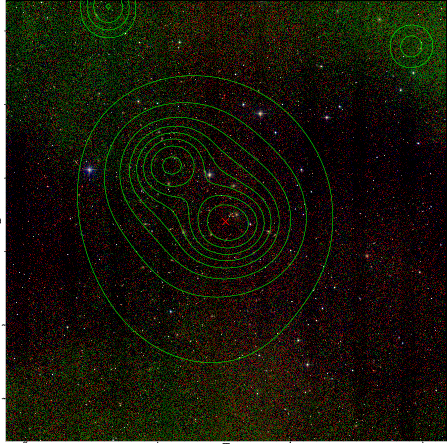

### 143

|Name|RAJ2000[deg]|DEJ2000[deg] |Ext[arcmin]| Ext,ml | z | z_src| C|GC(XSZ,Delta_z<0.01)| GC(OPT,Delta_z<0.01)|GC| R_sig[arcmin] | R500[arcmin] | R500[Mpc]| CRsig[c/s] | CR500[c/s] |L500[1E44 erg/s]|F500[1E-12 erg/s/cm^2]| M500[1E14 Msun]|Tx[keV]|Cnt_sig|Beta|Rc[arcmin]|Comment|Alias|
|---|---|---|---|---|---|------|---|--------|---------|----------|---|---|---|---|---|---|---|---|---|---|---|---|---|---|
|143| 52.501| -52.595| 3.49| 295.05| 0.0594(0.005)| z1, z_xsz| B| MCXC, Tar, XB| A, N, W| A, B15, H13, MCXC, N, PSZ2, Tar, W, XB, XCS| 25.194| 12.895| 0.889| 0.587(0.047)| 0.544(0.044)| 0.900(0.048)| 10.644(0.571)| 2.11(0.06)| 3.46(0.06)| 536.2| 0.692(-0.035+0.041)| 5.236(-0.496+0.562)| -| k431|

|[RASS image](../image/143/143_img.pdf)|[filtered image](../image/143/143_fil.pdf)|[Segment image](../image/143/143_seg.pdf)|
|-------------------|--------------------|-------------------|
|   |    |   |

|[Exposure image](../image/143/143_mex.pdf)| [nH image](../image/143/143_nh.pdf)| [Planck image](../image/143/143_p.pdf)|
|-------------------|--------------------|-------------------|
|   |     |  |

|[Redshift Histogram](../image/143/143_zg.pdf) | [DSS image(z1)](../image/143/143_dss_z1.pdf)      |  [DSS image(z2)](../image/143/143_dss_z2.pdf)    |
|-------------------|--------------------|-------------------|
| |  Blue circle for optical clusters;  Magenta circle for XSZ clusters;  all with r=1Mpc;  Only GC with Delta_z<0.01 are shown. |  Blue circle for optical clusters;  Magenta circle for XSZ clusters;  all with r=1Mpc;  Only GC with Delta_z<0.01 are shown.  |

|[known Abell/XSZ clusters](../image/143/143_gc.pdf) | [2MASS image](../image/143/143_2mass.pdf)      |
|-------------------|-------------------|
|  Magenta, blue and green circles  for optical, X-ray and SZ clusters  respectively, with redshift of clusters  labelled. The radius of circles  are 1Mpc.|  |

|[DES image](../image/143/143_des.pdf)   |
|-------------------|
|   |
