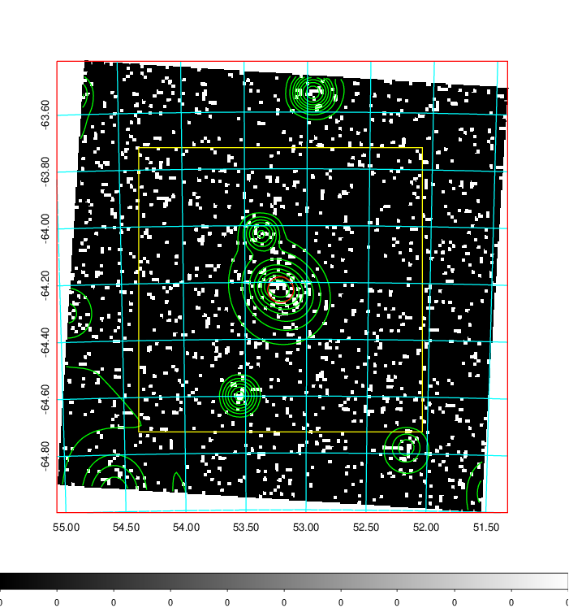
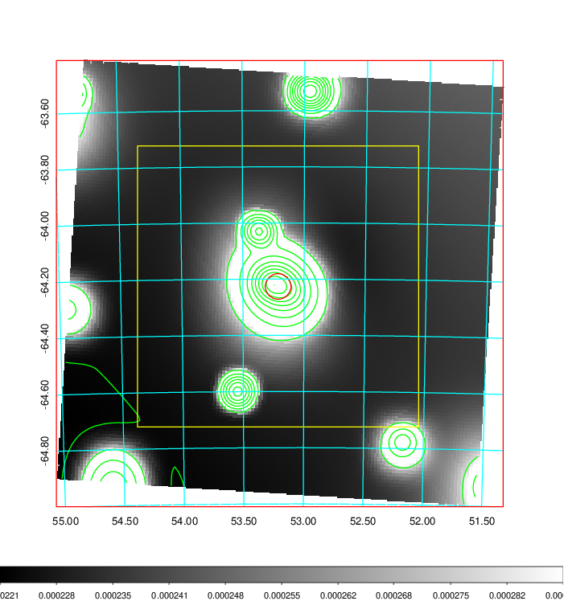
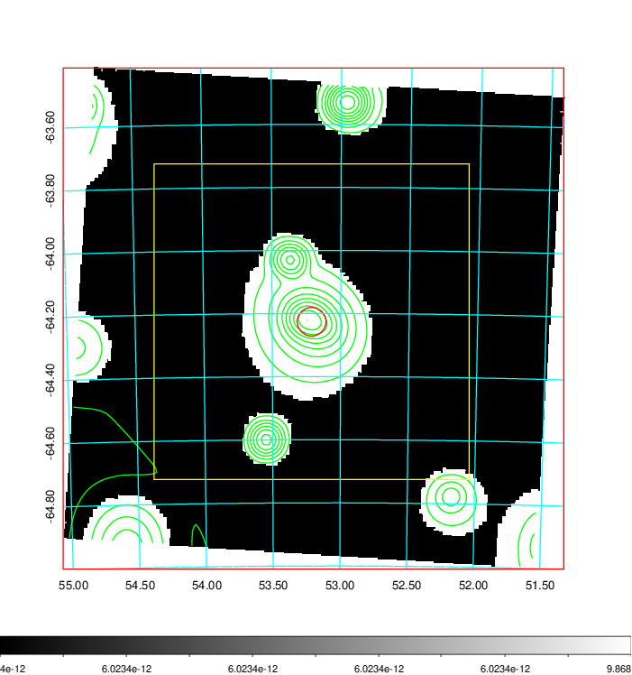
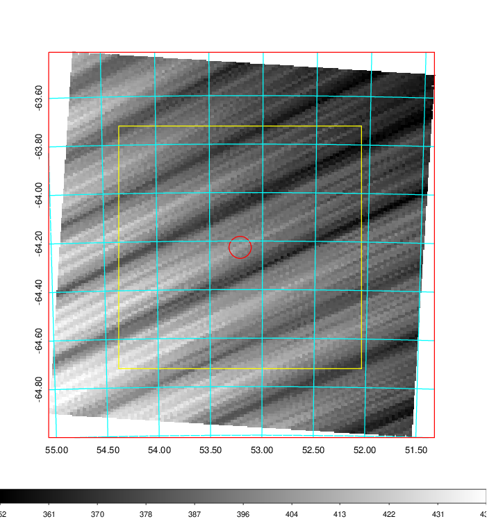
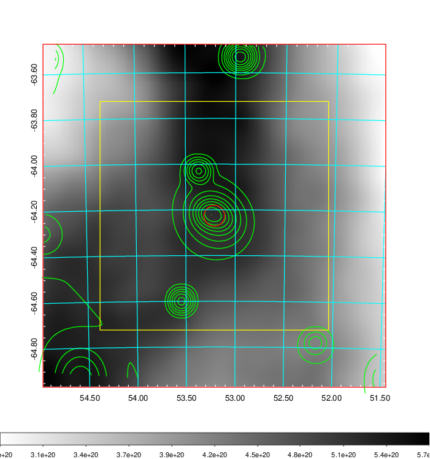
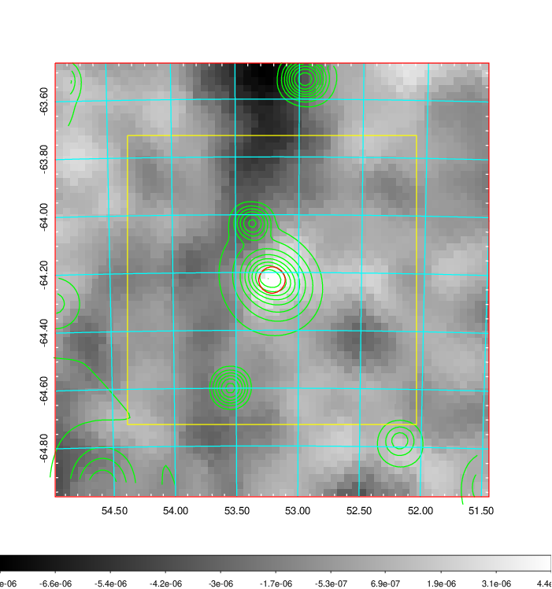
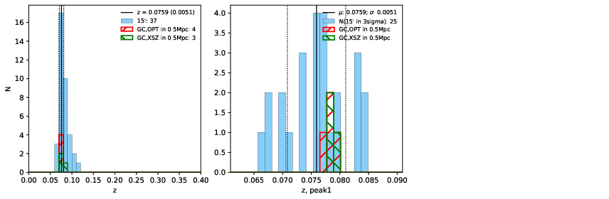
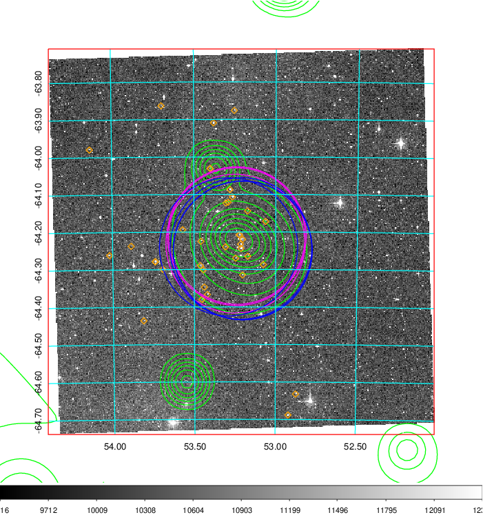
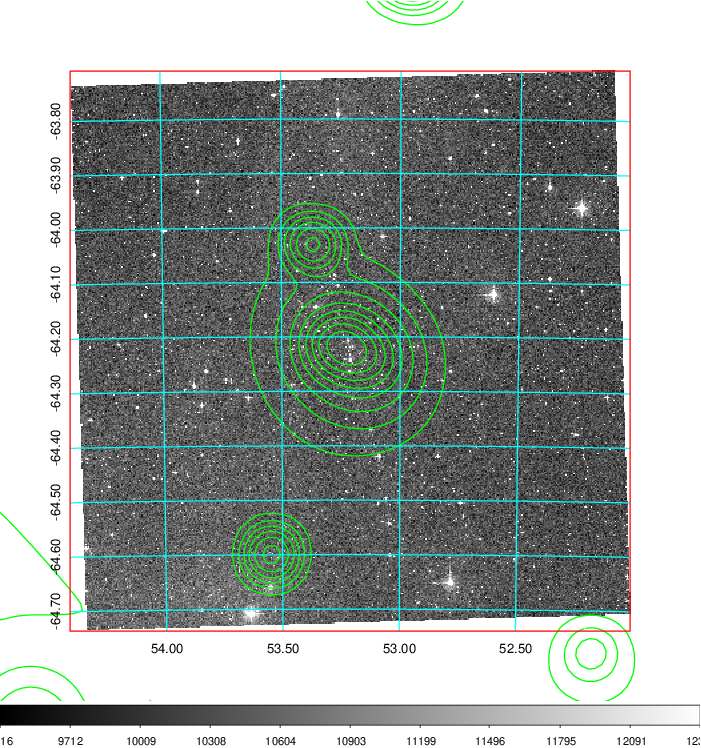
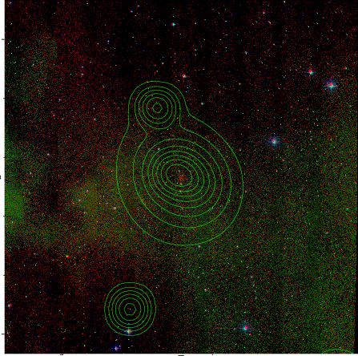

### 144

|Name|RAJ2000[deg]|DEJ2000[deg] |Ext[arcmin]| Ext,ml | z | z_src| C|GC(XSZ,Delta_z<0.01)| GC(OPT,Delta_z<0.01)|GC| R_sig[arcmin] | R500[arcmin] | R500[Mpc]| CRsig[c/s] | CR500[c/s] |L500[1E44 erg/s]|F500[1E-12 erg/s/cm^2]| M500[1E14 Msun]|Tx[keV]|Cnt_sig|Beta|Rc[arcmin]|Comment|Alias|
|---|---|---|---|---|---|------|---|--------|---------|----------|---|---|---|---|---|---|---|---|---|---|---|---|---|---|
|144| 53.212| -64.226| 2.74| 30.52| 0.0759(0.005)| z1, z_xsz| B| PSZ2, Tar| A, N, W| A, N, PSZ2, Tar, W| 8.312| 8.981| 0.776| 0.160(0.039)| 0.162(0.040)| 0.395(0.052)| 2.794(0.370)| 1.43(0.10)| 2.73(0.12)| 56.8| 0.882(-0.130+0.085)| 4.577(-0.871+0.657)| -| k341|

|[RASS image](../image/144/144_img.pdf)|[filtered image](../image/144/144_fil.pdf)|[Segment image](../image/144/144_seg.pdf)|
|-------------------|--------------------|-------------------|
|   |    |   |

|[Exposure image](../image/144/144_mex.pdf)| [nH image](../image/144/144_nh.pdf)| [Planck image](../image/144/144_p.pdf)|
|-------------------|--------------------|-------------------|
|   |     |  |

|[Redshift Histogram](../image/144/144_zg.pdf) | [DSS image(z1)](../image/144/144_dss_z1.pdf)      |  [DSS image(z2)](../image/144/144_dss_z2.pdf)    |
|-------------------|--------------------|-------------------|
| |  Blue circle for optical clusters;  Magenta circle for XSZ clusters;  all with r=1Mpc;  Only GC with Delta_z<0.01 are shown. |  Blue circle for optical clusters;  Magenta circle for XSZ clusters;  all with r=1Mpc;  Only GC with Delta_z<0.01 are shown.  |

|[known Abell/XSZ clusters](../image/144/144_gc.pdf) | [2MASS image](../image/144/144_2mass.pdf)      |
|-------------------|-------------------|
|  Magenta, blue and green circles  for optical, X-ray and SZ clusters  respectively, with redshift of clusters  labelled. The radius of circles  are 1Mpc.|  |

|[DES image](../image/144/144_des.pdf)   |
|-------------------|
|   |
