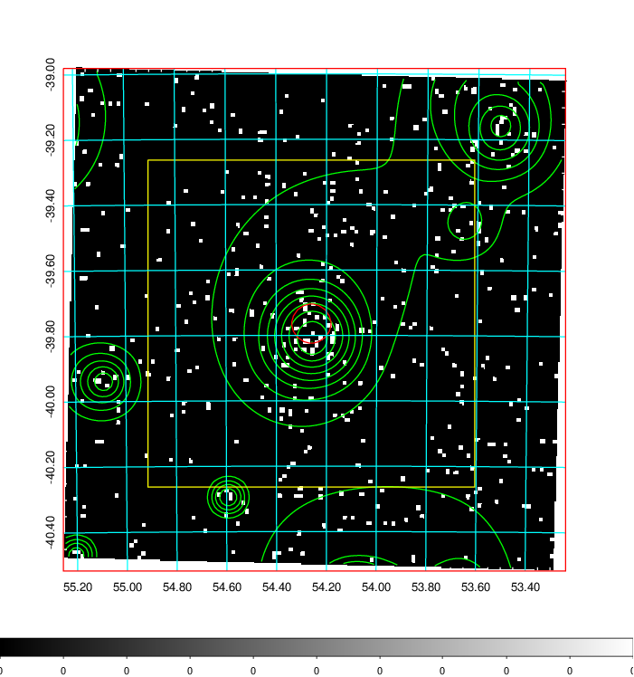
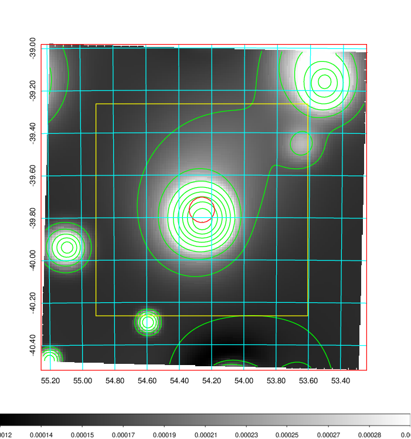
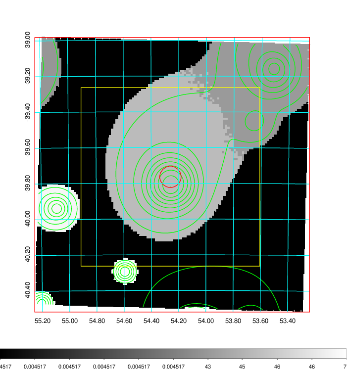
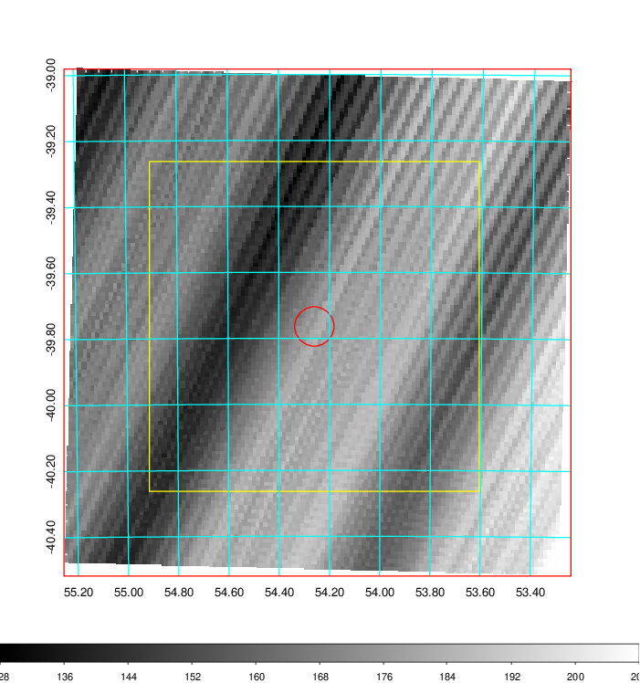
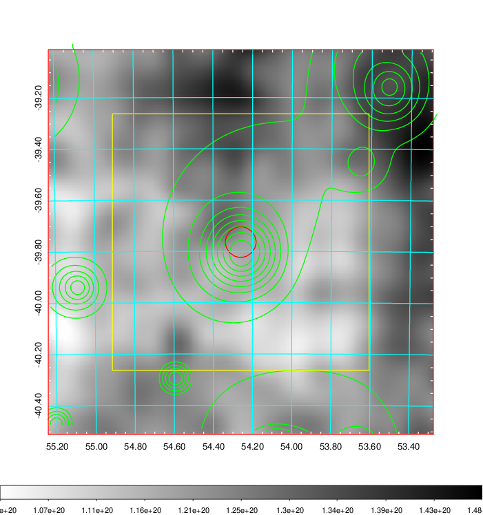
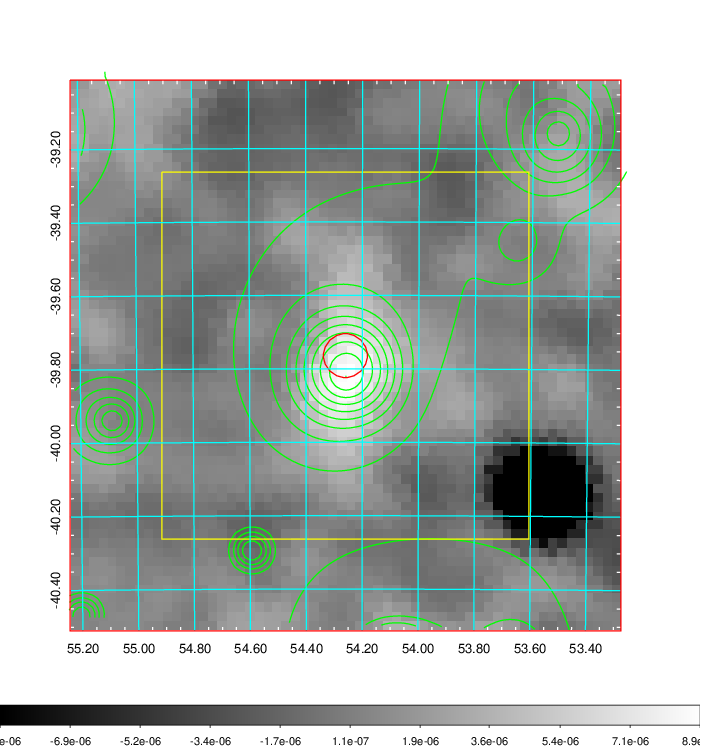
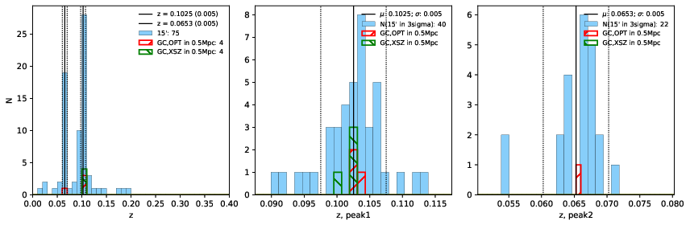
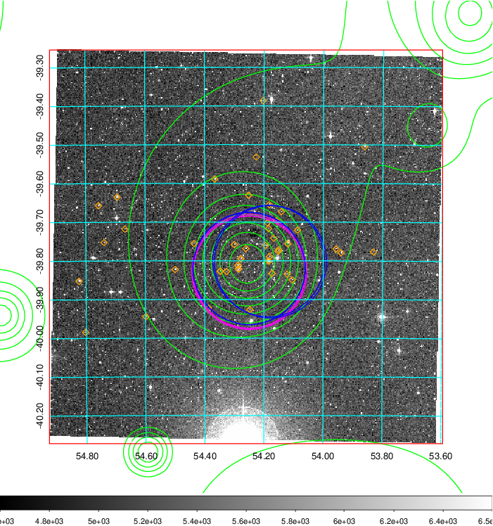
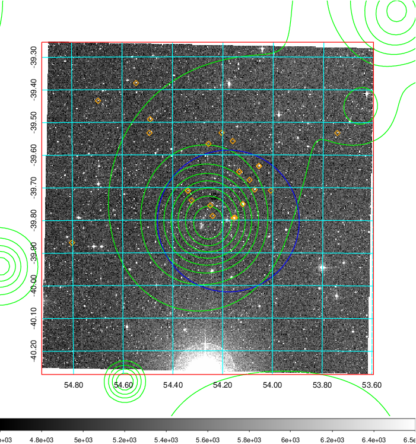
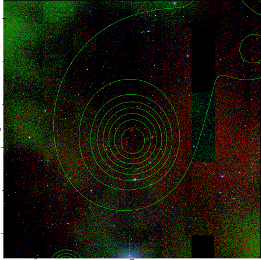

### 145

|Name|RAJ2000[deg]|DEJ2000[deg] |Ext[arcmin]| Ext,ml | z | z_src| C|GC(XSZ,Delta_z<0.01)| GC(OPT,Delta_z<0.01)|GC| R_sig[arcmin] | R500[arcmin] | R500[Mpc]| CRsig[c/s] | CR500[c/s] |L500[1E44 erg/s]|F500[1E-12 erg/s/cm^2]| M500[1E14 Msun]|Tx[keV]|Cnt_sig|Beta|Rc[arcmin]|Comment|Alias|
|---|---|---|---|---|---|------|---|--------|---------|----------|---|---|---|---|---|---|---|---|---|---|---|---|---|---|
|145| 54.260| -39.764| 3.58| 42.11| 0.1025(0.005)| z1, z_xsz| B| MCXC, PSZ2, Tar| A, W| A, MCXC, N, PSZ2, Tar, W| 20.750| 8.693| 0.983| 0.337(0.095)| 0.308(0.087)| 1.666(0.478)| 6.236(1.787)| 2.98(0.42)| 4.34(0.39)| 54.1| 0.612(-0.073+0.124)| 5.325(-1.347+1.971)| -| k445|

|[RASS image](../image/145/145_img.pdf)|[filtered image](../image/145/145_fil.pdf)|[Segment image](../image/145/145_seg.pdf)|
|-------------------|--------------------|-------------------|
|   |    |   |

|[Exposure image](../image/145/145_mex.pdf)| [nH image](../image/145/145_nh.pdf)| [Planck image](../image/145/145_p.pdf)|
|-------------------|--------------------|-------------------|
|   |     |  |

|[Redshift Histogram](../image/145/145_zg.pdf) | [DSS image(z1)](../image/145/145_dss_z1.pdf)      |  [DSS image(z2)](../image/145/145_dss_z2.pdf)    |
|-------------------|--------------------|-------------------|
| |  Blue circle for optical clusters;  Magenta circle for XSZ clusters;  all with r=1Mpc;  Only GC with Delta_z<0.01 are shown. |  Blue circle for optical clusters;  Magenta circle for XSZ clusters;  all with r=1Mpc;  Only GC with Delta_z<0.01 are shown.  |

|[known Abell/XSZ clusters](../image/145/145_gc.pdf) | [2MASS image](../image/145/145_2mass.pdf)      |
|-------------------|-------------------|
|  Magenta, blue and green circles  for optical, X-ray and SZ clusters  respectively, with redshift of clusters  labelled. The radius of circles  are 1Mpc.|  |

|[DES image](../image/145/145_des.pdf)   |[ATLAS image](../image/145/145_s.pdf)        |
|-------------------|-------------------|
|   |   |
