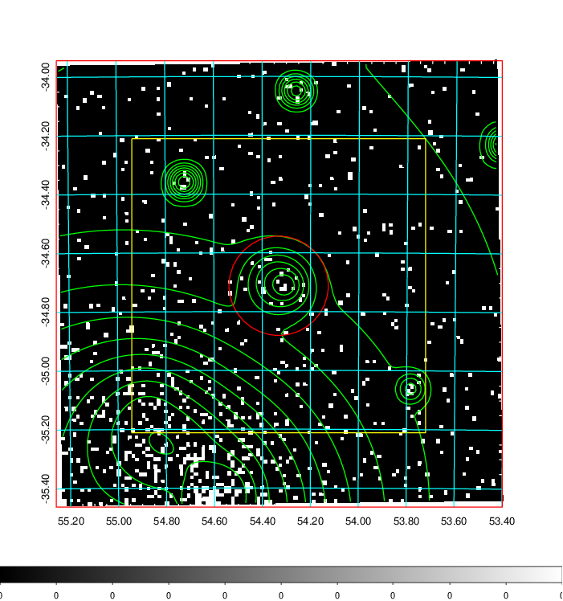
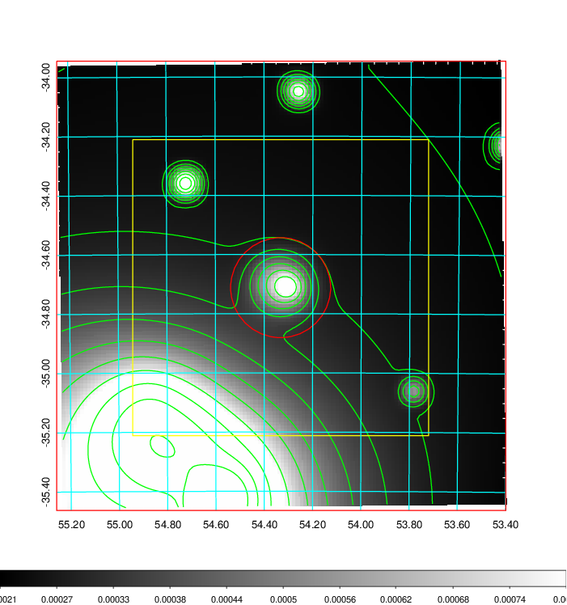
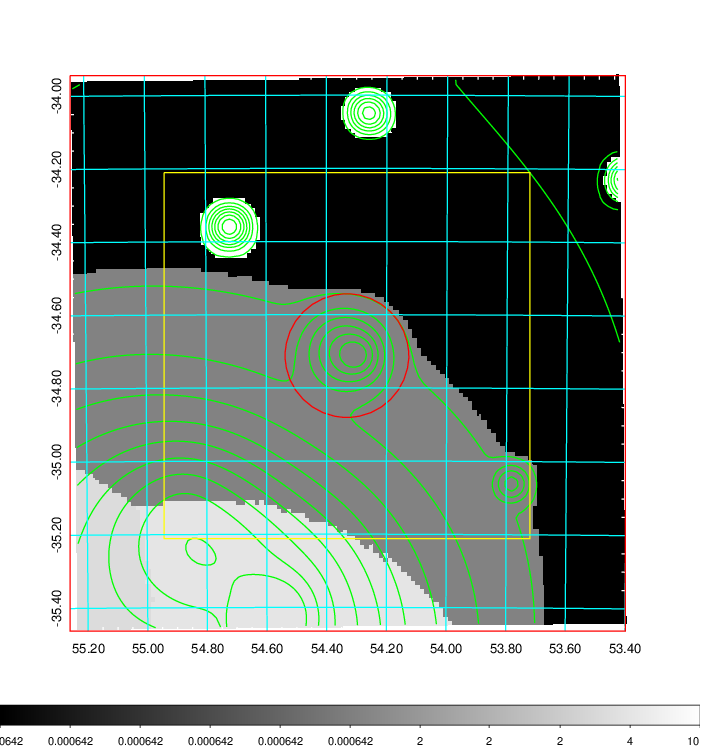
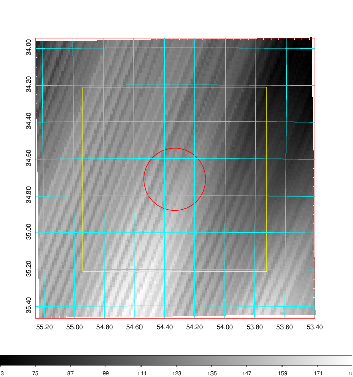
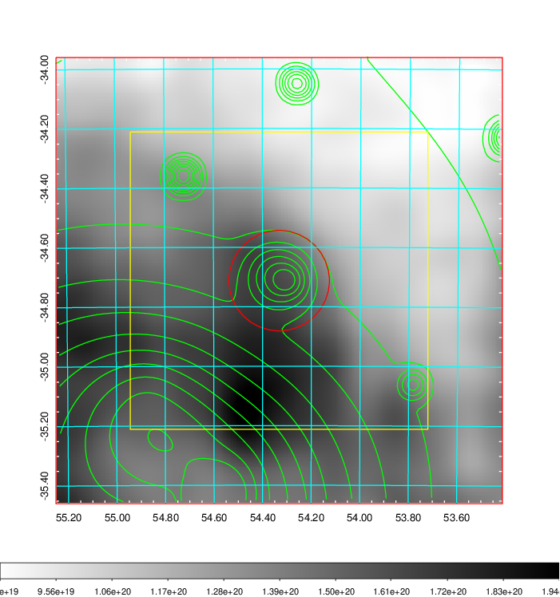
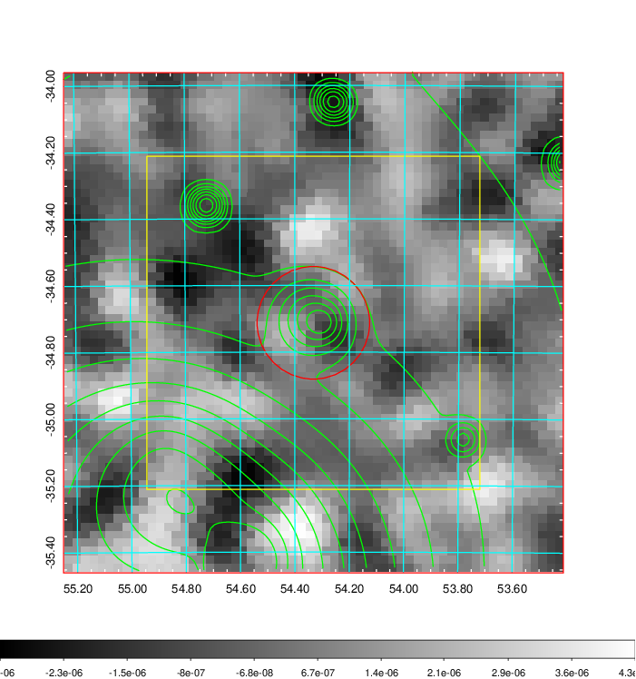
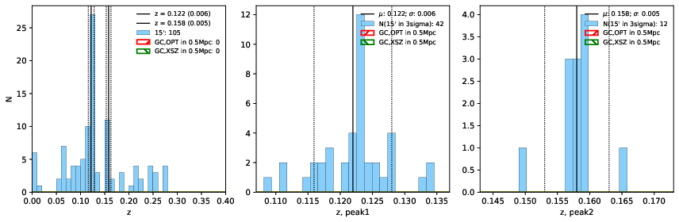
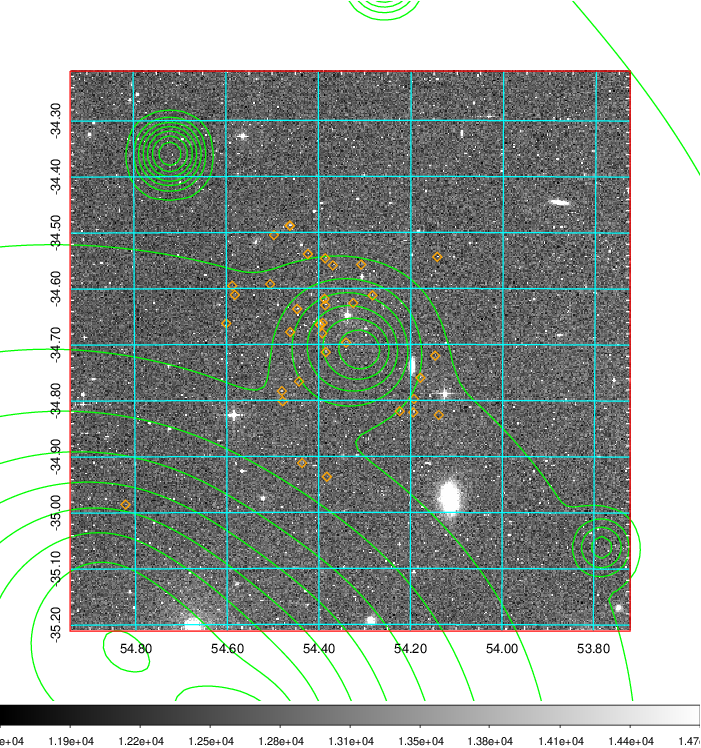
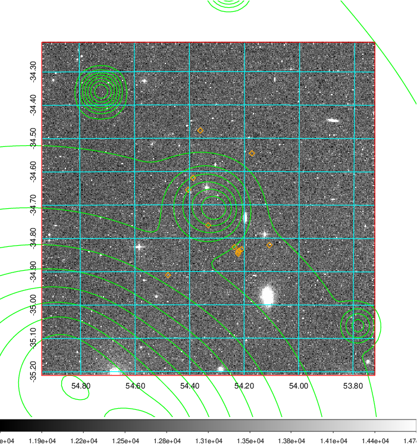
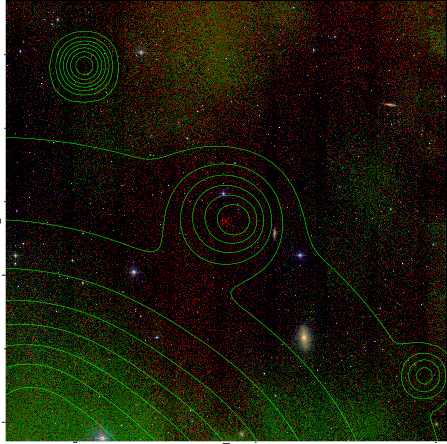

### 146

|Name|RAJ2000[deg]|DEJ2000[deg] |Ext[arcmin]| Ext,ml | z | z_src| C|GC(XSZ,Delta_z<0.01)| GC(OPT,Delta_z<0.01)|GC| R_sig[arcmin] | R500[arcmin] | R500[Mpc]| CRsig[c/s] | CR500[c/s] |L500[1E44 erg/s]|F500[1E-12 erg/s/cm^2]| M500[1E14 Msun]|Tx[keV]|Cnt_sig|Beta|Rc[arcmin]|Comment|Alias|
|---|---|---|---|---|---|------|---|--------|---------|----------|---|---|---|---|---|---|---|---|---|---|---|---|---|---|
|146| 54.332| -34.712| 10.14| 159.52| 0.1220(0.006)| z1,| G| -| -| N, SPI| 35.155| 8.245| 1.086| 0.400(0.210)| 0.355(0.187)| 2.751(5.816)| 7.082(14.972)| 4.09(4.22)| 5.31(3.49)| 158.7| 0.507(-0.005+0.011)| 3.891(-0.687+0.479)| -| t443|

|[RASS image](../image/146/146_img.pdf)|[filtered image](../image/146/146_fil.pdf)|[Segment image](../image/146/146_seg.pdf)|
|-------------------|--------------------|-------------------|
|   |    |   |

|[Exposure image](../image/146/146_mex.pdf)| [nH image](../image/146/146_nh.pdf)| [Planck image](../image/146/146_p.pdf)|
|-------------------|--------------------|-------------------|
|   |     |  |

|[Redshift Histogram](../image/146/146_zg.pdf) | [DSS image(z1)](../image/146/146_dss_z1.pdf)      |  [DSS image(z2)](../image/146/146_dss_z2.pdf)    |
|-------------------|--------------------|-------------------|
| |  Blue circle for optical clusters;  Magenta circle for XSZ clusters;  all with r=1Mpc;  Only GC with Delta_z<0.01 are shown. |  Blue circle for optical clusters;  Magenta circle for XSZ clusters;  all with r=1Mpc;  Only GC with Delta_z<0.01 are shown.  |

|[known Abell/XSZ clusters](../image/146/146_gc.pdf) | [2MASS image](../image/146/146_2mass.pdf)      |
|-------------------|-------------------|
|  Magenta, blue and green circles  for optical, X-ray and SZ clusters  respectively, with redshift of clusters  labelled. The radius of circles  are 1Mpc.|  |

|[DES image](../image/146/146_des.pdf)   |[ATLAS image](../image/146/146_s.pdf)        |
|-------------------|-------------------|
|   |   |
