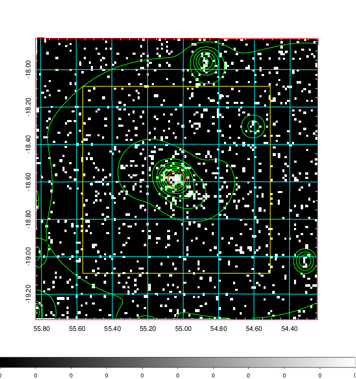
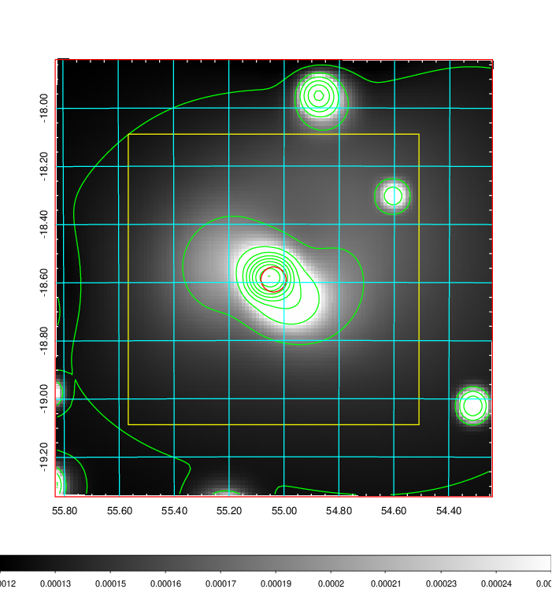
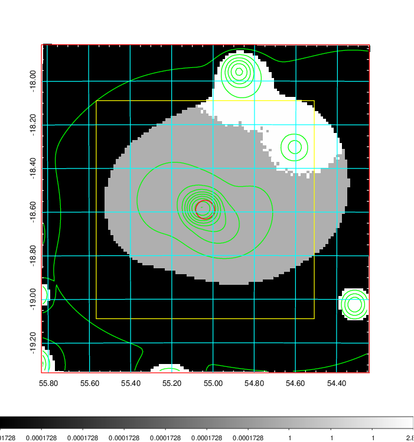
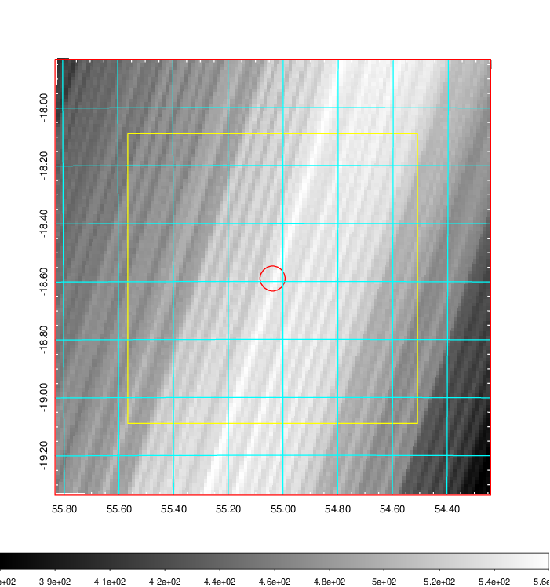
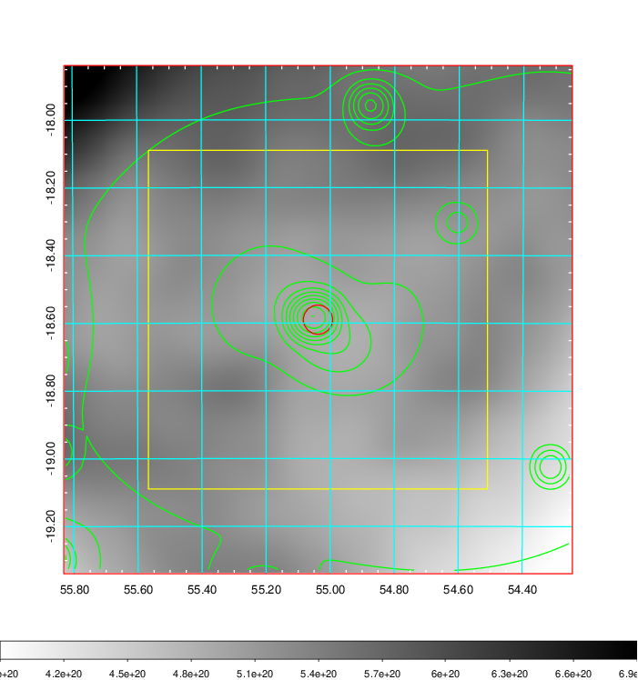
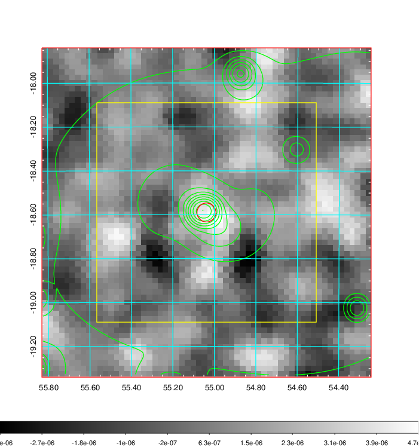
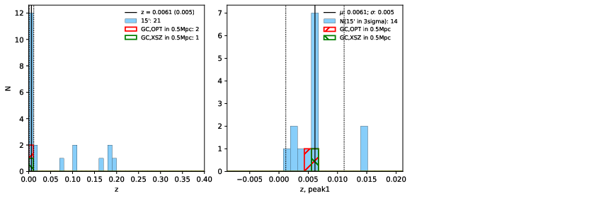
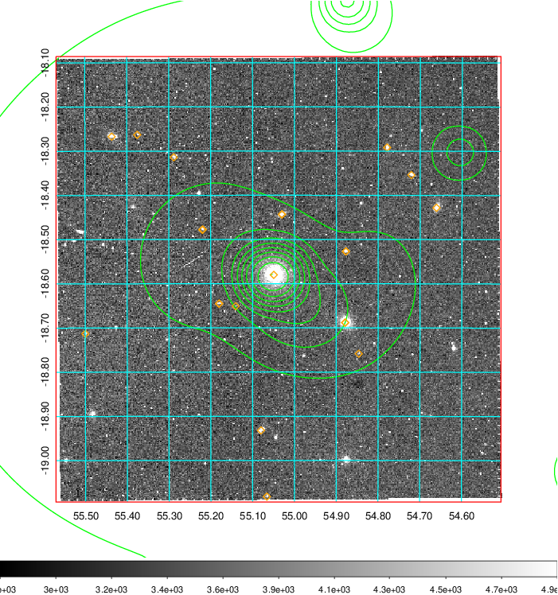
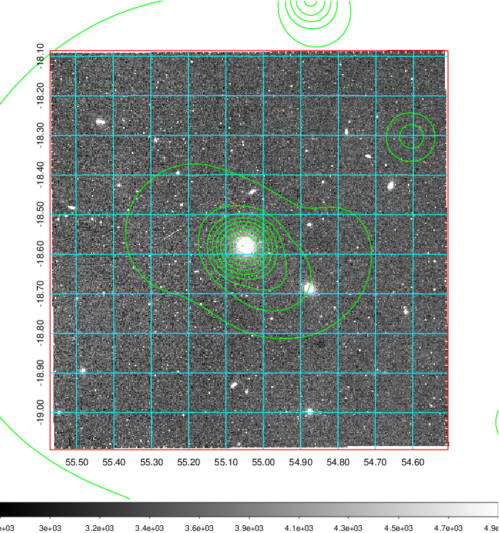
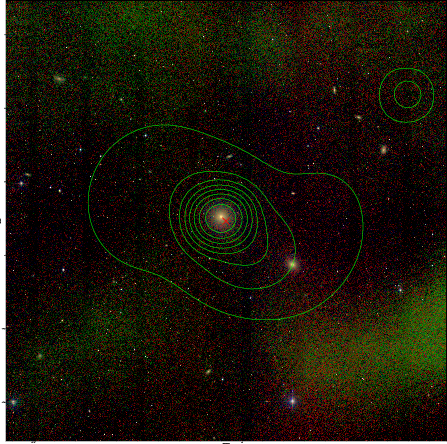

### 148

|Name|RAJ2000[deg]|DEJ2000[deg] |Ext[arcmin]| Ext,ml | z | z_src| C|GC(XSZ,Delta_z<0.01)| GC(OPT,Delta_z<0.01)|GC| R_sig[arcmin] | R500[arcmin] | R500[Mpc]| CRsig[c/s] | CR500[c/s] |L500[1E44 erg/s]|F500[1E-12 erg/s/cm^2]| M500[1E14 Msun]|Tx[keV]|Cnt_sig|Beta|Rc[arcmin]|Comment|Alias|
|---|---|---|---|---|---|------|---|--------|---------|----------|---|---|---|---|---|---|---|---|---|---|---|---|---|---|
|148| 55.038| -18.590| 2.59| 30.54| 0.0061(0.005)| z1, z_xsz| B| MCXC| N| MCXC, N| 31.612| 45.821| 0.346| 0.333(0.056)| 0.360(0.060)| 0.004(0.000)| 5.013(0.590)| 0.12(0.01)| 0.57(0.02)| 220.7| 0.506(-0.004+0.009)| 1.817(-0.192+0.222)| -| k316|

|[RASS image](../image/148/148_img.pdf)|[filtered image](../image/148/148_fil.pdf)|[Segment image](../image/148/148_seg.pdf)|
|-------------------|--------------------|-------------------|
|   |    |   |

|[Exposure image](../image/148/148_mex.pdf)| [nH image](../image/148/148_nh.pdf)| [Planck image](../image/148/148_p.pdf)|
|-------------------|--------------------|-------------------|
|   |     |  |

|[Redshift Histogram](../image/148/148_zg.pdf) | [DSS image(z1)](../image/148/148_dss_z1.pdf)      |  [DSS image(z2)](../image/148/148_dss_z2.pdf)    |
|-------------------|--------------------|-------------------|
| |  Blue circle for optical clusters;  Magenta circle for XSZ clusters;  all with r=1Mpc;  Only GC with Delta_z<0.01 are shown. |  Blue circle for optical clusters;  Magenta circle for XSZ clusters;  all with r=1Mpc;  Only GC with Delta_z<0.01 are shown.  |

|[known Abell/XSZ clusters](../image/148/148_gc.pdf) | [2MASS image](../image/148/148_2mass.pdf)      |
|-------------------|-------------------|
|  Magenta, blue and green circles  for optical, X-ray and SZ clusters  respectively, with redshift of clusters  labelled. The radius of circles  are 1Mpc.|  |

|[DES image](../image/148/148_des.pdf)   |[ATLAS image](../image/148/148_s.pdf)        |
|-------------------|-------------------|
|   |   |
