

### 15

|Name|RAJ2000[deg]|DEJ2000[deg] |Ext[arcmin]| Ext,ml | z | z_src| C|GC(XSZ,Delta_z<0.01)| GC(OPT,Delta_z<0.01)|GC| R_sig[arcmin] | R500[arcmin] | R500[Mpc]| CRsig[c/s] | CR500[c/s] |L500[1E44 erg/s]|F500[1E-12 erg/s/cm^2]| M500[1E14 Msun]|Tx[keV]|Cnt_sig|Beta|Rc[arcmin]|Comment|Alias|
|---|---|---|---|---|---|------|---|--------|---------|----------|---|---|---|---|---|---|---|---|---|---|---|---|---|---|
|15| 3.833| -23.834| 4.66| 25.56| 0.0662(0.005)| z1, z_xsz| B| L03, MCXC| A, N| A, L03, MCXC, N| 8.800| 9.277| 0.707| 0.142(0.040)| 0.143(0.040)| 0.279(0.043)| 2.629(0.406)| 1.07(0.08)| 2.28(0.11)| 45.2| 0.921(-0.103+0.057)| 7.894(-0.966+0.828)| -| k512|

|[RASS image](../image/15/15_img.pdf)|[filtered image](../image/15/15_fil.pdf)|[Segment image](../image/15/15_seg.pdf)|
|-------------------|--------------------|-------------------|
| 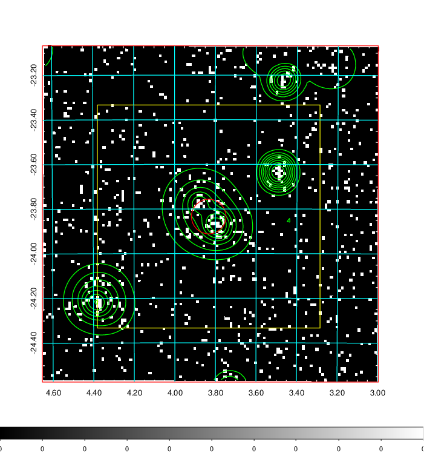  | 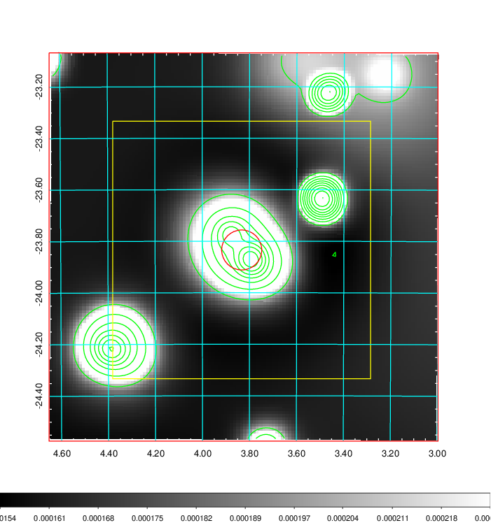   | 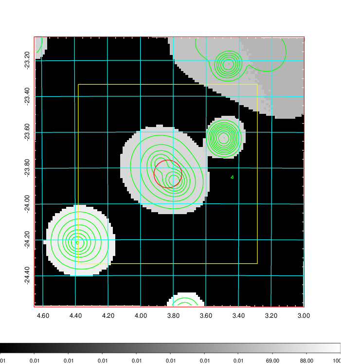  |

|[Exposure image](../image/15/15_mex.pdf)| [nH image](../image/15/15_nh.pdf)| [Planck image](../image/15/15_p.pdf)|
|-------------------|--------------------|-------------------|
|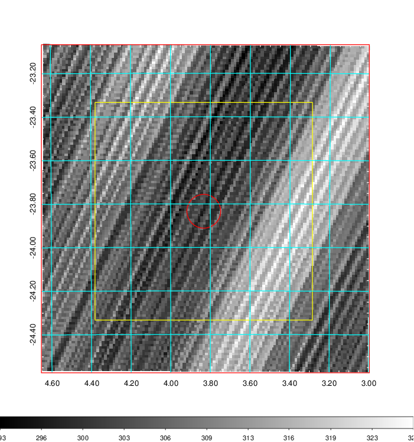   | 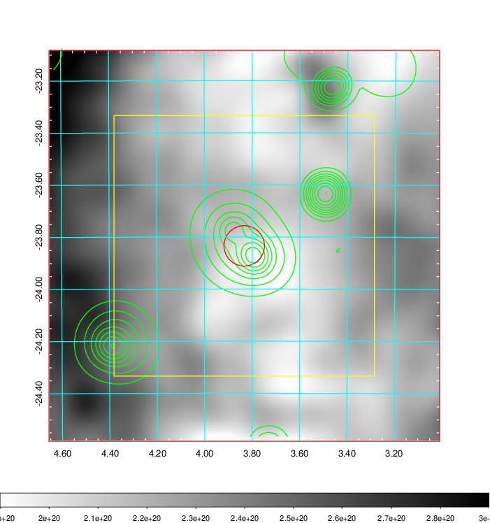    | 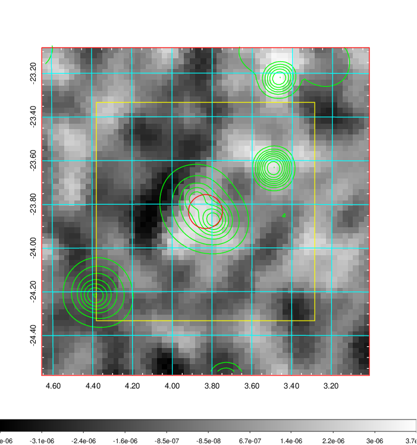 |

|[Redshift Histogram](../image/15/15_zg.pdf) | [DSS image(z1)](../image/15/15_dss_z1.pdf)      |  [DSS image(z2)](../image/15/15_dss_z2.pdf)    |
|-------------------|--------------------|-------------------|
|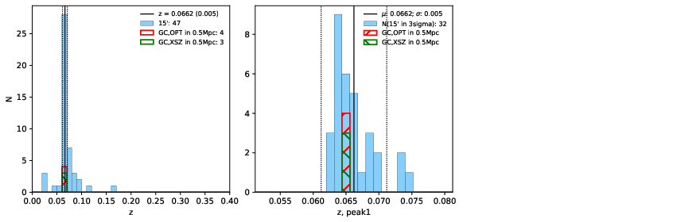 |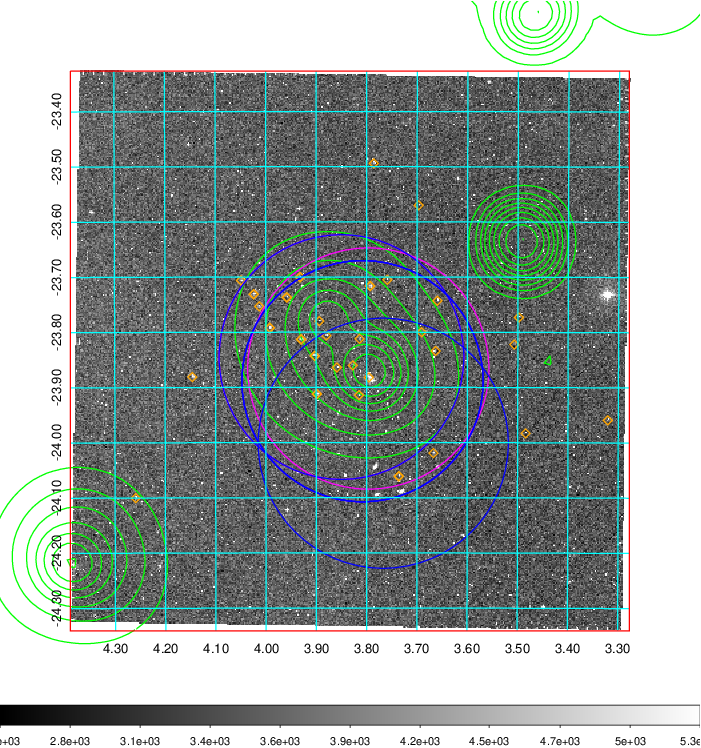  Blue circle for optical clusters;  Magenta circle for XSZ clusters;  all with r=1Mpc;  Only GC with Delta_z<0.01 are shown. | 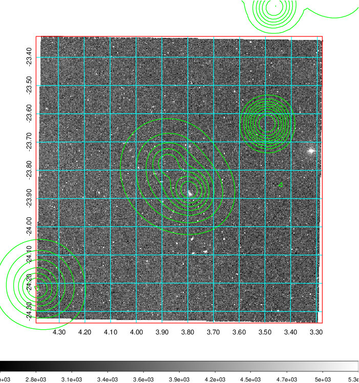 Blue circle for optical clusters;  Magenta circle for XSZ clusters;  all with r=1Mpc;  Only GC with Delta_z<0.01 are shown.  |

|[Previous-identified clusters](../image/15/15_gc.pdf) | [2MASS image](../image/15/15_2mass.pdf)      |
|-------------------|-------------------|
|  Green, magenta, and blue circles  for optical, X-ray and SZ clusters  respectively, with redshift of clusters  labelled. The radius of circles  are 1Mpc.|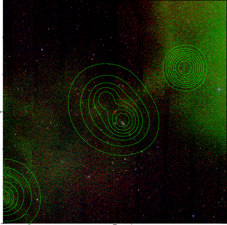  |

|[ATLAS image](../image/15/15_s.pdf)        |
|-------------------|
| 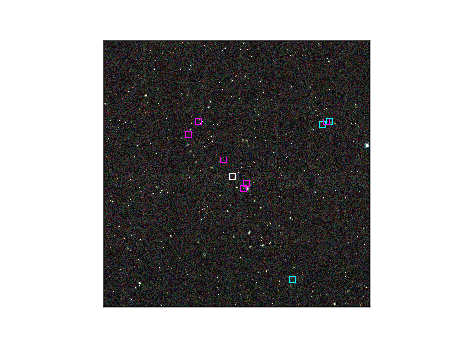  |
