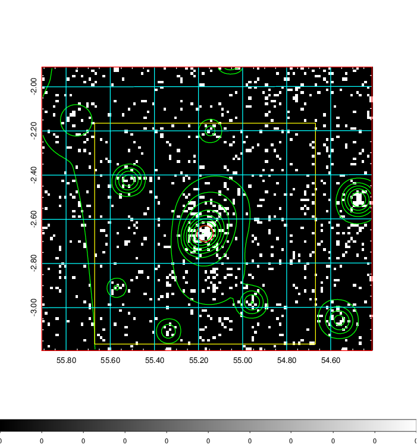
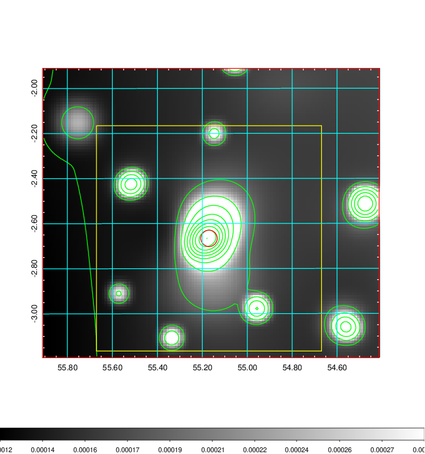
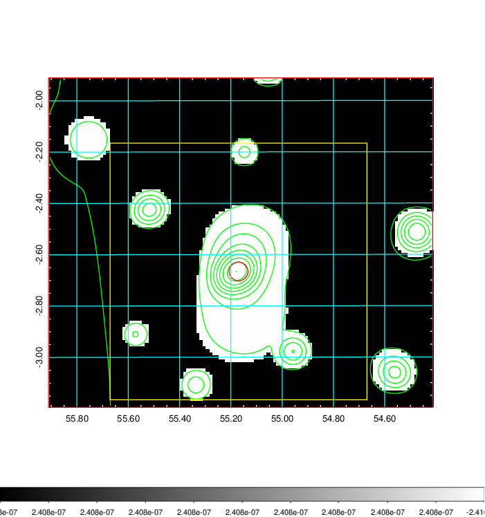
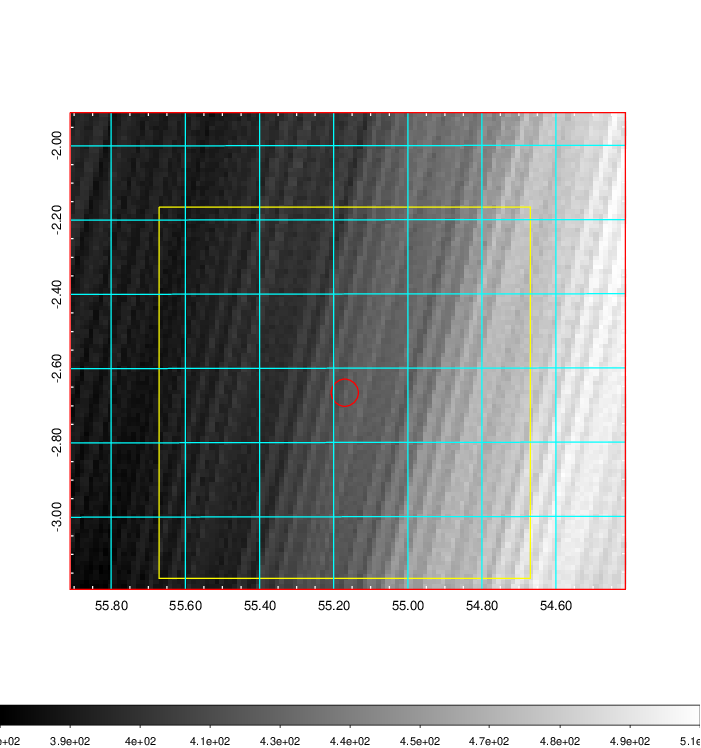
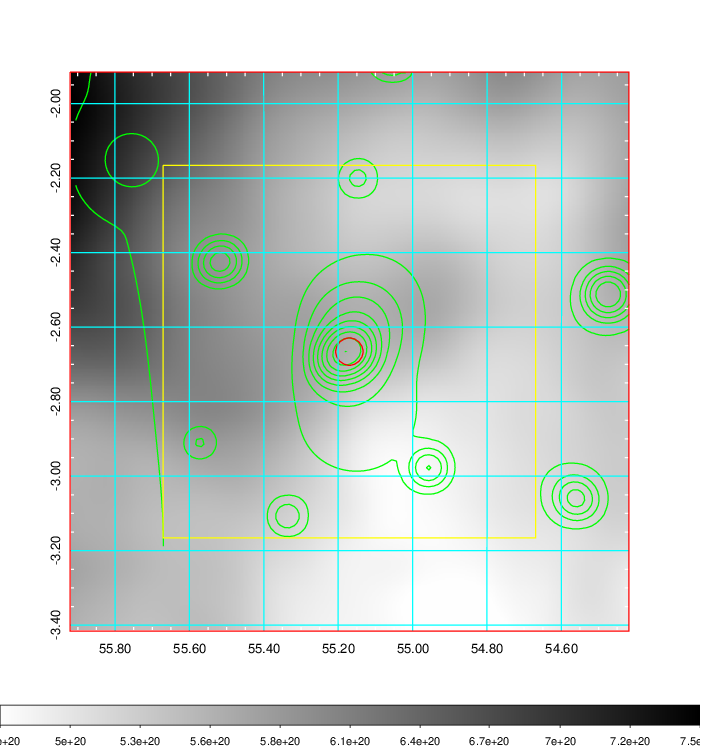
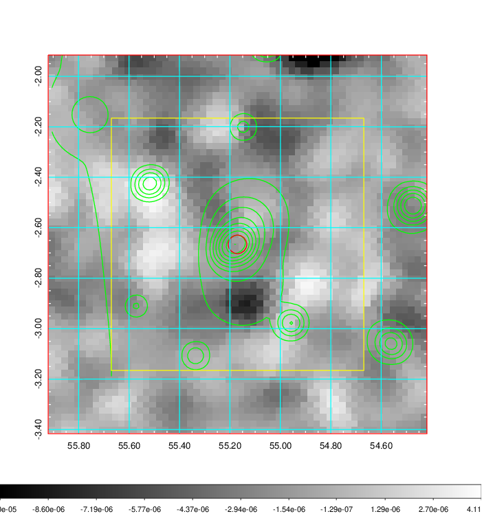
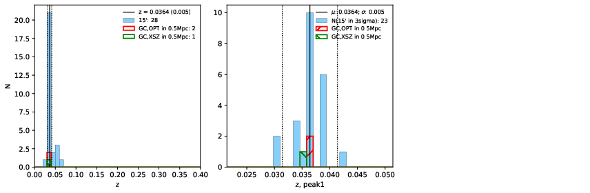
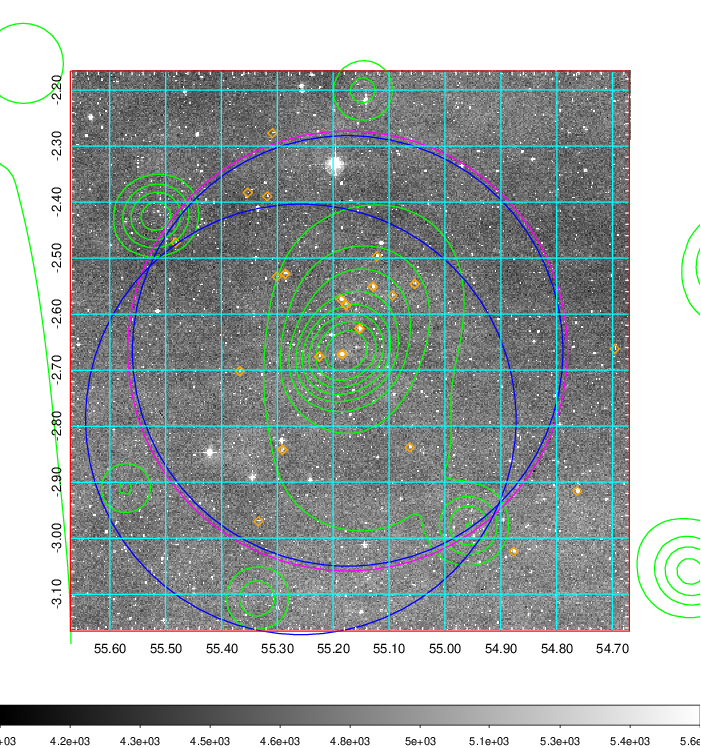
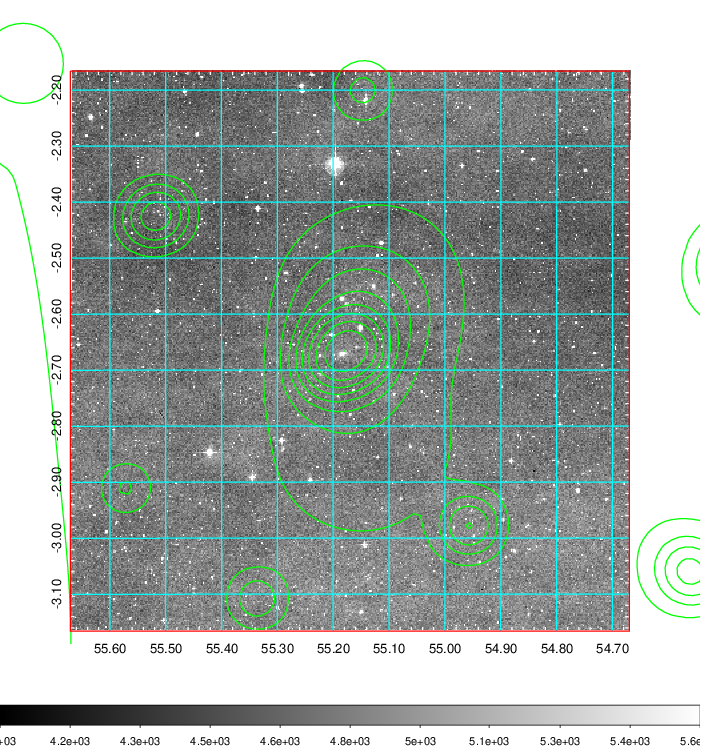
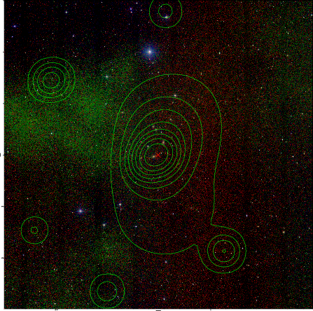

### 150

|Name|RAJ2000[deg]|DEJ2000[deg] |Ext[arcmin]| Ext,ml | z | z_src| C|GC(XSZ,Delta_z<0.01)| GC(OPT,Delta_z<0.01)|GC| R_sig[arcmin] | R500[arcmin] | R500[Mpc]| CRsig[c/s] | CR500[c/s] |L500[1E44 erg/s]|F500[1E-12 erg/s/cm^2]| M500[1E14 Msun]|Tx[keV]|Cnt_sig|Beta|Rc[arcmin]|Comment|Alias|
|---|---|---|---|---|---|------|---|--------|---------|----------|---|---|---|---|---|---|---|---|---|---|---|---|---|---|
|150| 55.170| -2.666| 2.20| 76.17| 0.0364(0.005)| z1, z_xsz| B| MCXC| N| MCXC, N| 16.800| 15.198| 0.659| 0.314(0.057)| 0.309(0.056)| 0.154(0.015)| 5.012(0.478)| 0.84(0.04)| 1.95(0.06)| 156.1| 0.749(-0.072+0.099)| 3.552(-0.673+0.809)| -| k255|

|[RASS image](../image/150/150_img.pdf)|[filtered image](../image/150/150_fil.pdf)|[Segment image](../image/150/150_seg.pdf)|
|-------------------|--------------------|-------------------|
|   |    |   |

|[Exposure image](../image/150/150_mex.pdf)| [nH image](../image/150/150_nh.pdf)| [Planck image](../image/150/150_p.pdf)|
|-------------------|--------------------|-------------------|
|   |     |  |

|[Redshift Histogram](../image/150/150_zg.pdf) | [DSS image(z1)](../image/150/150_dss_z1.pdf)      |  [DSS image(z2)](../image/150/150_dss_z2.pdf)    |
|-------------------|--------------------|-------------------|
| |  Blue circle for optical clusters;  Magenta circle for XSZ clusters;  all with r=1Mpc;  Only GC with Delta_z<0.01 are shown. |  Blue circle for optical clusters;  Magenta circle for XSZ clusters;  all with r=1Mpc;  Only GC with Delta_z<0.01 are shown.  |

|[known Abell/XSZ clusters](../image/150/150_gc.pdf) | [2MASS image](../image/150/150_2mass.pdf)      |
|-------------------|-------------------|
|  Magenta, blue and green circles  for optical, X-ray and SZ clusters  respectively, with redshift of clusters  labelled. The radius of circles  are 1Mpc.|  |

|[PS1 image](../image/150/150_ps1.pdf)            |
|-------------------|
|   |
