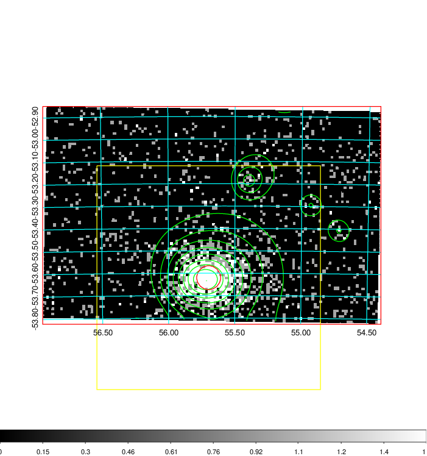
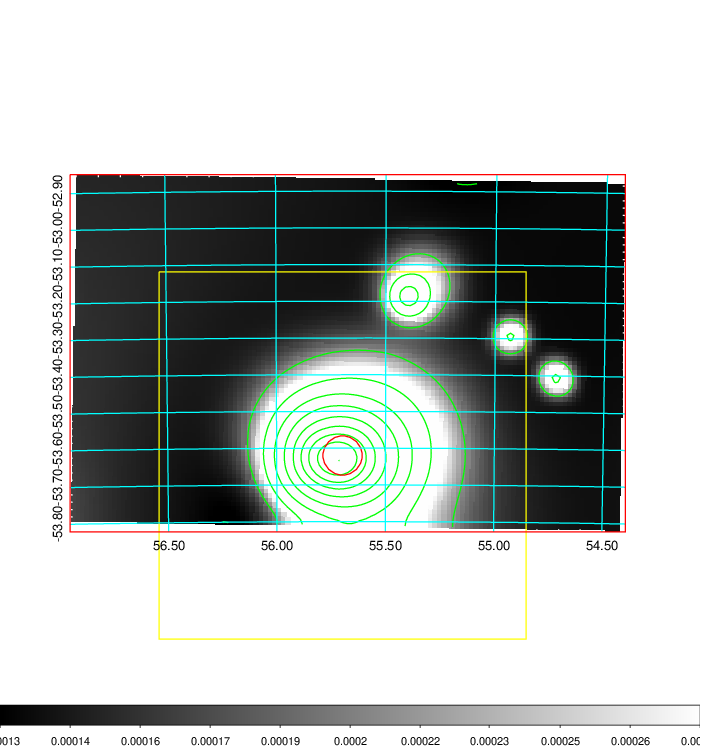
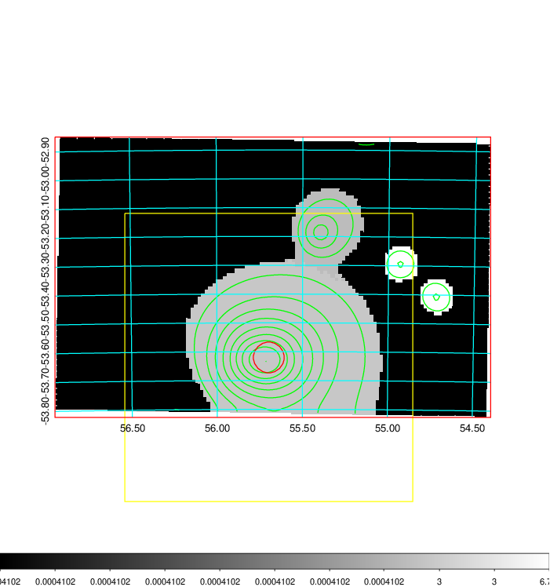
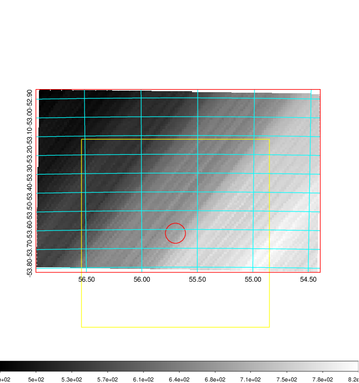
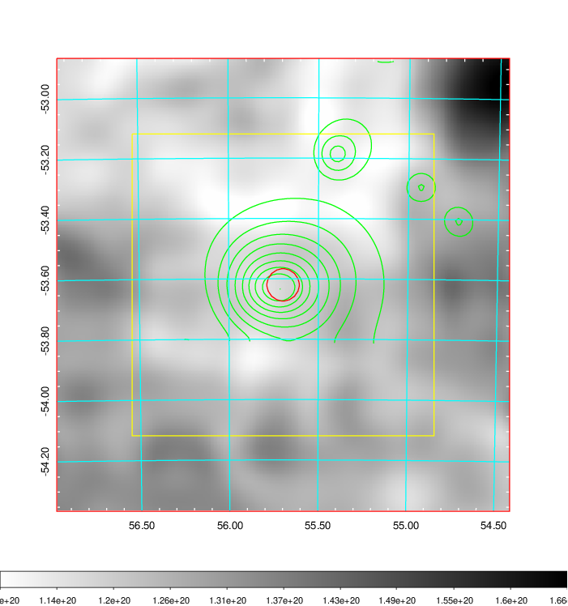
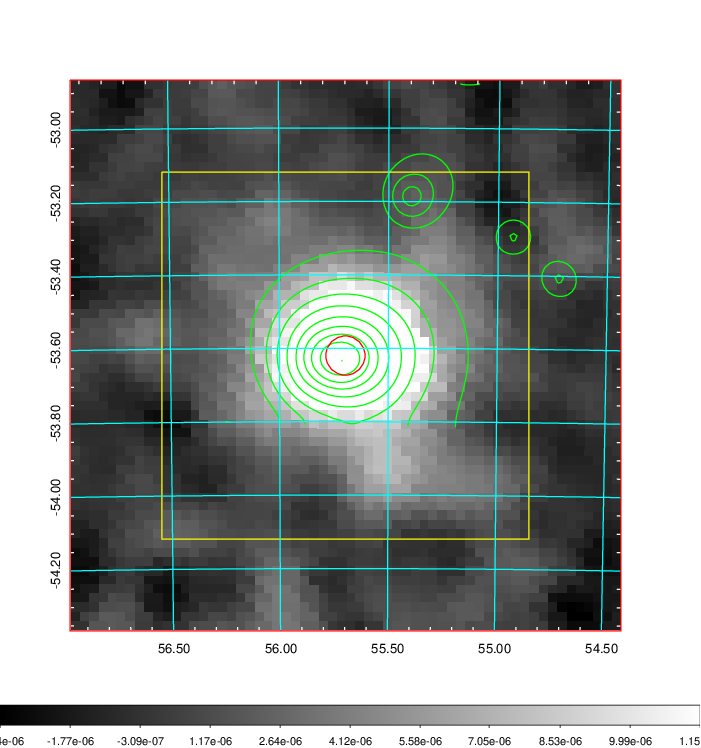
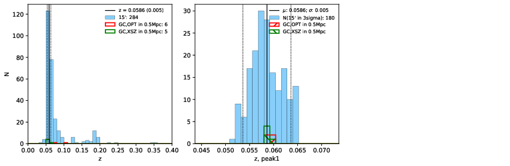
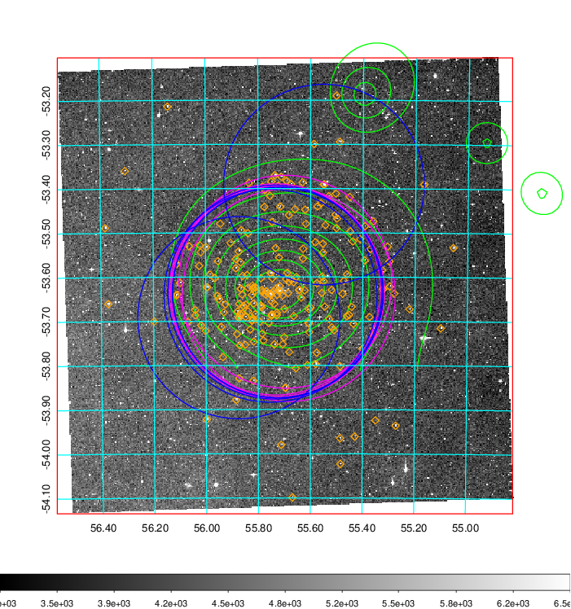
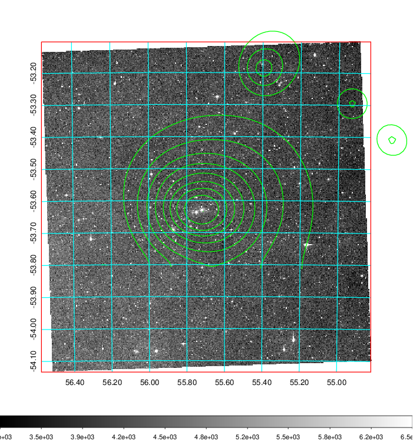
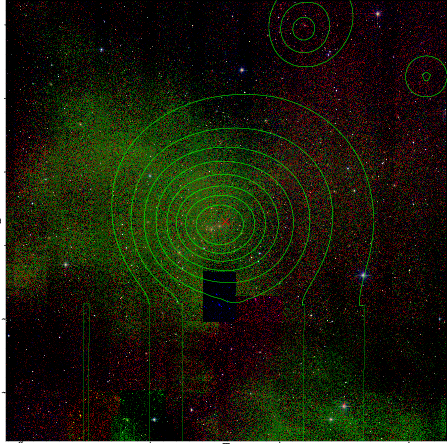

### 153

|Name|RAJ2000[deg]|DEJ2000[deg] |Ext[arcmin]| Ext,ml | z | z_src| C|GC(XSZ,Delta_z<0.01)| GC(OPT,Delta_z<0.01)|GC| R_sig[arcmin] | R500[arcmin] | R500[Mpc]| CRsig[c/s] | CR500[c/s] |L500[1E44 erg/s]|F500[1E-12 erg/s/cm^2]| M500[1E14 Msun]|Tx[keV]|Cnt_sig|Beta|Rc[arcmin]|Comment|Alias|
|---|---|---|---|---|---|------|---|--------|---------|----------|---|---|---|---|---|---|---|---|---|---|---|---|---|---|
|153| 55.697| -53.620| 3.21| 1857.57| 0.0586(0.005)| z1, z_xsz| B| MCXC, PSZ2, Tar, XB| A, N| A, MCXC, N, PSZ2, Tar, W, XB| 26.675| 16.450| 1.119| 1.771(0.064)| 1.666(0.060)| 2.756(0.045)| 33.520(0.548)| 4.22(0.03)| 5.30(0.03)| 1273.7| 0.951(-0.039+0.032)| 6.306(-0.326+0.260)| -| k397|

|[RASS image](../image/153/153_img.pdf)|[filtered image](../image/153/153_fil.pdf)|[Segment image](../image/153/153_seg.pdf)|
|-------------------|--------------------|-------------------|
|   |    |   |

|[Exposure image](../image/153/153_mex.pdf)| [nH image](../image/153/153_nh.pdf)| [Planck image](../image/153/153_p.pdf)|
|-------------------|--------------------|-------------------|
|   |     |  |

|[Redshift Histogram](../image/153/153_zg.pdf) | [DSS image(z1)](../image/153/153_dss_z1.pdf)      |  [DSS image(z2)](../image/153/153_dss_z2.pdf)    |
|-------------------|--------------------|-------------------|
| |  Blue circle for optical clusters;  Magenta circle for XSZ clusters;  all with r=1Mpc;  Only GC with Delta_z<0.01 are shown. |  Blue circle for optical clusters;  Magenta circle for XSZ clusters;  all with r=1Mpc;  Only GC with Delta_z<0.01 are shown.  |

|[known Abell/XSZ clusters](../image/153/153_gc.pdf) | [2MASS image](../image/153/153_2mass.pdf)      |
|-------------------|-------------------|
|  Magenta, blue and green circles  for optical, X-ray and SZ clusters  respectively, with redshift of clusters  labelled. The radius of circles  are 1Mpc.|  |

|[DES image](../image/153/153_des.pdf)   |
|-------------------|
|   |
