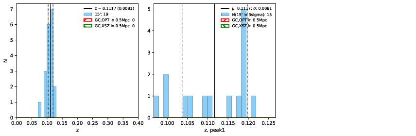

### 154

|Name|RAJ2000[deg]|DEJ2000[deg] |Ext[arcmin]| Ext,ml | z | z_src| C|GC(XSZ,Delta_z<0.01)| GC(OPT,Delta_z<0.01)|GC| R_sig[arcmin] | R500[arcmin] | R500[Mpc]| CRsig[c/s] | CR500[c/s] |L500[1E44 erg/s]|F500[1E-12 erg/s/cm^2]| M500[1E14 Msun]|Tx[keV]|Cnt_sig|Beta|Rc[arcmin]|Comment|Alias|
|---|---|---|---|---|---|------|---|--------|---------|----------|---|---|---|---|---|---|---|---|---|---|---|---|---|---|
|154| 56.302| -12.994| 3.28| 27.88| 0.1117(0.008)| z1,| G| -| -| A, W| 20.256| 7.055| 0.860| 0.144(0.052)| 0.130(0.047)| 0.758(0.191)| 2.359(0.596)| 2.02(0.25)| 3.42(0.27)| 97.9| 0.663(-0.083+0.127)| 4.326(-1.108+1.478)| An Abell cluster with no $z$ and offset = 0.14 Mpc| t147|

|[RASS image](../image/154/154_img.pdf)|[filtered image](../image/154/154_fil.pdf)|[Segment image](../image/154/154_seg.pdf)|
|-------------------|--------------------|-------------------|
|   |    |   |

|[Exposure image](../image/154/154_mex.pdf)| [nH image](../image/154/154_nh.pdf)| [Planck image](../image/154/154_p.pdf)|
|-------------------|--------------------|-------------------|
|   |     |  |

|[Redshift Histogram](../image/154/154_zg.pdf) | [DSS image(z1)](../image/154/154_dss_z1.pdf)      |  [DSS image(z2)](../image/154/154_dss_z2.pdf)    |
|-------------------|--------------------|-------------------|
| |  Blue circle for optical clusters;  Magenta circle for XSZ clusters;  all with r=1Mpc;  Only GC with Delta_z<0.01 are shown. |  Blue circle for optical clusters;  Magenta circle for XSZ clusters;  all with r=1Mpc;  Only GC with Delta_z<0.01 are shown.  |

|[Previous-identified clusters](../image/154/154_gc.pdf) | [2MASS image](../image/154/154_2mass.pdf)      |
|-------------------|-------------------|
|  Green, magenta, and blue circles  for optical, X-ray and SZ clusters  respectively, with redshift of clusters  labelled. The radius of circles  are 1Mpc.|  |

|[DES image](../image/154/154_des.pdf)   |[ATLAS image](../image/154/154_s.pdf)        |
|-------------------|-------------------|
|   |   |
