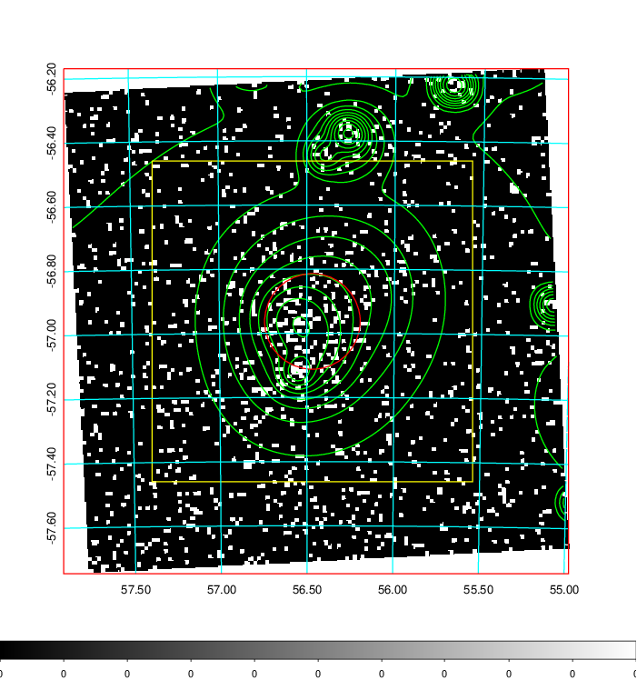
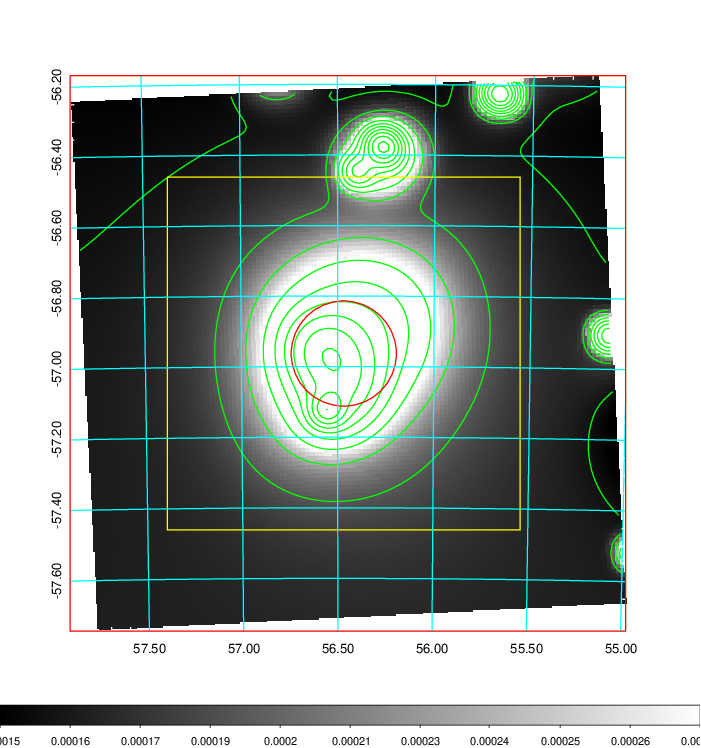
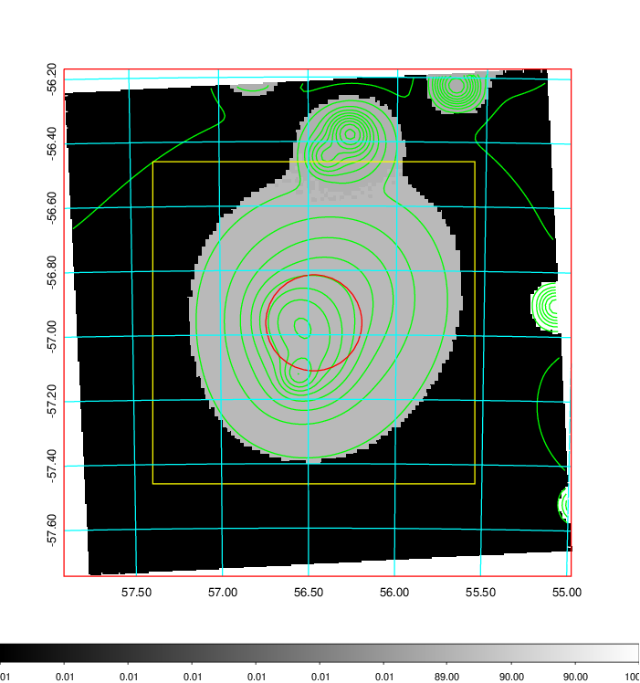
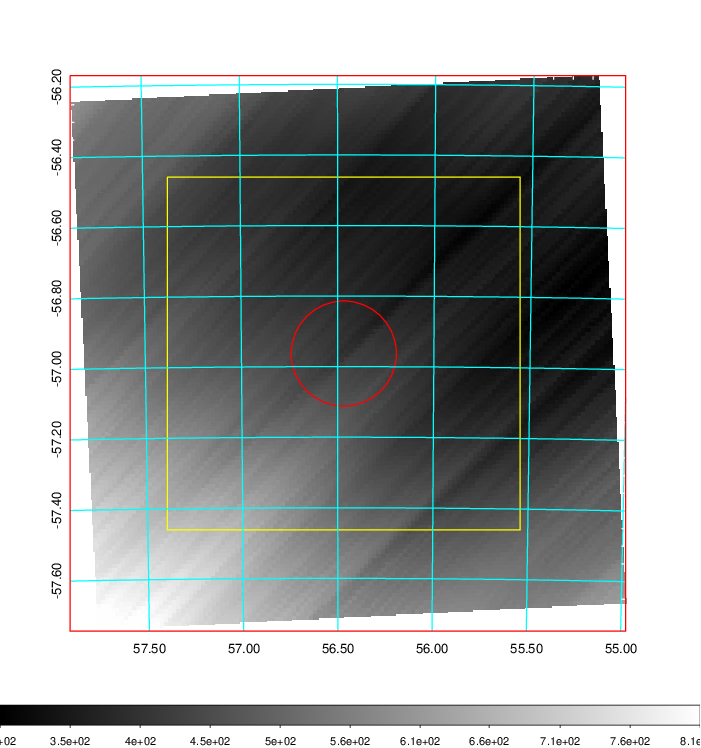
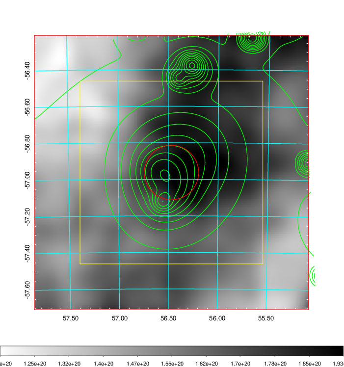
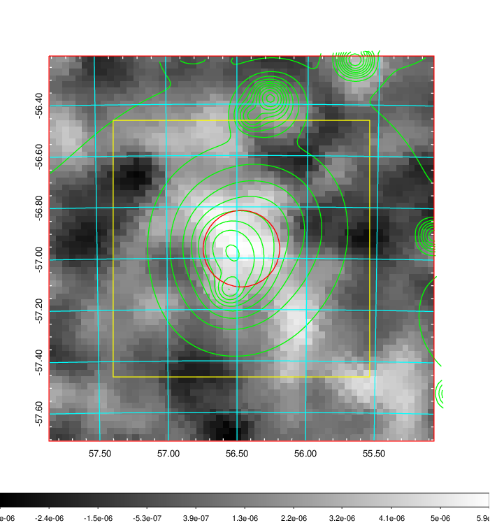
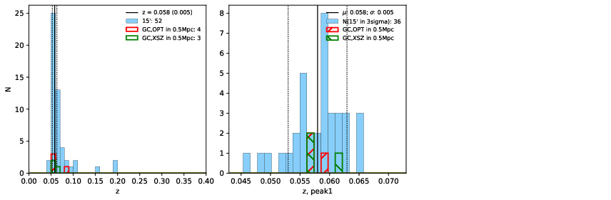
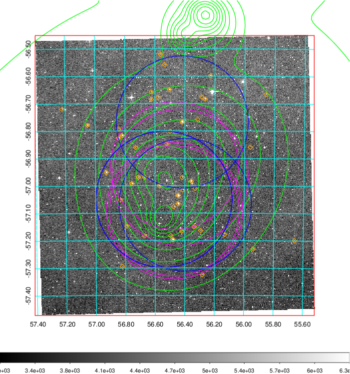
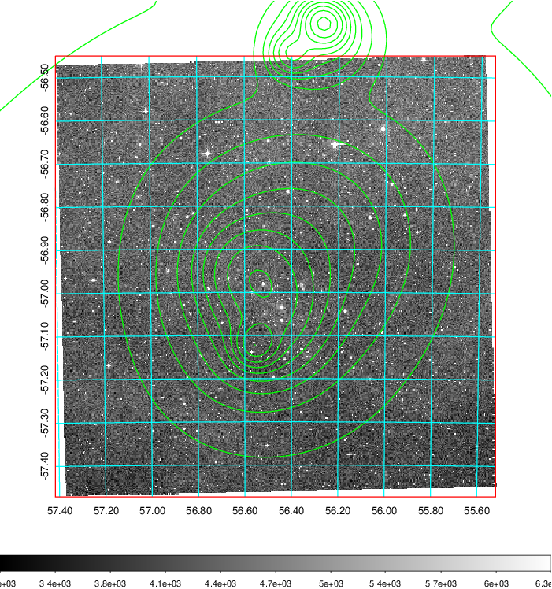
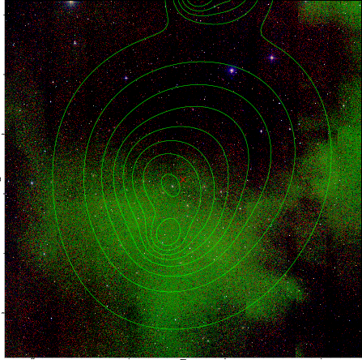

### 155

|Name|RAJ2000[deg]|DEJ2000[deg] |Ext[arcmin]| Ext,ml | z | z_src| C|GC(XSZ,Delta_z<0.01)| GC(OPT,Delta_z<0.01)|GC| R_sig[arcmin] | R500[arcmin] | R500[Mpc]| CRsig[c/s] | CR500[c/s] |L500[1E44 erg/s]|F500[1E-12 erg/s/cm^2]| M500[1E14 Msun]|Tx[keV]|Cnt_sig|Beta|Rc[arcmin]|Comment|Alias|
|---|---|---|---|---|---|------|---|--------|---------|----------|---|---|---|---|---|---|---|---|---|---|---|---|---|---|
|155| 56.468| -56.963| 8.94| 183.87| 0.0580(0.005)| z1, z_xsz| B| MCXC, PSZ2, XB| A, N| A, MCXC, N, PSZ2, Tar, W, XB| 29.262| 12.306| 0.829| 0.439(0.075)| 0.401(0.068)| 0.612(0.080)| 7.603(0.994)| 1.71(0.11)| 3.04(0.13)| 221.8| 0.966(-0.048+0.025)| 13.045(-0.736+0.561)| -| k568|

|[RASS image](../image/155/155_img.pdf)|[filtered image](../image/155/155_fil.pdf)|[Segment image](../image/155/155_seg.pdf)|
|-------------------|--------------------|-------------------|
|   |    |   |

|[Exposure image](../image/155/155_mex.pdf)| [nH image](../image/155/155_nh.pdf)| [Planck image](../image/155/155_p.pdf)|
|-------------------|--------------------|-------------------|
|   |     |  |

|[Redshift Histogram](../image/155/155_zg.pdf) | [DSS image(z1)](../image/155/155_dss_z1.pdf)      |  [DSS image(z2)](../image/155/155_dss_z2.pdf)    |
|-------------------|--------------------|-------------------|
| |  Blue circle for optical clusters;  Magenta circle for XSZ clusters;  all with r=1Mpc;  Only GC with Delta_z<0.01 are shown. |  Blue circle for optical clusters;  Magenta circle for XSZ clusters;  all with r=1Mpc;  Only GC with Delta_z<0.01 are shown.  |

|[known Abell/XSZ clusters](../image/155/155_gc.pdf) | [2MASS image](../image/155/155_2mass.pdf)      |
|-------------------|-------------------|
|  Magenta, blue and green circles  for optical, X-ray and SZ clusters  respectively, with redshift of clusters  labelled. The radius of circles  are 1Mpc.|  |

|[DES image](../image/155/155_des.pdf)   |
|-------------------|
|   |
