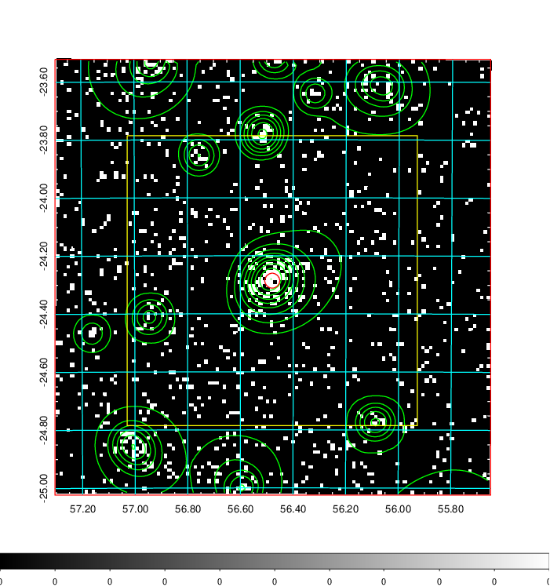
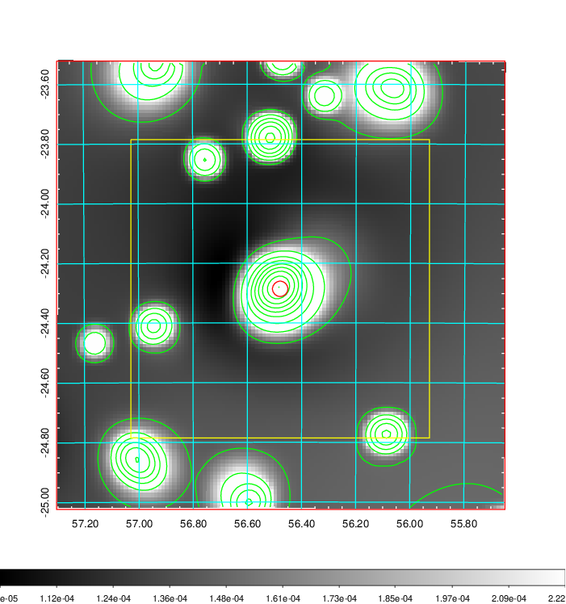
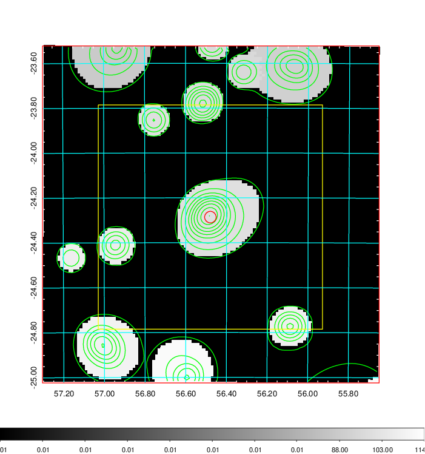
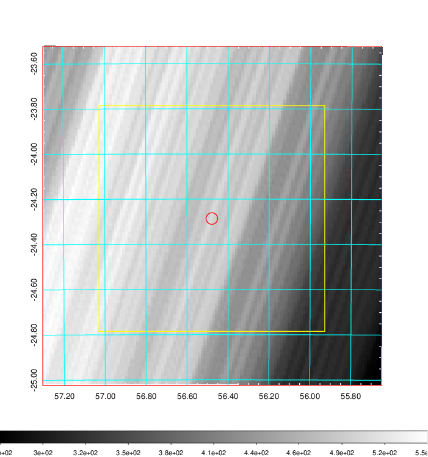
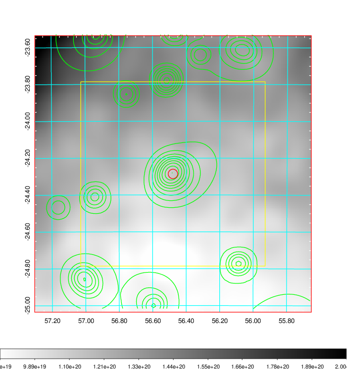
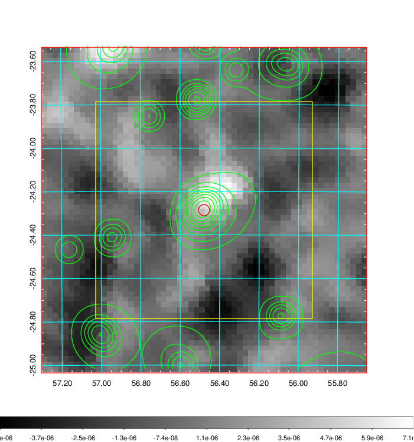
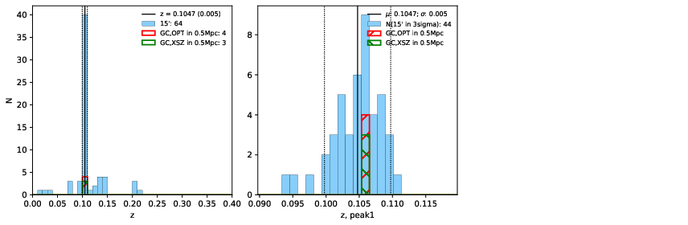
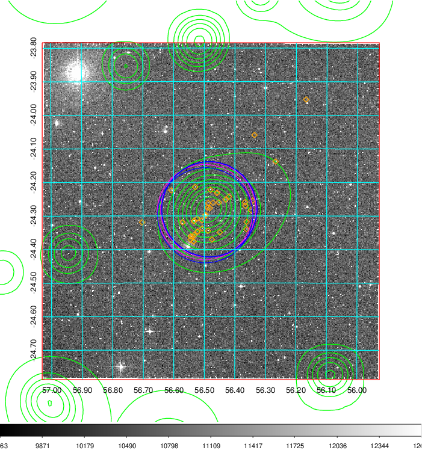
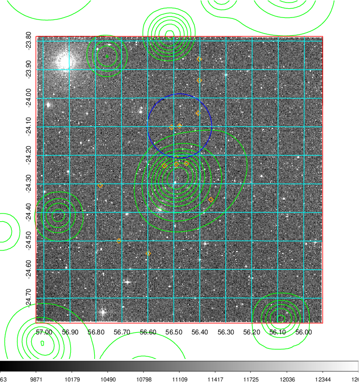
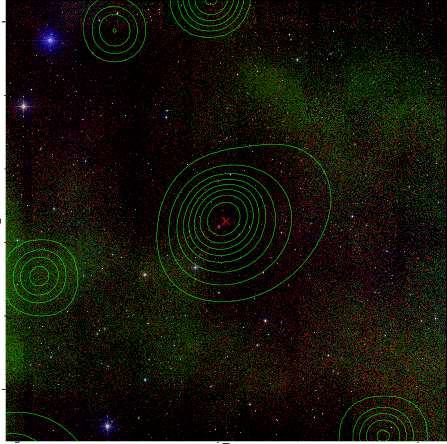

### 156

|Name|RAJ2000[deg]|DEJ2000[deg] |Ext[arcmin]| Ext,ml | z | z_src| C|GC(XSZ,Delta_z<0.01)| GC(OPT,Delta_z<0.01)|GC| R_sig[arcmin] | R500[arcmin] | R500[Mpc]| CRsig[c/s] | CR500[c/s] |L500[1E44 erg/s]|F500[1E-12 erg/s/cm^2]| M500[1E14 Msun]|Tx[keV]|Cnt_sig|Beta|Rc[arcmin]|Comment|Alias|
|---|---|---|---|---|---|------|---|--------|---------|----------|---|---|---|---|---|---|---|---|---|---|---|---|---|---|
|156| 56.479| -24.286| 1.54| 63.46| 0.1047(0.005)| z1, z_xsz| B| MCXC, Tar, XB| A, W| A, MCXC, Tar, W, XB| 8.800| 8.455| 0.974| 0.287(0.034)| 0.286(0.034)| 1.616(0.102)| 5.778(0.364)| 2.91(0.09)| 4.28(0.08)| 134.0| 0.897(-0.102+0.072)| 3.902(-0.600+0.432)| -| k122|

|[RASS image](../image/156/156_img.pdf)|[filtered image](../image/156/156_fil.pdf)|[Segment image](../image/156/156_seg.pdf)|
|-------------------|--------------------|-------------------|
|   |    |   |

|[Exposure image](../image/156/156_mex.pdf)| [nH image](../image/156/156_nh.pdf)| [Planck image](../image/156/156_p.pdf)|
|-------------------|--------------------|-------------------|
|   |     |  |

|[Redshift Histogram](../image/156/156_zg.pdf) | [DSS image(z1)](../image/156/156_dss_z1.pdf)      |  [DSS image(z2)](../image/156/156_dss_z2.pdf)    |
|-------------------|--------------------|-------------------|
| |  Blue circle for optical clusters;  Magenta circle for XSZ clusters;  all with r=1Mpc;  Only GC with Delta_z<0.01 are shown. |  Blue circle for optical clusters;  Magenta circle for XSZ clusters;  all with r=1Mpc;  Only GC with Delta_z<0.01 are shown.  |

|[known Abell/XSZ clusters](../image/156/156_gc.pdf) | [2MASS image](../image/156/156_2mass.pdf)      |
|-------------------|-------------------|
|  Magenta, blue and green circles  for optical, X-ray and SZ clusters  respectively, with redshift of clusters  labelled. The radius of circles  are 1Mpc.|  |

|[DES image](../image/156/156_des.pdf)   |[ATLAS image](../image/156/156_s.pdf)        |
|-------------------|-------------------|
|   |   |
